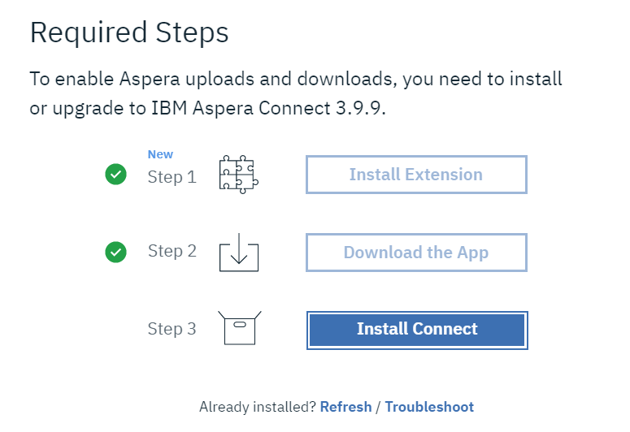

# 加快Brand Portal下载速度 {#guide-to-accelerate-downloads-from-brand-portal}

Adobe Experience Manager Assets Brand Portal通过与IBM Aspera Connect集成来增强大型资产文件的下载性能，Aspera Connect是一个按需安装的应用程序。 该应用程序使用专有技术来删除TCP开销，并帮助提高资产文件的传输速度。 此集成可确保增强的下载体验。

>[!NOTE]
>
>下载速度因网络带宽、服务器延迟和客户端地理位置等因素而异。

默认情况下，**[!UICONTROL 快速下载]**&#x200B;配置处于启用状态，这会显着减少从Brand Portal下载所需资产文件所花费的时间。

## 加快文件下载的先决条件 {#prerequisites-to-accelerate-file-download}

要更快地下载文件，请确保：

* 导航至&#x200B;**[!UICONTROL 工具]** > **[!UICONTROL 下载]**，并确认在&#x200B;**[!UICONTROL 下载设置]**&#x200B;中启用了&#x200B;**[!UICONTROL 快速下载]**&#x200B;配置。
* 确保防火墙上的端口33001（TCP和UDP）处于打开状态。 有关先决条件的更多信息，请参阅[IBM Aspera Connect Client文档](https://downloads.asperasoft.com/en/documentation/8)。
* **使用管理员权限(** )在浏览器的扩展中安装IBM Aspera Connect 3.9.9`https://www.ibm.com/docs/en/aspera-connect/3.9.9`。
* 有关Aspera传输客户端的平台支持，请参阅[IBM Aspera Connect平台支持表](https://www.asperasoft.com/company/support/transfer-clients/)。

>[!NOTE]
>
>IBM Aspera Connect存在已知问题。 快速下载不适用于IBM Aspera Connect版本3.10及更高版本。

## 下载域 {#download-domains}

以下是不同地理位置的下载域：

| 区域代码 | 域 |
|---|---|
| NA OR1 | downloads-na1.brand-portal.adobe.com |
| NA VA5 | downloads-na2.brand-portal.adobe.com |
| EMEA LON5 | downloads-emea1.brand-portal.adobe.com |
| APAC SIN2 | downloads-apac1.brand-portal.adobe.com |

## 使用文件加速器的下载性能示例 {#expected-download-performance-using-file-accelerator}

下表显示了使用Aspera Connect文件下载加速器下载2 GB文件的性能：

*鉴于Brand Portal服务器位于俄勒冈州（美国），因此，观察到的结果会因网络带宽、服务器延迟和客户端位置等因素而有所不同。*

| 客户端位置 | 客户端和服务器之间的延迟（毫秒） | 使用Aspera连接文件传输加速器(MBps)加速 | 下载带有Aspera文件传输加速器的2 GB文件所花费的时间（秒） |
|---------------------------|-----------------------------------|---------------------------------------------|-------------------------------------------------------------------------|
| 美国西部（北加利福利亚） | 18 | 36 | 57 |
| 美国西部（俄勒冈） | 42 | 36 | 57 |
| 美国东部（弗吉尼亚北） | 85 | 35 | 58 |
| APAC（东京） | 124 | 36 | 57 |
| 诺伊达（印度） | 275 | 13.36 | 153 |
| 悉尼 | 175 | 29 | 70 |
| 伦敦 | 179 | 35 | 58 |
| 新加坡 | 196 | 34 | 60 |

## 使用文件加速器下载工作流 {#download-workflow-using-file-accelerator}

要更快地从Brand Portal下载资产，请执行以下操作：

1. 登录到您的Brand Portal租户。 默认情况下，将打开&#x200B;**[!UICONTROL 文件]**&#x200B;视图，其中包含所有已发布的资产和文件夹。

   执行下列操作之一：

   * 选择要下载的资产或文件夹。 在顶部的工具栏中，单击&#x200B;**[!UICONTROL 下载]**&#x200B;图标。

      

   * 要下载资产的特定资产演绎版，请将指针悬停在资产上，然后单击快速操作缩略图中提供的&#x200B;**[!UICONTROL 下载]**&#x200B;图标。

      

1. 将打开列出所有选定资产的&#x200B;**[!UICONTROL 下载]**&#x200B;对话框。

   要在下载资产时保留Brand Portal文件夹层次结构，请选中&#x200B;**[!UICONTROL 为每个资产创建单独的文件夹]**&#x200B;复选框。

   “下载”按钮反映选定项目的计数。 完成应用规则后，单击&#x200B;**[!UICONTROL 下载项目]**。 要详细了解如何应用规则，请参阅[下载资产](../using/brand-portal-download-assets.md#download-assets)。

   

1. 默认情况下，在&#x200B;**[!UICONTROL 下载设置]**&#x200B;中启用了&#x200B;**[!UICONTROL 快速下载]**&#x200B;设置。 因此，会出现一个确认框，用于使用IBM Aspera Connect下载资产。

   如果您是首次下载资产，并且浏览器中未安装IBM Aspera Connect，或者现有版本已过期，则会提示您安装Aspera下载加速器(`https://www.ibm.com/docs/en/aspera-connect/3.9.9`)。

   

1. **安装Aspera Connect客户端**

   要安装IBM Aspera Connect客户端设置，请从IBM Aspera Connect客户端应用程序的.msi文件中运行该设置，然后按照安装向导进行操作。

   

1. 成功安装客户端后，刷新浏览器页面并再次启动下载步骤。

1. 要继续使用&#x200B;**[!UICONTROL Fast Download]**，请单击&#x200B;**[!UICONTROL Allow]**。 所有选定的演绎版均使用IBM Aspera Connect下载到zip文件夹中。

   成功下载后，会出现一个对话框，显示将资产下载到用户系统的位置。

   

   如果不想使用IBM Aspera Connect，请单击&#x200B;**[!UICONTROL 拒绝]**。 如果拒绝或失败&#x200B;**[!UICONTROL Fast Download]**，则系统会填充一条错误消息。 单击&#x200B;**[!UICONTROL Normal Download]**&#x200B;按钮以继续下载资产。

>[!NOTE]
>
>如果管理员关闭了&#x200B;**[!UICONTROL Fast Download]**&#x200B;设置，则所选演绎版将直接下载到zip文件夹中，而无需使用IBM Aspera Connect。

<!-- 
On successful completion of the download, a dialog box shows the location where assets are downloaded onto the user's system. If there is a failure, it shows error.

   >[!NOTE]
   >
   >There is a known limitation in Aspera Connect client application that no prompt to select download location appears if **[!UICONTROL Always ask me where to save downloaded files]** is enabled under the tab **[!UICONTROL Transfers]** within **[!UICONTROL Preferences]**. Before any download begins, provide the location in the text box **[!UICONTROL Save downloaded files to]**.

1. Log in to Brand Portal using a supported browser.
1. Browse and select the folders or assets you want to download. From the toolbar at the top, click the **[!UICONTROL Download]** icon. the **[!UICONTROL Download]** dialog appears with the **[!UICONTROL Asset(s)]** and **[!UICONTROL Enable download acceleration]** check boxes selected by default. 

   

   >[!NOTE]
   >
   >The functionality to send email notification with the link to download assets is presently not supported while faster downloads are enabled.

   

1. Click **[!UICONTROL Download]**.

   To speed up the download experience on your Brand Portal tenant account, you need to have Aspera Connect client application installed in your browser's extension.

1. **Download Aspera Connect Client**

   If Aspera Connect client is not installed on your system or the existing Aspera Connect client is out of date, a prompt is displayed on the browser page from where you can download the system-specific Aspera Connect client by selecting **[!UICONTROL Download Latest Version]**.

   

   To download the latest version of Aspera Connect from [https://downloads.asperasoft.com/connect2/](https://downloads.asperasoft.com/connect2/), select **[!UICONTROL Download Now]** and follow the instructions.

1. **Install Aspera Connect Client**

   To install IBM Aspera Connect client setup, run the setup from  .msi  file of IBM Aspera Connect client application and follow the installation wizard.

1. Once the client is successfully installed, refresh the browser page and initiate the download steps again.

   When using Aspera Connect for the first time, the browser prompts to open the link using **[!UICONTROL IBM Aspera Connect]**. To skip this dialog in future, enable **[!UICONTROL Remember my choice for FASP links]**.

   >[!NOTE]
   >
   >This message is different on the different browsers.

1. A dialog box confirms whether to proceed the transfer or not. Select **[!UICONTROL Allow]** to begin.
To skip this dialog in future, enable **[!UICONTROL Use my choice for all connections with this host]**.
Download begins. A dialog box shows the progress of the download. Use the dialog box to **[!UICONTROL pause]**, **[!UICONTROL resume]**, or **[!UICONTROL cancel]** the download.
Aspera Connect application provides an Activity Window on the system where user can view and manage all transfer sessions. For more information, refer [Aspera Connect Client documentation](https://downloads.asperasoft.com/en/documentation/8).

On successful completion of the download, a dialog box shows the location where assets are downloaded onto the user's system. If there is a failure, it shows error.

   >[!NOTE]
   >
   >There is a known limitation in Aspera Connect client application that no prompt to select download location appears if **[!UICONTROL Always ask me where to save downloaded files]** is enabled under the tab **[!UICONTROL Transfers]** within **[!UICONTROL Preferences]**. Before any download begins, provide the location in the text box **[!UICONTROL Save downloaded files to]**.
-->

## 在Microsoft Edge浏览器上使用文件加速器 {#using-file-accelerator-on-microsoft-edge-browser}

Microsoft Edge在增强保护模式(EPM)下运行，在同一专用网络或与受信任站点通信时，阻止与Aspera Connect服务器通信。 因此，每次与服务器建立连接时都会显示一个弹出窗口。

要在Microsoft Edge上使用加速下载功能，请从受信任的站点列表中删除Brand Portal站点。

1. 打开控制面板(**[!UICONTROL Window键+ X]**，然后选择&#x200B;**[!UICONTROL 控制面板]**)。
1. 转到&#x200B;**[!UICONTROL 网络和Internet]** > **[!UICONTROL Internet选项]**。 单击&#x200B;**[!UICONTROL Security]**&#x200B;选项卡。
1. 单击&#x200B;**[!UICONTROL 受信任站点区域]**，然后单击&#x200B;**[!UICONTROL 站点]**。
1. 从列表中删除Brand Portal网站。

## Aspera连接客户端首选项 {#aspera-connect-client-preferences}

在IBM Aspera Connect Client首选项中，可通过右键单击图标并选择&#x200B;**[!UICONTROL 首选项]**&#x200B;来设置一些有用的首选项。

您可以设置默认下载位置。

此外，Aspera Connect客户端可被标记为在系统启动时自动启动，以便连接客户端正在运行并可供下载以更快地开始。

## 下载加速问题疑难解答 {#troubleshoot-issues-with-download-acceleration}

如果下载加速不适合您，请按照以下步骤进行故障诊断：

1. 通过从计算机访问[https://test-connect.asperasoft.com](https://test-connect.asperasoft.com/)检查端口是否未被阻止。

   如果端口不正常，请联系您的网络团队，并确保防火墙中的端口33001（TCP和UDP）未被阻止。

1. 如果端口正常，则使用[https://www.speedtest.net/](https://www.speedtest.net/)测量可用带宽，检查网络是否不慢。

   如果带宽是几(1-10 Mbps)或以Kbps为单位，则使用Aspera首选项并尝试将带宽限制为等于可用带宽。

1. 要确认从Aspera演示服务器下载的内容是否正常工作，请使用[https://demo.asperasoft.com/aspera/user](https://demo.asperasoft.com/aspera/user)。\
   (登录： asperaweb ，密码： demoaspera)

1. 如果上述故障诊断步骤均不起作用，请取消选择“启用下载加速”选项，然后使用正常下载。
