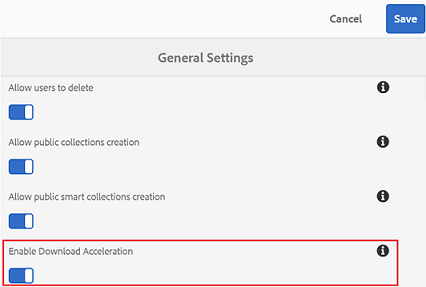
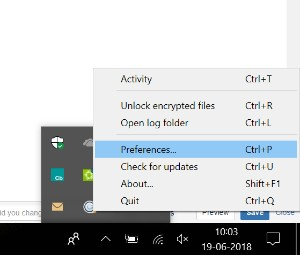
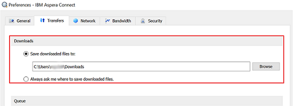

# 加快品牌门户下载 {#guide-to-accelerate-downloads-from-brand-portal}

Brand Portal通过与IBM Assera Connect集成(这是一个按需安装应用程序)来增强大型资源文件的下载性能。该应用程序使用专有技术删除TCP覆盖，并有助于提高资源文件的传输速度。此集成可确保增强的下载体验。

>[!NOTE]
>
>下载速度因用户而异，因为它取决于网络带宽、服务器滞后时间和客户端地理位置等因素。

如果启用此功能，Brand Portal用户可以通过安装Aspera Connect客户端显著缩短从Brand Portal或通过共享链接下载所需资源文件的时间。

## 加快文件下载的先决条件 {#prerequisites-to-accelerate-file-download}

要更快地下载文件，请确保：

* **[!UICONTROL 从管理工具面板]** 中 [!UICONTROL 的常规设置] 中启用下载加速(默认禁用)。
* 端口33001(TCP和UDP)在防火墙上打开。有关prerequi站点的详细信息，请参阅 [AsPera Connect客户端文档](https://downloads.asperasoft.com/en/documentation/8)。
* 使用管理员权限安装AsPera Connect。
* 有关AsPera传输客户端的平台支持，请参阅 [AssPera Connect平台支持矩阵](https://www.asperasoft.com/company/support/transfer-clients/)。

## 下载域 {#download-domains}

以下是不同地理位置的下载域：

| 地区代码 | 域 |
|---|---|
| NA OR1 | downloads-na1.brand-portal.adobe.com |
| NA VA5 | downloads-na2.brand-portal.adobe.com |
| EMEA Lon5 | downloads-emea1.brand-portal.adobe.com |
| APAC SIN2 | downloads-apac1.brand-portal.adobe.com |

## 使用文件加速器示例下载性能 {#expected-download-performance-using-file-accelerator}

下表显示了使用AsPera Connect文件下载加速器下载2GB文件的性能：

**考虑到Brand Portal服务器在俄勒冈州(美国)的因素，因此观察到的结果因网络带宽、服务器滞后时间和客户端位置而异。*

| 客户端位置 | 客户端与服务器之间的延迟(毫秒) | 使用Aspera Connect文件传输加速器(MBPS) | 使用Aspera文件传输加速器(秒)下载GB文件时所花费的时间 |
|---------------------------|-----------------------------------|---------------------------------------------|-------------------------------------------------------------------------|
| U.S. West(N. California) | 18 | 36 | 57 |
| U.S. West(俄勒冈) | 42 | 36 | 57 |
| U.S. 东(纽约州) | 85 | 35 | 58 |
| APAC(东京) | 124 | 36 | 57 |
| Noida(印度) | 275 | 13.36 | 153 |
| 悉尼 | 175 | 29 | 70 |
| 伦敦 | 179 | 35 | 58 |
| 新加坡 | 196 | 34 | 60 |

## 使用文件加速器下载工作流 {#download-workflow-using-file-accelerator}

要从Brand Portal更快地下载资产，请执行以下操作：

1. 使用支持的浏览器登录到Brand Portal。
2. 浏览并选择要下载的所需资产文件、文件夹或集合。点按/单击下载选项。
此时将显示下载对话框， [并选中启用下载加速] 选项。
   

   >[!NOTE]
   >
   >在启用更快下载的同时，当前不支持发送包含下载资产链接的电子邮件通知的功能。

   

3. 点按/单击 **[!UICONTROL 下载]** 选项。
要加快Brand Portal租户帐户上的下载体验，您需要在系统上安装Aspera Connect客户端应用程序。

4. **下载AsPera Connect客户端**如果系统中未安装Aspera
Connect客户端或现有安装的AsPera Connect客户端过期，则在浏览器页面上显示提示，您可以通过选择 **[!UICONTROL 下载最新版本来下载特定于系统的AsPera Connect客户端]**。

   

   要从 [https://downloads.asperasoft.com/connect2/](https://downloads.asperasoft.com/connect2/)下载最新版本的Aspera Connect，请选择 **[!UICONTROL “立即下载”]** 并按照说明操作。

5. **安装AsPera Connect客户端**要安装IBM
AssPera Connect客户端设置，请从IBM AsPera Connect客户端应用程序的. msi文件运行设置，然后按照安装向导操作。

6. 成功安装客户端后，刷新浏览器页面并再次启动下载步骤或在 **[!UICONTROL 资产]****[!UICONTROL 下载]** 对话框中选择“重新启动”(第步)。
首次使用AsPera Connect时，浏览器提示使用 **[!UICONTROL IBM AsPera Connect打开链接]**。要在将来跳过此对话框，请启用 **[!UICONTROL FASP链接的“记住我的选择]**”。

   >[!NOTE]
   >
   >此消息在不同浏览器上有所不同。

7. 对话框将确认是否继续传输。选择 **[!UICONTROL “允许]** ”开始。
要在将来跳过此对话框，请对 **[!UICONTROL 与此主机]**的所有连接启用我的选择。
下载开始。对话框将显示下载进度。使用对话框 **[!UICONTROL 暂停]**、 **[!UICONTROL 恢复]**&#x200B;或 **[!UICONTROL 取消]** 下载。
Assera Connect应用程序在系统上提供一个活动窗口，用户可在该系统上查看和管理所有传输会话。有关详细信息，请参阅 [AsPera Connect Client文档](https://downloads.asperasoft.com/en/documentation/8)。

成功完成下载后，对话框将显示将资产下载到用户系统的位置。如果出现故障，则显示错误。

>[!NOTE]
>
>在Prefera Connect客户端应用程序中存在一个已知限制，如果 **[!UICONTROL 始终询问我在Preferences中的选项卡]**[!UICONTROL 传输] 下如何启用下载的文件，则不会提示您选择下载 [!UICONTROL 位置]。在开始下载之前，请在文本框中提供 **[!UICONTROL 保存下载的文件的位置]**。

## 在Microsoft Edge浏览器上使用文件加速器 {#using-file-accelerator-on-microsoft-edge-browser}

Microsoft Edge在增强保护模式(EPM)中运行，可防止与AsPera Connect服务器通信，同时在同一专用网络上或与受信任站点进行通信。因此，每次与服务器建立连接时，都会显示一个弹出窗口。

要在Microsoft Edge上使用加速下载功能，请从可信站点列表中删除Brand Portal站点。

1. 打开控制面板(按 **[!UICONTROL Window键+ X]**，然后选择 **[!UICONTROL 控制面板]**)。
2. 转到 **[!UICONTROL “网络”和“Internet”&gt;“Internet选项]**”。单击 **[!UICONTROL “安全]** ”选项卡。
3. 单击 **[!UICONTROL 可信任的站点区域]**，然后单击 **[!UICONTROL 站点]**。
4. 从列表中删除Brand Portal站点。

## AsPera Connect客户端首选项 {#aspera-connect-client-preferences}

有一些有用的首选项可在IBM AssPera Connect Client首选项中设置，方法是右键单击图标并选择 **[!UICONTROL 首选项]**。

您可以设置默认下载位置。

此外，可以将AsPera Connect客户端标记为在系统启动时自动启动，以便Connect客户端正在运行并可供下载以更快开始。

## 解决下载加速问题 {#troubleshoot-issues-with-download-acceleration}

如果下载加速不适合您，请按照以下步骤进行故障排除：

1. 通过从计算机访问 [https://test-connect.asperasoft.com](https://test-connect.asperasoft.com/) ，检查是否阻止端口。

   如果端口不是OK，则请联系您的网络团队并确保在防火墙中不会阻止端口33001(TCP和UDP)。

2. 如果这些端口为“确定”，则检查使用 [https://www.speedtest.net/的可用带宽是否缓慢](https://www.speedtest.net/)。

   如果带宽为若干(1-10Mbps)或Kbps，则使用AsPera Preferences并尝试将带宽限制为等于可用带宽。

3. 要确认从AsPera演示服务器下载是否正在工作，请使用 [https://demo.asperasoft.com/aspera/user](https://demo.asperasoft.com/aspera/user)。\
   (登录：asperweb，密码：demaspera)

4. 如果上述故障排除步骤均不起作用，请取消选择“启用下载加速”选项并使用正常下载。
