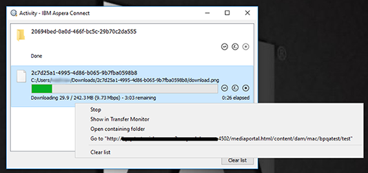

# 加快从Brand Portal下载的指南 {#guide-to-accelerate-downloads-from-brand-portal}

Brand Portal通过与IBM Assera Connect集成(这是一个按需安装应用程序)来支持加速下载大型资源文件。该应用程序使用专有技术删除TCP覆盖并帮助提高文件传输速度，从而确保增强的下载体验。跨地理位置分布在不同地理位置的用户也可以从此功能中受益。

>[!NOTE]
>
>IBM Assera Connect支持从Brand Portal和共享链接快速下载大型资源文件，但下载速度可能因网络带宽、服务器滞后时间和客户端地理位置等因素而异。

要为加速文件下载配置特定租户，管理员 **[!UICONTROL 可以从管理工具面板]** 中 **的常规设置** 中启用“下载加速”(默认为禁用)。

如果启用此功能，Brand Portal用户可以通过安装Aspera Connect客户端显著缩短从Brand Portal或通过共享链接下载所需资源文件的时间。

## 加快文件下载的先决条件 {#prerequisites-to-accelerate-file-download}

要使用更快的文件下载功能，请确保：

* 端口33001(TCP和UDP)由管理员在防火墙中打开。有关prerequi站点使用IBM Assera Connect的详细信息，请参阅 [AsPera Connect客户端文档](https://downloads.asperasoft.com/en/documentation/8)。

   以下是不同地理位置的下载域：

   | 区域 | 域 |
   |---|---|
   | NA OR1 | downloads-na1.brand-portal.adobe.com |
   | NA VA5 | downloads-na2.brand-portal.adobe.com |
   | EMEA Lon5 | downloads-emea1.brand-portal.adobe.com |
   | APAC SIN2 | downloads-apac1.brand-portal.adobe.com |

* 管理员权限用于下载IBM AsPera Connect安装程序包，因为您无法在“来宾”帐户下安装Aspera Connect。

### 系统和浏览器要求 {#system-and-browser-requirements}

Aspera Connect3.8.0的系统和浏览器要求如下：

| 操作系统 | 操作系统版本 | 浏览器 |  | 必需库 |
|----------------|----------------------------------------|-------------------|-------|--------------------------|
| Windows | Windows7、8、10 | Chrome | 64-66 |  |
|  | Windows Server2008、R2、2012R2、2016 | Firefox | 57-60 |  |
|  |  | Firefox ESR | 52 |  |
|  |  | Internet Explorer | 11 |  |
|  |  | Microsoft Edge | 39-42 |  |
| macOS | 10.11 - 10.13 | Chrome | 64-66 |  |
|  |  | Firefox | 57-60 |  |
|  |  | Firefox ESR | 52 |  |
|  |  | Safari | 11 |  |
| Linux(64位) | RHEL-7 | Chrome | 64-66 | OpenSSL1.0.2g或更高版本 |
|  | CentOS-7 |  |  | Mesa EGL |
|  | Debian-9 |  |  | glib2.28或更高版本 |
|  | SLES11-12 |  |  |  |
|  | Fedora26-27 |  |  |  |
|  | openSUSE42.3 | Firefox | 57-60 |  |
|  | Ubuntu14-17 | Firefox ESR | 52 |  |

有关不同版本的AsPera传输客户端的平台支持矩阵，请参阅 [AssPera Connect平台支持矩阵](https://www.asperasoft.com/company/support/transfer-clients/)。

## 使用文件加速器预期下载性能 {#expected-download-performance-using-file-accelerator}

在不同客户端位置使用AsPera Connect文件下载加速器的2GB文件的预期下载性能如下：在美国Oregon上考虑Brand Portal服务器：

| 客户端位置 | 客户端与服务器之间的延迟 | 使用Assesa文件传输加速器加快速度 | 使用AsPera文件传输加速器下载GB文件的时间 |
|---------------------------|-----------------------------------|---------------------------------------------|-------------------------------------------------------------------------|
| U.S. West(N. California) | 18毫秒 | 36MB/秒 | 57秒 |
| U.S. West(俄勒冈) | 42毫秒 | 36MB/秒 | 57秒 |
| U.S. 东(纽约州) | 85毫秒 | 35MB/秒 | 58秒 |
| APAC(东京) | 124毫秒 | 36MB/秒 | 57秒 |
| Noida | 275毫秒 | 13.36MB/s | 153秒 |
| 悉尼 | 175毫秒 | 29MB/秒 | 70秒 |
| 伦敦 | 179毫秒 | 35MB/秒 | 58秒 |
| 新加坡 | 196毫秒 | 34MB/s | 60秒 |

>[!NOTE]
>
>引用的数据取决于在实验室中执行的测试，并且仅表示指示。观察到的结果因网络带宽、服务器滞后时间和客户端位置等因素而异。

## 使用文件加速器下载工作流 {#download-workflow-using-file-accelerator}

要从Brand Portal更快地下载资产，请执行以下操作：

1. 通过首选浏览器登录到Brand Portal。
2. 浏览并选择要下载的所需资产文件、文件夹或集合。点按/单击下载选项。
此时将显示下载对话框， [并选中启用下载加速] 选项。
   

   >[!NOTE]
   >
   >在启用更快下载的同时，当前不支持发送包含下载资产链接的电子邮件通知的功能。

   

3. 点按/单击 **下载**。
要加快Brand Portal租户帐户上的下载体验，您需要在系统上安装Aspera Connect客户端应用程序。

4. **下载AsPera Connect客户端**如果系统中未安装Aspera
Connect客户端或现有安装的AsPera Connect客户端过期，则在浏览器页面上显示提示，您可以通过选择 **下载最新版本来下载特定于系统的AsPera Connect客户端**。

   

   要从 [https://downloads.asperasoft.com/connect2/](https://downloads.asperasoft.com/connect2/)下载最新版本的Aspera Connect，请选择 **“立即下载”** 并按照说明操作。

5. **安装AsPera Connect客户端**要安装IBM
AssPera Connect客户端设置，请从IBM AsPera Connect客户端应用程序的. msi文件运行设置，然后按照安装向导操作。

6. 成功安装客户端后，刷新浏览器页面并再次启动下载步骤或在 **资产****下载** 对话框中选择“重新启动”(第步)。
首次使用AsPera Connect时，浏览器提示使用 **IBM AsPera Connect打开链接**。要在将来跳过此对话框，请启用 **FASP链接的“记住我的选择**”。

   >[!NOTE]
   >
   >此消息在不同浏览器上有所不同。

7. 对话框将确认是否继续传输。选择 **“允许** ”开始。
要在将来跳过此对话框，请对 **与此主机**的所有连接启用我的选择。
下载开始。对话框将显示下载进度。使用对话框 **暂停**、 **恢复**&#x200B;或 **取消** 下载。
Assera Connect应用程序在系统上提供一个活动窗口，用户可在该系统上查看和管理所有传输会话。有关详细信息，请参阅 [AsPera Connect Client文档](https://downloads.asperasoft.com/en/documentation/8)。

成功完成下载后，对话框将显示将资产下载到用户系统的位置。如果出现故障，则显示错误。

>[!NOTE]
>
>在AsPera **Connect客户端应用程序中存在一个已知限制，该应用程序不会提示我在选项卡**“****首选项**”中的选项卡**传输**下保存下载的文件时出现下载位置。在开始下载之前，请在文本框中提供 **保存下载的文件的位置**。

## 在Microsoft Edge浏览器上使用文件加速器 {#using-file-accelerator-on-microsoft-edge-browser}

Microsoft Edge在增强保护模式(EPM)中运行，可防止与AsPera Connect服务器通信，同时在同一专用网络上或与受信任站点进行通信。因此，每次与服务器建立连接时，都会显示一个弹出窗口。

要在Microsoft Edge上使用加速下载功能，请从可信站点列表中删除Brand Portal站点。

1. 打开控制面板(按 **Window键+ X**，然后选择 **控制面板**)。
2. 转到 **“网络”和“Internet”&gt;“Internet选项**”。Click the **Security** tab.
3. 单击 **可信任的站点区域**，然后单击 **站点**。
4. 从列表中删除Brand Portal站点。

## AsPera Connect客户端首选项 {#aspera-connect-client-preferences}

有一些有用的首选项可在IBM AssPera Connect Client首选项中设置，方法是右键单击图标并选择 **首选项**。

您可以设置默认下载位置。

此外，可以将AsPera Connect客户端标记为在系统启动时自动启动，以便Connect客户端正在运行并可供下载以更快开始。

## 解决下载加速问题 {#troubleshoot-issues-with-download-acceleration}

如果下载加速不适合您，请按照以下步骤进行故障排除：

1. 通过从计算机访问 [https://test-connect.asperasoft.com](https://test-connect.asperasoft.com/) ，检查是否阻止端口。

   如果端口不是OK，则请联系您的网络团队并确保在防火墙中不会阻止端口33001(TCP和UDP)。

2. 如果这些端口为“确定”，则检查使用 [https://www.speedtest.net/的可用带宽是否缓慢](https://www.speedtest.net/)。

   如果带宽为若干(1-10Mbps)或Kbps，则使用AsPera Preferences并尝试将带宽限制为等于可用带宽。

3. 要确认从AsPera演示服务器下载是否正在工作，请使用 [https://demo.asperasoft.com/aspera/user](https://demo.asperasoft.com/aspera/user)。\
   (登录：asperweb，密码：demaspera)

4. 如果上述故障排除步骤均不起作用，请取消选择“启用下载加速”选项并使用正常下载。
