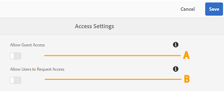

# 管理 Brand Portal 上的用户访问 {#administer-user-access-on-brand-portal}

Adobe Experience Manager Assets Brand Portal 6.4.2及更高版本授权管理员配置Guest访问权限，并允许用户请求访问其组织的Brand Portal。 这些配置已在管理面板上作为&#x200B;**[!UICONTROL 访问设置]**&#x200B;配置提供。 默认情况下，这两个设置都处于禁用状态。

**A** — 允许来宾使用Brand Portal欢迎屏幕上的&#x200B;**[!UICONTROL `Guest Access?`]**&#x200B;链接访问Brand Portal的配置。 （默认值为禁用）

**B** — 用于允许用户使用Brand Portal欢迎屏幕上的&#x200B;**[!UICONTROL `Need access?`]**&#x200B;链接请求访问Brand Portal的配置。 （默认值为禁用）

## 允许访客访问 {#allow-guest-access}

通过允许Guest访问，用户可以访问公共资源而无需登录到Brand Portal。
要允许Guest访问，管理员必须执行以下步骤：

1. 选择AEM徽标可从顶部的工具栏访问管理工具。
1. 从管理工具面板中，选择&#x200B;**[!UICONTROL 访问]**&#x200B;以打开&#x200B;**[!UICONTROL 访问设置]**&#x200B;页面。
1. 启用&#x200B;**[!UICONTROL 允许来宾访问]**&#x200B;配置。
1. **[!UICONTROL 保存]**&#x200B;更改。
1. 注销以使更改生效。

## 允许用户请求访问权限 {#allow-users-to-request-access}

管理员可允许组织用户从欢迎屏幕请求访问Brand Portal。 但是，管理员需要启用&#x200B;**[!UICONTROL 允许用户请求访问]**&#x200B;配置，以便在欢迎屏幕上显示请求访问链接。

要让组织用户请求访问Brand Portal，管理员需要：

1. 选择AEM徽标可从顶部的工具栏访问管理工具。
1. 从管理工具面板中，选择&#x200B;**[!UICONTROL 访问]**&#x200B;以打开&#x200B;**[!UICONTROL 访问设置]**&#x200B;页面。
1. 启用&#x200B;**[!UICONTROL 允许用户请求访问]**&#x200B;配置。
1. **[!UICONTROL 保存]**&#x200B;更改。
1. 注销以使更改生效。
