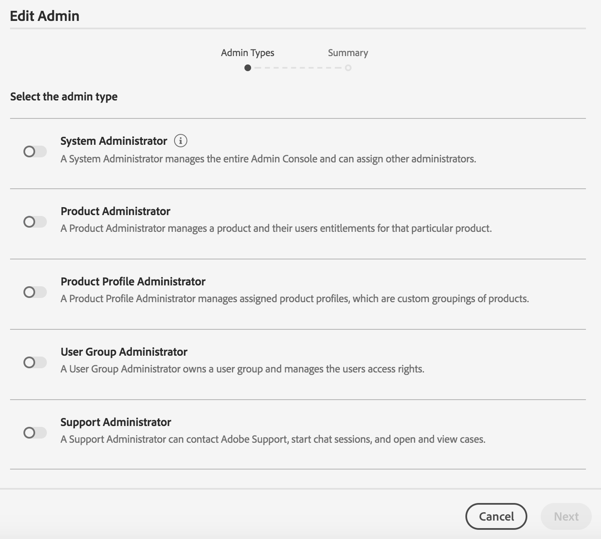
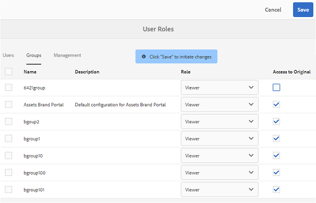

# 管理用户、组和用户角色{#manage-users-groups-and-user-roles}

管理员可以使用Adobe Admin Console创建AEM Assets Brand Portal用户和产品用户档案，并使用Brand Portal用户界面管理他们的角色。 此权限对查看者和编辑者不可用。

在[[!UICONTROL Admin Console]](http://adminconsole.adobe.com/enterprise/overview)中，您可以视图与您的组织关联的所有产品。 产品可以是任何Experience Cloud解决方案，如Adobe Analytics、Adobe Target或AEM Brand Portal。 您必须选择AEM Brand Portal产品，并创建产品用户档案。

<!--
Comment Type: draft

<note type="note">

Product Profiles (formerly known as product configurations*). 

* The nomenclature has changed from product configurations to product profiles in the new Adobe Admin Console.

</note>
-->

这些产品用户档案每8小时与Brand Portal用户界面同步一次，并在Brand Portal中以组形式显示。 在添加用户和创建产品用户档案，以及将用户添加到这些产品用户档案后，即可在Brand Portal中向用户和用户组分配角色。

>[!NOTE]
>
>要在Brand Portal中创建组，请从Adobe[!UICONTROL Admin Console]中，使用&#x200B;**[!UICONTROL 产品>产品用户档案]**，而不是&#x200B;**[!UICONTROL 用户页>用户组]**。 Adobe [!UICONTROL Admin Console]中的产品用户档案用于在Brand Portal中创建组。

## 添加用户{#add-a-user}

如果您是产品管理员，请使用Adobe [[!UICONTROL Admin Console]](http://adminconsole.adobe.com/enterprise/overview)创建用户，并将用户分配给产品用户档案（*以前称为产品配置*），在品牌门户中显示为组。 您可以使用组执行批量操作，如角色管理和资产共享。

>[!NOTE]
>
>无权访问Brand Portal的新用户可以从Brand Portal的登录屏幕请求访问权限。 有关详细信息，请参阅[请求访问Brand Portal](../using/brand-portal.md#request-access-to-brand-portal)。 在通知区域收到访问请求通知后，单击相关通知，然后单击&#x200B;**[!UICONTROL 授予访问权限]**。 或者，也可以按照收到的访问请求电子邮件中的链接操作。 接下来，要通过[Adobe[!UICONTROL Admin Console]](http://adminconsole.adobe.com/enterprise/overview)添加用户，请按照以下步骤中的步骤4-7进行操作。

>[!NOTE]
>
>您可以直接登录[Adobe [!UICONTROL Admin Console]](http://adminconsole.adobe.com/enterprise/overview)，也可以从Brand Portal登录。 如果您直接登录，请按照以下步骤中的步骤4-7添加用户。

1. 从顶部的AEM工具栏中，单击Adobe徽标以访问管理工具。

   

1. 在管理工具面板中，单击&#x200B;**[!UICONTROL 用户]**。

   

1. 在[!UICONTROL 用户角色]页中，单击&#x200B;**[!UICONTROL 管理]**&#x200B;选项卡，然后单击&#x200B;**[!UICONTROL 启动Admin Console]**。

   

1. 在Admin Console中，执行下列操作之一以创建新用户：

   * 在顶部的工具栏中，单击&#x200B;**[!UICONTROL 概述]**。 在[!UICONTROL 概述]页面中，单击Brand Portal产品卡中的&#x200B;**[!UICONTROL 分配用户]**。

   

   * 在顶部的工具栏中，单击&#x200B;**[!UICONTROL 用户]**。 在[!UICONTROL Users]页面中，默认情况下，左边栏中的[!UICONTROL Users]处于选中状态。 单击&#x200B;**[!UICONTROL 添加用户]**。

   

1. 在“添加用户”对话框中，键入要添加的用户的电子邮件ID，或从键入时显示的建议列表中选择该用户。

   

1. 将用户分配给至少一个产品用户档案（以前称为产品配置），以便用户可以访问Brand Portal。 从&#x200B;**[!UICONTROL 字段中选择相应的产品用户档案。请为此产品]**&#x200B;选择用户档案。
1. 单击&#x200B;**[!UICONTROL 保存]**。将向您添加的用户发送一封欢迎电子邮件。 受邀用户可以通过单击欢迎电子邮件中的链接，然后使用[!UICONTROL Adobe ID]登录来访问Brand Portal。 有关详细信息，请参阅[首次登录体验](../using/brand-portal-onboarding.md)。

   >[!NOTE]
   >
   >如果用户无法登录到Brand Portal，则组织的管理员应访问Adobe[!UICONTROL Admin Console]并检查用户是否存在以及是否已添加到至少一个产品用户档案。

   有关向用户授予管理权限的信息，请参阅[向用户提供管理员权限](../using/brand-portal-adding-users.md#provideadministratorprivilegestousers)。

## 添加产品用户档案{#add-a-product-profile}

[!UICONTROL Admin Console]中的产品用户档案（以前称为产品配置）用于在Brand Portal中创建组，以便您能够在Brand Portal中执行批量操作，如角色管理和资产共享。 **Brand Portalis** 是提供的默认产品用户档案;您可以创建更多产品用户档案，并将用户添加到新产品用户档案。

>[!NOTE]
>
>您可以直接登录[[!UICONTROL Admin Console]](http://adminconsole.adobe.com/enterprise/overview)或从Brand Portal登录。 如果您直接登录[!UICONTROL Admin Console]，请按照以下步骤中的步骤4-7添加产品用户档案。

1. 从顶部的AEM工具栏中，单击Adobe徽标以访问管理工具。

   

1. 在管理工具面板中，单击&#x200B;**[!UICONTROL 用户]**。

   

1. 在[!UICONTROL 用户角色]页中，单击&#x200B;**[!UICONTROL 管理]**&#x200B;选项卡，然后单击&#x200B;**[!UICONTROL 启动Admin Console]**。

   

1. 在顶部的工具栏中，单击&#x200B;**[!UICONTROL 产品]**。
1. 在[!UICONTROL 产品]页面中，默认情况下选择[!UICONTROL 产品用户档案]。 单击&#x200B;**[!UICONTROL 新建用户档案]**。

   

1. 在[!UICONTROL 创建新用户档案]页面中，提供用户档案名称、显示名称、用户档案说明，并选择是否要在将用户添加到用户档案或从中删除时通过电子邮件通知用户。

   

1. 单击&#x200B;**[!UICONTROL 完成]**。产品配置组（例如&#x200B;**[!UICONTROL Sales group]**）将添加到Brand Portal。

   

## 将用户添加到产品用户档案{#add-users-to-a-product-profile}

要将用户添加到Brand Portal组，请将其添加到[!UICONTROL Admin Console]中的相应产品用户档案（以前称为产品配置）。 您可以单独或批量添加用户。

>[!NOTE]
>
>您可以直接登录[[!UICONTROL Admin Console]](http://adminconsole.adobe.com/enterprise/overview)或从Brand Portal登录。 如果您直接登录Admin Console，请按照以下步骤中的步骤4-7将用户添加到产品用户档案。

1. 从顶部的AEM工具栏中，单击Adobe徽标以访问管理工具。

   

1. 在管理工具面板中，单击&#x200B;**[!UICONTROL 用户]**。

   

1. 在[!UICONTROL 用户角色]页中，单击&#x200B;**[!UICONTROL 管理]**&#x200B;选项卡，然后单击&#x200B;**[!UICONTROL 启动Admin Console]**。

   ![启动 [!DNL Admin Console]](assets/launch_admin_console.png)

1. 在顶部的工具栏中，单击&#x200B;**[!UICONTROL 产品]**。
1. 在[!UICONTROL 产品]页面中，默认情况下选择[!UICONTROL 产品用户档案]。 打开要向其添加用户的产品用户档案，例如[!UICONTROL Sales group]。

   

1. 要将个人用户添加到产品用户档案，请执行以下操作：

   * 单击&#x200B;**[!UICONTROL 添加用户]**。

   

   * 在[!UICONTROL 将用户添加到销售组]页面中，键入要添加的用户的电子邮件ID，或从键入时显示的建议列表中选择该用户。

   

   * 单击&#x200B;**[!UICONTROL 保存]**。

1. 要将批量用户添加到产品用户档案，请执行以下操作：

   * 选择&#x200B;**[!UICONTROL 省略号(...)>通过CSV]**&#x200B;添加用户。

   

   * 在&#x200B;**[!UICONTROL 通过CSV]**&#x200B;添加用户页面中，下载CSV模板或拖放CSV文件。

   

   * 单击&#x200B;**[!UICONTROL 上传]**。
   如果您将用户添加到默认产品用户档案（即Brand Portal），则欢迎电子邮件会发送到您添加的用户的电子邮件ID。 受邀用户可以通过单击欢迎电子邮件中的链接，然后使用[!UICONTROL Adobe ID]登录来访问Brand Portal。 有关详细信息，请参阅[首次登录体验](../using/brand-portal-onboarding.md)。

   添加到自定义或新产品用户档案的用户不会收到电子邮件通知。

## 为用户{#provide-administrator-privileges-to-users}提供管理员权限

您可以向Brand Portal用户提供系统管理员或产品管理员权限。 请勿提供[!UICONTROL Admin Console]中提供的其他管理权限，如产品用户档案管理员、用户组管理员和支持管理员。 要进一步了解这些角色，请参阅[管理角色](https://helpx.adobe.com/enterprise/using/admin-roles.html)。

>[!NOTE]
>
>您可以直接登录[[!UICONTROL Admin Console]](https://adminconsole.adobe.com/enterprise/overview)或从Brand Portal登录。 如果您直接登录[!UICONTROL Admin Console]，请按照以下步骤中的步骤4-8将用户添加到产品用户档案。

1. 从顶部的AEM工具栏中，单击Adobe徽标以访问管理工具。

   

1. 在管理工具面板中，单击&#x200B;**[!UICONTROL 用户]**。

   

1. 在[!UICONTROL 用户角色]页中，单击&#x200B;**[!UICONTROL 管理]**&#x200B;选项卡，然后单击&#x200B;**[!UICONTROL 启动Admin Console]**。

   

1. 在顶部的工具栏中，单击&#x200B;**[!UICONTROL 用户]**。
1. 在[!UICONTROL Users]页面中，默认情况下，左边栏中的[!UICONTROL Users]处于选中状态。 单击要向其提供管理员权限的用户的用户名。

   

1. 在用户用户档案页面中，找到底部的&#x200B;**[!UICONTROL 管理权限]**&#x200B;部分，然后选择&#x200B;**[!UICONTROL 省略号(...)>编辑管理权限]**。
   

1. 在[!UICONTROL 编辑管理员]页面中，选择系统管理员或产品管理员。

   

   >[!NOTE]
   >
   >Brand Portal仅支持“系统管理员”和“产品管理员”角色。
   >
   >Adobe建议您避免使用系统管理员角色，因为它授予组织范围内所有产品的管理员权限。 例如，某个组织（包括三个marketing cloud产品）的系统管理员对所有三个产品具有全部权限。 只有系统管理员才能配置AEM Assets，以便将资产从AEM Assets发布到Brand Portal。 有关详细信息，请参阅[配置AEM Assets with Brand Portal](../using/configure-aem-assets-with-brand-portal.md)。
   >
   >相反，产品管理员角色仅授予特定产品的管理员权限。 如果要在Brand Portal中强制实施更精细的访问控制，请使用“产品管理员”角色，然后选择产品作为Brand Portal。

   >[!NOTE]
   >
   >Brand Portal不支持产品用户档案管理员（以前称为配置管理员）权限。 避免为用户分配产品用户档案管理员权限。

1. 查看管理员类型选择，然后单击&#x200B;**[!UICONTROL 保存]**。

   >[!NOTE]
   >
   >要撤销用户的管理员权限，请在&#x200B;**[!UICONTROL 编辑管理员]**&#x200B;页面中进行相应更改，然后单击&#x200B;**[!UICONTROL 保存]**。

## 管理用户角色{#manage-user-roles}

管理员可以修改Brand Portal中用户的角色。

除了管理员角色之外，Brand Portal还支持以下角色：

* [!UICONTROL 查看器]:具有此角色的用户可以视图管理员与他们共享的文件和文件夹。查看器还可以搜索和下载资产。 但是，查看器无法与其他用户共享内容（文件、文件夹、[!UICONTROL 集合]）。
* [!UICONTROL 编辑器]:具有此角色的用户具有查看器的所有权限。此外，编辑人员还可以与其他用户共享内容（文件夹、[!UICONTROL 集合]、链接）。

1. 从顶部的AEM工具栏中，单击Adobe徽标以访问管理工具。

   

1. 在管理工具面板中，单击&#x200B;**[!UICONTROL 用户]**。

   

1. 在[!UICONTROL 用户角色]页面中，默认情况下会选择[!UICONTROL 用户]选项卡。 对于要更改其角色的用户，从&#x200B;**[!UICONTROL 角色]**&#x200B;下拉菜单中选择&#x200B;**[!UICONTROL Editor]**&#x200B;或&#x200B;**[!UICONTROL Viewer]**。

   

   要同时修改多个用户的角色，请选择这些用户，然后从&#x200B;**[!UICONTROL 角色]**&#x200B;下拉菜单中选择相应的角色。

   >[!NOTE]
   >
   >已禁用管理员用户的[!UICONTROL 角色]列表。 您无法选择这些用户来修改其角色。

   >[!NOTE]
   >
   >如果用户是编辑器组的成员，则用户角色也会被禁用。 要撤销用户的编辑权限，请将用户从“编辑器”组中删除或将整个组的角色更改为“查看器”。

1. 单击&#x200B;**[!UICONTROL 保存]**。将修改相应用户的角色。 如果您选择了多个用户，则同时修改所有用户的角色。

   >[!NOTE]
   >
   >用户权限的更改仅在用户重新登录Brand Portal后才会反映在&#x200B;**[!UICONTROL “用户角色]**”页面中。

## 管理组角色和权限{#manage-group-roles-and-privileges}

管理员可以将特定权限与Brand Portal上的[组](../using/brand-portal-adding-users.md#main-pars-title-278567577)用户关联。 通过&#x200B;**[!UICONTROL 用户角色]**&#x200B;页面上的&#x200B;**[!UICONTROL 组]**&#x200B;选项卡，管理员可以：

* 为用户组分配角色
* 限制用户组从Brand Portal下载图像文件的原始呈现形式(.jpeg、.tiff、.png、.bmp、.gif、.pjpeg、x-portable-anymap、x-portable-bitmap、x-portable-graymap、x-rgbitmap、x-xpixmap、x-icon、image/x-photoshop、.psd、image/vnd.adobe.photoshop)。

>[!NOTE]
>
>对于共享为链接的资产，将根据共享资产的用户的权限应用访问图像文件原始演绎版的权限。

要修改角色并访问特定用户组成员的原始演绎版的权限，请执行以下步骤：

1. 在&#x200B;**[!UICONTROL 用户角色]**&#x200B;页面上，导航到&#x200B;**[!UICONTROL 组]**&#x200B;选项卡。
1. 选择要更改其角色的组。
1. 从&#x200B;**[!UICONTROL 角色]**&#x200B;下拉列表中选择适当的角色。

   允许组成员访问图像文件的原始呈现形式(.jpeg、.tiff、.png、.bmp、.gif、.pjpeg、x-portable-anymap、x-portable-bitmap、x-portable-graymap、x-rgb、x-xbimp、x-icon、image/photoshop、image/x-photoshop、.image/vnd.adobe.photoshop)他们从门户或共享链接下载的“访问原件”选项将保持为该组选中。 ****&#x200B;默认情况下，为所有用户选择了“访问原件”**[!UICONTROL 选项。]**&#x200B;要阻止用户组访问原始演绎版，请取消选择与该组对应的选项。

   

   >[!NOTE]
   >
   >如果将用户添加到多个用户组，并且其中一个用户组具有限制，则限制将适用于该用户。
   >
   >此外，访问图像文件原始演绎版的限制并不适用于管理员，即使管理员是受限组的成员。

1. 单击&#x200B;**[!UICONTROL 保存]**。将修改相应组的角色。

   >[!NOTE]
   >
   >用户与用户组的关联或用户的用户组成员关系每8小时同步一次到Brand Portal。 对用户或组角色的更改在下一个同步作业运行后生效。

