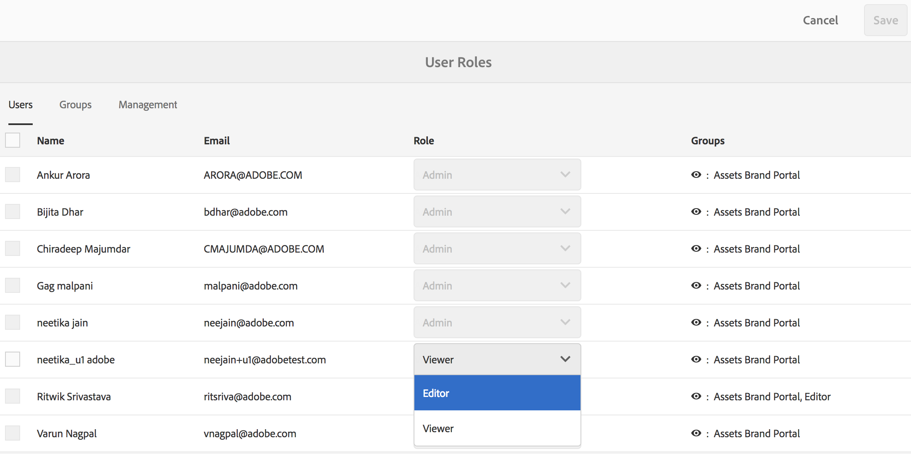

# 管理用户、组和用户角色 {#manage-users-groups-and-user-roles}

管理员可以使用Adobe Admin Console创建AEM Assets Brand Portal用户和产品配置文件，并使用Brand Portal用户界面管理其角色。查看器和编辑器不提供此权限。

In [[！UICCONTROL Admin Console]](http://adminconsole.adobe.com/enterprise/overview)，您可以查看与您的组织关联的所有产品。产品可以是任何Experience Cloud解决方案，如Adobe Analytics、Adobe Target或AEM Brand Portal。您必须选择AEM Brand Portal产品并创建产品配置文件。

<!--
Comment Type: draft

<note type="note">

Product Profiles (formerly known as product configurations*). 

* The nomenclature has changed from product configurations to product profiles in the new Adobe Admin Console.

</note>
-->

这些产品配置文件每个小时与Brand Portal用户界面同步，并作为Brand Portal中的组可见。添加用户和创建产品配置文件并将用户添加到这些产品配置文件后，您可以在Brand Portal中为用户和用户组分配角色。

>[!NOTE]
>
>要在Brand Portal中创建用户组，请使用Adobe [!UICONTROL Admin Console]，使用 **[!UICONTROL 产品&gt;产品配置文件]**&#x200B;而非 **[!UICONTROL 用户页面&gt;用户组]**。Adobe [!UICONTROL Admin Console] 中的产品配置文件用于在Brand Portal中创建组。

## 添加用户 {#add-a-user}

如果您是产品管理员，请使用Adobe [[！UICCONTROL Admin Console]](http://adminconsole.adobe.com/enterprise/overview) 创建用户并将其分配到产品配置(*以前称为产品配置*)，该配置在Brand Portal中显示为组。您可以使用组执行批量操作，如角色管理和资产共享。

>[!NOTE]
无权访问Brand Portal的新用户可以从Brand Portal的登录屏幕请求访问权限。有关详细信息，请参阅 [请求访问Brand Portal](../using/brand-portal.md#request-access-to-brand-portal)。在通知区域收到访问请求通知后，单击相关通知，然后单击 **[!UICONTROL “授权访问]**”。或者，也可以按照收到的访问请求电子邮件中的链接操作。接下来，要通过 [Adobe[！UICCONTROL Admin Console]](http://adminconsole.adobe.com/enterprise/overview)，按照下面的步骤操作第4-7步。

>[!NOTE]
您可以登录 [Adobe[！UICCONTROL Admin Console]或](http://adminconsole.adobe.com/enterprise/overview) 从Brand Portal中购买。如果您直接登录，请按照以下步骤中的步骤4-7添加用户。

1. 在顶部的AEM工具栏中，单击Adobe徽标以访问管理工具。

   

2. 在管理工具面板中，单击 **[!UICONTROL 用户]**。

   

3. 在 [!UICONTROL “用户角色] ”页面中，单击 **[!UICONTROL “管理]** ”选项卡，然后单击 **[!UICONTROL “启动管理员控制台]**”。

   

4. 在Admin Console中，执行以下操作之一以创建新用户：

   * 从顶部的工具栏中，单击 **[!UICONTROL 概述]**。在 [!UICONTROL 概述] 页面中，单击 **[!UICONTROL Brand Portal产品卡中的分配用户]** 。
   

   * 在顶部的工具栏中，单击 **[!UICONTROL “用户]**”。在 [!UICONTROL “用户] ”页面中，默认情况下会选择左边栏 [!UICONTROL 中] 的用户。单击 **[!UICONTROL “添加用户]**”。
   

5. 在添加用户对话框中，键入要在键入时显示的建议列表中的用户的电子邮件ID。

   

6. 将用户分配到至少一个产品配置文件(以前称为产品配置)，以便用户可以访问Brand Portal。从请 **[!UICONTROL 选择此产品]** 字段的配置文件中选择相应的产品配置文件。
7. Click **[!UICONTROL Save]**. 欢迎电子邮件会发送给您添加的用户。受邀用户可以通过单击欢迎电子邮件中的链接并使用 [!UICONTROL Adobe ID登录来访问Brand Portal]。有关更多信息，请参阅 [首次登录体验](../using/brand-portal-onboarding.md)。

   >[!NOTE]
   如果用户无法登录到Brand Portal，则组织的管理员应访问Adobe [!UICONTROL Admin Console] 并检查该用户是否存在并已将其添加到至少一个产品配置。

   有关向用户授予管理权限的信息，请参阅 [为用户提供管理员权限](../using/brand-portal-adding-users.md#provideadministratorprivilegestousers)。

## 添加产品配置文件 {#add-a-product-profile}

[!UICONTROL Admin Console中的产品配置文件(以前称为产品配置)] 用于在Brand Portal中创建组，以便您可以执行批量操作，如在Brand Portal中执行角色管理和资产共享。**Brand Portal** 是可用的默认产品配置文件；您可以创建更多产品配置文件，并将用户添加到新的产品配置。

>[!NOTE]
您可以登录 [[！UICCONTROL Admin Console]或](http://adminconsole.adobe.com/enterprise/overview) 从Brand Portal中购买。如果直接登录 [!UICONTROL Admin Console] ，请按照以下步骤中的步骤4-7添加产品配置文件。

1. 在顶部的AEM工具栏中，单击Adobe徽标以访问管理工具。

   

2. 在管理工具面板中，单击 **[!UICONTROL 用户]**。

   

3. 在 [!UICONTROL “用户角色] ”页面中，单击 **[!UICONTROL “管理]** ”选项卡，然后单击 **[!UICONTROL “启动管理员控制台]**”。

   

4. 从顶部的工具栏中，单击 **[!UICONTROL “产品]**”。
5. [!UICONTROL 在“产品”] 页面中， [!UICONTROL 默认情况下会选择产品配置文件] 。单击 **[!UICONTROL “新建配置文件]**”。

   

6. 在 [!UICONTROL “创建新配置文件] ”页面中，提供配置文件名称、显示名称、配置文件描述，并选择您希望在将用户添加到配置文件或从配置文件中删除时通过电子邮件通知用户。

   

7. Click **[!UICONTROL Done]**. 产品配置组( **[!UICONTROL 例如销售组]**)已添加到Brand Portal。

   

## 将用户添加到产品配置文件 {#add-users-to-a-product-profile}

要将用户添加到Brand Portal组，请将其添加到 [!UICONTROL Admin Console]中的相应产品配置文件(以前称为产品配置)。可以单独或批量添加用户。

>[!NOTE]
您可以登录 [[！UICCONTROL Admin Console]或](http://adminconsole.adobe.com/enterprise/overview) 从Brand Portal中购买。如果直接登录Admin Console，请按照以下步骤中的步骤4-7，将用户添加到产品配置文件。

1. 在顶部的AEM工具栏中，单击Adobe徽标以访问管理工具。

   

2. 在管理工具面板中，单击 **[!UICONTROL 用户]**。

   

3. 在 [!UICONTROL “用户角色] ”页面中，单击 **[!UICONTROL “管理]** ”选项卡，然后单击 **[!UICONTROL “启动管理员控制台]**”。

   ![Launch [!DNL Admin Console]](assets/launch_admin_console.png)

4. 从顶部的工具栏中，单击 **[!UICONTROL “产品]**”。
5. [!UICONTROL 在“产品”] 页面中， [!UICONTROL 默认情况下会选择产品配置文件] 。打开要添加用户的产品配置文件，例如 [!UICONTROL 销售组]。

   

6. 要将单个用户添加到产品配置文件，请执行以下操作：

   * 单击 **[!UICONTROL “添加用户]**”。
   

   * 在 [!UICONTROL “向销售用户添加用户”组] 页面中，键入要在键入时显示的建议列表中的用户的电子邮件ID。
   

   * Click **[!UICONTROL Save]**.

7. 要将批量用户添加到产品配置文件，请执行以下操作：

   * 选择省略号(...)**[!UICONTROL &gt;通过CSV添加用户]**。
   

   * 在“ **[!UICONTROL 按CSV添加用户”]** 中，下载CSV模板或拖放CSV文件。
   

   * Click **[!UICONTROL Upload]**.
   如果您向默认产品配置文件(即Brand Portal)添加了用户，欢迎电子邮件会发送到您添加的用户的电子邮件ID。受邀的用户可以通过单击欢迎电子邮件中的链接并使用 [!UICONTROL Adobe ID登录来访问Brand Portal]。有关更多信息，请参阅 [首次登录体验](../using/brand-portal-onboarding.md)。

   添加到自定义或新产品配置文件的用户不会收到电子邮件通知。

## 为用户提供管理员权限 {#provide-administrator-privileges-to-users}

您可以向Brand Portal用户提供系统管理员或产品管理员权限。请勿在 [!UICONTROL Admin Console]中提供其他管理权限，如产品配置管理员、用户组管理员和支持管理员。要了解有关这些角色的更多信息，请参阅 [管理角色](https://helpx.adobe.com/enterprise/using/admin-roles.html)。

>[!NOTE]
您可以登录 [[！UICCONTROL Admin Console]或](https://adminconsole.adobe.com/enterprise/overview) 从Brand Portal中购买。如果直接登录 [!UICONTROL 到Admin Console] ，请按照以下步骤中的步骤4-8将用户添加到产品配置文件。

1. 在顶部的AEM工具栏中，单击Adobe徽标以访问管理工具。

   

2. 在管理工具面板中，单击 **[!UICONTROL 用户]**。

   

3. 在 [!UICONTROL “用户角色] ”页面中，单击 **[!UICONTROL “管理]** ”选项卡，然后单击 **[!UICONTROL “启动管理员控制台]**”。

   

4. 在顶部的工具栏中，单击 **[!UICONTROL “用户]**”。
5. 在 [!UICONTROL “用户] ”页面中，默认情况下会选择左边栏 [!UICONTROL 中] 的用户。单击要向其提供管理员权限的用户的用户名。

   

6. 在用户配置文件页面中，找到底部的 **[!UICONTROL “管理权限]** ”部分，然后选择省略号(**[!UICONTROL …&gt;编辑管理员权限]**。
   

7. 在 [!UICONTROL “编辑管理员] ”页面中，选择系统管理员或产品管理员。

   

   >[!NOTE]
   Brand Portal仅支持系统管理员和产品管理员角色。
   Adobe建议您避免使用系统管理员角色，因为它为组织的所有产品授予整个组织范围的管理员权限。例如，包含三个营销云产品的组织的系统管理员拥有全部三个产品的全部权限。只有系统管理员才能配置AEM资产，以便将资产从AEM资产发布到Brand Portal。有关详细信息，请参阅 [配置AEM Assets与Brand Portal集成](https://helpx.adobe.com/experience-manager/6-5/assets/using/brand-portal-configuring-integration.html)。
   相反，产品管理员角色仅为特定产品授予管理员权限。如果要在Brand Portal中执行更精细的访问控制，请使用产品管理员角色并选择产品作为Brand Portal。

   >[!NOTE]
   Brand Portal不支持产品配置管理员(以前称为配置管理员)权限。避免向用户分配产品配置管理员权限。

8. 查看管理类型选择，然后单击 **[!UICONTROL 保存]**。

   >[!NOTE]
   要撤销用户的管理员权限，请在 [!UICONTROL “编辑管理员] ”页面中进行相应的更改，然后单击 **[!UICONTROL “保存”]**。

## 管理用户角色 {#manage-user-roles}

管理员可以修改Brand Portal中用户的角色。

除了管理员角色之外，Brand Portal还支持以下角色：

* [!UICONTROL 查看器]：具有此角色的用户可以查看管理员与其共享的文件和文件夹。查看器还可以搜索和下载资产。但是，查看器不能与其他用户共享内容(文件、文件夹和 [!UICONTROL 集合])。
* [!UICONTROL 编辑器]：具有此角色的用户具有查看器的所有权限。此外，编辑人员还可以与其他用户共享内容(文件夹、 [!UICONTROL 集合]、链接)。

1. 在顶部的AEM工具栏中，单击Adobe徽标以访问管理工具。

   

2. 在管理工具面板中，单击 **[!UICONTROL 用户]**。

   

3. 在 [!UICONTROL “用户角色] ”页面中，默认情况下会选择 [!UICONTROL “用户] ”选项卡。对于要更改其角色的用户，请从“角色”下拉列表中选择 **[!UICONTROL “编辑者]** ”或 **[!UICONTROL “查看者]****** ”。

   

   要同时修改多个用户的角色，请选择用户并从 **[!UICONTROL 角色]** 下拉列表中选择相应的角色。

   >[!NOTE]
   管理员用户的 [!UICONTROL “角色] ”列表被禁用。您无法选择这些用户来修改其角色。

   >[!NOTE]
   如果用户是编辑器组的成员，则用户角色也会被禁用。要从用户撤销编辑权限，请从编辑器组中删除该用户，或将整个用户组的角色更改为查看器。

4. Click **[!UICONTROL Save]**. 将为相应的用户修改角色。如果选择了多个用户，则会同时修改所有用户的角色。

   >[!NOTE]
   仅当用户重新登录到Brand Portal后，用户权限的更改才会反映在 [!UICONTROL “用户角色] ”页面中。

## 管理组角色和权限 {#manage-group-roles-and-privileges}

管理员可以将特定权限与Brand Portal上的一组  用户关联。通过“用户角色”页面上的 [!UICONTROL “组] ”选项卡，管理员可以：

* 为用户组分配角色
* 限制用户组下载图像文件的原始演绎版(.jpeg、. tiff、. png、. bmp、. gif、pjpeg、x-portable-any map、x-dable-any-map、x-dable-graymap、x-deskable-fillmap、x-digital-publish、x-digital-photoshop、x-create、image/photoshop、image/photoshop/x-photoshop、. psd、image/vnd. adobe. photoshop)。

>[!NOTE]
对于共享作为链接的资产，将根据共享资产的用户的权限，对图像文件的原始演绎版进行访问。

要修改角色和权限以访问特定组成员的原始演绎版，请按照以下步骤操作：

1. 在 [!UICONTROL “用户角色] ”页面上，导航到 **[!UICONTROL “用户组]** ”选项卡。
2. 选择要更改角色的用户组。
3. 从 [!UICONTROL 角色] 下拉列表中选择适当的角色。

   允许用户组成员访问图像文件的原始演绎版(.jpeg、. tiff、. png、. bmp、. gif、pjpeg、x-portable-any map、x-portable-any map、x-dable-graymap、x-dable-graymap、x-digital-publish、x-digital-publish、x-create、x-icon、x-icon、x-icon、image/photoshop、image/x-photoshop、. psd、 [!UICONTROL image/vnd. adobe. photoshop)，它们从门户网站或共享链接下载，请保留为该组选择的“访问原始”] 选项。默认情况下，对所有用户都选择 [!UICONTROL 了“访问原始] ”选项。要阻止用户组访问原始演绎版，请取消选择与该组对应的选项。

   

   >[!NOTE]
   如果用户添加到多个用户组，并且其中一个用户组有限制，则限制将适用于该用户。
   此外，访问原始图像文件的原始演绎版不适用于管理员，即使它们是受限组的成员也不例外。

4. Click **[!UICONTROL Save]**. 将为相应的组修改角色。

   >[!NOTE]
   用户对组关联或用户组成员关系每小时将同步到Brand Portal。对用户或用户组角色的更改在下一个同步作业运行后有效。
