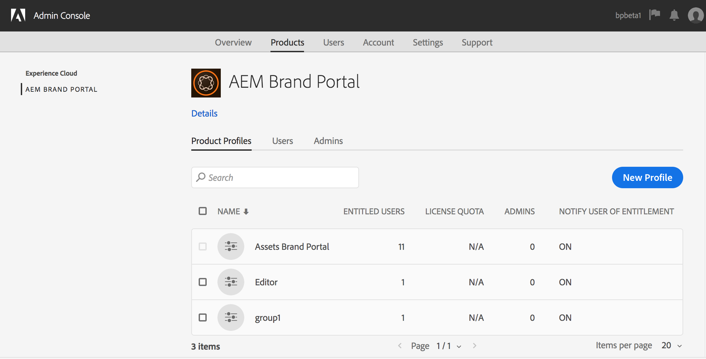

# Manage Users, Groups, and User Roles {#manage-users-groups-and-user-roles}

管理员可以使用Adobe Admin Console创建AEM Assets Brand Portal用户和产品配置文件，并使用Brand Portal用户界面管理他们的角色。 此权限对查看者和编辑者不可用。

在 [[!UICONTROL Admin Console中]](http://adminconsole.adobe.com/enterprise/overview)，您可以查看与您的组织关联的所有产品。 产品可以是任何Experience Cloud解决方案，如Adobe Analytics、Adobe Target或AEM Brand Portal。 您必须选择AEM Brand Portal产品，然后创建产品配置。

<!--
Comment Type: draft

<note type="note">

Product Profiles (formerly known as product configurations*). 

* The nomenclature has changed from product configurations to product profiles in the new Adobe Admin Console.

</note>
-->

这些产品配置每8小时与Brand Portal用户界面同步一次，并在Brand Portal中显示为组。 在添加用户和创建产品配置文件并将用户添加到这些产品配置文件后，您便可以在Brand Portal中为用户和用户组分配角色。

>[!NOTE]
>
>要在Brand Portal中创建组，请从Adobe [!UICONTROL Admin Console]，使用“产品”>“产品配置文件 **[!UICONTROL ”，而不是“用]**&#x200B;户页面”>“用户组” ****。 Adobe [!UICONTROL Admin Console中的产品配置] ，用于在Brand Portal中创建组。

## 添加用户 {#add-a-user}

如果您是产品管理员，请使用Adobe [[!UICONTROL Admin Console]](http://adminconsole.adobe.com/enterprise/overview) ，创建用户并将其分配到产品配置(以前称为产品配置&#x200B;**)，这些配置在Brand Portal中显示为组。 您可以使用组执行批量操作，如角色管理和资产共享。

>[!NOTE]
>
>无权访问Brand Portal的新用户可以从Brand Portal的登录屏幕请求访问权限。 有关详细信息，请参阅 [请求访问Brand Portal](../using/brand-portal.md#request-access-to-brand-portal)。 在通知区域收到访问请求通知后，单击相关通知，然后单击“授 **[!UICONTROL 予访问权限”]**。 或者，也可以按照收到的访问请求电子邮件中的链接操作。 接下来，要通过 [Adobe [!UICONTROL Admin Console添加用户]](http://adminconsole.adobe.com/enterprise/overview)，请按照以下步骤中的步骤4-7操作。

>[!NOTE]
>
>您可以直接 [或从 [!UICONTROL Brand Portal登录]](http://adminconsole.adobe.com/enterprise/overview) Adobe Admin Console。 如果您直接登录，请按照以下步骤中的步骤4-7添加用户。

1. 从顶部的AEM工具栏中，单击Adobe徽标以访问管理工具。

   

1. 在管理工具面板中，单击“用 **[!UICONTROL 户”]**。

   

1. 在“用户 [!UICONTROL 角色] ”页面中，单击“管 **[!UICONTROL 理”选项卡]** ，然后单击 **[!UICONTROL 启动管理控制台]**。

   

1. 在Admin Console中，执行下列操作之一以创建新用户：

   * 在顶部的工具栏中，单击“概 **[!UICONTROL 述”]**。 在“概 [!UICONTROL 述] ”页面中 **[!UICONTROL ，单击Brand Portal]** 产品卡中的“分配用户”。
   

   * 在顶部的工具栏中，单击“用 **[!UICONTROL 户”]**。 在“用 [!UICONTROL 户] ”页面 [!UICONTROL 中] ，默认情况下会选中左边栏中的“用户”。 单击“ **[!UICONTROL 添加用户]**”。
   

1. 在“添加用户”对话框中，键入要添加的用户的电子邮件ID，或从键入时显示的建议列表中选择该用户。

   

1. 将用户分配到至少一个产品配置文件（以前称为产品配置），以便用户能够访问Brand Portal。 从“请为此产品选择配置 **[!UICONTROL 文件”字段中选择相应的产品配置]** 。
1. 单击&#x200B;**[!UICONTROL 保存]**。随后将向您添加的用户发送一封欢迎电子邮件。 受邀用户可以通过单击欢迎电子邮件中的链接并使用 [!UICONTROL Adobe ID登录来访问Brand Portal]。 有关详细信息，请 [参阅首次登录体验](../using/brand-portal-onboarding.md)。

   >[!NOTE]
   >
   >如果用户无法登录到Brand Portal，则组织的管理员应访问Adobe [!UICONTROL Admin Console] ，并检查该用户是否存在以及是否已添加到至少一个产品配置文件中。

   有关向用户授予管理权限的信息，请参阅向 [用户提供管理员权限](../using/brand-portal-adding-users.md#provideadministratorprivilegestousers)。

## 添加产品配置 {#add-a-product-profile}

 Admin Console中的产品配置文件（以前称为产品配置）用于在Brand Portal中创建组，以便您能够在Brand Portal中执行批量操作，如角色管理和资产共享。 **Brand Portal是可用的默认产品配置；** 您可以创建更多产品配置并将用户添加到新的产品配置。

>[!NOTE]
>
>您可以直接或 [[!UICONTROL 从Brand Portal登录]](http://adminconsole.adobe.com/enterprise/overview) Admin Console。 如果您直接登 [!UICONTROL 录到Admin Console] ，请按照以下步骤中的步骤4-7添加产品配置。

1. 从顶部的AEM工具栏中，单击Adobe徽标以访问管理工具。

   

1. 在管理工具面板中，单击“用 **[!UICONTROL 户”]**。

   

1. 在“用户 [!UICONTROL 角色] ”页面中，单击“管 **[!UICONTROL 理”选项卡]** ，然后单击 **[!UICONTROL 启动管理控制台]**。

   

1. 在顶部的工具栏中，单击 **[!UICONTROL 产品]**。
1. 在“产 [!UICONTROL 品] ”页面中， [!UICONTROL 默认情况下选择“产品配置] ”。 单击“ **[!UICONTROL 新建配置文件]**”。

   

1. 在“创 [!UICONTROL 建新配置文件] ”页面中，提供配置文件名称、显示名称、配置文件说明，并选择在将用户添加到配置文件或从配置文件删除用户时，您是要通过电子邮件通知用户。

   

1. 单击&#x200B;**[!UICONTROL 完成]**。产品配置组(例如销 **[!UICONTROL 售组]**)将添加到Brand Portal。

   

## 将用户添加到产品配置 {#add-users-to-a-product-profile}

要将用户添加到Brand Portal组，请在 [!UICONTROL Admin Console中将其添加到相应的产品配置（以前称为产品配置）]。 您可以单独或批量添加用户。

>[!NOTE]
>
>您可以直接或 [[!UICONTROL 从Brand Portal登录]](http://adminconsole.adobe.com/enterprise/overview) Admin Console。 如果您直接登录Admin Console，请按照以下步骤中的步骤4-7将用户添加到产品配置。

1. 从顶部的AEM工具栏中，单击Adobe徽标以访问管理工具。

   

1. 在管理工具面板中，单击“用 **[!UICONTROL 户”]**。

   

1. 在“用户 [!UICONTROL 角色] ”页面中，单击“管 **[!UICONTROL 理”选项卡]** ，然后单击 **[!UICONTROL 启动管理控制台]**。

   ![启动 [!DNL Admin Console]](assets/launch_admin_console.png)

1. 在顶部的工具栏中，单击 **[!UICONTROL 产品]**。
1. 在“产 [!UICONTROL 品] ”页面中， [!UICONTROL 默认情况下选择“产品配置] ”。 打开要向其添加用户的产品配置文件，例如，“销 [!UICONTROL 售组”]。

   

1. 要将单个用户添加到产品配置，请执行以下操作：

   * 单击“ **[!UICONTROL 添加用户]**”。
   

   * 在“将用 [!UICONTROL 户添加到销售组”页面中] ，键入要添加的用户的电子邮件ID，或从键入时显示的建议列表中选择该用户。
   

   * 单击&#x200B;**[!UICONTROL 保存]**。

1. 要将批量用户添加到产品配置，请执行以下操作：

   * 选择 **[!UICONTROL 省略号(...)>通过CSV添加用户]**。
   

   * 在“通 **[!UICONTROL 过CSV添加用户]** ”页面中，下载CSV模板或拖放CSV文件。
   

   * Click **[!UICONTROL Upload]**.
   如果您将用户添加到默认的产品配置（即Brand Portal），则欢迎电子邮件会发送到您添加的用户的电子邮件ID。 受邀用户可以通过单击欢迎电子邮件中的链接并使用 [!UICONTROL Adobe ID登录来访问Brand Portal]。 有关详细信息，请 [参阅首次登录体验](../using/brand-portal-onboarding.md)。

   添加到自定义或新产品配置的用户不会收到电子邮件通知。

## 为用户提供管理员权限 {#provide-administrator-privileges-to-users}

您可以向Brand Portal用户提供系统管理员或产品管理员权限。 请勿提供Admin Console中提供的其他管 [!UICONTROL 理权限]，如产品配置管理员、用户组管理员和支持管理员。 要进一步了解这些角色，请参阅管 [理角色](https://helpx.adobe.com/enterprise/using/admin-roles.html)。

>[!NOTE]
>
>您可以直接或 [[!UICONTROL 从Brand Portal登录]](https://adminconsole.adobe.com/enterprise/overview) Admin Console。 如果您直接登 [!UICONTROL 录到Admin Console] ，请按照以下步骤中的步骤4-8将用户添加到产品配置。

1. 从顶部的AEM工具栏中，单击Adobe徽标以访问管理工具。

   

1. 在管理工具面板中，单击“用 **[!UICONTROL 户”]**。

   

1. 在“用户 [!UICONTROL 角色] ”页面中，单击“管 **[!UICONTROL 理”选项卡]** ，然后单击 **[!UICONTROL 启动管理控制台]**。

   

1. 在顶部的工具栏中，单击“用 **[!UICONTROL 户”]**。
1. 在“用 [!UICONTROL 户] ”页面 [!UICONTROL 中] ，默认情况下会选中左边栏中的“用户”。 单击要向其提供管理员权限的用户的用户名。

   

1. 在用户配置文件页面中，找到底 **[!UICONTROL 部的“管理权限]** ”部分，然后选择 **[!UICONTROL 省略号(...)>编辑管理权限]**。
   

1. 在“编 [!UICONTROL 辑管理员] ”页面中，选择“系统管理员”或“产品管理员”。

   

   >[!NOTE]
   >
   >Brand Portal仅支持“系统管理员”和“产品管理员”角色。
   >
   >
   >Adobe建议您避免使用“系统管理员”角色，因为它授予组织内所有产品的管理员权限。 例如，包含三个Marketing Cloud产品的组织的系统管理员对于所有三个产品都具有整套权限。 只有系统管理员才能配置AEM资产，以便将资产从AEM资产发布到Brand Portal。 有关详细信息，请参 [阅配置AEM资产与Brand Portal](../using/configure-aem-assets-with-brand-portal.md)。
   >
   >
   >相反，产品管理员角色仅授予特定产品的管理员权限。 如果要在Brand Portal中实施更精细的访问控制，请使用“产品管理员”角色，然后选择产品作为Brand Portal。

   >[!NOTE]
   >
   >Brand Portal不支持产品配置管理员（以前称为配置管理员）权限。 避免将产品配置管理员权限分配给用户。

1. 查看管理员类型选择，然后单击 **[!UICONTROL 保存]**。

   >[!NOTE]
   >
   >要撤销用户的管理员权限，请在“编辑管理员”页面中进 **[!UICONTROL 行相应的更改]** ，然后单击 **[!UICONTROL 保存]**。

## 管理用户角色 {#manage-user-roles}

管理员可以修改Brand Portal中用户的角色。

除了管理员角色之外，Brand Portal还支持以下角色：

* [!UICONTROL 查看器]:具有此角色的用户可以查看管理员与他们共享的文件和文件夹。 查看器还可以搜索和下载资产。 但是，查看器不能与其他用户共享内容(文件、 [!UICONTROL 文件夹]、集合)。
* [!UICONTROL 编辑器]:具有此角色的用户具有查看器的所有权限。 此外，编辑人员还可以与其他用户共享内容( [!UICONTROL 文件夹]、集合、链接)。

1. 从顶部的AEM工具栏中，单击Adobe徽标以访问管理工具。

   

1. 在管理工具面板中，单击“用 **[!UICONTROL 户”]**。

   

1. 在“用 [!UICONTROL 户角色] ”页面中，默认情况下 [!UICONTROL 选择“用] 户”选项卡。 对于要更改其角色的用户，从“角色 **** ”(Role **[!UICONTROL )下拉菜单中选择“编辑器]** ”(Editor **[!UICONTROL )或“查看器]** ”(Viewer)。

   

   要同时修改多个用户的角色，请选择这些用户，然后从“角色”下拉框中选 **[!UICONTROL 择相应]** 的角色。

   >[!NOTE]
   >
   >管理员 [!UICONTROL 用户的] “角色”列表被禁用。 您无法选择这些用户来修改其角色。

   >[!NOTE]
   >
   >如果用户是编辑者组的成员，则用户角色也会被禁用。 要从用户撤销编辑权限，请从“编辑器”组中删除该用户，或将整个组的角色更改为“查看器”。

1. 单击&#x200B;**[!UICONTROL 保存]**。将为相应用户修改角色。 如果选择了多个用户，则同时修改所有用户的角色。

   >[!NOTE]
   >
   >用户权限的更改仅在用户重新登 **[!UICONTROL 录到Brand Portal后]** ，才会反映在“用户角色”页面中。

## 管理组角色和权限 {#manage-group-roles-and-privileges}

管理员可以将特定权限与Brand Portal上 [的一组](../using/brand-portal-adding-users.md#main-pars-title-278567577) 用户相关联。 “用 **[!UICONTROL 户角色]** ”页面上的“ **** 组”选项卡允许管理员：

* 为用户组分配角色
* 限制用户组从Brand Portal下载图像文件的原始再现(.jpeg、.tiff、.png、.bmp、.gif、.pjpeg、x-portable-anymap、x-portable-bitmap、x-pratble-graymap、x-pixmap、x-icon、x-icon、image/x-photoshop、.psd、image/vnd.adobe.photoshop)。

>[!NOTE]
>
>对于共享为链接的资产，将根据共享资产的用户的权限，应用访问图像文件的原始演绎版的权限。

要修改角色和访问特定用户组成员的原始演绎版的权限，请执行以下步骤：

1. 在“用 **[!UICONTROL 户角色]** ”页面上，导航到“ **[!UICONTROL 组]** ”选项卡。
1. 选择要更改其角色的组。
1. 从“角色”(Role **** )下拉列表中选择相应的角色。

   允许组成员访问图像文件的原始再现(.jpeg、.tiff、.png、.bmp、.gif、.pjpeg、x-portable-anymap、x-portable-bitmap、x-portable-graymap、x-portable-pixmap、x-rgb、x-xbimp、x-icon、image/x-photoshop、.poshop、image/vnd.adobe.p)他们从门户或共享链接下载的“访问原件”选 **[!UICONTROL 项，以保持该组的“访问原件]** ”选项处于选中状态。 默认情况下， **[!UICONTROL 会为所有用户选择]** “访问原件”选项。 要阻止用户组访问原始演绎版，请取消选择与该组对应的选项。

   

   >[!NOTE]
   >
   >如果将用户添加到多个用户组，并且其中一个用户组具有限制，则这些限制将适用于该用户。
   >
   >
   >此外，访问图像文件原始演绎版的限制不适用于管理员，即使管理员是受限用户组的成员。

1. 单击&#x200B;**[!UICONTROL 保存]**。将修改相应组的角色。

   >[!NOTE]
   >
   >用户与组的关联或用户的组成员关系每8小时同步一次到Brand Portal。 对用户或用户组角色的更改在下一个同步作业运行后生效。
