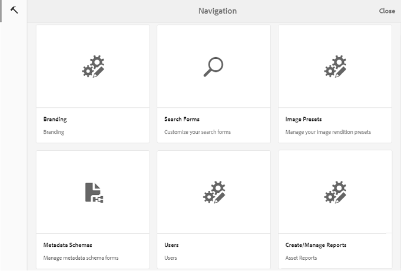

# 自定义墙纸、标题和电子邮件 {#customize-wallpaper-header-and-email-message}

[!DNL Brand Portal] 管理员可以对向用户显示的界面进行有限的自定义。您可以为 [!DNL Brand Portal] 登录页面选择特定的背景图像(墙纸)。您还可以添加标题图像，并自定义资产共享电子邮件以匹配客户的品牌。

## 自定义登录屏幕墙纸 {#customize-the-login-screen-wallpaper}

缺少自定义品牌墙纸图像时，登录页面上会显示默认墙纸。

1. 在顶部的 [!DNL AEM] 工具栏中，单击Adobe徽标以访问管理工具。

   

2. 从管理工具面板中，单击 **品牌**。

   

3. 在 **配置品牌** 页面的左边栏上， **默认** 情况下会选择墙纸。将显示登录页面上显示的默认背景图像。

   

4. 要添加新的背景图像，请单击顶部工具栏 **中的“选择图像** ”图标。

   

   执行下列操作之一：

   * 要从计算机上传图像，请单击 **“上传**”。导航到所需的图像并上传它。
   * 要使用现有的Brand Portal图像，请单击 **现有**&#x200B;的“选择”。使用资产选取器选择图像。
   

5. 指定背景图像的标题文本和描述。要保存更改，请单击 **顶部工具栏中** 的“保存”。

6. 在顶部的工具栏中，单击 **“预览** ”图标以生成带有图像的Brand Portal界面预览。

   

   

7. 要激活或取消激活默认墙纸，请在 **“配置品牌** ”&gt; **“墙纸** ”页面中执行以下操作：

   * 要在Brand Portal登录页面上显示默认墙纸图像，请单击 **顶部工具栏中的“停用墙纸** ”。系统会显示一条消息，确认已取消激活自定义图像。
   

   * 要在Brand Portal登录页面上恢复自定义图像，请单击 **工具栏中的“激活墙纸** ”。系统会显示一条消息，确认已恢复图像。
   

   * Click **Save** to save the changes.

## 自定义标题 {#customize-the-header}

登录Brand Portal后，标题将显示在各种Brand Portal页面上。

1. 在顶部的AEM工具栏中，单击Adobe徽标以访问管理工具。

   

2. 从管理工具面板中，单击 **品牌**。

   

3. 要自定义Brand Portal界面的页面标题，请在“ **配置品牌** ”页面上，从左边栏中选择 **“标题图像** ”。将显示默认标题图像。

   

4. 要上传标题图像，请单击 **选择图像** 图标，然后选择 **上传**。

   要使用现有 [!DNL Brand Portal] 图像，请选择 **从现有**&#x200B;图像中选择。

   

   使用资产选取器选择图像。

   

5. 要在标题图像中包含URL，请在 **图像URL** 框中指定该URL。可指定外部URL或内部URL。内部链接也可以是相对链接，例如，
   `/mediaportal.html/content/dam/mac/tenant_id/tags`.
此链接将用户定向到标记文件夹。
要保存更改，请单击 **顶部工具栏中** 的“保存”。

   

6. 在顶部的工具栏中，单击 **预览** 图标以生成与标题图像 [!DNL Brand Portal] 的界面预览。

   
   

7. 要激活或取消激活标题图像，请在 **“配置品牌** ”&gt; **“标题图像** ”页面中执行以下操作：

   * 要防止标题图像出现在 [!DNL Brand Portal] 页面上，请单击 **顶部工具栏中的取消激活标题** 。系统会显示一条消息，确认已取消激活图像。
   

   * 要使标题图像重新显示在 [!DNL Brand Portal] 页面上，请单击 **顶部工具栏中的“激活标题** ”。系统会显示一条消息，确认已激活图像。
   

   * Click **Save** to save the changes.

## 自定义电子邮件消息 {#customize-the-email-messaging}

将资产共享为链接时，用户会收到包含链接的电子邮件。管理员可以自定义这些电子邮件的消息，即徽标、说明和表尾。

1. 在顶部的 [!DNL AEM] 工具栏中，单击Adobe徽标以访问管理工具。

   

2. 从管理工具面板中，单击 **品牌**。

   

3. 当资产被共享为链接或通过电子邮件下载时，以及共享 [!UICONTROL 集合] 时，会向用户发送电子邮件通知。要自定义电子邮件，请在 **配置品牌** 页面上，从左边栏中选择 **电子邮件消息** 。

   

4. 要向传出电子邮件中添加标志，请单击 **顶部工具栏中的“上传** ”。

5. 在 **“描述** ”部分，指定电子邮件页眉和页脚文本。要保存更改，请单击 **顶部工具栏中** 的“保存”。

   >[!NOTE]
   >
   >如果您不使用徽标的建议大小，或者页眉和页脚文本超出建议的字数统计，则电子邮件中的内容可能会乱码。
