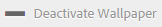

# 自定义墙纸、标题和电子邮件消息 {#customize-wallpaper-header-and-email-message}

Brand Portal管理员可以对向用户显示的界面进行有限的自定义。 您可以为Brand Portal登录页面选择特定的背景图像（墙纸）。 您还可以添加标题图像和自定义资产共享电子邮件，以匹配客户的品牌。

## 自定义登录屏幕壁纸 {#customize-the-login-screen-wallpaper}

如果没有自定义品牌墙纸图像，则登录页面上会显示默认壁纸。

1. 在顶部的工具栏中，单击Experience Manager徽标以访问管理工具。

   

1. 在管理工具面板中，单击&#x200B;**[!UICONTROL 品牌]**。

   

1. 在&#x200B;**[!UICONTROL 配置品牌]**&#x200B;页面的左边栏中，默认情况下会选中&#x200B;**[!UICONTROL 墙纸]**。 将显示登录页面上显示的默认背景图像。

   

1. 要添加新的背景图像，请单击顶部工具栏中的&#x200B;**[!UICONTROL 选择图像]**&#x200B;图标。

   

   执行下列操作之一：

   * 要从计算机上传图像，请单击&#x200B;**[!UICONTROL Upload]**。 导航到所需的图像并上传该图像。
   * 要使用现有的Brand Portal图像，请单击&#x200B;**[!UICONTROL 从现有]**&#x200B;中选择。 使用资产选取器选择图像。

   

1. 为背景图像指定标题文本和描述。 要保存更改，请单击顶部工具栏中的&#x200B;**[!UICONTROL 保存]** 。

1. 在顶部的工具栏中，单击&#x200B;**[!UICONTROL 预览]**&#x200B;图标，以生成包含图像的Brand Portal界面的预览。

   

   

1. 要激活或停用默认墙纸，请在&#x200B;**[!UICONTROL 配置品牌>墙纸]**&#x200B;页面中执行以下操作：

   * 要在Brand Portal登录页面上显示默认的墙纸图像，请单击顶部工具栏中的&#x200B;**[!UICONTROL 停用墙纸]**。 系统会显示一条消息，确认已停用自定义图像。

   

   * 要在Brand Portal登录页面上恢复自定义图像，请单击工具栏中的&#x200B;**[!UICONTROL 激活墙纸]**。 系统会显示一条消息，确认图像已恢复。

   

   * 单击&#x200B;**[!UICONTROL Save]**&#x200B;以保存更改。

## 自定义标题 {#customize-the-header}

登录到Brand Portal后，标头会显示在各种Brand Portal页面上。

1. 在顶部的工具栏中，单击Experience Manager徽标以访问管理工具。

   

1. 在管理工具面板中，单击&#x200B;**[!UICONTROL 品牌]**。

   

1. 要自定义Brand Portal界面的页眉，请在&#x200B;**[!UICONTROL 配置品牌]**&#x200B;页面上，从左边栏中选择&#x200B;**[!UICONTROL 标题图像]**。 将显示默认的标题图像。

   

1. 要上传标头图像，请单击&#x200B;**[!UICONTROL 选择图像]**&#x200B;图标，然后选择&#x200B;**[!UICONTROL 上传]**。

   要使用现有的Brand Portal图像，请选择&#x200B;**[!UICONTROL 从现有]**&#x200B;中选择。

   

   使用资产选取器选择图像。

   

1. 要在标题图像中包含URL，请在&#x200B;**[!UICONTROL 图像URL]**框中指定该URL。 您可以指定外部URL或内部URL。 内部链接也可以是相对链接，例如
   [!UICONTROL `/mediaportal.html/content/dam/mac/tenant_id/tags`].
此链接会将用户引导至标记文件夹。
要保存更改，请单击顶部工具栏中的**[!UICONTROL 保存]** 。

   

1. 在顶部的工具栏中，单击&#x200B;**[!UICONTROL 预览]**&#x200B;图标，以生成包含标题图像的Brand Portal界面预览。

   
   

1. 要激活或停用标题图像，请在&#x200B;**[!UICONTROL 配置品牌>标题图像]**&#x200B;页面中执行以下操作：

   * 要防止页眉图像显示在Brand Portal页面上，请单击顶部工具栏中的&#x200B;**[!UICONTROL 停用页眉]**。 系统会显示一条消息，确认已停用该图像。

   

   * 要使标题图像在Brand Portal页面上重新显示，请单击顶部工具栏中的&#x200B;**[!UICONTROL 激活标题]** 。 系统会显示一条消息，确认已激活该图像。

   

   * 单击&#x200B;**[!UICONTROL Save]**&#x200B;以保存更改。

## 自定义电子邮件消息 {#customize-the-email-messaging}

以链接形式共享资产时，用户会收到一封包含该链接的电子邮件。 管理员可以自定义这些电子邮件的消息传送（即徽标、描述和页脚）。

1. 在顶部的工具栏中，单击Experience Manager徽标以访问管理工具。

   

1. 在管理工具面板中，单击&#x200B;**[!UICONTROL 品牌]**。

   

1. 当资产作为链接共享或通过电子邮件下载，以及共享&#x200B;**[!UICONTROL 收藏集]**&#x200B;时，会向用户发送电子邮件通知。 要自定义电子邮件，请在&#x200B;**[!UICONTROL 配置品牌]**&#x200B;页面上，从左边栏中选择&#x200B;**[!UICONTROL 电子邮件]**。

   

1. 要向传出电子邮件添加徽标，请单击顶部工具栏中的&#x200B;**[!UICONTROL Upload]** 。

1. 在&#x200B;**[!UICONTROL 描述]**&#x200B;部分中，指定电子邮件的页眉和页脚文本。 要保存更改，请单击顶部工具栏中的&#x200B;**[!UICONTROL 保存]** 。

   >[!NOTE]
   >
   >如果您未使用推荐的徽标大小，或者页眉和页脚文本超过推荐的字数，则电子邮件中的内容可能会显示为乱码。
