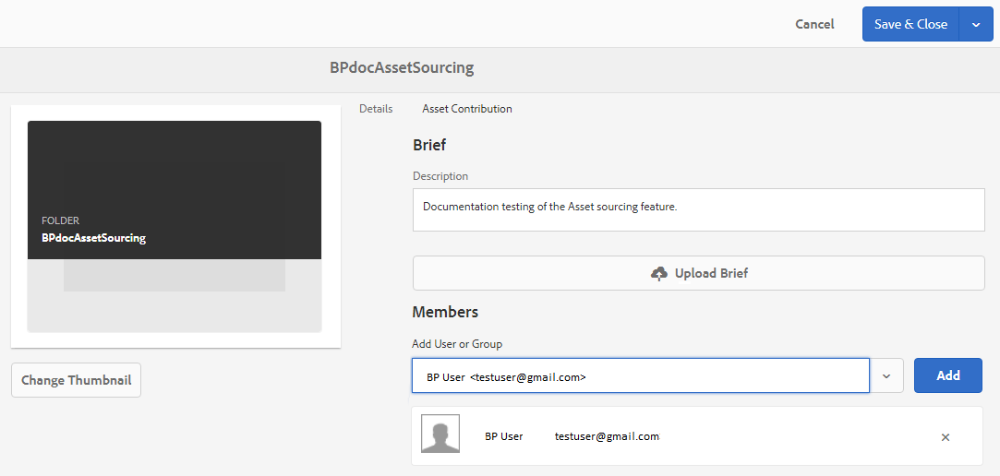

# 配置贡献文件夹属性 {#configure-contribution-folder-properties}

AEM管理员在配置贡献文件夹的属性时执行以下活动。

* **添加描述**: 提供贡献文件夹的高级描述。
* **上传摘要**:  上传包含资产相关信息的资产需求文档。
* **添加参与者**: 添加Brand Portal用户或用户组以授予他们对贡献文件夹的访问权限。

资产要求是指管理员为帮助参与者（Brand Portal用户）了解贡献文件夹的需要和要求而提供的详细信息。 管理员上传资产需求文档，其中包含应添加到贡献文件夹的资产类型和资产相关信息（例如用途、图像类型、最大大小等）的简要说明。

然后，管理员可以在将新创建的“贡献”文件夹发布到Brand Portal之前，向Brand Portal用户／组授予对贡献文件夹的访问权限。

**要配置贡献文件夹属性，请执行以下操作：**
1. 登录AEM作者实例默认URL: http://本地主机：4502/aem/start.html
1. 导航到 **[!UICONTROL 资产>文件]** ，然后找到贡献文件夹。
1. 选择贡献文件夹，然后单 **[!UICONTROL 击属性]**。 “文件夹属性”(Folder properties)窗口打开。
   
1. 导航到资 **[!UICONTROL 产贡献]** 选项卡。
1. 输入贡献文 **[!UICONTROL 件夹]** 的高级描述。
1. 单击 **[!UICONTROL 上传]** 摘要  ，从本地计算机浏览并上传 **资产需求文档**。
1. 在 **[!UICONTROL 添加用户或组]**，搜索并 **[!UICONTROL 添加要与其共享贡]** 献文件夹的品牌门户用户。 不能将分发文件夹分配给组。
这些Brand Portal用户将有权访问贡献文件夹并从其Brand Portal界面上上传内容，而无需访问AEM作者实例。

1. 单击&#x200B;**[!UICONTROL 保存]**。
   

>[!NOTE]
>
>搜索结果基于在AEM Assets中配置的Brand Portal用户列表。 确保已更新Brand Portal用户列表。 请参阅， [上传品牌门户用户列表](brand-portal-configure-asset-sourcing.md)。

