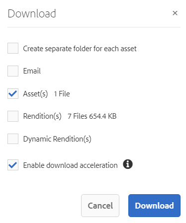

# 下载资产 {#download-assets}

<!-- Before update in Download experience - 26th Aug 2020 by Vishabh.
 All users can simultaneously download multiple assets and folders accessible to them from Brand Portal. This way, approved brand assets can be securely distributed for offline use. Read on to know how to download approved assets from Brand Portal, and what to expect from the [download performance](../using/brand-portal-download-assets.md#main-pars-header).
-->

Adobe Experience Manager资产品牌门户允许用户同时下载可从品牌门户访问的多个资产和文件夹，从而增强下载体验。 这样，可安全地分发获准的品牌资产以供离线使用。 阅读相关内容，了解如何从Brand Portal下载获准的资产，以及下载性能 [的预期](../using/brand-portal-download-assets.md#expected-download-performance)。

>[!NOTE]
>
>在从Brand Portal下载资源之前，在浏览器的扩展中安装IBM Aspera Connect 3.9.9。

<!--
**Types of renditions in Brand Portal:**

* Original asset rendition

  It is the original binary of the asset uploaded in AEM Assets. 
  
  
* System renditions

  These are the thumbnail renditions which are automatically generated in AEM Assets based on the "DAM update asset" workflow. 
  
* Custom renditions

  These are the additional renditions that an asset might have and its dynamic renditions. Any user can create additional custom renditions, whereas, only the AEM administrator can create dynamic renditions of an image in AEM Assets. To know more, see [how to apply image presets or dynamic renditions](../using/brand-portal-image-presets.md).     
-->

## 配置资产下载 {#configure-download}

下载配置允许Brand Portal管理员定义可供Brand Portal用户下载资产的演绎版集。 管理员可以从Brand Portal **[!UICONTROL 界面]** 配置资产下载设置。

可用的配置有：

* **[!UICONTROL 快速下载]**

   支持资源的高速下载。 要了解更多信息，请参 [阅可加快从Brand Portal下载的指南](../using/accelerated-download.md)。

* **[!UICONTROL 自定义呈现版本]**

   下载资产的自定义和（或）动态演绎版。
除原始资产和系统生成的演绎版之外的所有资产演绎版均称为自定义演绎版。 它包括资产可用的静态和动态演绎版。 任何用户都可以在AEM Assets创建自定义静态演绎版，而只有AEM管理员才能创建自定义动态演绎版。 要了解更多信息，请参 [阅如何应用图像预设或动态演绎版](../using/brand-portal-image-presets.md)

* **[!UICONTROL 系统呈现版本]**

   下载系统生成的资产演绎版。 这些缩略图是在AEM Assets根据“DAM更新资产”工作流自动生成的。

以管理员身份登录到您的Brand Portal租户，然后导航到 **[!UICONTROL 工具]** >下 **[!UICONTROL 载]**。 默认情况下，“ **[!UICONTROL 下载设置]** ”中启用“快速 **[!UICONTROL 下载”配置]**。

管理员可以启用任意组合来配置资产下载过程。

根据配置，独立资产、多个资产、包含资产的文件夹、授权或未授权的资产以及使用共享链接下载资产时，下载工作流程将保持不变。

* 如果“自 **[!UICONTROL 定义演]** 绎版 **[!UICONTROL ”和“系统演绎版]** ”配置都处于关闭状态，则下载资产的原始演绎版时，不会向用户显示任何其他对话框。

<!--
If all the three download configurations are turned-off, or only the **[!UICONTROL Fast Download]** configuration is enabled, the original assets are directly downloaded on your local system with no additional step required.
Test.. 
-->

* 如果启用了任 **[!UICONTROL 何“自定]** 义演绎版” **[!UICONTROL 或“系统演绎版]****** ”配置，则会显示一个额外的“下载”对话框，在该对话框中，您可以选择是下载原始资产及其演绎版，还是仅下载特定的演绎版。

>[!NOTE]
>
>只有管理员才能下载过期的资产。 有关已过期资产的更多信息，请 [参阅管理资产的数字权限](../using/manage-digital-rights-of-assets.md)。

## 下载资源的步骤 {#steps-to-download-assets}

以下是从Brand Portal下载包含资产的资产或文件夹的步骤：

1. 从Brand Portal界面，执行下列操作之一：

   * 选择要下载的文件夹或资产。 在顶部的工具栏中，单击“下 **[!UICONTROL 载]** ”图标。

      

   * 要下载特定的资产或文件夹，请将指针悬停在资产或文件夹上，然后单击快速操 **[!UICONTROL 作缩略图]** 中提供的下载图标。

      

      >[!NOTE]
      >
      >如果您是首次下载资源，并且浏览器中未安装IBM Aspera Connect，将提示您安装Aspera下载加速器。

      >[!NOTE]
      >
      >如果您正在下载的资产也包含许可的资产，则会将您重定向到版权 **[!UICONTROL 管理页]** 面。 在此页中，选择资产，单击“ **[!UICONTROL 同意]**”，然后单击“ **[!UICONTROL 下载]**”。 如果您选择不同意，则不会下载许可的资产。
      > 
      >受许可证保护的资 [产附加了许](https://helpx.adobe.com/experience-manager/6-5/assets/using/drm.html#DigitalRightsManagementinAssets) 可协议，可通过在Experience Manager资产中设置资产的 [元数据](https://helpx.adobe.com/experience-manager/6-5/assets/using/drm.html#DigitalRightsManagementinAssets) 属性来完成。

      

      >[!NOTE]
      >
      >确保在从资产详细信息页面下载资产演绎版时选择所有所需的资产演绎版，然后单击“ **[!UICONTROL 下载]**”。 选定的演绎版将下载到您的本地计算机。
      > 
      >下载后，将禁 **[!UICONTROL 用]** “下载”按钮，以避免创建已下载演绎版的重复副本。 要下载更多（缺少或其他再现副本），请刷新浏览器以重新启用下载按钮。

      如果在“下载设 **[!UICONTROL 置”中]** , **[!UICONTROL 启用了任何“自定]** 义演绎版”或“系统演绎版 **[!UICONTROL ”配置，则将显]********** 示“下载”对话框，并默认选中“Download Renditions(s)”复选框。 如果启 **[!UICONTROL 用了]** “快速下载”配置 **[!UICONTROL ，则默认情况下]** 会选中“启用下载加速”复选框。

      

      >[!NOTE]
      >
      >如果下载的资产是图像文件，并且您仅在“ **[!UICONTROL 下载”对话框中选择“资产]** ”复选框，但管理员未授权 **[!UICONTROL 访问图像文件的原始演绎版]** ，则不会下载图像文件并显示通知，表明管理员已限制您访问原始演绎版。

      

1. 要下载除原始资产外的演绎版，请选 **[!UICONTROL 择演绎版]** 复选框。 但是，如果要下载系统生成的演绎版以及自定义演绎版，请清除“排除 **[!UICONTROL 系统演绎版]** ”复选框。

   

   * 要仅下载演绎版，请清 **[!UICONTROL 除“资产]** ”复选框。

      >[!NOTE]
      >
      >默认情况下，仅下载资产。 但是，如果管理员未授权您访问图像文 [件的原始演绎版，则不会下载图像文件的原始演绎版](../using/brand-portal-adding-users.md#main-pars-procedure-202029708)。

   * 要通过链接与其他用户共享选定的资产，请选中“电 **[!UICONTROL 子邮件]** ”复选框。 会向用户发送带有下载链接的电子邮件通知。 要了解如何从共享链接下载资产，请参阅从 [共享链接下载资产](../using/brand-portal-link-share.md#main-pars-header-1703469193)。

      

      >[!NOTE]
      >
      >电子邮件通知的下载链接将在45天后过期。
      >
      >管理员可以使用品牌功能自定义电子邮件，即徽标、说明 [和页脚](../using/brand-portal-branding.md) 。

   * 您可以选择预定义的图像预设，或从“下载”对话框中创建自 **[!UICONTROL 定义]** 动态演绎版。

      要将自定 [义图像预设应用到资产及其演绎版](../using/brand-portal-image-presets.md#applyimagepresetswhendownloadingimages)，请选 **[!UICONTROL 中“动态演绎版”复选框]** 。 指定图像预设属性（如大小、格式、色彩空间、分辨率和图像修饰符），以便在下载资产及其演绎版时应用自定义图像预设。 要仅下载动态演绎版，请清 **[!UICONTROL 除“资产]** ”复选框。

      

      >[!NOTE]
      >
      >Brand Portal支持在Hybird和Scene 7模式下配置Dynamic Media。
      >
      >(如&#x200B;*果AEM作者实例在Dynamic Media Hybrid模&#x200B;**式上运行***)
      >
      >要预览或下载资产的动态演绎版，请确保已启用Dynamic Media，且资产的金字塔型Tiff演绎版存在于资产发布位置所在的AEM Assets作者实例中。 将资产发布到Brand Portal时，也会发布其金字塔tiff再现。

   * 要在下载资产时保留Brand Portal文件夹层次结构，请选中“为 **[!UICONTROL 每个资产创建单独的文件夹]** ”复选框。 默认情况下，将忽略Brand Portal文件夹层次结构，所有资产都下载到本地系统的一个文件夹中。

1. 单击“ **[!UICONTROL 下载]**”。

   资产（如果已选择，则会将演绎版）作为zip文件下载到您的本地文件夹。 但是，如果下载单个资产时不包含任何演绎版，则不会创建zip文件。

   如果管理员未 [授权您访问原始演绎版](../using/brand-portal-adding-users.md#main-pars-procedure-202029708)，则不会下载选定资产的原始演绎版。

   >[!NOTE]
   >
   >单独下载的资产会显示在资产下载报告中。 但是，如果下载的文件夹中包含资产，则文件夹和资产不会显示在资产下载报告中。

## 预期下载性能 {#expected-download-performance}

不同客户端位置的用户的文件下载体验可能不同，具体取决于诸如本地Internet连接和服务器延迟等因素。 在美国俄勒冈州的Brand Portal服务器上，在不同客户端位置观察到的2-GB文件的预期下载性能如下：

| 客户端位置 | 客户端与服务器之间的延迟 | 预期下载速度 | 下载2-GB文件所花费的时间 |
|-------------------------|-----------------------------------|-------------------------|------------------------------------|
| 美国西部（加利福尼亚北部） | 18毫秒 | 7.68 MB/秒 | 4分钟 |
| 美国西部（俄勒冈） | 42毫秒 | 3.84 MB/秒 | 9分钟 |
| 美国东部（弗吉尼亚北部） | 85毫秒 | 1.61 MB/秒 | 21分钟 |
| APAC（东京） | 124毫秒 | 1.13 MB/秒 | 30 分钟 |
| 诺伊达 | 275毫秒 | 0.5 MB/s | 68分钟 |
| 悉尼 | 175毫秒 | 0.49 MB/秒 | 69分钟 |
| 伦敦 | 179毫秒 | 0.32 MB/秒 | 106分钟 |
| 新加坡 | 196毫秒 | 0.5 MB/s | 68分钟 |

>[!NOTE]
>
>在测试条件下观察引用的数据，这可能因不同位置的用户目睹不同的延迟和带宽而异。
