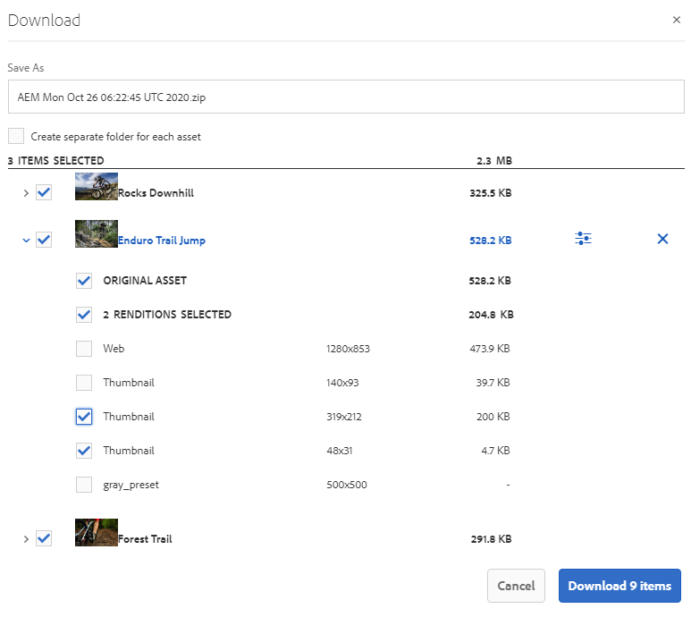

# 从Brand Portal下载资源 {#download-assets-from-bp}

<!-- Before update in Download experience - 26th Aug 2020 comment by Vishabh.
 All users can simultaneously download multiple assets and folders accessible to them from Brand Portal. This way, approved brand assets can be securely distributed for offline use. Read on to know how to download approved assets from Brand Portal, and what to expect from the [download performance](../using/brand-portal-download-assets.md#main-pars-header).
-->

Adobe Experience Manager资产品牌门户允许用户同时下载可从品牌门户访问的多个资产和文件夹，从而增强下载体验。 这样，可安全地分发获准的品牌资产以供离线使用。 阅读相关内容，了解如何从Brand Portal下载获准的资产，以及下载性能 [的预期](../using/brand-portal-download-assets.md#expected-download-performance)。

>[!NOTE]
>
>在Brand Portal 2020.10.0（及更高版本）中，默认 **[!UICONTROL 情况下启用]** “快速下载”设置，该设置使用IBM Aspera Connect加快资源下载。 在从Brand Portal下载资源之前，在浏览器的扩展中安装IBM Aspera Connect 3.9.9。 有关详细信息，请参 [阅加速从Brand Portal下载的指南](../using/accelerated-download.md)。
>
>如果您不想使用IBM Aspera Connect并继续正常下载过程，请与Brand Portal管理员联系以关闭“快速 **[!UICONTROL 下载]** ”设置。

## 配置资产下载 {#configure-download}

Brand Portal管理员可以为Brand Portal用户配置资产下载设置和权限，允许他们从Brand Portal界面访问和下载资产演绎版。

通过以下配置可以定义从Brand Portal访问和下载演绎版：

* 启用下载设置
* 配置下载权限

### 启用下载设置 {#enable-download-settings}

管理员可以启用资产 **[!UICONTROL 下载设置]** ，以定义可供Brand Portal用户下载的演绎版集。

可用设置有：

* **[!UICONTROL 快速下载]**

   它使用IBM Aspera Connect提供资源的加速下载。 默认情况下，“ **[!UICONTROL 下载设置]** ”中启用“快速 **[!UICONTROL 下载”设置]**。

* **[!UICONTROL 自定义呈现版本]**

   支持下载资产的自定义和（或）动态演绎版。

   除原始资产和系统生成的演绎版之外的所有资产演绎版均称为自定义演绎版。 它包括资产可用的静态和动态演绎版。 任何用户都可以在AEM Assets创建自定义静态演绎版，而只有AEM管理员才能创建自定义动态演绎版。 有关详细信息， [请参阅如何应用图像预设或动态演绎版](../using/brand-portal-image-presets.md)。

* **[!UICONTROL 系统呈现版本]**

   支持下载系统生成的资产演绎版。

   这些缩略图是在AEM Assets根据“DAM更新资产”工作流自动生成的。

以管理员身份登录到您的Brand Portal租户，然后导航到 **[!UICONTROL 工具]** >下 **[!UICONTROL 载]**。

管理员可以启用品牌门户用户访问和下载再现的任意设置组合。

>[!NOTE]
>
>只有管理员才能下载过期的资产。 有关已过期资产的更多信息，请 [参阅管理资产的数字权限](../using/manage-digital-rights-of-assets.md)。

### 配置下载权限 {#configure-download-permissions}

除了下载 **[!UICONTROL 设置]**,Brand Portal管理员还可以进一步配置不同用户组的视图权限，以及（或）下载原始资产及其演绎版。

以管理员身份登录到您的Brand Portal租户，然后导航到 **[!UICONTROL 工具]** > **[!UICONTROL 用户]**。 在“用 **[!UICONTROL 户角色]** ”页中，导航到 **[!UICONTROL “组]** ”选项卡，以配置用户组的视图和（或）下载权限。

>[!NOTE]
>
>如果将用户添加到多个组，并且其中一个组具有限制，则限制将适用于该用户。

根据配置，独立资产、多个资产、包含资产的文件夹、授权或未授权的资产以及使用共享链接下载资产时，下载工作流程将保持不变。

以下矩阵定义用户是否有权访问演绎版，具体取决于下 [载配置](#configure-download):

| **下载设置：自定义演绎版** | **下载设置：系统再现** | **用户组权限：下载原始** | **用户组权限：下载演绎版** | **结果** |
|---|---|---|---|---|
| 开启 | 开启 | 开启 | 开启 | 视图并下载所有再现 |
| 开启 | 开启 | 关闭 | 关闭 | 视图原始资产 |
| 关闭 | 关闭 | 开启 | 开启 | 视图和下载原始资产 |
| 开启 | 关闭 | 开启 | 开启 | 视图和下载原始资产和自定义演绎版 |
| 关闭 | 开启 | 开启 | 开启 | 视图和下载原始资产和系统演绎版 |
| 开启 | 关闭 | 关闭 | 关闭 | 视图原始资产 |
| 关闭 | 开启 | 关闭 | 关闭 | 视图原始资产 |
| 关闭 | 关闭 | 关闭 | 开启 | 视图原始资产 |
| 关闭 | 关闭 | 开启 | 关闭 | 视图和下载原始资产 |
| 关闭 | 关闭 | 关闭 | 关闭 | 视图原始资产 |

## 下载资产 {#download-assets}

Brand Portal用户可以从Brand Portal界面下载多个资产、包含资产的文件夹和集合。

>[!NOTE]
>
>如果您没有访问或下载演绎版的权限，请与Brand Portal管理员联系。

如果用户有权访问演绎版，则会为用户提供增强的“下 **[!UICONTROL 载]** ”对话框，其中包含以下功能：
* 视图下载列表中任何资产的所有可用演绎版。
* 排除不需要下载的资产演绎版。
* 只需单击一次，即可将同一组演绎版应用到所有类似的资产类型。
* 为不同的资产类型应用一组不同的演绎版。
* 为每个资产演绎版创建单独的文件夹。
* 下载选定资产及其演绎版。

>[!NOTE]
>
>仅当选 **[!UICONTROL 择要下载]** ，并且在“下载设置”中启用了“自定义演绎版 **[!UICONTROL ”或“系]** 统演绎版 **[!UICONTROL ”时，才会显]******&#x200B;示“下载”对话框。

### 下载资源的步骤 {#bulk-download}

以下是从Brand Portal界面下载包含资产的资产或文件夹的步骤：

1. 登录到您的Brand Portal租户。 默认情况下，将打 **[!UICONTROL 开]** “文件”视图，其中包含所有已发布的资产和文件夹。

   执行下列操作之一：

   * 选择要下载的资产或文件夹。 在顶部的工具栏中，单击“下 **[!UICONTROL 载]** ”图标。

      

   * 要下载资产的特定资产演绎版，请将指针悬停在资产上，然后单击快速操 **[!UICONTROL 作缩略图]** 中提供的下载图标。

      

      >[!NOTE]
      >
      >如果您是首次下载资源，并且浏览器中未安装IBM Aspera Connect，将提示您安装Aspera下载加速器。

      >[!NOTE]
      >
      >如果您正在下载的资产也包含许可的资产，则会将您重定向到版权 **[!UICONTROL 管理页]** 面。 在此页中，选择资产，单击“ **[!UICONTROL 同意]**”，然后单击“ **[!UICONTROL 下载]**”。 如果您选择不同意，则不会下载许可的资产。
      > 
      >受许可证保护的资 [产附加了许](https://helpx.adobe.com/experience-manager/6-5/assets/using/drm.html#DigitalRightsManagementinAssets) 可协议，可通过在Experience Manager资产中设置资产的 [元数据](https://helpx.adobe.com/experience-manager/6-5/assets/using/drm.html#DigitalRightsManagementinAssets) 属性来完成。

      

1. 将打 **[!UICONTROL 开]** “下载”对话框，其中列出所有选定的资产。

   单击任何资产以视图可用的演绎版，然后选中与要下载的演绎版对应的复选框。

   您可以手动选择或排除单个资产的演绎版，也可以单击 **应用** 图标，选择要下载的同一组演绎版以用于类似资产类型（此示例中的所有图像文件）。 在全 **[!UICONTROL 部应用]** 对话框中，单 **[!UICONTROL 击完成]** ，将规则应用到所有类似资产。

   

   您还可以通过单击删除图标，从下载列表（如果需要）中删除 **资产** 。

   

   要在下载资产时保留Brand Portal文件夹层次结构，请选中“为 **[!UICONTROL 每个资产创建单独的文件夹]** ”复选框。 默认情况下，将忽略Brand Portal文件夹层次结构，并将所有资产下载到zip文件夹中。

   下载按钮反映选定项的计数。 应用规则完成后，单击“下载 **[!UICONTROL 项目”]**。

   

1. 默认情况 **[!UICONTROL 下，“下载]** ”设置中启用“快 **[!UICONTROL 速下载”设置]**。 因此，将显示一个确认框，允许使用IBM Aspera Connect加速下载。

   要继续使用“ **[!UICONTROL 快速下载]**”，请单 **[!UICONTROL 击“允许]**”。 所有选定的演绎版都使用IBM Aspera Connect下载到一个zip文件夹中。

   如果不想使用IBM Aspera Connect，请单击“拒 **[!UICONTROL 绝]**”。 如果 **[!UICONTROL 拒绝或]** “快速下载”失败，则系统会填充一条“错误”消息。 单击“ **[!UICONTROL 正常下载]** ”按钮以继续下载资产。 选定的演绎版将下载到zip文件夹中，而无需使用IBM Aspera Connect。

>[!NOTE]
>
>如果管 **[!UICONTROL 理员关闭]** “快速下载”设置，则选定的演绎版将直接下载到zip文件夹中，而无需使用IBM Aspera Connect。

>[!NOTE]
>
>如果选择了20个以上的资产供下载，则会跳 **[!UICONTROL 过]** “下载”对话框，用户可访问的所有演绎版（动态演绎版除外）都会直接下载到zip文件夹中。
>
>下载包含资产和收藏集的文件夹时，会遵循相同的行为。 除动态演绎版外的可访问演绎版将直接下载到zip文件夹中。

>[!NOTE]
>
>Brand Portal支持在混合模式和Scene 7模式下配置Dynamic Media。
>
>(如&#x200B;*果AEM作者实例在Dynamic Media Hybrid模&#x200B;**式上运行***)
>
>要预览或下载资产的动态演绎版，请确保已启用Dynamic Media，且资产的金字塔型Tiff演绎版存在于资产发布位置所在的AEM Assets作者实例中。 当资产从AEM发布到Brand Portal时，其金字塔tiff再现也会发布。

如果管理员未 [授权您访问原始演绎版](../using/brand-portal-adding-users.md#main-pars-procedure-202029708)，则不会下载选定资产的原始演绎版。

<!-- This issue has been resolved, check with engineering.
>[!NOTE]
>
>Once you have downloaded the asset renditions, the **[!UICONTROL Download]** button is disabled to avoid creating duplicate copies of the renditions. To download more (missing or another copy of renditions), refresh the browser to re-enable the download button.
-->

### 从资产详细信息页面下载资产 {#download-assets-from-asset-details-page}

除了下载工作流之外，还有一种方法可以直接从资产详细信息页面下载单个资产的演绎版。

用户可以预览不同的演绎版，选择特定的演绎版，并直接从资产详细信息页面的“ **[!UICONTROL 演绎]** 版”面板下载它们，而不必打开“下 **[!UICONTROL 载]** ”对话框。

以下是从资产详细信息页面下载资产演绎版的步骤：

1. 登录到您的Brand Portal租户，然后单击资产以打开资产详细信息页面。
1. 单击左侧的叠加图标，然后单击“演 **[!UICONTROL 绎版]**”。

   

1. 演绎 **[!UICONTROL 版面板]** 会根据资产下载配置列表所有可访问的资 [产演绎版](#configure-download)。

   选择要下载的特定演绎版，然后单击“ **[!UICONTROL 下载项目]**”。

   

1. 默认情况 **[!UICONTROL 下，“下载]** ”设置中启用“快 **[!UICONTROL 速下载”设置]**。 因此，将显示一个确认框，允许使用IBM Aspera Connect加速下载。

   要继续使用“ **[!UICONTROL 快速下载]**”，请单 **[!UICONTROL 击“允许]**”。 所有选定的演绎版都使用IBM Aspera Connect下载到一个zip文件夹中。

   如果使用“快速下 **[!UICONTROL 载”拒绝]**，则系统会填充一条“错误”消息。 单击“ **[!UICONTROL Normal Download]** （正常下载）”按钮继续下载。 选定的演绎版将下载到zip文件夹中，而无需使用IBM Aspera Connect。

>[!NOTE]
>
>如果管 **[!UICONTROL 理员关闭]** “快速下载”设置，则选定的演绎版将直接下载到zip文件夹中，而无需使用IBM Aspera Connect。

>[!NOTE]
>
>单独下载的资产会显示在资产下载报告中。 但是，如果下载的文件夹中包含资产，则文件夹和资产不会显示在资产下载报告中。

<!--
>[!NOTE]
>
>Assets that are individually downloaded are visible in the assets download report. However, if a folder containing assets is downloaded, the folder and assets are not displayed in the assets download report.
-->

<!-- Backup of content before updating the new feature docs.
## Configure asset download {#configure-download}

The download configuration allows the Brand Portal administrators to define the set of renditions available to the Brand Portal users for downloading the assets. The administrator can configure the asset **[!UICONTROL Download]** settings from the Brand Portal interface. 

The available configurations are:

* **[!UICONTROL Fast Download]** 

  Enables high-speed download of the assets. To know more, see [guide to accelerate downloads from Brand Portal](../using/accelerated-download.md).

* **[!UICONTROL Custom Renditions]** 
  
  Download custom and (or) dynamic renditions of the assets. 
  All the asset renditions other than the original asset and system-generated renditions are called as custom renditions. It includes static as well as dynamic renditions available for the asset. Any user can create a custom static rendition in AEM Assets, whereas, only the AEM administrator can create custom dynamic renditions. To know more, see [how to apply image presets or dynamic renditions](../using/brand-portal-image-presets.md)

* **[!UICONTROL System Renditions]** 

  Download system-generated renditions of the assets. These are the thumbnails which are automatically generated in AEM Assets based on the "DAM update asset" workflow. 

Log in to your Brand Portal tenant as an administrator and navigate to **[!UICONTROL Tools]** > **[!UICONTROL Download]**. By default, the **[!UICONTROL Fast Download]** configuration is enabled in the **[!UICONTROL Download Settings]**. 

The administrators can enable any combination to configure the asset download process.

Based on the configuration, the download workflow remains constant for stand-alone assets, multiple assets, folders containing assets, licensed or unlicensed assets, and downloading assets using share link. 

* If both **[!UICONTROL Custom Renditions]** and **[!UICONTROL System Renditions]** configurations are turned-off, the original renditions of the assets are downloaded without any additional dialog being presented to the users.    

* If any of the **[!UICONTROL Custom Renditions]** or **[!UICONTROL System Renditions]** configuration is enabled, an additional **[!UICONTROL Download]** dialog box appears wherein you can choose whether to download the original asset along with its renditions, or download only specific renditions. 

>[!NOTE]
>
>Only the administrators can download the expired assets. For more information about expired assets, see [manage digital rights of assets](../using/manage-digital-rights-of-assets.md).

## Steps to download assets {#steps-to-download-assets}

Following are the steps to download assets or folders containing assets from Brand Portal:

1. From the Brand Portal interface, do one of the following:

   * Select the folders or assets you want to download. From the toolbar at the top, click the **[!UICONTROL Download]** icon.

     

   * To download a specific asset or folder, hover the pointer over the asset or folder and click the **[!UICONTROL Download]** icon available in the quick action thumbnails.

     

     >[!NOTE]
     >
     >If you are downloading the assets for the first time and do not have IBM Aspera Connect installed in your browser, it will prompt you to install the Aspera download accelerator. 

     >[!NOTE]
     >
     >If the assets you are downloading also include licensed assets, you are redirected to the **[!UICONTROL Copyright Management]** page. In this page, select the assets, click **[!UICONTROL Agree]**, and then click **[!UICONTROL Download]**. If you choose to disagree, licensed assets are not downloaded. 
     > 
     >License-protected assets have [license agreement attached](https://helpx.adobe.com/experience-manager/6-5/assets/using/drm.html#DigitalRightsManagementinAssets) to them, which is done by setting asset's [metadata property](https://helpx.adobe.com/experience-manager/6-5/assets/using/drm.html#DigitalRightsManagementinAssets) in Experience Manager Assets.

     

     
     >[!NOTE]
     >
     >Ensure to select all the required asset renditions while downloading them from the asset details page, and click **[!UICONTROL Download]**. The selected renditions are downloaded to your local machine.
     > 
     >Once you download, the **[!UICONTROL Download]** button is disabled to avoid creating duplicate copies of the downloaded renditions. To download more (missing or another copy of renditions), refresh the browser to re-enable the download button.

     If any of the **[!UICONTROL Custom Renditions]** or **[!UICONTROL System Renditions]** configuration is enabled in the **[!UICONTROL Download Settings]**, the **[!UICONTROL Download]** dialog appears with the **[!UICONTROL Asset(s)]** check box selected by default. If the **[!UICONTROL Fast Download]** configuration is enabled, the **[!UICONTROL Enable download acceleration]** check box is selected by default.

     

     >[!NOTE]
     >
     >If the downloading assets are image files, and you select only the **[!UICONTROL Asset(s)]** check box in the **[!UICONTROL Download]** dialog but are not [authorized by the administrator to have access to the original renditions of image files](../using/brand-portal-adding-users.md#main-pars-procedure-202029708) then no image files are downloaded and a notification appears, stating that you have been restricted by the administrator to access original renditions.

     

1. To download the renditions in addition to the original assets, select the **[!UICONTROL Rendition(s)]** check box. However, if you want to download the system-generated renditions along with the custom renditions, clear the **[!UICONTROL Exclude System Renditions]** check box.

   

   * To download only the renditions, clear the **[!UICONTROL Asset(s)]** check box.

     >[!NOTE]
     >
     >By default, only the assets are downloaded. However, original renditions of image files are not downloaded if you are not [authorized by the administrator to have access to the original renditions of image files](../using/brand-portal-adding-users.md#main-pars-procedure-202029708).

    * To share the selected assets with other users through a link, select the **[!UICONTROL Email]** check box. An email notification is sent to the users with the download link. To know how to download assets from shared links, see [downloading assets from shared links](../using/brand-portal-link-share.md#main-pars-header-1703469193).  

      

      >[!NOTE]
      >
      >The download link on email notification expires after 45 days.
      >
      >The administrators can customize email messages, that is, logo, description, and footer, using the [Branding](../using/brand-portal-branding.md) feature.

    * You can select a predefined image preset or create a custom dynamic rendition from the **[!UICONTROL Download]** dialog box. 

      To apply a [custom image preset to the asset and its renditions](../using/brand-portal-image-presets.md#applyimagepresetswhendownloadingimages), select the **[!UICONTROL Dynamic Rendition(s)]** check box. Specify the image preset properties (such as size, format, color space, resolution, and image modifier) to apply the custom image preset while downloading the asset and its renditions. To download only the dynamic renditions, clear the **[!UICONTROL Asset(s)]** check box.

      

      >[!NOTE]
      >
      >Brand Portal supports configuring Dynamic Media in both - Hybird and Scene 7 mode. 
      >
      >(*If AEM author instance is running on **Dynamic Media Hybrid mode***)
      >
      >To preview or download dynamic renditions of an asset, ensure that the dynamic media is enabled and the asset's Pyramid tiff rendition exists at the AEM Assets author instance from where the assets have been published. When an asset is published to Brand Portal, its Pyramid tiff rendition is also published.
      
  
    * To preserve the Brand Portal folder hierarchy while downloading assets, select the **[!UICONTROL Create separate folder for each asset]** check box. By default, the Brand Portal folder hierarchy is ignored and all the assets are downloaded in one folder in your local system.

1. Click **[!UICONTROL Download]**.

   The assets (and renditions if selected) are downloaded as a zip file to your local folder. However, no zip file is created if a single asset is downloaded without any of the renditions. 

   If you are not [authorized by the administrator to have access to the original renditions](../using/brand-portal-adding-users.md#main-pars-procedure-202029708), the original renditions of the selected assets are not downloaded. 

   >[!NOTE]
   >
   >Assets that are individually downloaded are visible in the assets download report. However, if a folder containing assets is downloaded, the folder and assets are not displayed in the assets download report.
-->

## 预期下载性能 {#expected-download-performance}

不同客户端位置的用户的文件下载体验可能不同，具体取决于诸如本地Internet连接和服务器延迟等因素。 在美国俄勒冈州的Brand Portal服务器上，在不同客户端位置观察到的2-GB文件的预期下载性能如下：

| 客户端位置 | 客户端与服务器之间的延迟 | 预期下载速度 | 下载2-GB文件所花费的时间 |
|-------------------------|-----------------------------------|-------------------------|------------------------------------|
| 美国西部（加利福尼亚北部） | 18毫秒 | 7.68 MB/秒 | 4分钟 |
| 美国西部（俄勒冈） | 42毫秒 | 3.84 MB/秒 | 9分钟 |
| 美国东部（弗吉尼亚北部） | 85毫秒 | 1.61 MB/秒 | 21分钟 |
| APAC（东京） | 124毫秒 | 1.13 MB/秒 | 30 分钟 |
| 诺伊达 | 275毫秒 | 0.5 MB/s | 68分钟 |
| 悉尼 | 175毫秒 | 0.49 MB/秒 | 69分钟 |
| 伦敦 | 179毫秒 | 0.32 MB/秒 | 106分钟 |
| 新加坡 | 196毫秒 | 0.5 MB/s | 68分钟 |

>[!NOTE]
>
>在测试条件下观察引用的数据，这可能因不同位置的用户目睹不同的延迟和带宽而异。

