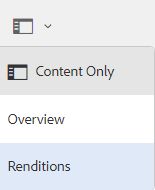

# 下载资源 {#download-assets-from-bp}

Adobe Experience Manager Assets Brand Portal通过允许用户同时下载可从Brand Portal访问的资源和文件夹来增强下载体验。 这样，即可安全地分发经批准的品牌资产以供离线使用。 请阅读并了解如何从Brand Portal下载资源（已批准的资源），以及对[下载性能](#expected-download-performance)有何期望。

>[!NOTE]
>
>在Brand Portal 2020.10.0（及更高版本）中，默认情况下启用&#x200B;**[!UICONTROL 快速下载]**&#x200B;设置，该设置使用IBM Aspera Connect加速下载资源。 在从Brand Portal下载资源之前，请在浏览器的扩展中安装IBM Aspera Connect 3.9.9 (`https://www.ibm.com/docs/en/aspera-connect/3.9.9`)。 有关更多详细信息，请参阅[从Brand Portal加速下载的指南](../using/accelerated-download.md)。
>
>如果您不想使用IBM Aspera Connect并继续正常下载过程，请联系Brand Portal管理员以关闭&#x200B;**[!UICONTROL 快速下载]**&#x200B;设置。

## 配置资源下载 {#configure-download}

Brand Portal管理员可以为Brand Portal用户配置资源下载和用户组设置，以便他们从Brand Portal界面访问和下载资源演绎版。

>[!NOTE]
>
>应用于用户界面的下载设置有助于Brand Portal用户获得自助式体验，从而轻松配置和下载资源演绎版。 它不会限制在应用程序层下载资源，例如，用户仍然可以访问和下载具有完整URL路径的资源演绎版。

以下配置定义了从Brand Portal界面访问和下载资源演绎版：

* 启用下载设置
* 配置用户群组设置

### 启用下载设置 {#enable-download-settings}

管理员可以启用资源&#x200B;**[!UICONTROL 下载设置]**&#x200B;以定义Brand Portal用户可以访问并下载的演绎版集。

可用的设置包括：

* **[!UICONTROL 快速下载]**

  它提供了使用IBM Aspera Connect加速资源下载的功能。 默认情况下，**[!UICONTROL 下载设置]**&#x200B;中的&#x200B;**[!UICONTROL 快速下载]**&#x200B;设置已启用。

* **[!UICONTROL 自定义呈现版本]**

  允许下载资源的自定义和（或）动态演绎版。

  除原始资源和系统生成的呈现版本之外的所有资源呈现版本都称为自定义呈现版本。 它包括可用于资源的静态和动态演绎版。 任何用户都可以在Experience Manager Assets中创建自定义静态演绎版，而只有管理员可以创建自定义动态演绎版。 有关详细信息，请参阅[如何应用图像预设或动态演绎版](../using/brand-portal-image-presets.md)。

* **[!UICONTROL 系统呈现版本]**

  允许下载系统生成的资源演绎版。

  这些是根据“DAM更新资产”工作流在Experience Manager Assets中自动生成的缩略图。

* **[!UICONTROL 资源下载]**

  支持将演绎版下载到每个资源的单独文件夹中。 该设置适用于文件夹、收藏集和批量下载资源（超过20项资源）。

以管理员身份登录到您的Brand Portal租户，并导航到&#x200B;**[!UICONTROL 工具]** > **[!UICONTROL 下载]**。

管理员可以为Brand Portal用户启用任意设置组合，以便访问和下载资源演绎版。

>[!NOTE]
>
>只有管理员才能下载过期的资源。 有关过期资产的详细信息，请参阅[管理资产的数字权限](../using/manage-digital-rights-of-assets.md)。

### 配置用户群组设置 {#configure-user-group-settings}

除了&#x200B;**[!UICONTROL 下载设置]**&#x200B;之外，Brand Portal管理员还可以进一步配置其他用户组的设置，以查看和（或）下载原始资源及其演绎版。

以管理员身份登录到您的Brand Portal租户，并导航到&#x200B;**[!UICONTROL 工具]** > **[!UICONTROL 用户]**。 在&#x200B;**[!UICONTROL 用户角色]**&#x200B;页面中，导航到&#x200B;**[!UICONTROL 组]**&#x200B;选项卡以配置用户组的查看和（或）下载设置。

>[!NOTE]
>
>如果将用户添加到多个组，并且其中一个组具有限制，则该限制将适用于该用户。

根据配置，对于独立资产、多个资产、包含资产的文件夹、已许可或未许可资产以及使用共享链接下载资产，下载工作流会保持不变。

以下矩阵定义用户是否有权根据[下载配置](#configure-download)访问演绎版：

| **下载设置：自定义呈现版本** | **下载设置：系统呈现版本** | **用户组设置：下载原始用户组** | **用户组设置：下载演绎版** | **结果** |
|---|---|---|---|---|
| 开启 | 开启 | 开启 | 开启 | 查看和下载所有演绎版 |
| 开启 | 开启 | 关闭 | 关闭 | 查看原始资源 |
| 关闭 | 关闭 | 开启 | 开启 | 查看和下载原始资源 |
| 开启 | 关闭 | 开启 | 开启 | 查看和下载原始资源和自定义演绎版 |
| 关闭 | 开启 | 开启 | 开启 | 查看和下载原始资源和系统演绎版 |
| 开启 | 关闭 | 关闭 | 关闭 | 查看原始资源 |
| 关闭 | 开启 | 关闭 | 关闭 | 查看原始资源 |
| 关闭 | 关闭 | 关闭 | 开启 | 查看原始资源 |
| 关闭 | 关闭 | 开启 | 关闭 | 查看和下载原始资源 |
| 关闭 | 关闭 | 关闭 | 关闭 | 查看原始资源 |

## 下载资源 {#download-assets}

Brand Portal用户可以从Brand Portal界面下载多个资源、包含资源的文件夹和收藏集。

>[!NOTE]
>
>如果您无权访问或下载资源演绎版，请联系Brand Portal管理员。

如果用户有权访问演绎版，则会向用户提供具有以下功能的增强型&#x200B;**[!UICONTROL 下载]**&#x200B;对话框：

* 查看下载列表中任何资源的所有可用演绎版。
* 排除不需要下载的资产演绎版。
* 只需单击一次，即可将同一组演绎版应用于所有类似的资源类型。
* 为不同的资源类型应用不同的演绎版集。
* 为每个资源创建单独的文件夹。
* 下载所选资源及其演绎版。

>[!NOTE]
>
>仅当&#x200B;**[!UICONTROL 下载设置]**&#x200B;中启用了&#x200B;**[!UICONTROL 自定义呈现版本]**&#x200B;和（或）**[!UICONTROL 系统呈现版本]**&#x200B;时，才会显示&#x200B;**[!UICONTROL 下载]**&#x200B;对话框。

### 下载资产的步骤 {#bulk-download}

以下是从Brand Portal界面下载资源或包含资源的文件夹的步骤：

1. 登录到您的Brand Portal租户。 默认情况下，**[!UICONTROL 文件]**&#x200B;视图打开，其中包含所有已发布的资源和文件夹。

   执行下列操作之一：

   * 选择要下载的资源或文件夹。 从顶部的工具栏中，单击&#x200B;**[!UICONTROL 下载]**&#x200B;图标。

     

   * 要下载资源的特定资源演绎版，请将指针悬停在资源上，然后单击快速操作缩略图中显示的&#x200B;**[!UICONTROL 下载]**&#x200B;图标。

     

     >[!NOTE]
     >
     >如果您是首次下载资源，并且浏览器中未安装IBM Aspera Connect，则会提示您安装Aspera下载加速器(`https://www.ibm.com/docs/en/aspera-connect/3.9.9`)。

     >[!NOTE]
     >
     >如果您正在下载的资源也包含许可资源，则您将被重定向到&#x200B;**[!UICONTROL 版权管理]**&#x200B;页面。 在此页面中，选择资源，单击&#x200B;**[!UICONTROL 同意]**，然后单击&#x200B;**[!UICONTROL 下载]**。 如果您选择不同意，则不会下载许可资产。
     > 
     >受许可证保护的资产附有[许可协议](https://experienceleague.adobe.com/docs/experience-manager-65/assets/administer/drm.html)，可通过在Experience Manager Assets中设置资产的[元数据属性](https://experienceleague.adobe.com/docs/experience-manager-65/assets/administer/drm.html)来完成此操作。

     

1. 此时将打开&#x200B;**[!UICONTROL 下载]**&#x200B;对话框，其中列出了所有选定的资源。

   单击任意资源可查看可用的演绎版，并选中与您要下载的演绎版对应的复选框。

   您可以手动选择或排除单个资源的演绎版，或单击&#x200B;**应用**&#x200B;图标以选择为类似资源类型（此示例中的所有图像文件）下载的同一组演绎版。 在&#x200B;**[!UICONTROL 全部应用]**&#x200B;对话框中，单击&#x200B;**[!UICONTROL 完成]**&#x200B;以将规则应用于所有类似资源。

   

   您还可以通过单击&#x200B;**删除**&#x200B;图标，从下载列表中删除资产（如果需要）。

   

   要在下载资源时保留Brand Portal文件夹层次结构，请选中&#x200B;**[!UICONTROL 为每个资源创建单独的文件夹]**&#x200B;复选框。

   下载按钮反映选定项目的计数。 应用完规则后，单击&#x200B;**[!UICONTROL 下载项目]**。

   

1. 默认情况下，**[!UICONTROL 下载设置]**&#x200B;中启用了&#x200B;**[!UICONTROL 快速下载]**&#x200B;设置。 因此，会显示一个确认框，以允许使用IBM Aspera Connect加速下载。

   若要继续使用&#x200B;**[!UICONTROL 快速下载]**，请单击&#x200B;**[!UICONTROL 允许]**。 使用IBM Aspera Connect将所有选定的呈现版本下载到zip文件夹中。

   如果您不想使用IBM Aspera Connect，请单击&#x200B;**[!UICONTROL 拒绝]**。 如果&#x200B;**[!UICONTROL 快速下载]**&#x200B;被拒绝或失败，则系统填充错误消息。 单击&#x200B;**[!UICONTROL 正常下载]**&#x200B;按钮继续下载资产。

<!-- removed the known issue from step 2 as it is fixed in 2022.02.0 release.
   >[!CAUTION]
   >
   >(**Experience Manager Assets as a Cloud Service** only) The following known issue will be fixed in the upcoming release:
   >
   >The download dialog lists the smart crop renditions of the selected asset, however, the user cannot download the smart crop renditions.
-->

>[!NOTE]
>
>如果管理员关闭了&#x200B;**[!UICONTROL 快速下载]**&#x200B;设置，则所选格式副本将直接下载到zip文件夹中，而无需使用IBM Aspera Connect。

>[!NOTE]
>
>如果在&#x200B;**[!UICONTROL 下载设置]**&#x200B;中启用了&#x200B;**[!UICONTROL 资源下载]**&#x200B;设置，则会将资源演绎版下载到zip文件夹中每个资源的单独文件夹中。
>  
>如果资源是从共享链接下载的，则资源演绎版将下载到zip文件夹中每个资源的单独文件夹中。
>
>如果选择了某个文件夹、收藏集或超过20个资源进行下载，则会跳过&#x200B;**[!UICONTROL 下载]**&#x200B;对话框，并且用户可访问的所有资源演绎版（不包括动态演绎版）都会下载到zip文件夹中。

>[!NOTE]
>
>Brand Portal支持在混合和Scene 7模式下配置Dynamic Media。
>
>(*如果Experience Manager Assets创作实例在&#x200B;**Dynamic Media混合模式***上运行)
>
>要预览或下载资源的动态演绎版，请确保已启用Dynamic Media，并且在已发布资源的Experience Manager Assets创作实例中存在资源的金字塔演绎版。 将资源从Experience Manager Assets发布到Brand Portal时，也会发布其金字塔TIFF演绎版。

如果管理员未[授权您访问原始演绎版](../using/brand-portal-adding-users.md#main-pars-procedure-202029708)，则不会下载所选资源的原始演绎版。

<!-- This issue has been resolved, check with engineering.
>[!NOTE]
>
>Once you have downloaded the asset renditions, the **[!UICONTROL Download]** button is disabled to avoid creating duplicate copies of the renditions. To download more (missing or another copy of renditions), refresh the browser to re-enable the download button.
-->

### 从资源详细信息页面下载资源 {#download-assets-from-asset-details-page}

除了下载工作流之外，还有另一种方法可直接从资源详细信息页面下载单个资源的演绎版。

用户可以预览不同的资源演绎版、选择特定的演绎版，以及直接从资源详细信息页面中的&#x200B;**[!UICONTROL 演绎版]**&#x200B;面板下载资源演绎版，而无需打开&#x200B;**[!UICONTROL 下载]**&#x200B;对话框。

以下是从资源详细信息页面下载资源演绎版的步骤：

1. 登录到您的Brand Portal租户，然后单击资源以打开资源详细信息页面。
1. 单击左侧的叠加图标，然后单击&#x200B;**[!UICONTROL 呈现版本]**。

   

1. **[!UICONTROL 呈现版本]**&#x200B;面板根据资源[下载配置](#configure-download)列出了所有可访问的资源呈现版本。

   选择要下载的特定格式副本，然后单击&#x200B;**[!UICONTROL 下载项目]**。

   

1. 默认情况下，**[!UICONTROL 下载设置]**&#x200B;中启用了&#x200B;**[!UICONTROL 快速下载]**&#x200B;设置。 因此，会显示一个确认框，以允许使用IBM Aspera Connect加速下载。

   若要继续使用&#x200B;**[!UICONTROL 快速下载]**，请单击&#x200B;**[!UICONTROL 允许]**。 使用IBM Aspera Connect将所有选定的呈现版本下载到zip文件夹中。

   如果您拒绝使用&#x200B;**[!UICONTROL 快速下载]**，则系统会填充一条错误消息。 单击&#x200B;**[!UICONTROL 正常下载]**&#x200B;按钮继续下载资产。

<!-- removed the known issue from step 3 as it is fixed in 2022.02.0 release.
   >[!CAUTION]
   >
   >(**Experience Manager Assets as a Cloud Service** only) The following known issues will be fixed in the upcoming release:
   >
   >The **[!UICONTROL Renditions]** panel does not list all the static renditions of the assets that are published to Brand Portal after December 16, 2021.
   >
   >The **[!UICONTROL Renditions]** panel lists the smart crop renditions of the asset, however, the user cannot preview or download the smart crop renditions.
-->

>[!NOTE]
>
>如果管理员关闭了&#x200B;**[!UICONTROL 快速下载]**&#x200B;设置，则所选格式副本将直接下载到zip文件夹中，而无需使用IBM Aspera Connect。

>[!NOTE]
>
>单独下载的Assets会在assets download报表中可见。 但是，如果下载了包含资产的文件夹，则该文件夹和资产不会显示在资产下载报表中。

<!--
>[!NOTE]
>
>Assets that are individually downloaded are visible in the assets download report. However, if a folder containing assets is downloaded, the folder and assets are not displayed in the assets download report.
-->

<!-- Backup of content before updating the new feature docs.
## Configure asset download {#configure-download}

The download configuration allows the Brand Portal administrators to define the set of renditions available to the Brand Portal users for downloading the assets. The administrator can configure the asset **[!UICONTROL Download]** settings from the Brand Portal interface. 

The available configurations are:

* **[!UICONTROL Fast Download]** 

  Enables high-speed download of the assets. To know more, see [guide to accelerate downloads from Brand Portal](../using/accelerated-download.md).

* **[!UICONTROL Custom Renditions]** 
  
  Download custom and (or) dynamic renditions of the assets. 
  All the asset renditions other than the original asset and system-generated renditions are called as custom renditions. It includes static as well as dynamic renditions available for the asset. Any user can create a custom static rendition in AEM Assets, whereas, only the AEM administrator can create custom dynamic renditions. To know more, see [how to apply image presets or dynamic renditions](../using/brand-portal-image-presets.md)

* **[!UICONTROL System Renditions]** 

  Download system-generated renditions of the assets. These are the thumbnails which are automatically generated in AEM Assets based on the "DAM update asset" workflow. 

Log in to your Brand Portal tenant as an administrator and navigate to **[!UICONTROL Tools]** > **[!UICONTROL Download]**. By default, the **[!UICONTROL Fast Download]** configuration is enabled in the **[!UICONTROL Download Settings]**. 

The administrators can enable any combination to configure the asset download process.

Based on the configuration, the download workflow remains constant for stand-alone assets, multiple assets, folders containing assets, licensed or unlicensed assets, and downloading assets using share link. 

* If both **[!UICONTROL Custom Renditions]** and **[!UICONTROL System Renditions]** configurations are turned-off, the original renditions of the assets are downloaded without any additional dialog being presented to the users.    

* If any of the **[!UICONTROL Custom Renditions]** or **[!UICONTROL System Renditions]** configuration is enabled, an additional **[!UICONTROL Download]** dialog box appears wherein you can choose whether to download the original asset along with its renditions, or download only specific renditions. 

>[!NOTE]
>
>Only the administrators can download the expired assets. For more information about expired assets, see [manage digital rights of assets](../using/manage-digital-rights-of-assets.md).

## Steps to download assets {#steps-to-download-assets}

Following are the steps to download assets or folders containing assets from Brand Portal:

1. From the Brand Portal interface, do one of the following:

   * Select the folders or assets you want to download. From the toolbar at the top, click the **[!UICONTROL Download]** icon.

     

   * To download a specific asset or folder, hover the pointer over the asset or folder and click the **[!UICONTROL Download]** icon available in the quick action thumbnails.

     

     >[!NOTE]
     >
     >If you are downloading the assets for the first time and do not have IBM Aspera Connect installed in your browser, it will prompt you to install the Aspera download accelerator. 

     >[!NOTE]
     >
     >If the assets you are downloading also include licensed assets, you are redirected to the **[!UICONTROL Copyright Management]** page. In this page, select the assets, click **[!UICONTROL Agree]**, and then click **[!UICONTROL Download]**. If you choose to disagree, licensed assets are not downloaded. 
     > 
     >License-protected assets have [license agreement attached]() to them, which is done by setting asset's [metadata property]() in Experience Manager Assets.

     

     
     >[!NOTE]
     >
     >Ensure to select all the required asset renditions while downloading them from the asset details page, and click **[!UICONTROL Download]**. The selected renditions are downloaded to your local machine.
     > 
     >Once you download, the **[!UICONTROL Download]** button is disabled to avoid creating duplicate copies of the downloaded renditions. To download more (missing or another copy of renditions), refresh the browser to re-enable the download button.

     If any of the **[!UICONTROL Custom Renditions]** or **[!UICONTROL System Renditions]** configuration is enabled in the **[!UICONTROL Download Settings]**, the **[!UICONTROL Download]** dialog appears with the **[!UICONTROL Asset(s)]** check box selected by default. If the **[!UICONTROL Fast Download]** configuration is enabled, the **[!UICONTROL Enable download acceleration]** check box is selected by default.

     

     >[!NOTE]
     >
     >If the downloading assets are image files, and you select only the **[!UICONTROL Asset(s)]** check box in the **[!UICONTROL Download]** dialog but are not [authorized by the administrator to have access to the original renditions of image files](../using/brand-portal-adding-users.md#main-pars-procedure-202029708) then no image files are downloaded and a notification appears, stating that you have been restricted by the administrator to access original renditions.

     

1. To download the renditions in addition to the original assets, select the **[!UICONTROL Rendition(s)]** check box. However, if you want to download the system-generated renditions along with the custom renditions, clear the **[!UICONTROL Exclude System Renditions]** check box.

   

   * To download only the renditions, clear the **[!UICONTROL Asset(s)]** check box.

     >[!NOTE]
     >
     >By default, only the assets are downloaded. However, original renditions of image files are not downloaded if you are not [authorized by the administrator to have access to the original renditions of image files](../using/brand-portal-adding-users.md#main-pars-procedure-202029708).

    * To share the selected assets with other users through a link, select the **[!UICONTROL Email]** check box. An email notification is sent to the users with the download link. To know how to download assets from shared links, see [downloading assets from shared links](../using/brand-portal-link-share.md#main-pars-header-1703469193).  

      

      >[!NOTE]
      >
      >The download link on email notification expires after 45 days.
      >
      >The administrators can customize email messages, that is, logo, description, and footer, using the [Branding](../using/brand-portal-branding.md) feature.

    * You can select a predefined image preset or create a custom dynamic rendition from the **[!UICONTROL Download]** dialog box. 

      To apply a [custom image preset to the asset and its renditions](../using/brand-portal-image-presets.md#applyimagepresetswhendownloadingimages), select the **[!UICONTROL Dynamic Rendition(s)]** check box. Specify the image preset properties (such as size, format, color space, resolution, and image modifier) to apply the custom image preset while downloading the asset and its renditions. To download only the dynamic renditions, clear the **[!UICONTROL Asset(s)]** check box.

      

      >[!NOTE]
      >
      >Brand Portal supports configuring Dynamic Media in both - Hybird and Scene 7 mode. 
      >
      >(*If AEM author instance is running on **Dynamic Media Hybrid mode***)
      >
      >To preview or download dynamic renditions of an asset, ensure that the dynamic media is enabled and the asset's Pyramid tiff rendition exists at the AEM Assets author instance from where the assets have been published. When an asset is published to Brand Portal, its Pyramid tiff rendition is also published.
      
  
    * To preserve the Brand Portal folder hierarchy while downloading assets, select the **[!UICONTROL Create separate folder for each asset]** check box. By default, the Brand Portal folder hierarchy is ignored and all the assets are downloaded in one folder in your local system.

1. Click **[!UICONTROL Download]**.

   The assets (and renditions if selected) are downloaded as a zip file to your local folder. However, no zip file is created if a single asset is downloaded without any of the renditions. 

   If you are not [authorized by the administrator to have access to the original renditions](../using/brand-portal-adding-users.md#main-pars-procedure-202029708), the original renditions of the selected assets are not downloaded. 

   >[!NOTE]
   >
   >Assets that are individually downloaded are visible in the assets download report. However, if a folder containing assets is downloaded, the folder and assets are not displayed in the assets download report.
-->

## 预期下载性能 {#expected-download-performance}

根据本地Internet连接和服务器延迟等因素，位于不同客户端位置的用户的文件下载体验可能会有所不同。 通过位于美国俄勒冈州的Brand Portal服务器，在不同的客户端位置观察到2 GB文件的预期下载性能如下：

| 客户端位置 | 客户端和服务器之间的延迟 | 预期下载速度 | 下载2 GB文件所需的时间 |
|-------------------------|-----------------------------------|-------------------------|------------------------------------|
| 美国西部（北加利福尼亚） | 18 毫秒 | 7.68 MB/秒 | 4 分钟 |
| 美国西部（俄勒冈州） | 42 毫秒 | 3.84 MB/秒 | 9 分钟 |
| 美国东部（北弗吉尼亚州） | 85 毫秒 | 1.61 MB/秒 | 21 分钟 |
| APAC （东京） | 124 毫秒 | 1.13 MB/秒 | 30 分钟 |
| Noida | 275 毫秒 | 0.5 MB/秒 | 68 分钟 |
| 悉尼 | 175 毫秒 | 0.49 MB/秒 | 69 分钟 |
| 伦敦 | 179 毫秒 | 0.32 MB/秒 | 106 分钟 |
| 新加坡 | 196 毫秒 | 0.5 MB/秒 | 68 分钟 |

>[!NOTE]
>
>在测试条件下观察到引用的数据，对于具有不同延迟和带宽的不同位置的用户，这些测试条件可能有所不同。
