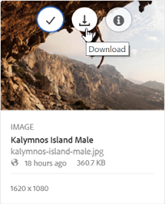

# 下载资源 {#download-assets}

所有用户可以同时从Brand Portal下载多个资产和文件夹。这样，经过批准的品牌资产可以安全地分发以供脱机使用。阅读了解如何从Brand Portal下载获准的资源，以及如何从 [下载性能中受益](../using/brand-portal-download-users.md#main-pars-header)。

>[!NOTE]
>
>只有管理员才能下载过期的资产。有关过期资产的更多信息，请参阅 [管理资产的数字权限](../using/manage-digital-rights-of-assets.md)。

## 下载资产的步骤 {#steps-to-download-assets}

要下载包含品牌门户资源的资产或文件夹，请执行以下步骤：

1. 在Brand Portal界面中，执行下列操作之一：

   * 选择要下载的文件夹或资产。从顶部的工具栏中，单击 **[!UICONTROL 下载]** 图标。
   

   * 要下载单个文件夹或资产，请将指针悬停在该文件夹或资产上。从可用的快速操作缩略图中，单击 **[!UICONTROL 下载]** 图标。
   

   >[!NOTE]
   >
   >如果您下载的资产还包含许可的资产，则您将被重定向到 **[!UICONTROL “版权管理]** ”页面。在此页面中，选择资产，单击 **[!UICONTROL “同意”]**，然后单击 **[!UICONTROL “下载]**”。如果您选择不同意，则不会下载许可的资产。\
   >受许可保护的资产已 [附加](https://helpx.adobe.com/experience-manager/6-5/assets/using/drm.html#DigitalRightsManagementinAssets) 许可协议，通过在AEM资产中设置资产 [的元数据属性](https://helpx.adobe.com/experience-manager/6-5/assets/using/drm.html#DigitalRightsManagementinAssets) 来完成此操作。

   

   此时将显示 **[!UICONTROL “下载]** ”对话框，默认情况下选择 **[!UICONTROL “资产”]** 选项。

   

   >[!NOTE]
   >
   >如果您正在下载的资产是图像文件，且您只选择“下载”对话框中的 **[!UICONTROL “资产”]** 选项，但管理员 [未授权管理员访问图像文件](../using/brand-portal-adding-users.md#main-pars-procedure-202029708) 的原始演绎版，则管理员将无法下载图像文件并提示您进行提示，表明您已受到管理员的限制访问原始演绎版。

   

2. 要在资产之外下载资产演绎版，请选择 **[!UICONTROL 演绎版]**。但是，要允许自动生成的演绎版与自定义演绎版一起下载，请取消选择 **[!UICONTROL “排除自动生成的演绎版]**”(默认情况下处于选中状态)。

   

   要仅下载演绎版，请取消选择 **[!UICONTROL 资产]**。

   >[!NOTE]
   >
   >默认情况下，仅下载资产。但是，如果管理员 [未授权您访问图像文件的原始演绎版，则不下载图像文件的原始演绎版](../using/brand-portal-adding-users.md#main-pars-procedure-202029708)。

   * 要加速从Brand Portal下载资源文件，请选择 **[!UICONTROL “启用下载加速]** 选项”， [然后按照向导](../using/accelerated-download.md#main-pars-header-405749062)进行操作。要进一步了解资源下载的更快速度，请 [参考引导您从Brand Portal下载的指南](../using/accelerated-download.md)。

   * 要将 [自定义图像预设应用于资产及其演绎版](../using/brand-portal-image-presets.md#applyimagepresetswhendownloadingimages)，请选择 **[!UICONTROL “动态演绎版]**”。指定自定义图像预设属性(大小、格式、颜色空间、分辨率和图像修饰符)，以在下载资产及其再现时应用自定义图像预设。要仅下载动态演绎版，请删除 **[!UICONTROL 资产]**。
   

   >[!NOTE]
   >
   >要预览(或下载)任何资产的动态演绎版，请确保已启用动态媒体，并且该资产的金字塔tiff演绎版存在于AEM作者实例(从已发布资产的位置)。将资产发布到Brand Portal时，其金字塔tiff再现也会发布。无法从Brand Portal生成金字塔tiff再现。

   * 要在下载资产时保留Brand Portal文件夹层次结构，请为每个资产选择 **[!UICONTROL 创建单独的文件夹]**。默认情况下，Brand Portal文件夹层次结构会被忽略，所有资源将下载到本地系统中的一个文件夹中。

   * 要向用户发送电子邮件通知以下载资产，请选择 **[!UICONTROL “电子邮件”]**。
   

   >[!NOTE]
   >
   >电子邮件通知的下载链接在45天后过期。
   >
   >管理员可以使用 [品牌](../using/brand-portal-branding.md) 功能自定义电子邮件，即徽标、说明和页脚。

3. 单击 **[!UICONTROL “下载]**”。

   资产(如果选择)作为ZIP文件下载到本地文件夹。但是，如果下载单个资源而不使用任何再现，则不会创建zip文件，从而确保了快速下载。

   如果管理员 [无权访问原始演绎版](../using/brand-portal-adding-users.md#main-pars-procedure-202029708)，则不下载所选资产的原始演绎版。

   >[!NOTE]
   >
   >单独选择并下载的资产会在下载的资产报告中可见。但是，如果下载了包含资产的文件夹，则文件夹和资产均不会显示在下载的资产中。

   要了解如何从共享链接下载资产，请参阅 [从共享链接下载资产](../using/brand-portal-link-share.md#main-pars-header-1703469193)。

## 预期下载性能 {#expected-download-performance}

文件下载体验可能因不同客户端的用户而异，具体取决于本地Internet连接和服务器滞后时间等因素。在不同客户端位置观察到的2GB文件的预期下载性能如下：位于美国Oregon的Brand Portal服务器：

| 客户端位置 | 客户端与服务器之间的延迟 | 预期下载速度 | 下载GB文件所花费的时间 |
|-------------------------|-----------------------------------|-------------------------|------------------------------------|
| 美国西部(N. California) | 18毫秒 | 7.68MB/s | 分钟 |
| 美国西部(俄勒冈州) | 42毫秒 | 3.84MB/s | 分钟 |
| 美国东部(N. Virginia) | 85毫秒 | 1.61MB/s | 21分钟 |
| APAC(东京) | 124毫秒 | 1.13MB/秒 | 30 分钟 |
| Noida | 275毫秒 | 0.5MB/秒 | 68分钟 |
| 悉尼 | 175毫秒 | 0.49MB/s | 69分钟 |
| 伦敦 | 179毫秒 | 0.32MB/秒 | 106分钟 |
| 新加坡 | 196毫秒 | 0.5MB/秒 | 68分钟 |

**注意**：在测试条件下观察到的数据可能会因不同的滞后时间和带宽不同而异。
