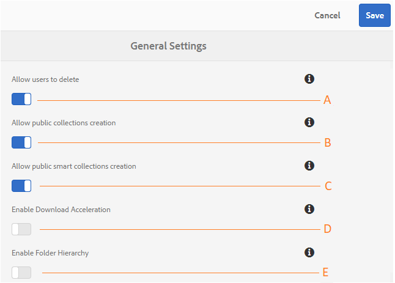

# Administer general tenant configurations {#administer-general-tenant-configurations}

AEM Assets Brand Portal allows organizations to configure the following capabilities for specific tenants:

* 管理员删除资产
* 非管理员用户创建公共集合
* 非管理员用户创建公共智能收藏集
* 下载加速
* 对非管理员用户可见的共享文件夹的父级层次结构

这些配置已作为“常规 **[!UICONTROL 设置]** ”配置在管理工具面板上提供。

**允许管理员** 从Brand Portal中删除资产的配置。 （默认为启用状态）

**B配置** ，允许非管理员用户创建公共集合。 （默认为启用状态）

**配置** ，允许非管理员用户创建公共智能收藏集。 （默认为启用状态）

**D** Configuration（配置），允许下载从门户和共享链接下载的资产的加速。 （默认为禁用）

**E** Configuration（配置），用于向非管理员用户（编辑器、查看器、客人用户）显示共享文件夹的文件夹层次结构（从根文件夹）。 （默认为禁用）

## 启用／禁用常规配置 {#enable-disable-general-configurations}

要启用／禁用以下各种配置：

1. 以管理员权限登录。
2. 从顶部的工具栏中选择AEM徽标以访问管理工具。
3. 从管理工具面板中，选择“ **[!UICONTROL 常规]** ”以打开“ **[!UICONTROL 常规设置]** ”页。
4. 使用相应的切换开关启用／禁用任何常规配置。
5. **[!UICONTROL 保存更改。]**
6. 注销以使更改生效。

## 允许管理员用户从Brand Portal中删除资产 {#allow-admin-users-to-delete-assets-from-brand-portal}

**[!UICONTROL 允许用户删除配置]** ，使组织能够允许（或限制）具有管理员权限的用户从Brand Portal中删除资产和文件夹。

## 允许非管理员创建公共集合 {#allow-public-collections-creation-by-non-admins}

[[!UICONTROL允许创建公共集合]](../using/brand-portal-share-collection.md#main-pars-text-1915052376) 配置控制非管理员是否可以在Brand Portal上创建公共集合。 默认情况下，该配置处于启用状态。 通过禁用配置，组织可以防止在其门户上拥有大量公共集合，以便保存系统空间。

## 允许非管理员创建公共智能收藏集 {#allow-public-smart-collections-creation-by-non-admins}

[[!UICONTROL Allow public smart collections creation] configuration controls whether non-administrators can save their searches as smart collections and make them public for that tenant. ](../using/brand-portal-searching.md#main-pars-header-500620467)默认情况下，该配置处于启用状态。 By disabling the configuration organizations can prevent having a huge number of public smart collections created by non-admin users on organization's Brand Portal.

## Allow download acceleration {#allow-download-acceleration}

[[!UICONTROL允许下载加速]](../using/accelerated-download.md) 配置允许组织通过与IBM Aspera connect（按需安装的应用程序）集成，从Brand Portal和共享链接加速资源下载。 该应用程序使用专有技术来消除TCP开销。

## 启用文件夹层次结构 {#enable-folder-hierarchy}

[[!UICONTROL启用文件夹层次结构]](../using/brand-portal-sharing-folders.md#non-admin-user-access-to-shared-folders) 配置允许管理员控制非管理员用户（编辑器、查看器和来宾用户）在登录后查看共享文件夹的方式。
