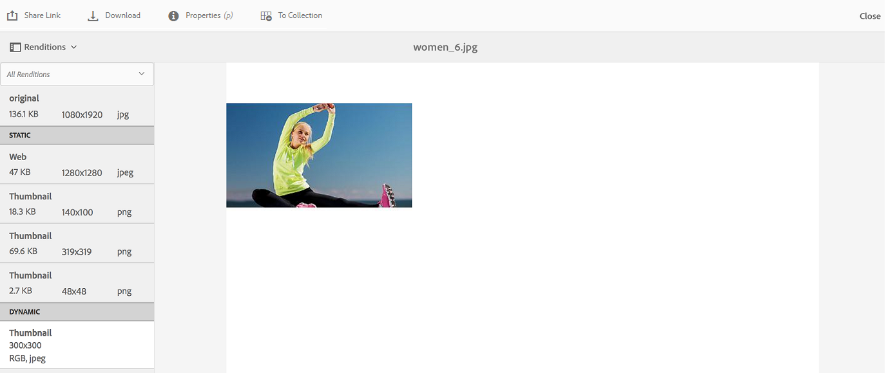

# 应用图像预设或动态演绎版 {#apply-image-presets-or-dynamic-renditions}

与宏一样，图像预设是一组预定义的大小调整和格式设置命令，这些命令以名称保存。 图像预设使AEM Assets Brand Portal能够动态传送不同大小、格式和属性的图像。

图像预设用于生成可预览和下载的图像的动态演绎版。 在预览图像及其再现时，您可以选择预设来根据管理员设置的规范重新设置图像格式。

要在Brand Portal中查看资产的动态演绎版，请确保其金字塔式tiff演绎版存在于从中发布到Brand Portal的AEM作者实例中。 发布资产时，其PTIFF再现也会发布到Brand Portal。 无法从Brand Portal生成PTIFF再现。

>[!NOTE]
>
>下载图像及其演绎版时，无法从现有预设中进行选择。 而是可以指定自定义图像预设的属性。 有关详细信息，请参 [阅下载图像时应用图像预设](../using/brand-portal-image-presets.md#main-pars-text-1403412644)。

有关创建图像预设时所需参数的详细信息，请参阅管 [理图像预设](https://docs.adobe.com/docs/en/AEM/6-0/administer/integration/dynamic-media/image-presets.html)。

## Create an image preset {#create-an-image-preset}

管理员可以创建图像预设，这些预设在资产详细信息页面上显示为动态演绎版。 您可以从头开始创建图像预设，或用新名称保存现有图像预设。 创建图像预设时，请选择图像传送的大小和格式命令。 当传送图像供查看时，其外观会根据所选命令进行优化。
请注意，只有管理员才能在Brand Portal中创建图像预设。

请注意，只有管理员才能在Brand Portal中创建图像预设。

>[!NOTE]
>
>为PTIFF可用的资产创建动态演绎版。 因此，如果资产在AEM上未创建金字塔TIFF再现并发布到Brand Portal，则只能导出其系统再现，但动态再现会作为一个选项显示。
必须在AEM（作者）上启用Dynamic Media Hybrid模式，才能创建资产的金字塔tiff(ptiff)。 当此类资产发布到Brand Portal时，会应用图像预设并显示动态演绎版。

1. 从顶部的AEM工具栏中，单击Adobe徽标以访问管理工具。

2. 在管理工具面板中，单击“图 **[!UICONTROL 像预设”]**。

   

3. 在图像预设页面中，单击“创 **[!UICONTROL 建”]**。

   

4. 在“编 **[!UICONTROL 辑图像预设]********** ”页面中，根据需要在“基本”和“高级”选项卡中输入值，包括名称。 有关各个选项的概述，请参阅[图像预设选项](https://docs.adobe.com/docs/en/AEM/6-0/administer/integration/dynamic-media/image-presets.html#Image%20preset%20options)。各项预设将出现在左侧窗格中，并且可以快速用于其他资产。

   

   >[!NOTE]
   >
   >您还可以使用“编 **[!UICONTROL 辑图像预设]** ”页面编辑现有图像预设的属性。 要编辑图像预设，请从图像预设页面中选择该图像预设，然后单击“编 **[!UICONTROL 辑”]**。

5. Click **[!UICONTROL Save]**. 图像预设将创建并显示在图像预设页面上。
6. 要删除图像预设，请从图像预设页面中选择该图像预设，然后单击“删 **[!UICONTROL 除”]**。 在确认页面中，单击 **[!UICONTROL 删除]** ，以确认删除。 图像预设将从图像预设页面中删除。

## 预览图像时应用图像预设 {#apply-image-presets-when-previewing-images}

预览图像及其再现时，从现有预设中进行选择，以根据管理员设置的规范重新设置图像格式。

1. 从Brand Portal界面中，单击图像以将其打开。
2. 单击左侧的叠加图标，然后选择“演 **[!UICONTROL 绎版”]**。

   

3. 从演绎 **[!UICONTROL 版列表]** ，选择相应的动态演绎版，例如缩 **[!UICONTROL 略图]**。 预览图像将根据您选择的再现进行渲染。

   

## 下载图像时应用图像预设 {#apply-image-presets-when-downloading-images}

从Brand Portal下载图像及其演绎版时，您无法从现有图像预设中进行选择。 但是，您可以根据要重新设置图像格式的属性来自定义图像预设属性。

1. 从Brand Portal界面中，执行以下操作之一：

   * 将指针悬停在要下载的图像上。 从可用的快速操作缩略图中，单击“下 **[!UICONTROL 载]** ”图标。
   

   * 选择要下载的图像。 在顶部的工具栏中，单击“下载 **[!UICONTROL ”图]** 标。
   

2. 从“下 **[!UICONTROL 载]** ”对话框中，根据是否要下载包含或不包含其演绎版的资产，选择所需的选项。

   

3. 要下载资产的动态演绎版，请选择“ **[!UICONTROL 动态演绎版”选项]** 。
4. 自定义图像预设属性，根据这些属性，您可以在下载过程中动态地重新设置图像及其演绎版的格式。 指定大小、格式、色彩空间、分辨率和图像修饰符。

   

5. 单击“ **[!UICONTROL 下载]**”。 自定义动态演绎版将以ZIP文件的形式下载，并包含您选择下载的图像和演绎版。 但是，如果下载了单个资产，则不会创建zip文件，这可确保快速下载。
