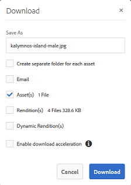

# 应用图像预设或动态演绎版 {#apply-image-presets-or-dynamic-renditions}

与宏一样，图像预设是预先定义的名称下保存的大小和格式命令集合。 图像预设使Experience Manager Assets Brand Portal能够动态交付不同大小、格式和属性的图像。

图像预设用于生成可预览和下载的图像动态演绎版。 在预览图像及其演绎版时，您可以选择预设，按照管理员设置的规范重新格式化图像。

(*如果Experience Manager Assets创作实例在&#x200B;**Dynamic Media混合模式***下运行。) 要在Brand Portal中查看资源的动态演绎版，请确保其金字塔TIFF演绎版存在于您发布到Brand Portal的Experience Manager Assets创作实例中。 发布资源时，其PTIFF演绎版也会发布到Brand Portal。

>[!NOTE]
>
>下载图像及其演绎版时，没有选项可以从现有预设中选择。 相反，您可以指定自定义图像预设的属性。 有关详细信息，请参阅[下载图像时应用图像预设](../using/brand-portal-image-presets.md#main-pars-text-1403412644)。

有关创建图像预设时所需参数的更多信息，请参阅[管理图像预设](../using/brand-portal-image-presets.md)。

## 创建图像预设 {#create-an-image-preset}

Experience Manager Assets管理员可以创建在资源详细信息页面上显示为动态演绎版的图像预设。 您可以从头开始创建图像预设，也可以使用新名称保存现有图像预设。 创建图像预设时，请选择用于图像投放的大小和格式设置命令。 当传送图像供查看时，根据选择的命令优化其外观。

>[!NOTE]
>
>图像的动态演绎版使用其金字塔TIFF创建。 如果金字塔TIFF不适用于任何资源，则无法在Brand Portal中获取该资源的动态演绎版。
>
>如果Experience Manager Assets创作实例在&#x200B;**Dynamic Media混合模式**&#x200B;下运行，则会创建图像资源的金字塔TIFF演绎版并将其保存在Experience Manager Assets存储库中。
>
>但是，如果Experience Manager Assets创作实例在&#x200B;**Dynamic Media Scene7模式**&#x200B;下运行，则Scene7服务器上存在图像资源的金字塔TIFF演绎版。
>
>将此类资源发布到Brand Portal时，会应用图像预设并显示动态演绎版。

1. 在顶部的工具栏中，单击Experience Manager徽标以访问管理工具。

1. 在“管理工具”面板中，单击&#x200B;**[!UICONTROL 图像预设]**。

   

1. 在图像预设页面中，单击&#x200B;**[!UICONTROL 创建]**。

   

1. 在&#x200B;**[!UICONTROL 编辑图像预设]**&#x200B;页面中，根据需要在&#x200B;**[!UICONTROL 基本]**&#x200B;和&#x200B;**[!UICONTROL 高级]**&#x200B;选项卡中输入值，包括名称。 预设显示在左窗格中，并可以与其他资产一起动态使用。

   

   >[!NOTE]
   >
   >您还可以使用&#x200B;**[!UICONTROL 编辑图像预设]**&#x200B;页面编辑现有图像预设的属性。 要编辑图像预设，请从图像预设页面中选择它，然后单击&#x200B;**[!UICONTROL 编辑]**。

1. 单击&#x200B;**[!UICONTROL 保存]**。图像预设随即创建并显示在图像预设页面上。
1. 要删除图像预设，请从图像预设页面中选择它，然后单击&#x200B;**[!UICONTROL 删除]**。 在确认页面中，单击&#x200B;**[!UICONTROL 删除]**&#x200B;以确认删除。 图像预设将从图像预设页面中删除。

## 在预览图像时应用图像预设 {#apply-image-presets-when-previewing-images}

在预览图像及其演绎版时，从现有预设中进行选择，以按照管理员设置的规范重新格式化图像。

1. 在Brand Portal界面中，单击图像以将其打开。
1. 单击左侧的叠加图标，然后选择&#x200B;**[!UICONTROL 节目]**。

   

1. 从&#x200B;**[!UICONTROL 呈现版本]**&#x200B;列表中，选择相应的动态呈现版本，例如&#x200B;**[!UICONTROL 缩略图]**。 根据您选择的演绎版来呈现预览图像。

   

## 下载图像时应用图像预设 {#apply-image-presets-when-downloading-images}

从Brand Portal下载图像及其演绎版时，无法从现有图像预设中进行选择。 但是，您可以根据要重新设置图像格式来自定义图像预设属性。

1. 在Brand Portal界面中，执行以下操作之一：

   * 将指针悬停在要下载的图像上。 在可用的快速操作缩略图中，单击&#x200B;**[!UICONTROL 下载]**&#x200B;图标。

   

   * 选择要下载的图像。 从顶部的工具栏中，单击&#x200B;**[!UICONTROL 下载]**&#x200B;图标。

   

1. 从&#x200B;**[!UICONTROL 下载]**&#x200B;对话框中，根据您是要下载资源（包含还是不包含其演绎版）选择所需的选项。

   

1. 要下载资源的动态演绎版，请选择&#x200B;**[!UICONTROL 动态演绎版]**&#x200B;选项。
1. 自定义图像预设属性以在下载期间动态重新格式化图像及其演绎版。 指定大小、格式、颜色空间、分辨率和图像修饰符。

   

1. 单击&#x200B;**[!UICONTROL 下载]**。 自定义动态呈现版本以ZIP文件格式下载，同时下载的还有您选择下载的图像和呈现版本。 但是，如果下载单个资产，则不会创建zip文件，这可以确保快速下载。
