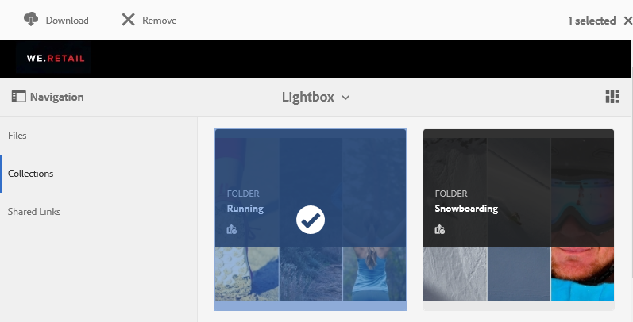

# 管理 Lightbox 收藏集 {#manage-the-lightbox-collection}

**[!UICONTROL 灯箱]** 是一种特殊类型的收藏集，可轻松访问资产。 每个用户都有一个 **[!UICONTROL 灯箱]** 首次登录Brand Portal时会自动创建。 此 **[!UICONTROL 灯箱]** 无法删除收藏集。

## 将资产添加到Lightbox {#add-assets-to-lightbox}

要将资源添加到，请执行以下操作 **[!UICONTROL 灯箱]**，请执行以下操作：

1. 导航到要添加到的资源的位置 **[!UICONTROL 灯箱]**，然后选择资源。

   

1. 从顶部的工具栏中，单击添加到收藏集图标。

   

1. 在 **[!UICONTROL 添加到收藏集]** 页面， **[!UICONTROL 灯箱]** 默认情况下，收藏集处于选中状态。

   单击 **[!UICONTROL 添加]**. 选定的资产将会添加到 **[!UICONTROL 灯箱]**.

   

1. 查看已添加到的资产 **[!UICONTROL 灯箱]**，单击 **[!UICONTROL 收藏集]** ，然后单击 **[!UICONTROL 灯箱]** 收藏集。

   

   已添加到的资产 **[!UICONTROL 灯箱]** 显示在 **[!UICONTROL 灯箱]** 页面。

   

## 从Lightbox中删除资源 {#remove-assets-from-lightbox}

1. 查看中的资产 [!UICONTROL 灯箱]，单击 **[!UICONTROL 收藏集]** 然后，单击左边栏上的 [!UICONTROL 灯箱] 收藏集。

   

1. 选择要从收藏集中删除的文件夹，然后单击 **[!UICONTROL 移除]** 从顶部的工具栏中。

   

1. 在警告消息框中，单击 **[!UICONTROL 移除]** 以确认删除。

将从删除文件夹 **[!UICONTROL 灯箱]** 收藏集。
