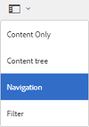
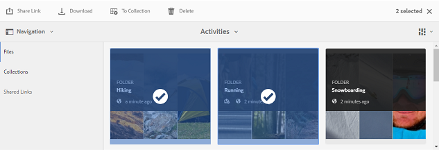
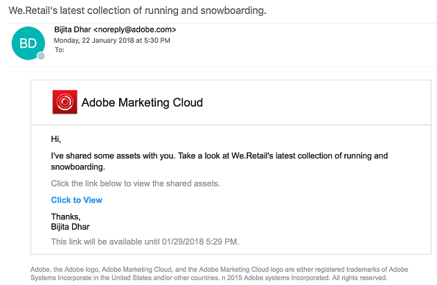
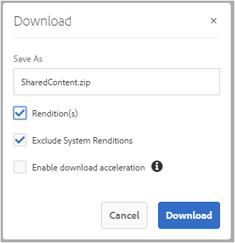
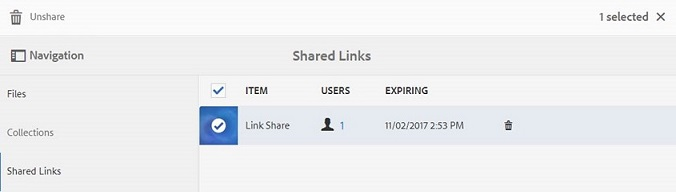

# 将资产共享为链接 {#share-assets-as-a-link}

AEM Assets Brand Portal管理员可以与授权的内部用户和外部实体（包括合作伙伴和供应商）共享多个资产的链接。 编辑人员只能查看和共享与他们共享的资源。

通过链接共享资产是一种方便的方式，使外部方可以使用它们，因为接收方不必登录Brand Portal即可访问资产。

链接共享访问权限仅限编辑员和管理员。 有关详细信息，请 [参阅管理用户、组和用户角色](../using/brand-portal-adding-users.md#manage-user-roles)。

>[!NOTE]
>
>使用Brand Portal上的链接共享功能，最多可下载5GB的zip文件。

要将资产共享为链接，请执行以下步骤：

1. 单击左侧的叠加图标，然后选择“导 **[!UICONTROL 航”]**。

   

2. 在左侧的脱轨处，单击“文 **[!UICONTROL 件]** ”以共享文件夹或图像。 要共享收藏集，请单击“ **[!UICONTROL 收藏集]**”。

   

3. 选择要作为链接共享的文件夹或收藏集。

   

4. 在顶部的工具栏中，单击共享 **[!UICONTROL 链接图标]** 。

   将出 **[!UICONTROL 现“链接共享]** ”对话框。

   

   >[!NOTE]
   >
   >共享 **[!UICONTROL 链接字段]** ，会显示自动创建的资产链接。 此链接的默认到期时间为7天。 您可以复制链接并与用户单独共享，或从“链接共享”对话 **[!UICONTROL 框共享]** 。

5. 在电子邮件地址框中，键入要与其共享链接的用户的电子邮件ID。 您可以与多个用户共享该链接。

   如果用户是您组织的成员，请从下拉列表中显示的建议中选择其电子邮件ID。 如果用户是外部用户，请键入完整的电子邮件ID并按 **[!UICONTROL Enter]**;电子邮件ID将添加到用户列表。

   

6. In the **[!UICONTROL Subject]** box, type a subject for the asset you want to share.
7. In the **[!UICONTROL Message]** box, type a message if necessary.
8. 在“过 **[!UICONTROL 期]** ”字段中，使用日期选取器指定链接的过期日期和时间。 默认情况下，到期日期设置为您共享链接之日起的7天。

   通过链接共享的资产在超过“到期”字段中指定的日期和时间后 **[!UICONTROL 过期]** 。 有关过期资产的行为以及基于用户角色在Brand Portal中对允许活动进行更改的信息，请参阅管 [理资产的数字权限](../using/manage-digital-rights-of-assets.md#asset-expiration)。

9. Click **[!UICONTROL Share]**. 系统会显示一条消息，确认已与用户共享该链接。 用户会收到一封包含该链接的电子邮件。

   

   >[!NOTE]
   >
   >管理员可以自定义电子邮件消息，包括使用品牌功能自定义徽标、说明 [和页脚](../using/brand-portal-branding.md) 。

## 从共享链接下载资源 {#download-assets-from-shared-links}

单击电子邮件中的链接，以查看共享的资产。 此时将打开AEM链接共享页面。

要下载共享资产，请执行以下操作：

1. 单击资产，然后单击工 **[!UICONTROL 具栏中]** 的下载图标。

   

   >[!NOTE]
   >
   >目前，您只能为某些资产生成预览和缩略图，具体取决于文件格式。 有关支持的文件格式的详细信息，请参 [阅资产格式的预览和缩览图支持](#preview-thumbnail-support)。

   >[!NOTE]
   >
   >如果您正在下载的资产也包括许可的资产，您会被重定向到“版权 **[!UICONTROL 管理]** ”页面。 在此页中，选择许可的资产，单击“ **[!UICONTROL 同意]**”，然后单击“ **[!UICONTROL 下载”]**。 如果您选择不同意，则仅下载未授权的资产。\
   >受许可证保护的资 [产附加了许可协议](https://helpx.adobe.com/experience-manager/6-5/assets/using/drm.html#DigitalRightsManagementinAssets) ，可通过在中设置资产的元数据属性 [来完成](https://helpx.adobe.com/experience-manager/6-5/assets/using/drm.html#DigitalRightsManagementinAssets)[!DNL AEM Assets]。

   

   将显 [!UICONTROL 示“下载] ”对话框。 
   

   * 要加快下载共享为链接的资产文件，请选择“启用下 **[!UICONTROL 载加速]** ”选项， [然后按向导操作](../using/accelerated-download.md#download-workflow-using-file-accelerator)。 要详细了解Brand Portal上资产的快速下载，请参阅 [指南以加速从Brand Portal下载](../using/accelerated-download.md)。
[!UICONTROL
2. 要从共享链接下载资产的演绎版以及资产的演绎版，请选择“ **[!UICONTROL 演绎版”选项]** 。 执行此操作时，将显 **示“排除系统演绎版”** （默认情况下为选中状态）选项。 这会阻止下载现成的演绎版以及已批准的资产或其自定义演绎版。

   但是，要允许自动生成的演绎版与自定义演绎版一起下载，请取消选择“排除 **[!UICONTROL 系统演绎版]** ”选项。

   >[!NOTE]
   >
   >如果共享资产作为链接的用户未获得管理员授权访问原始演绎版，则不会使用共享 [链接下载原始演绎版](../using/brand-portal-adding-users.md#manage-group-roles-and-privileges)。

   

3. 点按／单击 **[!UICONTROL 下载]**。 资产（如果已选择，则会将演绎版）作为ZIP文件下载到您的本地文件夹。 但是，如果下载单个资产而不下载任何演绎版，则不会创建zip文件，从而确保快速下载。

>[!NOTE]
>
>Brand Portal限制下载每个文件大小超过5 GB的资产。

## 资产格式的预览和缩览图支持 {#preview-thumbnail-support}

以下列表列出了Brand Portal支持其缩略图和预览的资产格式：

| 资产格式 | 缩略图支持 | 预览支持 |
|--------------|-------------------|-----------------|
| PNG | ✓ | ✓ |
| GIF | ✓ | ✓ |
| TIFF | ✓ | ✕ |
| JPEG | ✓ | ✓ |
| BMP | ✓ | ✕ |
| PNM* | NA | NA |
| PGM* | NA | NA |
| PBM* | NA | NA |
| PPM* | NA | NA |
| PSD | ✓ | ✕ |
| EPS | NA | ✕ |
| DNG | ✓ | ✕ |
| PICT | ✓ | ✕ |
| PSB* | ✓ | ✕ |
| JPG | ✓ | ✓ |
| AI | ✓ | ✕ |
| DOC | ✕ | ✕ |
| DOCX | ✕ | ✕ |
| ODT* | ✕ | ✕ |
| PDF | ✓ | ✕ |
| HTML | ✕ | ✕ |
| RTF | ✕ | ✕ |
| TXT | ✓ | ✕ |
| XLS | ✕ | ✕ |
| XLSX | ✕ | ✕ |
| ODS | ✕ | ✕ |
| PPT | ✓ | ✕ |
| PPTX | ✕ | ✕ |
| ODP | ✕ | ✕ |
| INDD | ✓ | ✕ |
| PS | ✕ | ✕ |
| QXP | ✕ | ✕ |
| EPUB | ✓ | ✕ |
| AAC | ✕ | ✕ |
| MIDI | ✕ | ✕ |
| 3GP | ✕ | ✕ |
| MP3 | ✕ | ✕ |
| MP4 | ✕ | ✕ |
| OGA | ✕ | ✕ |
| OGG | ✕ | ✕ |
| RA | ✕ | ✕ |
| WAV | ✕ | ✕ |
| WMA | ✕ | ✕ |
| DVI | ✕ | ✕ |
| FLV | ✕ | ✕ |
| M4V | ✕ | ✕ |
| MPG | ✕ | ✕ |
| OGV | ✕ | ✕ |
| MOV | ✕ | ✕ |
| WMV | ✕ | ✕ |
| SWF | ✕ | ✕ |
| TGZ | NA | ✕ |
| JAR | ✓ | ✕ |
| RAR | NA | ✕ |
| TAR | NA | ✕ |
| ZIP | ✓ | ✕ |

以下图例解释了矩阵中使用的符号：

| 符号 | 意义 |
|---|---|
| ✓ | 此文件格式支持此功能 |
| ✕ | 此文件格式不支持此功能 |
| NA | 此功能不适用于此文件格式 |
| * | 此功能要求在AEM作者实例上支持此文件格式，但在将资产发布到Brand Portal后，不要在Brand Portal上支持此文件格式 |

## 取消共享作为链接共享的资产 {#unshare-assets-shared-as-a-link}

要取消共享以前共享的资产作为链接，请执行以下操作：

1. 要查看您作为链接共享的资产，请单击左侧的叠加图标，然后选择导 **[!UICONTROL 航]**。

   

2. 在脱轨中，单击“共 **[!UICONTROL 享链接”]**。

   

3. 查看您从显示的列表中共享的链接。
4. 要从列表中取消共享链接，请选择该链接，然后单击链接条目旁边的素材箱图标，或从顶部的工具栏中取消共 **[!UICONTROL 享]** 。

   

   >[!NOTE]
   >
   >共享链接的显示特定于用户。 此功能不显示租户的所有用户共享的所有链接。

5. 在警告消息框中，单击“继 **[!UICONTROL 续]** ”以确认取消共享。 链接的条目将从共享链接列表中删除。
