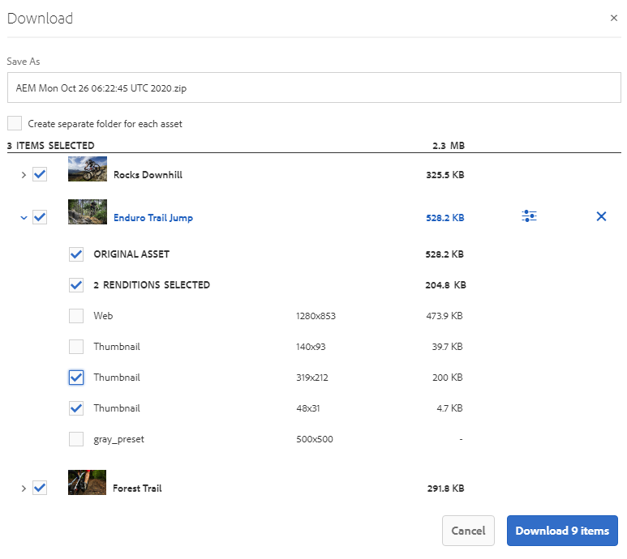

# 以链接方式共享资产 {#share-assets-as-a-link}

Adobe Experience Manager Assets Brand Portal管理员可以与授权的内部用户和外部实体（包括合作伙伴和供应商）共享多个资产的链接。 编辑者只能查看和共享与其共享的资产。

通过链接共享资产是一种方便的方式，可让外部各方使用，因为接收者不必登录Brand Portal即可访问资产。

<!-- Link sharing access is restricted to editors and administrators. 
-->

有关更多信息，请参阅 [管理用户、组和用户角色](../using/brand-portal-adding-users.md#manage-user-roles).

以下是将资产作为链接共享的步骤：

1. 登录到您的Brand Portal租户。 默认情况下， **[!UICONTROL 文件]** 此时会打开视图，其中包含所有已发布的资产和文件夹。

1. 选择要共享的资产或文件夹，或导航到 **[!UICONTROL 收藏集]** 查看以共享您创建的收藏集。

   

1. 在顶部的工具栏中，单击 **[!UICONTROL 共享链接]** 图标。

   的 **[!UICONTROL 链接共享]** 对话框。

   

   * 在电子邮件地址框中，键入要与其共享链接的用户的电子邮件ID。 您可以与多个用户共享该链接。 如果用户是您组织的成员，请从下拉列表中显示的建议中选择其电子邮件ID。 如果用户是外部用户，请键入完整的电子邮件ID并按 **[!UICONTROL 输入]**;电子邮件ID会添加到用户列表。

      

   * 在 **[!UICONTROL 主题]** 框中，键入要共享的资产的主题。
   * 在 **[!UICONTROL 消息]** 框中，根据需要键入消息。
   * 在 **[!UICONTROL 过期]** 字段中，使用日期选取器指定链接的过期日期和时间。 默认情况下，过期日期会设置为自您共享链接之日起7天。
   * 启用 **[!UICONTROL 允许下载原始文件]** 复选框以允许收件人下载原始演绎版。

   通过链接共享的资产会在 **[!UICONTROL 过期]** 字段。 有关过期资产的行为以及根据Brand Portal中用户角色对允许活动所做的更改的信息，请参阅 [管理资产的数字权限](../using/manage-digital-rights-of-assets.md#asset-expiration).

   >[!NOTE]
   >
   >链接的默认过期时间为7天。 链接必须使用 **[!UICONTROL 链接共享]** ，请勿单独复制和共享链接。

1. 单击&#x200B;**[!UICONTROL 共享]**。系统会显示一条消息，确认已与用户共享该链接。 用户会收到包含共享链接的电子邮件。

   

   >[!NOTE]
   >
   >管理员可以自定义电子邮件消息，包括使用自定义徽标、描述和页脚 [品牌策略](../using/brand-portal-branding.md) 功能。

## 从共享链接下载资产 {#download-assets-from-shared-links}

单击电子邮件中的链接，以访问共享资产。 此时将打开AEM Link Share页面。

要下载共享资产，请执行以下操作：

1. 单击资产或文件夹，然后单击 **[!UICONTROL 下载]** 图标。

   

   >[!NOTE]
   >
   >目前，您只能为某些资产生成预览和缩略图，具体取决于文件格式。 有关支持的文件格式的更多信息，请参阅 [资产格式的预览和缩略图支持](#preview-thumbnail-support).

1. 的 **[!UICONTROL 下载]** 对话框。

   

1. 默认情况下， **[!UICONTROL 快速下载]** 设置 **[!UICONTROL 下载设置]**. 因此，确认框似乎会继续使用IBM Aspera Connect下载。

   继续使用 **[!UICONTROL 快速下载]**，单击 **[!UICONTROL 允许]**.

   所有选定的演绎版都将下载到一个zip文件夹中，其中包含每个资产的单独文件夹。

   >[!NOTE]
   >
   >从共享链接下载资产时，会为每个资产创建一个单独的文件夹。
   >
   >如果选择了文件夹、收藏集或20个以上的资产进行下载，则 **[!UICONTROL 下载]** 会跳过对话框，用户可访问的所有资产演绎版（不包括动态演绎版）都会下载到zip文件夹中，其中包含每个资产的单独文件夹。

   >[!NOTE]
   >
   >如果以链接形式共享资产的用户没有使用共享链接，则不会使用共享链接下载原始演绎版 [有权访问原始演绎版](../using/brand-portal-adding-users.md#manage-group-roles-and-privileges).

>[!NOTE]
>
>Brand Portal使用链接共享限制下载大小超过5 GB的文件夹或资产。

<!--
1. The **[!UICONTROL Download]** dialog box appears.

   

    * To speed up the download of asset files shared as the link, select **[!UICONTROL Enable download acceleration]** option and [follow the wizard](../using/accelerated-download.md#download-workflow-using-file-accelerator). To know more about the fast download of assets on Brand Portal refer [Guide to accelerate downloads from Brand Portal](../using/accelerated-download.md).
    
1. To download the renditions of assets in addition to the assets from the shared link, select **[!UICONTROL Rendition(s)]** option. When you do so, **[!UICONTROL Exclude System Renditions]** option appears that is selected by default. This prevents the download of out-of-the-box renditions along with approved assets or their custom renditions.

   However, to allow auto-generated renditions to download along with custom renditions, deselect the **[!UICONTROL Exclude System Renditions]** option.

   >[!NOTE]
   >
   >Original renditions are not downloaded using the shared link if the user who shared the assets as a link is not [authorized by the administrator to have access to the original renditions](../using/brand-portal-adding-users.md#manage-group-roles-and-privileges).

   

1. Click **[!UICONTROL Download]**. The assets (and renditions if selected) are downloaded as a ZIP file to your local folder. However, no zip file is created if a single asset is downloaded without any of the renditions, thereby ensuring speedy download.

-->

## 资产格式的预览和缩略图支持 {#preview-thumbnail-support}

下表列出了Brand Portal支持缩略图和预览的资产格式：

| 资产格式 | 缩略图支持 | 预览支持 |
|--------------|-------------------|-----------------|
| PNG | ✓ | ✓ |
| GIF | ✓ | ✓ |
| TIFF | ✓ | ✕ |
| JPEG | ✓ | ✓ |
| BMP | ✓ | ✕ |
| PNM* | NA | NA |
| PGM* | NA | NA |
| PBM* | NA | NA |
| PPM* | NA | NA |
| PSD | ✓ | ✕ |
| EPS | NA | ✕ |
| DNG | ✓ | ✕ |
| PICT | ✓ | ✕ |
| PSB* | ✓ | ✕ |
| JPG | ✓ | ✓ |
| AI | ✓ | ✕ |
| DOC | ✕ | ✕ |
| DOCX | ✕ | ✕ |
| ODT* | ✕ | ✕ |
| PDF | ✓ | ✕ |
| HTML | ✕ | ✕ |
| RTF | ✕ | ✕ |
| TXT | ✓ | ✕ |
| XLS | ✕ | ✕ |
| XLSX | ✕ | ✕ |
| ODS | ✕ | ✕ |
| PPT | ✓ | ✕ |
| PPTX | ✕ | ✕ |
| ODP | ✕ | ✕ |
| INDD | ✓ | ✕ |
| PS | ✕ | ✕ |
| QXP | ✕ | ✕ |
| EPUB | ✓ | ✕ |
| AAC | ✕ | ✕ |
| MIDI | ✕ | ✕ |
| 3GP | ✕ | ✕ |
| MP3 | ✕ | ✕ |
| MP4 | ✕ | ✕ |
| OGA | ✕ | ✕ |
| OGG | ✕ | ✕ |
| RA | ✕ | ✕ |
| WAV | ✕ | ✕ |
| WMA | ✕ | ✕ |
| DVI | ✕ | ✕ |
| FLV | ✕ | ✕ |
| M4V | ✕ | ✕ |
| MPG | ✕ | ✕ |
| OGV | ✕ | ✕ |
| MOV | ✕ | ✕ |
| WMV | ✕ | ✕ |
| SWF | ✕ | ✕ |
| TGZ | NA | ✕ |
| JAR | ✓ | ✕ |
| RAR | NA | ✕ |
| TAR | NA | ✕ |
| ZIP | ✓ | ✕ |

以下图例说明了矩阵中使用的符号：

| 符号 | 含义 |
|---|---|
| ✓ | 此文件格式支持此功能 |
| ✕ | 此文件格式不支持此功能 |
| NA | 此功能不适用于此文件格式 |
| &#42; | 此功能要求在将资产发布到Brand Portal后，在AEM创作实例上支持此文件格式，但在Brand Portal上不支持此文件格式 |

## 取消共享作为链接共享的资产 {#unshare-assets-shared-as-a-link}

要取消共享以前共享的资产作为链接，请执行以下操作：

1. 登录Brand Portal时， **[!UICONTROL 文件]** 默认情况下，视图会打开。 要查看您以链接形式共享的资产，请导航到 **[!UICONTROL 共享链接]** 中。

1. 查看显示的列表中共享的链接。

   

1. 要从列表中取消共享链接，请选择该链接，然后单击 **[!UICONTROL 取消共享]** 图标。

   

   >[!NOTE]
   >
   >共享链接的显示特定于用户。 此功能不会显示租户的所有用户共享的所有链接。

1. 在警告消息框中，单击 **[!UICONTROL 继续]** 确认取消共享。 链接的条目将从共享链接列表中删除。
