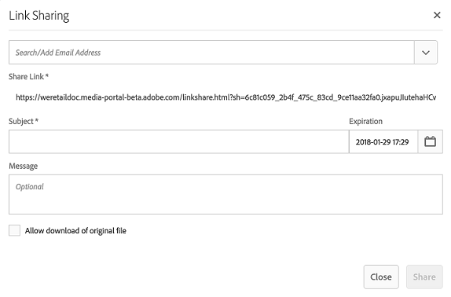
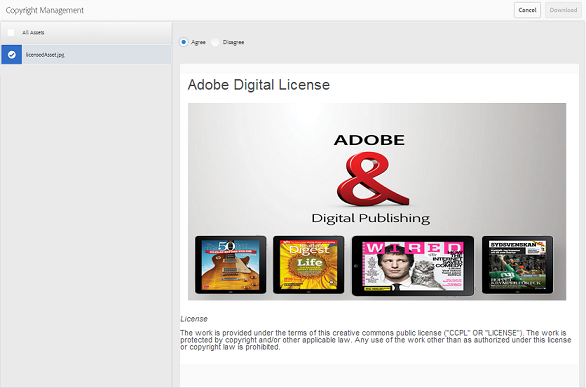

# 以链接方式共享资产 {#share-assets-as-a-link}

AEM Assets品牌门户管理员可以与授权的内部用户和外部实体（包括合作伙伴和供应商）共享多个资产的链接。 编辑人员只能视图和共享与他们共享的资源。

通过链接共享资产是一种方便的方式，使外部方可以使用这些资产，因为接收方不必登录Brand Portal即可访问资产。

链接共享访问权限仅限编辑人员和管理员。

有关详细信息，请 [参阅管理用户、组和用户角色](../using/brand-portal-adding-users.md#manage-user-roles)。

>[!NOTE]
>
>使用Brand Portal上的链接共享功能最多可下载5GB的zip文件。

以下是将资产共享为链接的步骤：

1. 单击左侧的叠加图标，然后选择“ **[!UICONTROL 导航]**”。

   

1. 从左侧的脱轨处，单击“ **[!UICONTROL 文件]** ”以共享文件夹或图像。 要共享收藏集，请单击“ **[!UICONTROL 收藏集]**”。

   

1. 选择要作为链接共享的文件夹或收藏集。

   

1. 在顶部的工具栏中，单击共享 **[!UICONTROL 链接图]** 标。

   将出 **[!UICONTROL 现“链接]** 共享”对话框。

   

   >[!NOTE]
   >
   >共享 **[!UICONTROL 链接字段]** 会显示自动创建的资产链接。 此链接的默认到期时间为7天。 您可以复制链接并单独与用户共享，或从“链接共享”对 **[!UICONTROL 话框共享]** 它。

1. 在电子邮件地址框中，键入要与其共享链接的用户的电子邮件ID。 您可以与多个用户共享链接。

   如果用户是您组织的成员，请从下拉列表中显示的建议中选择其电子邮件ID。 如果用户是外部用户，请键入完整的电子邮件ID并按 **[!UICONTROL Enter]**;电子邮件ID将添加到用户列表。

   

1. In the **[!UICONTROL Subject]** box, type a subject for the asset you want to share.
1. In the **[!UICONTROL Message]** box, type a message if necessary.
1. 在“过 **[!UICONTROL 期]** ”字段中，使用日期选取器指定链接的过期日期和时间。 默认情况下，到期日期设置为共享链接之日起的7天。

   通过链接共享的资产在过期字段中指定的日期和时间后 **[!UICONTROL 过期]** 。 有关过期资产的行为以及基于用户角色在Brand Portal中更改允许活动的信息，请参 [阅管理资产的数字权限](../using/manage-digital-rights-of-assets.md#asset-expiration)。

1. 单击&#x200B;**[!UICONTROL 共享]**。系统会显示一条消息，确认已与用户共享该链接。 用户会收到一封包含链接的电子邮件。

   

   >[!NOTE]
   >
   >管理员可以自定义电子邮件消息，包括使用品牌功能自定义徽标、说明 [和页脚](../using/brand-portal-branding.md) 。

## 从共享链接下载资源 {#download-assets-from-shared-links}

单击电子邮件中的链接，以视图共享的资产。 将打开AEM链接共享页。

要下载共享资产，请执行以下操作：

1. 单击资产，然后单击工 **[!UICONTROL 具栏]** 中的下载图标。

   

   >[!NOTE]
   >
   >目前，您只能为某些资产生成预览和缩略图，具体取决于文件格式。 有关支持的文件格式的更多信息，请参 [阅资产格式的预览和缩略图支持](#preview-thumbnail-support)。

   >[!NOTE]
   >
   >如果您正在下载的资产也包含许可的资产，则会将您重定向到版权 **[!UICONTROL 管理页]** 面。 在此页中，选择授权的资产，单击 **[!UICONTROL 同意]**，然后单击 **[!UICONTROL 下载]**。 如果您选择不同意，则仅下载未授权的资源。\
   >受许可证保护的资 [产附加了许](https://helpx.adobe.com/experience-manager/6-5/assets/using/drm.html#DigitalRightsManagementinAssets) 可证协议，可通过在中设置资产的元数 [据属性](https://helpx.adobe.com/experience-manager/6-5/assets/using/drm.html#DigitalRightsManagementinAssets) 来完成 [!DNL AEM Assets]。

   

   将显 **[!UICONTROL 示]** “下载”对话框。

   

   * 要加快共享为链接的资源文件的下载速度，请选择“启 **[!UICONTROL 用下载加速]** ”选项 [，然后按照向导操作](../using/accelerated-download.md#download-workflow-using-file-accelerator)。 要进一步了解品牌门户上资产的快速下载，请参 [阅指南以加速从Brand Portal下载](../using/accelerated-download.md)。

1. 要从共享链接下载资产的演绎版以及资产，请选 **[!UICONTROL 择演绎版]** 选项。 执行此操作时，将显 **[!UICONTROL 示“排除系统再现]** ”选项，该选项默认处于选中状态。 这会阻止下载现成的演绎版以及已批准的资产或其自定义演绎版。

   但是，要允许自动生成的演绎版与自定义演绎版一起下载，请取消选择“ **[!UICONTROL 排除系统演绎版]** ”选项。

   >[!NOTE]
   >
   >如果共享资产作为链接的用户未获得管理员的授权，无法访问原始演绎版，则 [不会使用共享链接下载原始演绎版](../using/brand-portal-adding-users.md#manage-group-roles-and-privileges)。

   

1. 点按／单击 **[!UICONTROL 下载]**。 资产（如果已选择，则会将演绎版）作为ZIP文件下载到您的本地文件夹。 但是，如果下载单个资产时不包含任何演绎版，则不会创建zip文件，从而确保快速下载。

>[!NOTE]
>
>Brand Portal限制下载每个文件大小超过5 GB的资源。

## 预览和缩略图支持资产格式 {#preview-thumbnail-support}

以下矩阵列表了Brand Portal支持其缩略图和预览的资产格式：

| 资产格式 | 缩略图支持 | 预览支持 |
|--------------|-------------------|-----------------|
| PNG | ✓ | ✓ |
| GIF | ✓ | ✓ |
| TIFF | ✓ | ✕ |
| JPEG | ✓ | ✓ |
| BMP | ✓ | ✕ |
| PNM* | NA | NA |
| PGM* | NA | NA |
| PBM* | NA | NA |
| PPM* | NA | NA |
| PSD | ✓ | ✕ |
| EPS | NA | ✕ |
| DNG | ✓ | ✕ |
| PICT | ✓ | ✕ |
| PSB* | ✓ | ✕ |
| JPG | ✓ | ✓ |
| AI | ✓ | ✕ |
| DOC | ✕ | ✕ |
| DOCX | ✕ | ✕ |
| ODT* | ✕ | ✕ |
| PDF | ✓ | ✕ |
| HTML | ✕ | ✕ |
| RTF | ✕ | ✕ |
| TXT | ✓ | ✕ |
| XLS | ✕ | ✕ |
| XLSX | ✕ | ✕ |
| ODS | ✕ | ✕ |
| PPT | ✓ | ✕ |
| PPTX | ✕ | ✕ |
| ODP | ✕ | ✕ |
| INDD | ✓ | ✕ |
| PS | ✕ | ✕ |
| QXP | ✕ | ✕ |
| EPUB | ✓ | ✕ |
| AAC | ✕ | ✕ |
| MIDI | ✕ | ✕ |
| 3GP | ✕ | ✕ |
| MP3 | ✕ | ✕ |
| MP4 | ✕ | ✕ |
| OGA | ✕ | ✕ |
| OGG | ✕ | ✕ |
| RA | ✕ | ✕ |
| WAV | ✕ | ✕ |
| WMA | ✕ | ✕ |
| DVI | ✕ | ✕ |
| FLV | ✕ | ✕ |
| M4V | ✕ | ✕ |
| MPG | ✕ | ✕ |
| OGV | ✕ | ✕ |
| MOV | ✕ | ✕ |
| WMV | ✕ | ✕ |
| SWF | ✕ | ✕ |
| TGZ | NA | ✕ |
| JAR | ✓ | ✕ |
| RAR | NA | ✕ |
| TAR | NA | ✕ |
| ZIP | ✓ | ✕ |

下图说明矩阵中使用的符号：

| 符号 | 意义 |
|---|---|
| ✓ | 此文件格式支持此功能 |
| ✕ | 此文件格式不支持此功能 |
| NA | 此功能不适用于此文件格式 |
| * | 此功能要求AEM作者实例上的此文件格式提供附加支持，但在资产发布到品牌门户后，不要在品牌门户上提供此支持 |

## 取消共享作为链接共享的资产 {#unshare-assets-shared-as-a-link}

要取消共享以前共享的资产作为链接，请执行以下操作：

1. 要视图您作为链接共享的资产，请单击左侧的叠加图标，然后选择 **[!UICONTROL 导航]**。

   

1. 在脱轨中，单击“共 **[!UICONTROL 享链接”]**。

   

1. 查看您从显示的列表共享的链接。
1. 要从列表中取消共享链接，请选择该链接，然后单击链接条目旁边的bin图标，或 **[!UICONTROL 从顶部]** 工具栏中取消共享图标。

   

   >[!NOTE]
   >
   >共享链接的显示特定于用户。 此功能不显示租户的所有用户共享的所有链接。

1. 在警告消息框中，单击“继 **[!UICONTROL 续]** ”以确认取消共享。 链接的条目将从共享链接的列表中删除。
