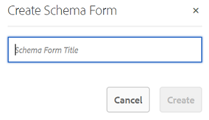

# 使用元数据架构表单 {#use-the-metadata-schema-form}

元数据架构描述了“属性”页的布局，以及针对使用特定架构的资源显示的元数据属性。 应用于资源的架构决定了其属性页面上显示的元数据字段。

每个资源的&#x200B;**[!UICONTROL 属性]**&#x200B;页面包含默认元数据属性，具体取决于资源的MIME类型。 管理员可以使用元数据架构编辑器修改现有架构或添加自定义元数据架构。 Experience Manager Assets Brand Portal为各种MIME类型的资源提供默认表单。 但是，您还可以为此类资源添加自定义表单。

## 添加元数据架构表单 {#add-a-metadata-schema-form}

要创建新的元数据架构表单，请执行以下操作：

1. 在顶部的工具栏中，单击Experience Manager徽标以访问管理工具。

   

1. 在“管理工具”面板中，单击&#x200B;**[!UICONTROL 元数据架构]**。

   

1. 在&#x200B;**[!UICONTROL 元数据架构Forms]**&#x200B;页面上，单击&#x200B;**[!UICONTROL 创建]**。

   

1. 在&#x200B;**[!UICONTROL 创建架构表单]**&#x200B;对话框中，指定架构表单的标题，然后单击&#x200B;**[!UICONTROL 创建]**&#x200B;以完成表单创建过程。

   

## 编辑元数据架构表单 {#edit-a-metadata-schema-form}

可以编辑任何添加或现有的元数据架构表单。 元数据架构表单包含从其父级派生的内容，包括选项卡和选项卡中的表单项。 您可以将这些表单项映射或配置到元数据节点中的字段。

您可以将新选项卡或表单项添加到元数据架构表单。 派生的选项卡和表单项目（来自父项）处于锁定状态。 不能在子级别更改它们。

要编辑元数据架构表单，请执行以下操作：

1. 在顶部的工具栏中，单击Experience Manager徽标以访问管理工具。

   

1. 在“管理工具”面板中，单击&#x200B;**[!UICONTROL 元数据架构]**。
1. 从&#x200B;**[!UICONTROL 元数据架构Forms]**&#x200B;页面中，选择架构表单以编辑其属性，例如&#x200B;**[!UICONTROL 收藏集]**。

   

   >[!NOTE]
   >
   >未编辑的模板在其前显示一个锁定符号。 如果自定义任何模板，模板前的“锁定”符号将消失。

1. 在顶部的工具栏中，单击&#x200B;**[!UICONTROL 编辑]**。

   **[!UICONTROL 元数据架构编辑器]**&#x200B;页面打开，左侧打开&#x200B;**[!UICONTROL Basic]**&#x200B;选项卡。 在右侧，打开&#x200B;**[!UICONTROL 生成表单]**&#x200B;选项卡。

1. 在&#x200B;**[!UICONTROL 元数据架构编辑器]**&#x200B;页面中，自定义资源的&#x200B;**[!UICONTROL 属性]**&#x200B;页面。 只需从&#x200B;**[!UICONTROL 构建表单]**&#x200B;选项卡中的组件类型列表中拖动一个或多个组件即可。 将它们拖到&#x200B;**[!UICONTROL 基本]**&#x200B;选项卡。

   

1. 要配置组件，请选择该组件并在&#x200B;**[!UICONTROL 设置]**&#x200B;选项卡中修改其属性。

### “构建表单”选项卡中的组件 {#components-in-the-build-form-tab}

**[!UICONTROL 构建表单]**&#x200B;选项卡列出了可在架构表单中使用的项目。 **[!UICONTROL 设置]**&#x200B;选项卡提供您在&#x200B;**[!UICONTROL 构建表单]**&#x200B;选项卡中选择的每个项目的属性。 下表列出了&#x200B;**[!UICONTROL 生成表单]**&#x200B;选项卡中可用的表单项：

| 组件名称 | 描述 |
|----|----|
| **[!UICONTROL 节标题]** | 为常用组件列表添加章节标题。 |
| **[!UICONTROL 单行文本]** | 添加单行文本属性。 它存储为字符串。 |
| **[!UICONTROL 多值文本]** | 添加多值文本属性。 它存储为字符串数组。 |
| **[!UICONTROL 数字]** | 添加一个数值组件。 |
| **[!UICONTROL 日期]** | 添加一个日期组件。 |
| **[!UICONTROL 下拉列表]** | 添加下拉列表。 |
| **[!UICONTROL 标准标记]** | 添加标记。 管理员可能需要更改路径值。 例如，`/etc/tags/mac/<tenant_id>/<custom_tag_namespace>`，如果他们从Experience Manager Assets发布元数据架构表单，其中路径不包括租户信息，例如`/etc/tags/<custom_tag_namespace>`。 |
| **[!UICONTROL 智能标记]** | 如果您已购买并配置Experience Manager Assets智能标记加载项，则为自动检测到的标记。 |
| **[!UICONTROL 隐藏字段]** | 添加隐藏字段。 保存资产时，此参数将作为POST参数发送。 |
| **[!UICONTROL 由]**&#x200B;引用的资产 | 添加此组件可查看资产引用的资产列表。 |
| **[!UICONTROL 资源引用]** | 添加以显示引用资产的资产列表。 |
| **[!UICONTROL 上下文元数据]** | 添加以控制其他元数据选项卡在资源属性页面中的显示。 |

<!--| **[!UICONTROL Asset Rating]** |  Average rating of an asset added from Experience Manager Assets before it is published to Brand Portal. |-->

>[!NOTE]
>
>请勿使用&#x200B;**[!UICONTROL 产品引用]**，因为它不能正常工作。

#### 编辑元数据组件 {#edit-the-metadata-component}

要编辑表单上元数据组件的属性，请单击该组件并在&#x200B;**[!UICONTROL 设置]**&#x200B;选项卡中编辑其属性。

* **[!UICONTROL 字段标签]**：在资产的“属性”页面上显示的元数据属性的名称。

* **[!UICONTROL 映射到属性]**：此属性的值提供资产节点的相对路径/名称，资产节点保存在CRX存储库中。 它以“**”开头。/**”，因为指示路径在资产的节点下。

以下是此属性的有效值：

— `./jcr:content/metadata/dc:title`：将该值作为属性`dc:title`存储在资产的元数据节点中。

— `./jcr:created`：在资产的节点上显示jcr属性。 如果您在视图资产上配置了这些资产，Adobe建议您将其标记为“禁用编辑”，因为它们是受保护资产。 否则，在保存资产的属性时，会出现“Assets无法修改”错误。

* **[!UICONTROL 占位符]**：使用此属性向用户提供有关元数据属性的任何相关信息。
* **[!UICONTROL 必需]**：使用此属性在“属性”页面上将元数据属性标记为必需。
* **[!UICONTROL 禁用编辑]**：使用此属性使元数据属性在属性页面上不可编辑。
* **[!UICONTROL 以只读方式显示空字段]**：标记此属性以在“属性”页面上显示元数据属性，即使该属性没有值也是如此。 默认情况下，当元数据属性没有值时，它不会列在属性页面上。
* **[!UICONTROL 描述]**：使用此属性为元数据组件添加简短描述。
* **[!UICONTROL 删除图标]**：单击此图标可从架构表单中删除组件。

  

>[!NOTE]
>
>在资源的元数据编辑器表单中，所有元数据字段均为只读。 因为在将资源发布到Brand Portal之前，必须在Experience Manager Assets中编辑资源的元数据。

#### 在架构表单中添加或删除选项卡 {#add-or-delete-a-tab-in-the-schema-form}

默认架构表单包括&#x200B;**[!UICONTROL 基本]**&#x200B;和&#x200B;**[!UICONTROL 高级]**&#x200B;选项卡。 通过架构编辑器，可以添加或删除选项卡。

* 要在架构表单上添加新选项卡，请单击&#x200B;**[!UICONTROL +]**。 默认情况下，新选项卡的名称为“Unnamed-1”。 您可以从&#x200B;**[!UICONTROL 设置]**&#x200B;选项卡修改名称。

  

* 要删除选项卡，请单击&#x200B;**[!UICONTROL x]**。 点击&#x200B;**[!UICONTROL 保存]**&#x200B;即可保存更改。

## 将元数据架构应用到文件夹 {#apply-a-metadata-schema-to-a-folder}

通过Brand Portal，您可以自定义和控制元数据架构，以便资源的&#x200B;**[!UICONTROL 属性]**&#x200B;页面仅显示您选择显示的特定信息。 要控制&#x200B;**[!UICONTROL 属性]**&#x200B;页面中显示的元数据，请从元数据架构表单中删除所需的元数据并将其应用到特定文件夹。

要将元数据架构表单应用到文件夹，请执行以下操作：

1. 在顶部的工具栏中，单击Experience Manager徽标以访问管理工具。

   

1. 在“管理工具”面板中，单击&#x200B;**[!UICONTROL 元数据架构]**。

1. 从&#x200B;**[!UICONTROL 元数据架构Forms]**&#x200B;页面中，选择要应用于资产的架构表单，例如&#x200B;**[!UICONTROL 服装]**。

   

1. 在顶部的工具栏中，单击&#x200B;**[!UICONTROL 应用到文件夹]**。

1. 在&#x200B;**[!UICONTROL 选择文件夹]**&#x200B;页面中，导航到要应用&#x200B;**[!UICONTROL 服装]**&#x200B;元数据架构的文件夹，例如&#x200B;**[!UICONTROL 手套]**。

   

1. 单击&#x200B;**[!UICONTROL 应用]**&#x200B;以将元数据架构表单应用到文件夹。

   **[!UICONTROL 服装]**&#x200B;元数据架构表单中可用的元数据已应用于&#x200B;**[!UICONTROL 手套]**&#x200B;文件夹，并显示在文件夹的&#x200B;**[!UICONTROL 属性]**&#x200B;页面中。

   

>[!NOTE]
>
>如果将包含嵌套架构的架构应用于包含视频文件的文件夹，则可能无法正确呈现视频文件的元数据属性。 为确保元数据属性正确呈现，请删除嵌套架构并仅将父架构应用于文件夹。

## 删除元数据架构表单 {#delete-a-metadata-schema-form}

Brand Portal仅允许您删除自定义架构表单。 不允许删除默认架构表单/模板。 但是，您可以删除这些表单中的任何自定义更改。

要删除表单，请选择一个表单，然后单击&#x200B;**[!UICONTROL 删除]**&#x200B;图标。

>[!NOTE]
>
>删除对默认表单所做的自定义更改后，**[!UICONTROL 锁定]**&#x200B;符号会重新出现在元数据架构界面上的表单名称之前，以指示该表单已恢复到其默认状态。

## MIME类型的架构表单 {#schema-forms-for-mime-types}

### 为MIME类型添加新表单 {#adding-new-forms-for-mime-types}

除了默认表单之外，您还可以为各种MIME类型的资产添加自定义表单，或在相应的表单类型下创建新表单。 例如，要为 **[!UICONTROL image/png]** 子类型添加新模板，请在“image”表单下创建表单。架构表单的标题是子类型名称。在本例中，标题为“png”。

#### 为各种MIME类型使用现有架构模板 {#using-an-existing-schema-template-for-various-mime-types}

您可以为其他MIME类型使用现有模板。 例如，对MIME类型&#x200B;**image/png**&#x200B;的资源使用&#x200B;**image/jpeg**&#x200B;表单。

在这种情况下，请在CRX存储库中的[!UICONTROL `/etc/dam/metadataeditor/mimetypemappings`]处创建新节点。 指定节点的名称并定义以下属性：

| **名称** | **类型** | **值** |
|---|---|---|
| exposedmimetype | 字符串 | image/jpeg |
| mime类型 | 字符串[] | image/png |

* **exposedmimetype**：要映射的现有表单的名称
* **mime类型**：使用&#x200B;**exposedmimetype**&#x200B;属性中定义的表单的MIME类型列表

Brand Portal映射以下MIME类型和架构表单：

| **架构表单** | **MIME类型** |
|---|---|
| image/jpeg | image/pjpeg |
| image/tiff | image/x-tiff |
| application/pdf | application/postscript |
| application/x-ImageSet | Multipart/Related; type=application/x-ImageSet |
| application/x-SpinSet | Multipart/Related; type=application/x-SpinSet |
| application/x-MixedMediaSet | Multipart/Related; type=application/x-MixedMediaSet |
| video/quicktime | video/x-quicktime |
| video/mpeg4 | video/mp4 |
| video/avi | video/avi， video/msvideo， video/x-msvideo |
| video/wmv | `video/x-ms-wmv` |
| video/flv | video/x-flv |

以下是默认元数据属性的列表：

* `jcr:content/metadata/cq:tags`
* `jcr:content/metadata/dc:format`
* `jcr:content/metadata/dam:status`
* `jcr:content/metadata/videoCodec`
* `jcr:content/metadata/audioCodec`
* `jcr:content/metadata/dc:title`
* `jcr:content/metadata/dc:description`
* `jcr:content/metadata/xmpMM:InstanceID`
* `jcr:content/metadata/xmpMM:DocumentID`
* `jcr:content/metadata/dam:sha1`
* `jcr:content/metadata/dam:solutionContext`
* `jcr:content/metadata/videoBitrate`
* `jcr:content/metadata/audioBitrate`
* `jcr:content/usages/usedBy`
* `jcr:content/jcr:lastModified`
* `jcr:content/metadata/prism:expirationDate`
* `jcr:content/onTime`
* `jcr:content/offTime`
* `jcr:content/metadata/dam:size`
* `jcr:content/metadata/tiff:ImageWidth`
* `jcr:content/metadata/tiff:ImageLength`
