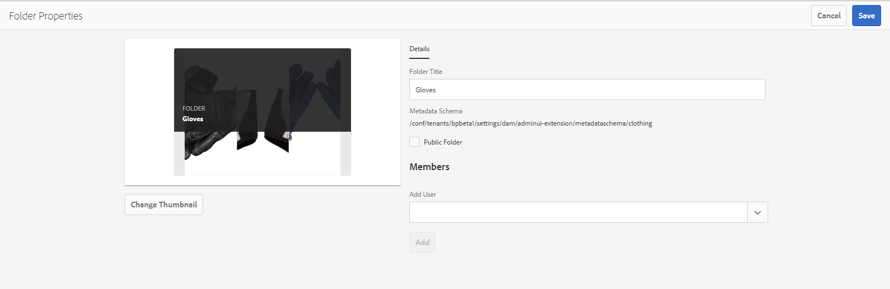

# 使用元数据架构表单 {#use-the-metadata-schema-form}

元数据架构描述“属性”页的布局以及为使用特定架构的资产显示的元数据属性。 您应用于资产的架构决定了在其“属性”页面上显示的元数据字段。

每个 **[!UICONTROL 资产的]** “属性”页包括默认元数据属性，具体取决于资产的MIME类型。 管理员可以使用元数据架构编辑器修改现有架构或添加自定义元数据架构。 AEM Assets Brand Portal为各种MIME类型的资产提供默认表单。 但是，您也可以为此类资产添加自定义表单。

## Add a metadata schema form {#add-a-metadata-schema-form}

要创建新的元数据架构表单，请执行以下操作：

1. 从顶部的AEM工具栏中，单击Adobe徽标以访问管理工具。

   

2. 在管理工具面板中，单击元数 **[!UICONTROL 据架构]**。

   

3. 在“元数 **[!UICONTROL 据架构表单]** ”页面上，单 **[!UICONTROL 击创建]**。

   

4. 在“创 **[!UICONTROL 建架构表单]** ”对话框中，指定架构表单的标题，然后单击“创 **[!UICONTROL 建]** ”以完成表单创建过程。

   

## Edit a metadata schema form {#edit-a-metadata-schema-form}

您可以编辑新添加的或现有的元数据架构表单。 元数据架构表单包含从其父表单派生的内容，包括选项卡和选项卡内的表单项。 您可以将这些表单项目映射到元数据节点中的字段或对其进行配置。

可以向元数据架构表单中添加新的选项卡或表单项目。（从父表单）派生的选项卡和表单项目处于锁定状态。无法从子级别更改它们。

要编辑元数据架构表单，请执行以下操作：

1. 从顶部的AEM工具栏中，单击Adobe徽标以访问管理工具。

   

2. 在管理工具面板中，单击元数 **[!UICONTROL 据架构]**。
3. 从“元数 **[!UICONTROL 据架构表单]** ”页中，选择一个架构表单以编辑其属性，例如集合 ****。

   

   >[!NOTE]
   >
   >未编辑的模板前面会显示一个锁符号。 如果自定义任何模板，则模板前的锁符号将消失。

4. 在顶部的工具栏中，单击“编 **[!UICONTROL 辑”]**。

   The **[!UICONTROL Metadata Schema Editor]** page opens with the **[!UICONTROL Basic]** tab open on the left and the **[!UICONTROL Build Form]** tab open on the right.

5. In the **[!UICONTROL Metadata Schema Editor]** page, customize the **[!UICONTROL Properties]** page of the asset by dragging one or more components from a list of component types in the **[!UICONTROL Build Form]** tab to the **[!UICONTROL Basic]** tab.

   

6. To configure a component, select it and modify its properties in the **[!UICONTROL Settings]** tab.

### Components in the Build Form tab {#components-in-the-build-form-tab}

The **[!UICONTROL Build Form]** tab lists items that you can use in your schema form. The **[!UICONTROL Settings]** tab provides the attributes of each item that you select in the **[!UICONTROL Build Form]** tab. The following table lists the form items available in the **[!UICONTROL Build Form]** tab:

| 组件名称 | 描述 |
|---------------------|--------------------------------------------------------------------------------------------------------------------------------------------------------------------------------------------------------------------------------------------------------------------------------------------|
| [!UICONTROL 章节标题] | 为公用组件列表添加章节标题。 |
| [!UICONTROL 单行文本] | 添加单行文本属性。它存储为字符串。 |
| [!UICONTROL 多值文本] | 添加多值文本属性。 它将作为字符串数组存储。 |
| [!UICONTROL 数字] | Add a number component. |
| [!UICONTROL 日期] | 添加日期组件。 |
| [!UICONTROL 下拉列表] | 添加下拉列表。 |
| [!UICONTROL 标准标记] | 添加标记. **** 注意： Administrators might need to change the path value, for example, , if they publish the metadata schema form from AEM, where the path does not include tenant information, for example, .`/etc/tags/mac/<tenant_id>/<custom_tag_namespace>``/etc/tags/<custom_tag_namespace>` |
| [!UICONTROL 智能标记] | Auto-detected tags if you have purchased and configured the AEM smart tags add-on. |
| [!UICONTROL 隐藏字段] | 添加隐藏字段。在保存资产时，它将作为POST参数发送。 |
| [!UICONTROL 资产引用对象] | 添加此组件可查看资产引用的资产列表。 |
| [!UICONTROL 资产引用] | 添加可显示引用资产的资产列表。 |
| [!UICONTROL 资产评级] | Average rating of an asset added from AEM Assets before it is published to Brand Portal. |
| [!UICONTROL 上下文元数据] | Add to control the display of other metadata tabs in the Properties page of assets. |

>[!NOTE]
>
>Do not use **[!UICONTROL Product References]**, as it is not functional.

#### Edit the metadata component {#edit-the-metadata-component}

要在表单上编辑元数据组件的属性，请单击相应的组件，然后在&#x200B;**[!UICONTROL 设置]选项卡中编辑其属性。**

* **[!UICONTROL 字段标签]**:资产的“属性”页面上显示的元数据属性的名称。

* **[!UICONTROL 映射到属性]**：此属性的值提供资产节点在 CRX 存储库中保存的相对路径/名称。该值以“**./**”开头，因为这表示该路径位于资产的节点下。

以下是此属性的有效值：

-- [!UICONTROL `./jcr:content/metadata/dc:title`]: Stores the value at the asset's metadata node as the property [!UICONTROL `dc:title`].

-- [!UICONTROL `./jcr:created`]: Displays the jcr property at the asset's node. 如果您对查看属性配置这些属性，我们建议您将它们标记为“禁用编辑”，因为它们是受保护的属性。否则，当您保存资产的属性时，系统会出现“无法修改资产”错误。

* **[!UICONTROL 占位符]**：使用此属性可向用户提供有关元数据属性的任何相关信息。
* **[!UICONTROL 必需]**：使用此属性可在“属性”页面上将元数据属性标记为必需。
* **[!UICONTROL 禁用编辑]**：使用此属性可让“属性”页面上的元数据属性变得不可编辑。
* **[!UICONTROL 在只读模式下显示空字段]**：标记此属性可使没有值的元数据属性显示在“属性”页面上。默认情况下，当元数据属性没有值时，不会在“属性”页面上将其列出。
* **[!UICONTROL 描述]**：使用此属性可添加对元数据组件的简短描述。
* **[!UICONTROL 删除图标]**:单击此图标可从架构表单中删除组件。

>[!NOTE]
>
>All the metadata fields are read-only in the metadata editor form of an asset. Since metadata of the asset must be edited in AEM Assets before an asset is published to Brand Portal.

#### Add or delete a tab in the schema form {#add-or-delete-a-tab-in-the-schema-form}

The default schema form includes the **[!UICONTROL Basic]** and **[!UICONTROL Advanced]** tabs. 通过架构编辑器，可以添加或删除选项卡。

* To add a new tab on a schema form, click **[!UICONTROL +]**. 默认情况下，新选项卡的名称为“未命名-1”。 You can modify the name from the **[!UICONTROL Settings]** tab.

* To delete a tab, click x. **** Click **[!UICONTROL Save]** to save the changes.

## Apply a metadata schema to a folder {#apply-a-metadata-schema-to-a-folder}

Brand Portal allows you to customize and control the metadata schema so that the Properties page of an asset displays only the specific information you choose to reveal. 要控制在“属性”页中显示的元 [!UICONTROL 数据] ，请从元数据架构表单中删除所需的元数据，并将其应用到特定文件夹。

To apply a metadata schema form to a folder, do the following:

1. 从顶部的AEM工具栏中，单击Adobe徽标以访问管理工具。

   

2. From the administrative tools panel, click Metadata Schemas.****

3. 从元数 **[!UICONTROL 据架构表单页]** ，选择要应用于资产的架构表单，例如， [!UICONTROL Clothing]。

   

4. 在顶部的工具栏中，单 **[!UICONTROL 击“应用到文件夹”]**。

5. 从“选 **[!UICONTROL 择文件夹]** ”页面中，导航到要将Clothing **[!UICONTROL 元数据架构应用到的文件夹，例如Gloves]******。

   

6. 单击 **[!UICONTROL 应用]** ，以将元数据架构表单应用到文件夹。

   Clothing **** metadata schema form中可用的元数据将应用于 **[!UICONTROL Gloves]** 文件夹，并在文件夹的“ **[!UICONTROL Properties]** ”（属性）页面中可见。

   

>[!NOTE]
>
>如果将包含嵌套架构的架构应用到包含视频文件的文件夹，则视频文件的元数据属性可能无法正确呈现。 要确保元数据属性正确呈现，请删除嵌套架构，并仅将父架构应用于文件夹。

## Delete a metadata schema form {#delete-a-metadata-schema-form}

Brand Portal仅允许您删除自定义架构表单。 您无法删除默认的架构表单/模板。但是，您可以删除对这些表单所做的任何自定义更改。

要删除某个表单，请选择该表单，然后单击&#x200B;**[!UICONTROL 删除]图标。**

>[!NOTE]
>
>After you delete the custom changes made to a default form, the **[!UICONTROL Lock]** symbol reappears before the form name on the Metadata Schema interface to indicate that the form is reverted to its default state.

## Schema forms for MIME TYPES {#schema-forms-for-mime-types}

### 为 MIME 类型添加新表单 {#adding-new-forms-for-mime-types}

除了默认表单之外，您还可以为各种MIME类型的资产添加自定义表单，或在适当的表单类型下创建新表单。 For example, to add a new template for the **[!UICONTROL image/png]** subtype, create the form under the "image" forms. 架构表单的标题为子类型名称。在这种情况下，标题为“png”。

#### 为各种 MIME 类型使用现有架构模板 {#using-an-existing-schema-template-for-various-mime-types}

You can use an existing template for a different MIME type. For example, use the **image/jpeg** form for assets of MIME type **image/png**.

In this case, create a new node at [!UICONTROL `/etc/dam/metadataeditor/mimetypemappings`] in the CRX repository. 指定节点的名称并定义以下属性：

| **名称** | **类型** | **值** |
|---|---|---|
| exposedmimetype | 字符串 | image/jpeg |
| mimetypes | String[] | image/png |

* **exposedmimetype**:要映射的现有表单的名称
* **mimetypes**:使用exposedmimetype属性中定义的表单的MIME类 **型列表**

Brand Portal映射以下MIME类型和架构表单：

| **架构表单** | **MIME类型** |
|---|---|
| image/jpeg | image/pjpeg |
| image/tiff | image/x-tiff |
| application/pdf | application/postscript |
| application/x-ImageSet | Multipart/Related; type=application/x-ImageSet |
| application/x-SpinSet | Multipart/Related; type=application/x-SpinSet |
| application/x-MixedMediaSet | Multipart/Related; type=application/x-MixedMediaSet |
| video/quicktime | video/x-quicktime |
| video/mpeg4 | video/mp4 |
| video/avi | video/avi、video/msvideo、video/x-msvideo |
| video/wmv | video/x-ms-wmv |
| video/flv | video/x-flv |

以下是默认元数据属性的列表：

* jcr:content/metadata/cq:tags
* jcr:content/metadata/dc:format
* jcr:content/metadata/dam:status
* jcr:content/metadata/videoCodec
* jcr:content/metadata/audioCodec
* jcr:content/metadata/dc:title
* jcr:content/metadata/dc:description
* jcr:content/metadata/xmpMM:InstanceID
* jcr:content/metadata/xmpMM:DocumentID
* jcr:content/metadata/dam:sha1
* jcr:content/metadata/dam:solutionContext
* jcr:content/metadata/videoBitrate
* jcr:content/metadata/audioBitrate
* jcr:content/usages/usedBy
* jcr:content/jcr:lastModified
* jcr:content/metadata/prism:expirationDate
* jcr:content/onTime
* jcr:content/offTime
* jcr:content/metadata/dam:size
* jcr:content/metadata/tiff:ImageWidth
* jcr:content/metadata/tiff:ImageLength
