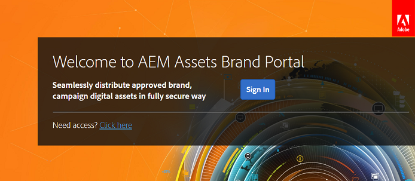

# 首次登录体验 {#first-time-login-experience}

所有新的Experience Manager Assets Brand Portal用户（包括管理员）都具有相同的首次登录体验。 管理员将您添加到组织的Brand Portal帐户后，您无需接受邀请即可自动包含在帐户中。 您会收到一封欢迎电子邮件，其中包含用于访问贵组织的Brand Portal帐户的链接。

以下是对于首次登录Brand Portal的用户要执行的步骤：

1. 打开欢迎电子邮件，然后单击&#x200B;**[!UICONTROL 开始]**。

1. 在注册页面中，指定详细信息（包括名字、姓氏、密码和国家/地区）。

   >[!NOTE]
   >
   >如果您是现有的Adobe Experience Cloud用户，则会显示登录页面而不是注册页面。 要登录Adobe Experience Cloud，请输入您的Adobe ID和密码。

   >[!NOTE]
   >
   >如果贵组织使用Enterprise ID，则不会查看此注册页面，而是会重定向到Enterprise登录页面。 有关详细信息，请参阅[Enterprise ID、登录和帐户帮助](https://helpx.adobe.com/in/enterprise/kb/enterprise-id-faq.html)。

1. 单击&#x200B;**[!UICONTROL 继续]**&#x200B;以进入组织的Brand Portal页面。
1. 从Brand Portal登录页面，单击&#x200B;**[!UICONTROL 登录]**&#x200B;以登录Brand Portal。

   

   >[!NOTE]
   >
   >要登录到Brand Portal，您必须至少有权使用一个Experience Manager Assets产品配置文件。
