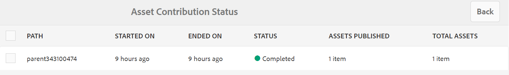

# Publish贡献文件夹到Experience Manager Assets {#using-asset-souring-in-bp}

具有适当权限的Brand Portal用户可以将多个资源或包含多个资源的文件夹上传到contribution文件夹。 但是，Brand Portal用户只能将资源上传到&#x200B;**NEW**&#x200B;文件夹。 **SHARED**&#x200B;文件夹用于分发Brand Portal用户在创建新资源以进行贡献时所使用的基线资源（参考内容）。

有权访问“贡献”文件夹的Brand Portal用户可以执行以下操作：

* [下载资源要求](#download-asset-requirements)
* [将新资产上传到贡献文件夹](#uplad-new-assets-to-contribution-folder)
* [Publish贡献文件夹到Experience Manager Assets](#publish-contribution-folder-to-aem)

## 下载资源要求 {#download-asset-requirements}

当Brand Portal用户共享contribution文件夹时，Experience Manager Assets用户会自动收到电子邮件和pulse通知。 此工作流可让他们从&#x200B;**共享**&#x200B;文件夹下载简要（资源要求）文档和基准资源（参考内容），以了解资源要求。

Brand Portal用户会执行以下操作，以下载资源要求：

* **下载摘要** — 下载附加到贡献文件夹的摘要（资产要求文档）。 它包含与资产相关的信息，例如资产类型、用途、支持的格式、最大资产大小等。
* **下载基线资源** — 下载基线资源，该资源可用于了解所需的资源类型。 Brand Portal用户可以使用这些资源作为参考，为贡献创建新资源。

Brand Portal功能板反映允许向Brand Portal用户访问的所有现有文件夹，以及新共享的贡献文件夹。 在此示例中，Brand Portal用户仅拥有新创建的贡献文件夹的访问权限。 没有其他现有文件夹与该用户共享。

**要下载资源要求：**

1. 登录到您的Brand Portal实例。
1. 从Brand Portal仪表板中选择贡献文件夹。
1. 单击&#x200B;**[!UICONTROL 属性]**。 将打开包含贡献文件夹详细信息的“属性”窗口。

   

   

1. 单击&#x200B;**[!UICONTROL 下载摘要]**&#x200B;选项可在本地计算机上下载资源要求文档。

   

1. 返回到Brand Portal仪表板。
1. 单击贡献文件夹以将其打开。 您可以在贡献文件夹中看到两个子文件夹：**[!UICONTROL SHARED]**&#x200B;和&#x200B;**[!UICONTROL NEW]**。 共享文件夹包含管理员共享的所有基线资源（引用内容）。
1. 您可以下载包含本地计算机上所有基线资源的&#x200B;**[!UICONTROL SHARED]**&#x200B;文件夹。
或者，您可以打开&#x200B;**[!UICONTROL 共享]**&#x200B;文件夹并单击&#x200B;**下载**&#x200B;图标来下载单个文件/文件夹。

   

   

浏览简要（资产需求文档）并参考基准资产，以了解资产需求。 现在，您可以为贡献创建新资产，并将它们上传到贡献文件夹。

## 将资产上传到贡献文件夹 {#upload-new-assets-to-contribution-folder}

完成资源要求后，Brand Portal用户可以为贡献创建新资源，并将这些资源上传到contribution文件夹中的NEW文件夹。 用户可以将多个资产上传到资产贡献文件夹。 但是，一次只能创建一个文件夹。

>[!NOTE]
>
>Brand Portal用户可以向NEW文件夹上传资源（每个文件大小最多2 GB）。
>
>任何Brand Portal租户的最大上传限制为10 GB，将累计应用于所有贡献文件夹。
>
>上传到Brand Portal的资源不会进行处理以供呈现，并且不包含预览。

>[!NOTE]
>
>Adobe建议您在将贡献文件夹发布到Experience Manager Assets后释放上传空间，以便其他Brand Portal用户能够贡献内容。
>
>如果需要将Brand Portal租户的上传限制延长到&#x200B;**10** GB以上，请联系客户支持部门并指定相关要求。

**要上传新资源：**

1. 登录到您的Brand Portal实例。
Brand Portal功能板反映了允许向Brand Portal用户访问的所有现有文件夹，以及新共享的贡献文件夹。

1. 选择贡献文件夹并单击以将其打开。 贡献文件夹包含两个子文件夹 — **[!UICONTROL SHARED]**&#x200B;和&#x200B;**[!UICONTROL NEW]**。

1. 单击&#x200B;**[!UICONTROL 新建]**&#x200B;文件夹。

   

1. 单击&#x200B;**[!UICONTROL 创建]** > **[!UICONTROL 文件]**&#x200B;以上传单个文件或包含多个资产的文件夹(.zip)。

   

1. 浏览资源（文件或文件夹）并将其上载到&#x200B;**[!UICONTROL NEW]**&#x200B;文件夹。

   

将所有资源或文件夹上传到NEW文件夹后，将贡献文件夹发布到Experience Manager Assets。

## Publish贡献文件夹到Experience Manager Assets {#publish-contribution-folder-to-aem}

Brand Portal用户可以将contribution文件夹发布到Experience Manager Assets，而无需访问Experience Manager创作实例。

确保您已满足资产要求，并在contribution文件夹的&#x200B;**NEW**&#x200B;文件夹中上传新创建的资产。

**要发布贡献文件夹：**

1. 登录到您的Brand Portal实例。

1. 从Brand Portal仪表板中选择贡献文件夹。
1. 单击&#x200B;**[!UICONTROL Publish到AEM]**。

   

   

在发布工作流的不同阶段，会向Brand Portal用户和管理员发送电子邮件/脉冲通知：

1. **排队** — 在Brand Portal中触发发布工作流时，会向Brand Portal用户和Brand Portal管理员发送通知。

1. **完成** — 当贡献文件夹成功发布到Brand Portal时，将向Experience Manager Assets用户和Brand Portal管理员发送通知。

将新创建的资源发布到Experience Manager Assets后，Brand Portal用户可以从新建文件夹中删除这些资源。 但是，Brand Portal管理员可以从NEW和SHARED文件夹中删除资源。

一旦实现了创建贡献文件夹的目标，Brand Portal管理员可以删除贡献文件夹，以便为其他用户释放上传空间。

## 发布作业状态 {#publishing-job-status}

管理员可以使用两个报表来查看从Brand Portal发布到Experience Manager Assets的资源贡献文件夹的状态。

* 在Brand Portal中，导航到&#x200B;**[!UICONTROL 工具]** > **[!UICONTROL 资源贡献状态]**。 此报表反映发布工作流不同阶段的所有发布作业的状态。

  

* 在Experience Manager Assets（内部部署或托管服务）中，导航到&#x200B;**[!UICONTROL Assets]** > **[!UICONTROL 作业]**。 此报表可反映所有发布作业的最终状态（成功或错误）。

  

* 在Experience Manager Assetsas a Cloud Service中，导航到&#x200B;**[!UICONTROL Assets]** > **[!UICONTROL 作业]**。

  或者，您可以从全局导航直接导航到&#x200B;**[!UICONTROL 作业]**。

  此报表可反映所有发布作业的最终状态（成功或错误），包括从Brand Portal将资源导入Experience Manager Assetsas a Cloud Service。

  

<!--
>[!NOTE]
>
>Currently, no report is generated in AEM Assets as a Cloud Service for the Asset Sourcing workflow. 
-->

## 从Contribution文件夹中自动删除发布到Experience Manager Assets的资源 {#automatically-delete-published-assets-from-contribution-folder}

Brand Portal现在每十二小时执行一次自动作业，以扫描所有Contribution文件夹并删除发布到AEM的所有资源。 因此，您无需手动删除“贡献”文件夹中的资产，即可将文件夹大小保持在[阈值限制](#upload-new-assets-to-contribution-folder)以下。 您还可以监视过去七天内自动执行的删除作业的状态。 作业的报表提供以下详细信息：

* 作业开始时间
* 作业结束时间
* 作业状态
* 作业中包含的资产总数
* 已成功删除作业中的资源总数
* 作为作业运行结果而提供的总存储空间

  

您还可以进一步深入查看删除作业中包含的每个资源的详细信息。 资产标题、大小、作者、删除状态和删除时间等详细信息将包含在报表中。

详细的

>[!NOTE]
>
> * 客户可以请求Adobe客户支持停用和重新启用自动删除作业功能或更改其执行频率。
> * 此功能在Experience Manager6.5.13.0及更高版本中可用。

### 查看和下载删除报告 {#view-delete-jobs}

要查看和下载删除作业的报告，请执行以下操作：

1. 在Brand Portal中，导航到&#x200B;**[!UICONTROL 工具]**>**[!UICONTROL 资源贡献状态]**>**[!UICONTROL 删除报告]**&#x200B;选项。

1. 选择作业并单击&#x200B;**[!UICONTROL 查看]**&#x200B;查看报告。

   查看删除作业中包含的每个资源的详细信息。 资产标题、大小、作者、删除状态和删除时间等详细信息将包含在报表中。 单击&#x200B;**[!UICONTROL 下载]**&#x200B;以CSV格式下载作业的报告。

   报表中资产的删除状态可能具有以下值：

   * **已删除** — 已成功从“贡献”文件夹中删除资产。

   * **未找到** - Brand Portal在Contribution文件夹中找不到该资源。 已手动从文件夹中删除资产。

   * **已跳过** - Brand Portal已跳过资源删除，因为Contribution文件夹中有新版本可用于该资源，但该版本尚未发布到Experience Manager。

   * **失败** - Brand Portal无法删除该资源。 对于具有`Failed`删除状态的资源，会重试三次。 如果资产第三次重试删除尝试失败，您需要手动删除资产。

### 删除报告

Brand Portal还允许您选择一个或多个报表并手动删除它们。

要删除报告，请执行以下操作：

1. 导航到&#x200B;**[!UICONTROL 工具]**>**[!UICONTROL 资产贡献状态]**>**[!UICONTROL 删除报告]**&#x200B;选项。

1. 选择一个或多个报告并单击&#x200B;**[!UICONTROL 删除]**。

