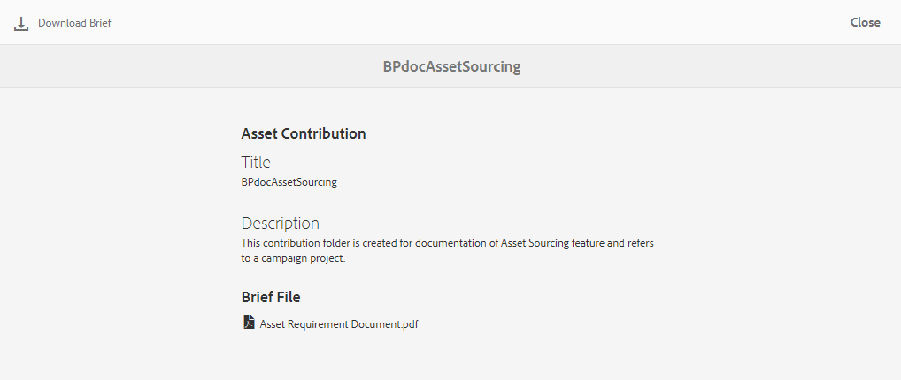

# 将贡献文件夹发布到AEM Assets {#using-asset-souring-in-bp}

拥有适当权限的Brand Portal用户可以将多个资产或包含多个资产的文件夹上传到贡献文件夹。 但是，Brand Portal用户只能将资产上传到&#x200B;**NEW**&#x200B;文件夹。 **SHARED**&#x200B;文件夹用于分发基准资产（引用内容），在创建新资产以供贡献时，Brand Portal用户可使用这些资产。

拥有访问贡献文件夹权限的用户可以执行以下活动:

* [下载资产要求](#download-asset-requirements)
* [将新资产上传到贡献文件夹](#uplad-new-assets-to-contribution-folder)
* [将贡献文件夹发布到AEM Assets](#publish-contribution-folder-to-aem)

## 下载资产要求{#download-asset-requirements}

只要AEM用户共享了贡献文件夹，Brand Portal用户就会自动收到电子邮件/脉冲通知，允许他们下载简要（资产需求）文档，并从&#x200B;**SHARED**&#x200B;文件夹下载基准资产（参考内容），以确保他们了解资产需求。

Brand Portal用户执行以下活动来下载资产要求：

* **下载简介**:下载附加到贡献文件夹的简介(资产需求文档)，该文件夹包含资产相关信息，如资产类型、用途、支持的格式、最大资产大小等。
* **下载基准资产**:下载可用于了解所需资产类型的基准资产。Brand Portal用户可以使用这些资产作为参考来创建要贡献的新资产。

Brand Portal仪表板反映了允许给Brand Portal用户的所有现有文件夹以及新共享的贡献文件夹。 在此示例中，Brand Portal用户只能访问新创建的贡献文件夹，不会与用户共享任何其他现有文件夹。

**要下载资产要求，请执行以下操作：**

1. 登录到您的Brand Portal实例。
1. 从Brand Portal仪表板中选择贡献文件夹。
1. 单击&#x200B;**[!UICONTROL 属性]** . 属性窗口将打开，显示“资产贡献”文件夹详细信息。
   
1. 单击&#x200B;**[!UICONTROL 下载Brief]** 以将资产需求文档下载到本地计算机。
   
1. 返回Brand Portal仪表板。
1. 单击打开贡献文件夹，您可以在贡献文件夹中看到两个子文件夹 — **[!UICONTROL SHARED]**&#x200B;和&#x200B;**[!UICONTROL NEW]**。 SHARED文件夹包含管理员共享的所有基准资产（参考内容）。
1. 您可以下载&#x200B;**[!UICONTROL SHARED]**文件夹，其中包含本地计算机上的所有基准资产。
或者，可以打开**[!UICONTROL SHARED]**&#x200B;文件夹，然后单击&#x200B;**下载**&#x200B;图标下载单个文件/文件夹。
   

浏览简介(资产需求文档)，参阅基准资产以了解资产需求。 现在，您可以创建新资产以进行贡献，并将其上传到贡献文件夹。

## 将资产上传到贡献文件夹{#uplad-new-assets-to-contribution-folder}

完成资产要求后，Brand Portal用户可以创建新资产进行贡献，并将其上传到贡献文件夹中的NEW文件夹。

>[!NOTE]
>
>Brand Portal用户只能将资产上传到NEW文件夹。
>
>任何Brand Portal租户的最大上载限制为&#x200B;**10** GB（累计应用于所有贡献文件夹）。

>[!NOTE]
>
>建议在将贡献文件夹发布到AEM Assets后释放上传空间，以便其他Brand Portal用户可使用该文件夹进行贡献。
>
>如果需要将您的Brand Portal租户的上载限制扩展到&#x200B;**10** GB以上，请与Adobe支持联系，以指定此要求。

**要上传新资产，请执行以下操作：**

1. 登录到您的Brand Portal实例。
Brand Portal仪表板反映了允许给Brand Portal用户的所有现有文件夹以及新共享的贡献文件夹。

1. 选择贡献文件夹，然后单击以打开它。 贡献文件夹包含两个子文件夹 — **[!UICONTROL SHARED]**&#x200B;和&#x200B;**[!UICONTROL NEW]**。

1. 单击&#x200B;**[!UICONTROL NEW]**&#x200B;文件夹。

   

1. 单击&#x200B;**[!UICONTROL 创建]** > **[!UICONTROL 文件]**&#x200B;可上传包含多个资产的单个文件或文件夹(.zip)。

   

1. 浏览资产（文件或文件夹）并将其上传到&#x200B;**[!UICONTROL NEW]**&#x200B;文件夹。

   

将所有资产或文件夹上传到NEW文件夹后，将贡献文件夹发布到AEM Assets。

## 将贡献文件夹发布到AEM Assets {#publish-contribution-folder-to-aem}

Brand Portal用户无需访问AEM作者实例即可将贡献文件夹发布到AEM Assets。

确保您已完成资产要求，并上传贡献文件夹&#x200B;**NEW**&#x200B;文件夹中新创建的资产。

**要发布贡献文件夹：**

1. 登录到您的Brand Portal实例。

1. 从Brand Portal仪表板中选择贡献文件夹。
1. 单击&#x200B;**[!UICONTROL 发布到AEM]**。

   

   

将向位于发布工作流程不同阶段的Brand Portal用户和管理员发送电子邮件/脉冲通知：
1. **已排队**  — 当在Brand Portal中触发发布工作流时，将向Brand Portal用户和Brand Portal管理员发送通知。

1. **完成**  — 当贡献文件夹成功发布到AEM Assets时，将向Brand Portal用户和Brand Portal管理员发送通知。

将新创建的资产发布到AEM Assets后，Brand Portal用户可以从NEW文件夹中删除这些资产。 但是，Brand Portal管理员可以从NEW和SHARED文件夹中删除资产。

实现创建贡献文件夹的目标后，Brand Portal管理员可以删除贡献文件夹，以释放其他用户的上传空间。

## 发布作业状态{#publishing-job-status}

管理员可以利用两种报告来视图从Brand Portal发布到AEM Assets的资产贡献文件夹的状态。

* 在Brand Portal中，导航到&#x200B;**[!UICONTROL 工具]** > **[!UICONTROL 资产贡献状态]**。 此报表反映发布工作流程不同阶段的所有发布作业的状态。

   

* 在AEM Assets（内部部署或托管服务）中，导航到&#x200B;**[!UICONTROL 工具]** > **[!UICONTROL 作业]**。 此报表反映所有发布作业的最终状态（成功或错误）。

   

* 在AEM Assets作为Cloud Service，导航到&#x200B;**[!UICONTROL 工具]** > **[!UICONTROL 资产]** > **[!UICONTROL 报表]**。

   单击&#x200B;**[!UICONTROL 创建]**&#x200B;按钮并选择&#x200B;**[!UICONTROL 发布]**&#x200B;以创建发布报告。

   

   输入&#x200B;**[!UICONTROL 标题]**&#x200B;和&#x200B;**[!UICONTROL 说明]**，然后选择贡献文件夹的&#x200B;**[!UICONTROL 文件夹路径]**&#x200B;并计划&#x200B;**[!UICONTROL Now]**&#x200B;的报表。 单击&#x200B;**[!UICONTROL 下一步]**。

   

   在报表中选择您想要的字段属性并生成它。 此报表反映所有发布作业的最终状态（成功或错误）。

<!--
>[!NOTE]
>
>Currently, no report is generated in AEM Assets as a Cloud Service for the Asset Sourcing workflow. 
-->

