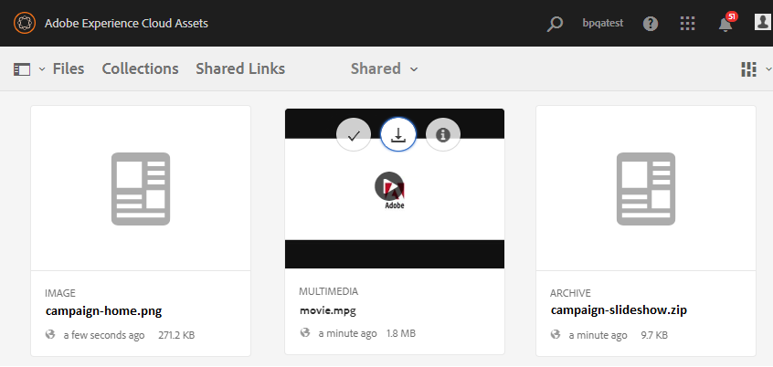
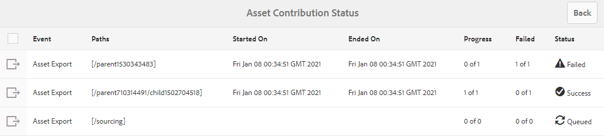

# 将贡献文件夹发布到AEM Assets {#using-asset-souring-in-bp}

具有相应权限的Brand Portal用户可以将多个资产或包含多个资产的文件夹上传到“贡献”文件夹。 但是，Brand Portal用户只能将资产上传到&#x200B;**NEW**&#x200B;文件夹。 **SHARED**&#x200B;文件夹用于分发基线资产（引用内容），Brand Portal用户在创建新资产以进行贡献时可以使用这些资产（引用内容）。

Brand Portal用户（具有访问贡献文件夹的权限）可以执行以下活动：

* [下载资产要求](#download-asset-requirements)
* [将新资产上传到贡献文件夹](#uplad-new-assets-to-contribution-folder)
* [将贡献文件夹发布到AEM Assets](#publish-contribution-folder-to-aem)

## 下载资产要求{#download-asset-requirements}

每当AEM用户共享贡献文件夹时，Brand Portal用户都会自动收到电子邮件/脉冲通知，以便他们能够从&#x200B;**SHARED**&#x200B;文件夹下载简短（资产要求）文档以及下载基线资产（参考内容），以确保他们了解资产要求。

Brand Portal用户可通过执行以下活动来下载资产要求：

* **下载摘要**:下载附加到贡献文件夹的简短（资产要求文档），其中包含与资产相关的信息，如资产类型、用途、支持的格式、最大资产大小等。
* **下载基准资产**:下载可用于了解所需资产类型的基准资产。Brand Portal用户可以将这些资产用作参考，以创建新资产供贡献。

Brand Portal功能板反映允许Brand Portal用户使用的所有现有文件夹以及新共享的贡献文件夹。 在此示例中，Brand Portal用户只能访问新创建的贡献文件夹，不会与用户共享任何其他现有文件夹。

**要下载资产要求，请执行以下操作：**

1. 登录到Brand Portal实例。
1. 从Brand Portal功能板中选择Contribution文件夹。
1. 单击&#x200B;**[!UICONTROL 属性]**. 此时将打开包含贡献文件夹详细信息的属性窗口。

   

   

1. 单击&#x200B;**[!UICONTROL Download Brief]**&#x200B;选项，在本地计算机上下载资产要求文档。

   

1. 返回到Brand Portal仪表板。
1. 单击以打开贡献文件夹，您可以在贡献文件夹中看到两个子文件夹 — **[!UICONTROL SHARED]**&#x200B;和&#x200B;**[!UICONTROL NEW]**。 SHARED文件夹包含管理员共享的所有基线资产（引用内容）。
1. 您可以下载包含本地计算机上所有基线资产的&#x200B;**[!UICONTROL SHARED]**文件夹。
或者，也可以打开**[!UICONTROL SHARED]**&#x200B;文件夹，然后单击&#x200B;**下载**&#x200B;图标以下载单个文件/文件夹。

   

   

阅读简介（资产要求文档），并参考基准资产，以了解资产要求。 现在，您可以创建新资产以进行贡献，并将其上传到贡献文件夹。

## 将资产上传到贡献文件夹{#uplad-new-assets-to-contribution-folder}

完成资产要求后，Brand Portal用户可以创建新资产以进行贡献，并将其上传到贡献文件夹的NEW文件夹。

>[!NOTE]
>
>Brand Portal用户只能将资产上传到NEW文件夹。
>
>任何Brand Portal租户的上载限制上限为&#x200B;**10** GB，该GB将累计应用于所有贡献文件夹。

>[!NOTE]
>
>建议在将贡献文件夹发布到AEM Assets后释放上传空间，以便其他Brand Portal用户可以使用该文件夹进行贡献。
>
>如果需要将Brand Portal租户的上载限制扩展到&#x200B;**10** GB以外，请联系Adobe支持人员以指定要求。

**要上传新资产，请执行以下操作：**

1. 登录到Brand Portal实例。
Brand Portal功能板反映允许Brand Portal用户使用的所有现有文件夹以及新共享的贡献文件夹。

1. 选择贡献文件夹，然后单击以将其打开。 贡献文件夹包含两个子文件夹 — **[!UICONTROL SHARED]**&#x200B;和&#x200B;**[!UICONTROL NEW]**。

1. 单击&#x200B;**[!UICONTROL NEW]**&#x200B;文件夹。

   

1. 单击&#x200B;**[!UICONTROL 创建]** > **[!UICONTROL 文件]**&#x200B;可上传包含多个资产的单个文件或文件夹(.zip)。

   

1. 浏览资产（文件或文件夹）并将其上传到&#x200B;**[!UICONTROL NEW]**&#x200B;文件夹。

   

将所有资产或文件夹上传到NEW文件夹后，将Contribution文件夹发布到AEM Assets。

## 将贡献文件夹发布到AEM Assets {#publish-contribution-folder-to-aem}

Brand Portal用户可以将贡献文件夹发布到AEM Assets，而无需访问AEM创作实例。

确保您已完成资产要求，并上传Contribution文件夹&#x200B;**NEW**&#x200B;文件夹中新创建的资产。

**要发布贡献文件夹，请执行以下操作：**

1. 登录到Brand Portal实例。

1. 从Brand Portal功能板中选择Contribution文件夹。
1. 单击&#x200B;**[!UICONTROL 发布到AEM]**。

   

   

将在发布工作流程的不同阶段向Brand Portal用户和管理员发送电子邮件/脉冲通知：
1. **已排队**  — 在Brand Portal中触发发布工作流程时，会向Brand Portal用户和Brand Portal管理员发送通知。

1. **完成**  — 将Contribution文件夹成功发布到Brand Portal时，系统会向Brand Portal用户和管理员发送通知。

将新创建的资产发布到AEM Assets后，Brand Portal用户可以从NEW文件夹中删除这些资产。 然而，Brand Portal管理员可以从NEW文件夹和SHARED文件夹中删除资产。

实现创建贡献文件夹的目标后，Brand Portal管理员可以删除贡献文件夹，以便为其他用户释放上传空间。

## 发布作业状态{#publishing-job-status}

管理员可以使用两个报表来查看从Brand Portal发布到AEM Assets的资产贡献文件夹的状态。

* 在Brand Portal中，导航到&#x200B;**[!UICONTROL 工具]** > **[!UICONTROL 资产贡献状态]**。 此报表反映发布工作流程不同阶段的所有发布作业的状态。

   

* 在AEM Assets（内部部署或托管服务）中，导航至&#x200B;**[!UICONTROL Assets]** > **[!UICONTROL Jobs]**。 此报表反映所有发布作业的最终状态（成功或错误）。

   

* 在AEM Assets as a Cloud Service中，导航至&#x200B;**[!UICONTROL Assets]** > **[!UICONTROL Jobs]**。

   或者，您也可以从全局导航中直接导航到&#x200B;**[!UICONTROL 作业]**。

   此报表反映所有发布作业的最终状态（成功或错误），包括将资产从Brand Portal导入AEM Assets作为Cloud Service。

   

<!--
>[!NOTE]
>
>Currently, no report is generated in AEM Assets as a Cloud Service for the Asset Sourcing workflow. 
-->
