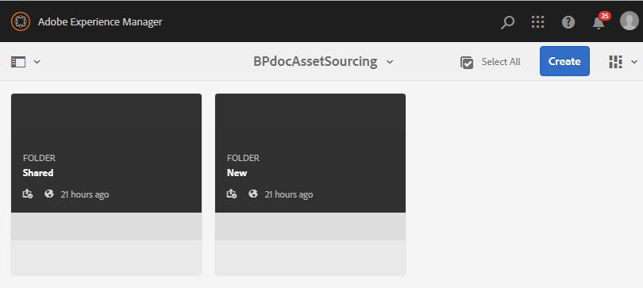

# 在AEM Assets {#configure-contribution-folder}中配置贡献文件夹

对于协作资产来源补充，AEM用户（具有权限的管理员和非管理员用户）可以创建类型为&#x200B;**资产贡献**&#x200B;的新文件夹，确保创建的新文件夹可以由Brand Portal用户提交资产。  这会自动触发一个工作流，该工作流会在新创建的&#x200B;**Contribution**&#x200B;文件夹中创建另外两个子文件夹，名为&#x200B;**SHARED**&#x200B;和&#x200B;**NEW**。

AEM用户随后会定义资产要求，方法是将应添加到贡献文件夹的资产类型以及一组基准资产的简报上传到&#x200B;**SHARED**&#x200B;文件夹，以确保Brand Portal用户获得所需的信息。 然后，管理员可以在将新创建的“贡献”文件夹发布到Brand Portal之前，向活动的Brand Portal用户授予对贡献文件夹的访问权限。

以下视频演示了如何在AEM Assets中配置贡献文件夹：

>[!VIDEO](https://video.tv.adobe.com/v/30547)

AEM用户在配置贡献文件夹时执行以下活动:

* [创建贡献文件夹](#create-contribution-folder)
* [上传资产要求并分配参与者](#configure-contribution-folder-properties)
* [上传基准资产](#uplad-new-assets-to-contribution-folder)
* [将贡献文件夹从AEM Assets发布到Brand Portal](#publish-contribution-folder-to-brand-portal)

## 创建贡献文件夹{#create-contribution-folder}

AEM管理员和拥有创建新文件夹权限的用户可以在AEM Assets中创建贡献文件夹。
要创建贡献文件夹，请新建一个类型为“资产贡献”的文件夹，确保创建的新文件夹已打开，可供Brand Portal用户提交资产。  这会自动触发一个工作流，该工作流会在贡献文件夹内创建另外两个子文件夹，称为SHARED和NEW。

>[!NOTE]
>
>您可以在一个文件夹中创建多个贡献文件夹。 请勿在其他贡献文件夹中创建贡献文件夹。

**要创建贡献文件夹，请执行以下操作：**
1. 登录到AEM Assets实例。

1. 导航到&#x200B;**[!UICONTROL 资产]** > **[!UICONTROL 文件]**。 它将列表AEM Assets存储库中的所有现有文件夹。

1. 单击&#x200B;**[!UICONTROL 创建]**&#x200B;以创建新文件夹。 **[!UICONTROL “创建文]** 件夹”对话框打开。

1. 输入文件夹的&#x200B;**[!UICONTROL 标题]**&#x200B;和&#x200B;**[!UICONTROL 名称]**，然后选中&#x200B;**[!UICONTROL 资产贡献]**复选框。
建议使用小写字母来命名文件夹，但不要使用任何空格。

1. 单击&#x200B;**[!UICONTROL 创建]**。您可以看到列在AEM Assets存储库中的贡献文件夹。

   >[!NOTE]
   >
   >非管理员用户可以创建和共享资产贡献文件夹，但无法修改或删除该文件夹。

   

1. 单击打开贡献文件夹，您可以看到两个子文件夹 — **[!UICONTROL SHARED]**&#x200B;和&#x200B;**[!UICONTROL NEW]**&#x200B;将自动在贡献文件夹中创建。

   

您还可以在创建贡献文件夹时配置贡献文件夹属性。

## 配置贡献文件夹属性{#configure-contribution-folder-properties}

AEM管理员在配置贡献文件夹的属性时执行以下活动。

* **添加说明**:提供贡献文件夹的高级描述。
* **上传摘要**:上传包含资产相关信息的资产需求文档。
* **添加参与者**:添加Brand Portal用户以授予他们对贡献文件夹的访问权限。

资产要求是指管理员为帮助参与者（Brand Portal用户）了解贡献文件夹的需要和要求而提供的详细信息。 管理员上传资产需求文档，其中包含应添加到贡献文件夹的资产类型以及资产相关信息（例如用途、图像类型、最大大小等）的简短说明。

**要配置贡献文件夹属性，请执行以下操作：**

1. 登录到AEM Assets实例。

1. 导航到&#x200B;**[!UICONTROL 资产>文件]**&#x200B;并找到贡献文件夹。
1. 选择贡献文件夹，然后单击&#x200B;**[!UICONTROL 属性]**&#x200B;以打开“文件夹属性”窗口。

   

   

1. 导航到&#x200B;**[!UICONTROL 资产贡献]**&#x200B;选项卡。
1. 输入贡献文件夹的高级&#x200B;**[!UICONTROL 说明]**。
1. 单击&#x200B;**[!UICONTROL 上传Brief]**&#x200B;从本地计算机浏览并上传&#x200B;**资产需求文档**。

   

1. 在&#x200B;**[!UICONTROL 添加用户]**&#x200B;字段中，添加要与其共享贡献文件夹的Brand Portal用户。 这些用户可以使用Brand Portal界面访问内容并将内容上传到贡献文件夹。
1. 单击&#x200B;**[!UICONTROL 保存]**。

   

>[!NOTE]
>
>搜索结果基于在AEM Assets中配置的Brand Portal用户列表。 确保您已更新Brand Portal用户列表。

## 将资产上传到贡献文件夹{#uplad-new-assets-to-contribution-folder}

Brand Portal用户可以下载资产要求，以了解贡献的需求。
然后，他们可以创建新资产以进行贡献，并将其上传到贡献文件夹中的NEW文件夹。

>[!NOTE]
>
>Brand Portal用户只能将资产上传到NEW文件夹。
>
>任何Brand Portal租户的最大上载限制为&#x200B;**10** GB（累计应用于所有贡献文件夹）。

将新创建的资产发布到AEM Assets后，Brand Portal用户可以从NEW文件夹中删除这些资产。 但是，Brand Portal管理员可以从NEW和SHARED文件夹中删除资产。

实现创建贡献文件夹的目标后，Brand Portal管理员可以删除贡献文件夹，以释放其他用户的上传空间。

>[!NOTE]
>
>建议在将贡献文件夹发布到AEM Assets后释放上传空间，以便其他Brand Portal用户可使用该文件夹进行贡献。
>
>如果需要将您的Brand Portal租户的上载限制扩展到&#x200B;**10** GB以上，请与Adobe支持联系，以指定此要求。

**要上传新资产，请执行以下操作：**

1. 登录到您的Brand Portal实例。
Brand Portal仪表板反映了允许给Brand Portal用户的所有现有文件夹以及新共享的贡献文件夹。

1. 选择贡献文件夹，然后单击以打开它。 贡献文件夹包含两个子文件夹 — **[!UICONTROL SHARED]**&#x200B;和&#x200B;**[!UICONTROL NEW]**。

1. 单击&#x200B;**[!UICONTROL NEW]**&#x200B;文件夹。

   

1. 单击&#x200B;**[!UICONTROL 创建]** > **[!UICONTROL 文件]**&#x200B;可上传包含多个资产的单个文件或文件夹(.zip)。

   

1. 浏览资产（文件或文件夹）并将其上传到&#x200B;**[!UICONTROL NEW]**&#x200B;文件夹。

   

将所有资产或文件夹上传到NEW文件夹后，将贡献文件夹发布到AEM Assets。

## 将贡献文件夹发布到Brand Portal {#publish-contribution-folder-to-brand-portal}

配置贡献文件夹后，AEM用户（管理员/非管理员用户）可以将贡献文件夹从AEM Assets发布到Brand Portal。 拥有访问贡献文件夹权限的用户将在发布操作完成后收到电子邮件/脉冲通知。

**要发布贡献文件夹：**

1. 登录到AEM Assets实例。

1. 导航到&#x200B;**[!UICONTROL 资产>文件]**，然后找到要发布到Brand Portal的贡献文件夹。
1. 选择贡献文件夹，然后单击&#x200B;**[!UICONTROL 快速发布]** > **[!UICONTROL 发布到Brand Portal]**。

   

   贡献文件夹发布到Brand Portal后，您会收到一条成功消息。

会向分配到贡献文件夹的Brand Portal用户发送电子邮件/脉冲通知。 Brand Portal用户可以访问贡献文件夹并开始贡献。 请参阅[将资产上传到贡献文件夹并发布到AEM Assets](brand-portal-publish-contribution-folder-to-aem-assets.md)。
