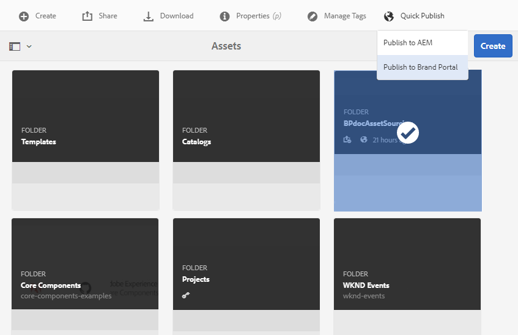

# 在Experience Manager Assets中配置贡献文件夹 {#configure-contribution-folder}

对于协作资源源，Experience Manager Assets用户（拥有权限的管理员和非管理员用户）可以创建类型为的新文件夹 **资产贡献**，确保创建的新文件夹可供Brand Portal用户提交资源。  这会自动触发一个工作流，该工作流会创建两个额外的子文件夹，称为 **已共享** 和 **新**，在新创建的 **贡献** 文件夹。

然后，Experience Manager Assets用户通过上传一份关于应添加到contribution文件夹的资源类型的简报以及一组基线资源来定义资源要求 **已共享** 文件夹，以确保Brand Portal用户获得所需的信息。 随后，管理员可以向活动Brand Portal用户授予对贡献文件夹的访问权限，然后再将新创建的Contribution文件夹发布到Brand Portal。

以下视频演示了如何在Experience Manager Assets中配置Contribution文件夹：

>[!VIDEO](https://video.tv.adobe.com/v/30547)

Experience Manager Assets用户在配置贡献文件夹时执行以下操作：

* [创建贡献文件夹](#create-contribution-folder)
* [上传资源要求并分配参与者](#configure-contribution-folder-properties)
* [上载基线资源](#uplad-new-assets-to-contribution-folder)
* [将贡献文件夹从Experience Manager Assets发布到Brand Portal](#publish-contribution-folder-to-brand-portal)

## 创建贡献文件夹 {#create-contribution-folder}

有权创建新文件夹的Experience Manager Assets管理员和非管理员用户可以在Experience Manager Assets中创建“贡献”文件夹。
要创建“贡献”文件夹，请创建一个类型为“资源贡献”的新文件夹，以确保创建的新文件夹可供Brand Portal用户提交资源。  这会自动触发一个工作流，该工作流会在contribution文件夹中创建两个额外的子文件夹，分别称为SHARED和NEW。

>[!NOTE]
>
>管理员可以在一个文件夹中创建多个资产贡献文件夹。
>
>资源贡献文件夹包含用于资源分发和贡献的NEW和SHARED文件夹。 请勿在贡献文件夹中创建资产、文件夹或贡献文件夹。

您可以在创建贡献文件夹时单独配置贡献文件夹属性。 在本例中，我们将单独配置属性。

**要创建贡献文件夹，请执行以下操作：**

1. 登录到您的Experience Manager Assets实例。

1. 导航到 **[!UICONTROL 资产]** > **[!UICONTROL 文件]**. 它列出了Experience Manager Assets存储库中的所有现有文件夹。

1. 单击 **[!UICONTROL 创建]** 以创建新文件夹。 **[!UICONTROL 创建文件夹]** 对话框打开。

1. 输入 **[!UICONTROL 标题]** 和 **[!UICONTROL 名称]** ，然后选择 **[!UICONTROL 资产贡献]** 复选框。
建议使用不带任何空格的小写字母来命名文件夹。

1. 单击&#x200B;**[!UICONTROL 创建]**。您可以看到Experience Manager Assets存储库中列出的贡献文件夹。

   >[!NOTE]
   >
   >非管理员用户可以创建和共享资产贡献文件夹，但无法修改或删除它。

   

1. 单击以打开贡献文件夹，您可以看到两个子文件夹 — **[!UICONTROL 已共享]** 和 **[!UICONTROL 新]** 将自动在contribution文件夹中创建。

   

## 配置贡献文件夹属性 {#configure-contribution-folder-properties}

Experience Manager Assets管理员在配置“贡献”文件夹的属性时执行以下操作。

* **添加描述**：提供贡献文件夹的高级别描述。
* **上传摘要**：上传包含资产相关信息的资产要求文档。
* **添加参与者**：添加Brand Portal用户，以授予他们访问贡献文件夹的权限。

资源要求是指管理员为帮助参与者(Brand Portal用户)了解贡献文件夹的需要和要求而提供的详细信息。 管理员上传资源请求文档，该文档简要说明了应添加到Contribution文件夹的资源的类型以及资源相关信息，例如用途、图像类型、最大大小等。

**要配置贡献文件夹属性，请执行以下操作：**

1. 登录到您的Experience Manager Assets实例。

1. 导航到 **[!UICONTROL 资产>文件]** 并找到贡献文件夹。
1. 选择贡献文件夹并单击 **[!UICONTROL 属性]** 打开“文件夹属性”窗口。

   

   

1. 导航到 **[!UICONTROL 资产贡献]** 选项卡。
1. 输入高级别 **[!UICONTROL 描述]** 贡献文件夹的。
1. 单击 **[!UICONTROL 上传摘要]** 从本地计算机浏览并上传 **资产需求文档**.

   

1. 在 **[!UICONTROL 添加用户]** 字段中，添加要与其共享贡献文件夹的Brand Portal用户。 这些用户可以使用Brand Portal界面访问内容并将其上传到贡献文件夹。
1. 单击“**[!UICONTROL 保存]**”。

   

>[!NOTE]
>
>搜索结果基于Experience Manager Assets中配置的Brand Portal用户列表。 确保您拥有更新的Brand Portal用户列表。

管理员可以下载 `user.csv` 文件来源 [!DNL Admin Console] 并将其用作添加Brand Portal用户的基本模板。 转到 [!UICONTROL 用户] ，然后单击 [!UICONTROL 将用户列表导出到csv] 用于下载 `users.csv` 文件。 以下示例用户列表详细列出了添加用户所需的属性。 用户条目的唯一必需属性是 `Email` 而所有其他属性都是可选的。

[获取文件](assets/users.csv)

## 将资产上传到贡献文件夹 {#uplad-new-assets-to-contribution-folder}

Experience Manager Assets用户将一组基线资源上传到 **已共享** 文件夹，以确保Brand Portal用户获得所需的信息。

**要上传基线资源，请执行以下操作：**

1. 登录到您的Experience Manager Assets实例。

1. 导航到 **[!UICONTROL 资产>文件]** 并找到贡献文件夹。

1. 选择贡献文件夹，然后单击以将其打开。

1. 单击 **[!UICONTROL 新]** 文件夹。

   

1. 单击 **[!UICONTROL 创建]** > **[!UICONTROL 文件]** 上传单个文件或包含多个资产的文件夹(.zip)。

   

1. 浏览资产（文件或文件夹）并将其上传到 **[!UICONTROL 新]** 文件夹。

   

将所有资源或文件夹上传到NEW文件夹后，将贡献文件夹发布到Experience Manager Assets。

## 将贡献文件夹发布到Brand Portal {#publish-contribution-folder-to-brand-portal}

配置贡献文件夹后，Experience Manager Assets用户（管理员/非管理员用户）可以将贡献文件夹从Experience Manager Assets发布到Brand Portal。 具有访问“贡献”文件夹权限的Brand Portal用户将在发布操作完成后收到电子邮件/脉冲通知。

**要发布贡献文件夹，请执行以下操作：**

1. 登录到您的Experience Manager Assets实例。

1. 导航到 **[!UICONTROL 资产>文件]** 并找到要发布到Brand Portal的contribution文件夹。
1. 选择贡献文件夹并单击 **[!UICONTROL 快速发布]** > **[!UICONTROL 发布到Brand Portal]**.

   

   将contribution文件夹发布到Brand Portal后，您将收到一则成功消息。

会向分配给contribution文件夹的Brand Portal用户发送电子邮件/脉冲通知。 Brand Portal用户可以访问贡献文件夹并开始贡献。 参见， [将资源上传到contribution文件夹并发布到Experience Manager Assets](brand-portal-publish-contribution-folder-to-aem-assets.md).
