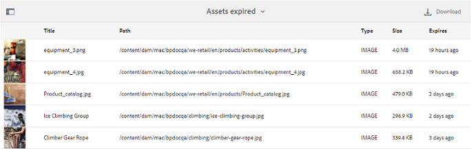
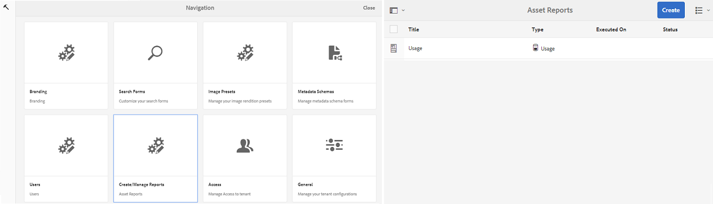
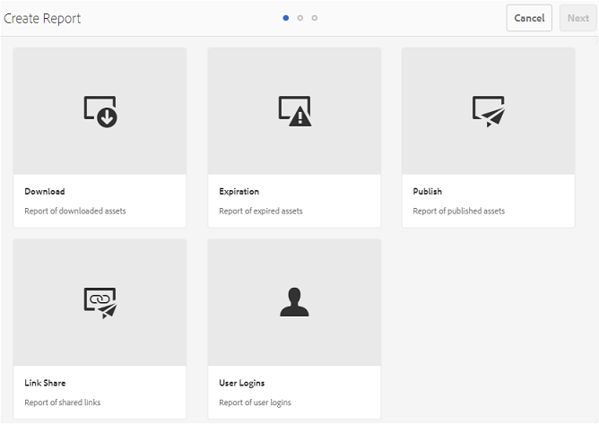

# 使用报告 {#work-with-reports}

报告功能有助于评估品牌门户的使用情况，以及了解内部和外部用户如何与批准的资产交互。 管理员可以视图“品牌门户使用情况”报告，该报告始终在“资产报告”页面上提供。 但是，可以通过资产报告页面生成和查看通过链接下载、过期、发布和共享的用户登录和资产的报告。 这些报告有助于分析资产部署，从而得出关键成功指标来衡量组织内外批准资产的采用情况。

报表管理界面直观，包括用于访问已保存报表的精细选项和控件。 您可以从资产报表页面视图、下载或删除报表，其中会列出所有以前生成的报表。

## 视图报告 {#view-reports}

要视图报告，请执行以下步骤：

1. 在顶部的工具栏中，点按／单击AEM徽标以访问管理工具。

   

1. 在管理工具面板中，单击 **[!UICONTROL 创建／管理报表]** ，以打 **[!UICONTROL 开资产报表]** 页面。

   

1. 从“资 **[!UICONTROL 产报告]** ”页面访问使用情况报告和其他生成的报告。

   >[!NOTE]
   >
   >默认情况下，品牌门户中存在使用情况报告。 无法创建或删除它。 但是，您可以创建、下载和删除“下载”、“过期”、“发布”、“链接共享”和“用户登录”报告。

   要视图报表，请点按／单击报表链接。 或者，选择报表，然后点按／单击工具栏中的视图图标。

   **[!UICONTROL 使用情况报]** 告显示有关当前Brand Portal用户数、所有资产占用的存储空间以及Brand Portal中资产总数的信息。 报告还显示每个信息指标的允许容量。

   

   **[!UICONTROL “用户登录]** ”报告提供有关登录到Brand Portal的用户的信息。 报告显示每个用户的显示姓名、电子邮件ID、角色（管理员、查看器、编辑者、客人）、组、上次登录、活动状态以及从Brand Portal 6.4.2部署到生成报告时的登录计数。

   

   **[!UICONTROL 下载]** 报告列表以及在特定日期和时间范围内下载的所有资产的详细信息。

   

   >[!NOTE]
   >
   >资产下 **[!UICONTROL 载报]** 告仅显示从Brand Portal单独选择和下载的资产。 如果用户已下载包含资产的文件夹，则报告不会显示该文件夹或该文件夹中的资产。

   **[!UICONTROL 到期报告]** 列表，并详细列出在特定时间范围内过期的所有资产。

   

   **[!UICONTROL 发布报]** 告列表，并提供有关在指定时间范围内从AEM发布到Brand Portal的所有资产的信息。

   

   >[!NOTE]
   >
   >发布报告不显示有关内容片段的信息，因为内容片段无法发布到品牌门户。

   **[!UICONTROL 链接共享报告]** 列表在特定时间范围内通过Brand Portal界面链接共享的所有资产。 报告还通知通过链接共享资产的时间、用户、链接的过期时间以及租户（以及共享资产链接的用户）的共享链接数。 链接共享报告的列不可自定义。

   

   >[!NOTE]
   >
   >链接共享报告不会显示有权访问通过链接共享的资产或通过链接下载资产的用户。
   >
   >要通过共享链接跟踪下载，您需要在选择“创建报告”页面上的“仅链 **[!UICONTROL 接共享下载]** ”选项 **[!UICONTROL 后生成下载报]** 告。 但是，在本例中，用户（下载者）是匿名的。

## 生成报告 {#generate-reports}

管理员可以生成和管理以下标准报告，一旦生成，这些报告将保存以供以 [后访](../using/brand-portal-reports.md#main-pars-header) 问：

* 用户登录
* 下载
* 到期时间
* 发布
* 链接共享

可以自定义“下载”、“过期”和“发布”报告中的列以供查看。 要生成报表，请执行以下步骤：

1. 从顶部的工具栏中，点按／单击AEM徽标以访问管理工具。

   

1. 在管理工具面板中，点按／单 **[!UICONTROL 击创建／管理报表]** ，以打 **[!UICONTROL 开资产报表页]** 。

   

1. 在资产报表页面中，点按/单击&#x200B;**[!UICONTROL 创建]**。
1. 在创建 **[!UICONTROL 报表页]** ，选择要创建的报表，然后点按／单击下 **[!UICONTROL 一步]**。

   

1. 配置报告详细信息。 指定“下载”、“过期”和“发布”报告的标题、描述、文件夹结构(其中报告需要运行 **[!UICONTROL 并生成]**&#x200B;统计信息) **[!UICONTROL 和日]**&#x200B;期范 **[!UICONTROL 围]** 。

   

   而链接 **[!UICONTROL 共享报表]** 只需要标题、说明和日期范围参数。

   

   >[!NOTE]
   >
   >报表标题中的特殊字符#和%在生成报表时替换为连字符(-)。

1. 点按／单 **[!UICONTROL 击下]**&#x200B;一步，以配置“下载”、“过期”和“发布”报告的列。
1. 根据需要选择或取消选择相应的复选框。 例如，要在“下载”报告中视图用户(下载资产 **[!UICONTROL )的名]** 称，请选 **[!UICONTROL 择“下载者]**”。 下图说明了如何在下载报告中选择默认列。

   

   您还可以向这些报表添加自定义列，以根据自定义要求显示更多数据。

   要向“下载”、“发布”或“过期”报告添加自定义列，请执行以下步骤：

   1. 要显示自定义列，请点按／单 **[!UICONTROL 击自]** 定义 [!UICONTROL 列中添加]。
   1. 在列名称字段中指 **[!UICONTROL 定列名]** 。
   1. 使用属性选取器，选择列需要映射到的属性。

      
或者，在属性路径字段中键入路径。

      

      要添加更多自定义列，请点按／单 **击添** 加，然后重复步骤2和3。

1. 点按/单击&#x200B;**[!UICONTROL 创建]**。系统会显示一条消息，通知已开始生成报告。

## 下载报告 {#download-reports}

要将报告保存并下载为。csv文件，请执行以下操作之一：

* 在资产报表页面上选择一个报表，然后点按／单 **[!UICONTROL 击顶部]** 工具栏中的下载。

* 从资产报表页面，打开报表。 从报 **[!UICONTROL 告页]** 面顶部选择“下载”选项。

## 删除报告 {#delete-reports}

要删除现有报表，请从资产报表页 **[!UICONTROL 面选择报表]** ，然后点按/ **[!UICONTROL 单击顶]** 部工具栏中的删除。

>[!NOTE]
>
>**[!UICONTROL 无法删除]** “使用情况”报告。
