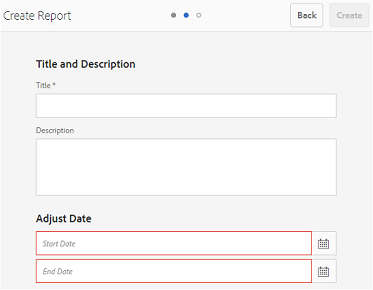
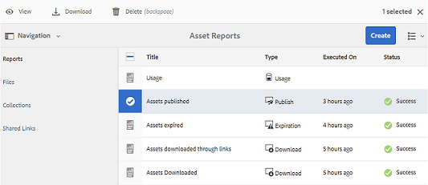

# 使用报告 {#work-with-reports}

报告功能有助于评估Brand Portal使用情况，并了解内部和外部用户如何与经过批准的资源进行交互。 管理员可以查看Brand Portal使用情况报表，此报表始终位于资产报表页面上。 但是，可以通过“资产报表”页面生成和查看有关用户登录和通过链接共享的资产的报表，这些报表包括已下载、已过期、已发布和资产。 这些报告有助于分析资产部署，从而让您获得关键成功指标以衡量组织内外的已批准资产采用情况。

报表管理界面非常直观，包括用于访问已保存报表的细粒度选项和控件。 您可以从“资产报表”页面查看、下载或删除报表，其中列出了之前生成的所有报表。

## 查看报表 {#view-reports}

要查看报告，请执行以下步骤：

1. 从顶部的工具栏中，点按/单击Experience Manager徽标以访问管理工具。

   

1. 在“管理工具”面板中，单击&#x200B;**[!UICONTROL 创建/管理报表]**&#x200B;以打开&#x200B;**[!UICONTROL 资产报表]**&#x200B;页面。

   

1. 从“资产报告”页面访问&#x200B;**[!UICONTROL 使用情况]**&#x200B;报告和其他生成的报告。

   >[!NOTE]
   >
   >使用情况报告是在Brand Portal中生成的默认报告。 无法创建或删除它。 但是，您可以创建、下载和删除下载、过期、Publish、链接共享和用户登录报表。

   要查看报表，请单击报表链接。 或者，选择报表，然后点按/单击工具栏中的查看图标。

   **[!UICONTROL 使用情况报表]**&#x200B;显示有关Brand Portal中活动的Brand Portal用户数、所有资源占用的存储空间以及资源总数的信息。 未分配给Admin Console中任何产品配置文件的Brand Portal用户被视为非活动用户，未反映在&#x200B;**[!UICONTROL 使用情况报表]**中。
此报表还会显示每个信息量度的允许容量。

   

   **[!UICONTROL 用户登录]**&#x200B;报告提供了有关登录到Brand Portal的用户的信息。 报表会显示从Brand Portal 6.4.2部署到生成报表期间每个用户的显示名称、电子邮件ID、角色（管理员、查看者、编辑者、来宾）、组、上次登录、活动状态和登录计数。

   

   **[!UICONTROL 下载]**&#x200B;报告列表，以及有关在特定日期和时间范围内下载的所有资源的详细信息。

   

   >[!NOTE]
   >
   >资源&#x200B;**[!UICONTROL 下载]**&#x200B;报表仅显示从Brand Portal单独选择和下载的资源。 如果用户下载了包含资产的文件夹，报表不会显示该文件夹或文件夹中的资产。

   **[!UICONTROL 过期]**&#x200B;报告列出并详细说明了在特定时间范围内过期的所有资源。

   

   **[!UICONTROL Publish]**&#x200B;报告列出了在指定时间段内从Experience Manager Assets发布到Brand Portal的所有资源并提供相关信息。

   

   >[!NOTE]
   >
   >Publish报表不显示有关内容片段的信息，因为内容片段无法发布到Brand Portal。

   **[!UICONTROL 链接共享报表]**&#x200B;列出了特定时间段内通过来自Brand Portal界面的链接共享的所有资源。 报告还告知通过链接共享资产的时间、用户、链接过期时间以及租户（以及与之共享资产链接的用户）的共享链接数量。 无法自定义链接共享报表的列。

   

   >[!NOTE]
   >
   >链接共享报表不显示有权通过链接共享资产或已通过链接下载资产的用户。
   >
   >若要通过共享链接跟踪下载，您需要在&#x200B;**[!UICONTROL 创建报告]**&#x200B;页面中选择&#x200B;**[!UICONTROL 仅链接共享下载]**&#x200B;选项后生成下载报告。 但是，在这种情况下，用户（下载者）是匿名的。

## 生成报表 {#generate-reports}

管理员可以生成和管理以下标准报告，生成后，这些报告将保存为[稍后访问](../using/brand-portal-reports.md#main-pars-header)：

* 用户登录
* 下载
* 期限
* 发布
* 链接共享

可以自定义下载、过期和Publish报表中的列以供查看。 要生成报表，请执行以下步骤：

1. 在顶部的工具栏中，点按/单击Experience Manager徽标以访问管理工具。

1. 在管理工具面板中，点按/单击&#x200B;**[!UICONTROL 创建/管理报表]**&#x200B;以打开&#x200B;**[!UICONTROL 资产报表]**&#x200B;页面。

   

1. 在资产报表页面中，点按/单击&#x200B;**[!UICONTROL 创建]**。
1. 从&#x200B;**[!UICONTROL 创建报告]**&#x200B;页面，选择要创建的报告，然后点按/单击&#x200B;**[!UICONTROL 下一步]**。

   

1. 配置报表详细信息。 指定&#x200B;**[!UICONTROL 下载]**、**[!UICONTROL 过期]**&#x200B;和&#x200B;**[!UICONTROL Publish]**&#x200B;报告的标题、描述、文件夹结构（报告需要在其中运行并生成统计信息）和日期范围。

   

   而&#x200B;**[!UICONTROL 链接共享报表]**&#x200B;只需要标题、描述和日期范围参数。

   

   >[!NOTE]
   >
   >报告标题中的特殊字符#和%在报告生成时被连字符(-)替换。

1. 点按/单击&#x200B;**[!UICONTROL 下一步]**&#x200B;以配置下载、到期和Publish报表的列。
1. 根据需要选中或取消选中相应的复选框。 例如，要在&#x200B;**[!UICONTROL 下载]**&#x200B;报表中查看用户（下载了资产）的名称，请选择&#x200B;**[!UICONTROL 下载者]**。 下图说明了如何在下载报表中选择默认列。

   

   您还可以向这些报表添加自定义列，以显示更多符合自定义要求的数据。

   要向下载、Publish或到期报告添加自定义列，请执行以下步骤：

   1. 要显示自定义列，请点按/单击[!UICONTROL 自定义列]中的&#x200B;**[!UICONTROL 添加]**。
   1. 在&#x200B;**[!UICONTROL 列名称]**&#x200B;字段中指定列的名称。
   1. 使用属性选取器选择列需要映射到的属性。

      
或者，在属性路径字段中键入路径。

      

      要添加更多自定义列，请点按/单击&#x200B;**添加**&#x200B;并重复步骤2和3。

1. 点按/单击&#x200B;**[!UICONTROL 创建]**。此时将显示一条消息，通知已启动报表生成。

## 下载报表 {#download-reports}

要将报表保存并下载为.csv文件，请执行以下操作之一：

* 在“资产报表”页面上选择一个报表，然后点按/单击顶部工具栏中的&#x200B;**[!UICONTROL 下载]**。

* 在“资产报表”页面中，打开报表。 从报表页面顶部选择&#x200B;**[!UICONTROL 下载]**&#x200B;选项。

## 删除报表 {#delete-reports}

要删除现有报表，请从&#x200B;**[!UICONTROL 资产报表]**&#x200B;页面中选择该报表，然后点按/单击顶部工具栏中的&#x200B;**[!UICONTROL 删除]**。

>[!NOTE]
>
>无法删除&#x200B;**[!UICONTROL 使用情况]**&#x200B;报告。
