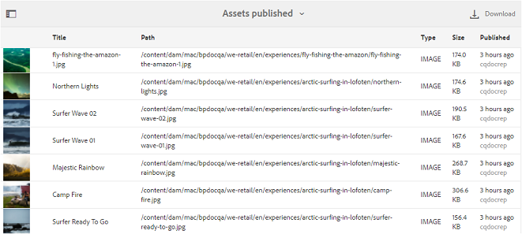

# 使用报告 {#work-with-reports}

报告功能有助于评估Brand Portal使用情况，并了解内部和外部用户如何与批准的资产交互。管理员可以查看Brand Portal使用情况报告，该报告始终在资产报表页面上提供。但是，用户登录、已过期、已发布和通过链接共享的资产的报告可以从资产报表页面生成和查看。这些报告有助于分析资产部署，可让您得出关键成功指标，以测量组织内外所批准资产的采用情况。

报表管理界面直观易懂，其中包含用于访问保存的报表的精细选项和控件。您可以从资产报表页面查看、下载或删除报告，其中列出了之前生成的所有报告。

## 查看报告 {#view-reports}

要查看报告，请执行以下步骤：

1. 在顶部的工具栏中，点按/单击AEM徽标以访问管理工具。

   

2. 在管理工具面板中，单击 **[!UICONTROL 创建/管理报表]** 以打开 **[!UICONTROL 资产报表]** 页面。

   

3. 从资产报表页面访问 **[!UICONTROL 使用情况]** 报告和其他生成的报表。

   >[!NOTE]
   >
   >默认情况下，Brand Portal中存在使用情况报告。不能创建或删除它。但是，您可以创建、下载和删除下载、过期、发布、链接共享和用户登录报告。

   要查看报告，请点按/单击报表链接。或者，选择报表，然后点按/单击工具栏中的视图图标。

   [!UICONTROL 使用情况报告] 显示有关当前Brand Portal用户数量、所有资产占用的存储空间以及Brand Portal中资产总数的信息。报告还会显示每个信息量度的允许容量。

   

   [!UICONTROL 用户登录] 报告提供登录到Brand Portal的用户的相关信息。在生成报表生成期间，该报告显示每个用户的显示姓名、电子邮件ID、角色(管理员、查看器、用户名、用户、客人)、组、上次登录名、活动状态和登录计数。

   

   [!UICONTROL 下载] 报告列表和有关在特定日期和时间范围内下载的所有资产的详细信息。

   

   >[!NOTE]
   >
   >[!UICONTROL 资产下载] 报告仅显示从Brand Portal单独选择和下载的资产。如果用户下载了包含资产的文件夹，则报告不会显示文件夹或文件夹中的资产。

   [!UICONTROL 过期] 报告列出并详细显示在特定时间范围内过期的所有资产。

   

   [!UICONTROL 发布] 报告列表列出了在指定时间范围内从AEM发布到Brand Portal的所有资产的相关信息。

   

   >[!NOTE]
   >
   >发布报告不显示有关内容片段的信息，因为无法将内容片段发布到Brand Portal。

   [!UICONTROL 链接共享报告] 列出了在特定时间范围内通过Brand Portal界面共享的所有资产。此报告还可在通过链接共享资产时、链接过期时、链接过期时以及租户(与资产链接被共享的用户)共享时通知。链接共享报告的列不可自定义。

   

   >[!NOTE]
   >
   >链接共享报告不会显示有权通过链接共享的资产或已通过链接下载资产的用户。
   >
   >
   >要跟踪通过共享链接下载，您需要在创建报告页面上选择 **[!UICONTROL “仅链接共享下载下载]** ”选项后生成 **[!UICONTROL 下载报告]** 。但是，在此情况下，用户(下载者)为匿名用户。

## 生成报告 {#generate-reports}

管理员可以生成和管理以下标准报告，一旦生成后，将保存 [这些](../using/brand-portal-reports.md#main-pars-header) 报告：

* 用户登录
* 下载
* 到期时间
* 发布
* 链接共享

可以自定义下载、过期和发布报告中的列以供查看。要生成报告，请执行以下步骤：

1. 从顶部工具栏中，点按/单击AEM徽标以访问管理工具。

   

2. 在管理工具面板中，点按/单击 **[!UICONTROL 创建/管理报表]** 以打开**资产报表**页面。

   

3. 在资产报表页面中，点按/单击 **[!UICONTROL 创建]**。
4. 从 **[!UICONTROL 创建报表]** 页面中，选择要创建的报表，然后点按/单击 **[!UICONTROL 下]**&#x200B;一步。

   

5. 配置报表详细信息。指定标题、说明、文件夹结构(报告需要运行和生成统计信息)以及 [!UICONTROL 下载]、 [!UICONTROL 过期]和 [!UICONTROL 发布] 报告的日期范围。

   

   [!UICONTROL 但是，链接共享报告] 仅需要标题、说明和日期范围参数。

   

   >[!NOTE]
   >
   >报表标题中的特殊字符#和%，替换为生成报表的连字符(-)。

6. 点按/单击 **[!UICONTROL 下一步]**，以配置“下载”、“过期”和“发布”报告的列。
7. 根据需要选择或取消选择相应的复选框。例如，要在 [!UICONTROL 下载] 报告中查看用户的姓名(已下载资产)，请选择 **[!UICONTROL “下载者]**”。下图介绍了在下载报告中选择默认列的步骤。

   

   您还可以向这些报告中添加自定义列，以根据您的自定义要求显示更多数据。

   要将自定义列添加到下载、发布或过期报告，请执行以下步骤：

   1. 要显示自定义列，请点按/单击 **[!UICONTROL 自定义列]** 中 [!UICONTROL 的添加]。
   2. 指定 **[!UICONTROL 列名称]** 字段中列的名称。
   3. 使用属性选取器选择要将列映射到的属性。

      或者，在属性路径字段中键入路径。

      

      要添加更多自定义列，请点按/单击 **添加** ，并重复步骤和3。

8. Tap/click **[!UICONTROL Create]**. 系统会显示一条消息，通知您生成了报表生成。

## 下载报告 {#download-reports}

要保存并下载报告作为. csv文件，请执行下列操作之一：

* 选择资产报表页面上的报告，然后点按/单击 **[!UICONTROL 顶部工具栏中的下载]** 。

* 从资产报表页面中，打开报告。从报表页面顶部选择 **[!UICONTROL 下载]** 选项。

## 删除报告 {#delete-reports}

要删除现有报表，请从 **[!UICONTROL 资产报表]** 页面中选择该报告，然后点按/单击 **[!UICONTROL 顶部工具栏中的删除]** 。

>[!NOTE]
>
>[!UICONTROL 无法删除使用] 情况报告。
