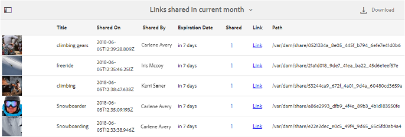

# 使用报告 {#work-with-reports}

报告功能有助于评估品牌门户的使用情况，并了解内部和外部用户如何与批准的资产交互。 管理员可以查看Brand Portal使用情况报告，该报告始终在“资产报告”页面上可用。 但是，可以通过“资产报告”页面生成和查看通过链接下载、过期、发布和共享的用户登录和资产的报告。 这些报告有助于分析资产部署，让您能够得出关键成功指标，以衡量组织内外批准资产的采用情况。

报表管理界面直观，包括用于访问保存的报表的精细选项和控件。 您可以从资产报告页面查看、下载或删除报告，其中列出了之前生成的所有报告。

## 查看报告 {#view-reports}

要查看报告，请执行以下步骤：

1. 在顶部的工具栏中，点按／单击AEM徽标以访问管理工具。

   

1. 在管理工具面板中，单击创 **[!UICONTROL 建／管理报表]** ，以打开“ **[!UICONTROL 资产报表]** ”页面。

   

1. 从“资 **[!UICONTROL 产报告]** ”页面访问使用情况报告和其他生成的报告。

   >[!NOTE]
   >
   >默认情况下，在Brand Portal中显示使用情况报告。 无法创建或删除。 但是，您可以创建、下载和删除“下载”、“过期”、“发布”、“链接共享”和“用户登录”报告。

   要查看报表，请点按／单击报表链接。 或者，选择报表，然后点按／单击工具栏中的视图图标。

   [!UICONTROL 使用情况报告] 显示有关当前Brand Portal用户数、所有资产占用的存储空间以及Brand Portal中资产总数的信息。 报告还显示了这些信息指标中每个指标的允许容量。

   

   [!UICONTROL “用户登录] ”报告提供有关登录到Brand Portal的用户的信息。 报告显示从Brand Portal 6.4.2部署到生成报告之前的每个用户的显示姓名、电子邮件ID、角色（管理员、查看器、编辑器、客人）、用户组、上次登录、活动状态和登录计数。

   

   [!UICONTROL 下载] “报告”列表以及在特定日期和时间范围内下载的所有资产的详细信息。

   

   >[!NOTE]
   >
   >资产下 [!UICONTROL 载报告仅显示] 从Brand Portal单独选择和下载的资产。 如果用户已下载包含资产的文件夹，则报告不显示该文件夹或该文件夹内的资产。

   [!UICONTROL 到期报告] 会列出并详细列出在特定时间范围内过期的所有资产。

   

   [!UICONTROL 发布] ”报告列出并提供有关在指定时间范围内从AEM发布到Brand Portal的所有资产的信息。

   

   >[!NOTE]
   >
   >发布报告不显示有关内容片段的信息，因为内容片段无法发布到Brand Portal。

   [!UICONTROL “链接共享] ”报告列出通过特定时间范围内Brand Portal界面中的链接共享的所有资产。 报告还通知通过链接共享资产的时间、链接的到期时间以及租户（以及共享资产链接的用户）的共享链接数。 链接共享报告的列不可自定义。

   

   >[!NOTE]
   >
   >链接共享报告不显示有权访问通过链接共享的资产或通过链接下载了该资产的用户。
   >
   >
   >要通过共享链接跟踪下载，您需要在选择“创建报告”页面上的“仅链接共 **[!UICONTROL 享下载]** ”选项后生 **[!UICONTROL 成下载报告]** 。 但是，在本例中，用户（下载者）是匿名的。

## 生成报告 {#generate-reports}

管理员可以生成和管理以下标准报告，生成后会保存这些报告以供以 [后访问](../using/brand-portal-reports.md#main-pars-header) :

* 用户登录
* 下载
* 到期时间
* 发布
* 链接共享

可以自定义“下载”、“过期”和“发布”报告中的列以供查看。 要生成报表，请执行以下步骤：

1. 从顶部的工具栏中，点按／单击AEM徽标以访问管理工具。

   

1. 在管理工具面板中，点按／单击创 **[!UICONTROL 建／管理报表]** ，以打开资 **[!UICONTROL 产报表页面]** 。

   

1. 在资产报表页面中，点按／单击 **[!UICONTROL 创建]**。
1. 从创建 **[!UICONTROL 报表页面]** ，选择要创建的报表，然后点按／单击下 **[!UICONTROL 一步]**。

   

1. 配置报告详细信息。 指定“下载”、“到期”和“发布”报告的标题、描述、文件夹结构(其中报告需要运行和生成 [!UICONTROL 统计])和日期范 [!UICONTROL 围] 。

   

   但是，链 [!UICONTROL 接共享报告只需] “标题”、“说明”和“日期范围”参数。

   

   >[!NOTE]
   >
   >报表标题中的特殊字符编号和%在生成报表时替换为连字符(-)。

1. 点按／单击 **[!UICONTROL 下一步]**，以配置“下载”、“过期”和“发布”报告的列。
1. 根据需要选择或取消选择相应的复选框。 例如，要在“下载”报告中查看用户（已下载资产）的名 [!UICONTROL 称] ，请选择“ **[!UICONTROL 下载者”]**。 下图说明了如何在下载报告中选择默认列。

   

   您还可以向这些报告添加自定义列，以根据您的自定义要求显示更多数据。

   要向“下载”、“发布”或“过期”报告添加自定义列，请执行以下步骤：

   1. 要显示自定义列，请点按／单击自 **[!UICONTROL 定义列]** 中 [!UICONTROL 的添加]。
   1. 在列名字段中指定 **[!UICONTROL 列名]** 。
   1. 使用属性选取器选择列需要映射到的属性。

      或者，在属性路径字段中键入路径。

      

      要添加更多自定义列，请点按／单 **击添加** ，然后重复步骤2和3。

1. Tap/click **[!UICONTROL Create]**. 系统会显示一条消息，通知已开始生成报告。

## 下载报告 {#download-reports}

要将报告另存为。csv文件并下载，请执行下列操作之一：

* 在资产报表页面上选择报表，然后点按／单 **[!UICONTROL 击顶部]** 工具栏中的下载。

* 从资产报表页面，打开报表。 从报 **[!UICONTROL 告页面]** 顶部选择“下载”选项。

## 删除报告 {#delete-reports}

要删除现有报表，请从“资产报表”页 **[!UICONTROL 面中选择报表]** ，然后点按／单击顶 **[!UICONTROL 部工具栏中的]** 删除。

>[!NOTE]
>
>[!UICONTROL 无法删除] “使用情况”报告。
