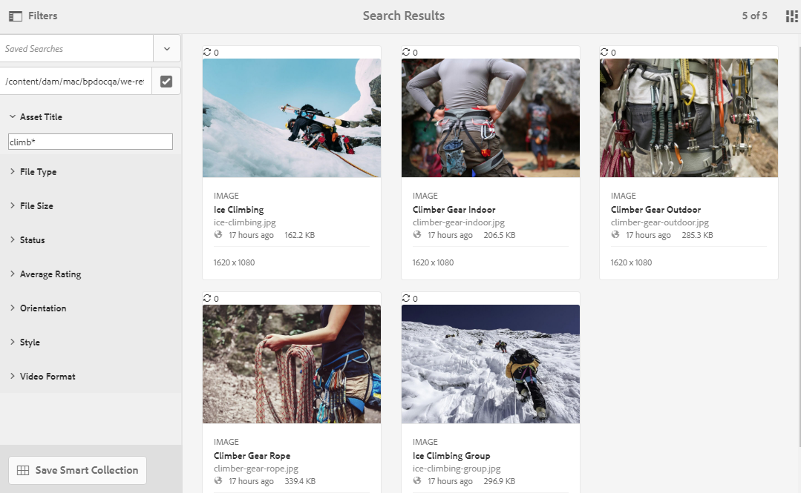

# 在 Brand Portal 上搜索资产 {#search-assets-on-brand-portal}

Brand Portal搜索功能允许您使用omnisearch和facet搜索来快速搜索相关资产，这些搜索使用过滤器来帮助您进一步缩小搜索范围。 您可以在文件或文件夹级别搜索资产，并将搜索结果另存为智能收藏集。

>[!NOTE]
>
>Brand Portal不支持使用omnisearch进行收藏集搜索。
>
>但是，您可以使用 [搜索过滤器以获取相关收藏集的列表](#search-collection).

## 使用Omnisearch搜索资产 {#search-assets-using-omnisearch}

要在Brand Portal上搜索资产，请执行以下操作：

1. 在工具栏中，单击 **[!UICONTROL 搜索]** 图标，或按“**[!UICONTROL /]**&#x200B;启动Omnisearch的键。

   

1. 在搜索框中，为要搜索的资产键入关键字。

   

   >[!NOTE]
   >
   >* Omnisearch中至少需要3个字符才能显示搜索建议。
   >* 搜索词时 `mountain` 或 `biking` 然后，omnisearch会提供搜索结果并显示文本 `mountain` 和 `biking` 元数据字段中。 否则，行为为或，对于智能标记，则行为为 `mountain` 或 `biking` 检索其各自的智能标记中。

1. 从下拉列表中显示的相关建议中进行选择，以快速访问相关资产。

   

   *使用Omnisearch搜索资产*

要了解带有智能标记资产的搜索行为，请参阅 [了解搜索结果和行为](https://experienceleague.adobe.com/docs/experience-manager-65/assets/using/search-assets.html).

## 在“过滤器”面板中使用Facet进行搜索 {#search-using-facets-in-filters-panel}

“过滤器”面板中的搜索彩块化可为您的搜索体验添加粒度，并提高搜索功能的效率。 搜索彩块化使用多个维度（谓词），允许您执行复杂搜索。 您可以轻松地向下展开到所需的详细信息级别，以便进行更集中的搜索。

例如，如果要查找图像，则可以选择想要位图还是矢量图像。 您可以通过在“文件类型”搜索方面中为图像指定MIME类型，进一步缩小搜索范围。 同样，在搜索文档时，可以指定格式，例如PDF或MS® Word格式。

的 **[!UICONTROL 过滤器]** 面板包含一些标准彩块化，例如 —  **[!UICONTROL 路径浏览器]**, **[!UICONTROL 文件类型]**, **[!UICONTROL 文件大小]**, **[!UICONTROL 状态]**&#x200B;和 **[!UICONTROL 方向]**. 但是，您可以 [添加自定义搜索彩块化](../using/brand-portal-search-facets.md) 或从 **[!UICONTROL 过滤器]** 面板，方法是在基础搜索表单中添加或删除谓词。 请参阅可用和可用的列表 [在Brand Portal上搜索谓词](../using/brand-portal-search-facets.md#list-of-search-predicates).

要使用 [搜索彩块化](../using/brand-portal-search-facets.md):

1. 单击叠加图标，然后选择 **[!UICONTROL 过滤器]**.

   

1. 从 **[!UICONTROL 过滤器]** 面板中，选择要应用相关过滤器的相应选项。
例如，使用以下标准过滤器：

   * **[!UICONTROL 路径浏览器]** 搜索特定目录中的资产。 路径浏览器谓词的默认搜索路径为 `/content/dam/mac/<tenant-id>/`，可通过编辑默认搜索表单来配置。
   >[!NOTE]
   >
   >对于非管理员用户， [!UICONTROL 路径浏览器] in [!UICONTROL 过滤器] 面板仅显示与其共享的文件夹（及其上级文件夹）的内容结构。\
   >对于管理员用户，路径浏览器允许导航到Brand Portal中的任意文件夹。

   * **[!UICONTROL 文件类型]** 要指定要查找的资产文件的类型（图像、文档、多媒体、存档）。 此外，您还可以缩小搜索范围，例如，为文档的图像或格式(PDF或MS® Word)指定MIME类型（Tiff、位图、GIMP图像）。
   * **[!UICONTROL 文件大小]** 以根据资产的大小搜索资产。 您可以为大小范围指定下限和上限，以缩小搜索范围并指定要搜索的度量单位。
   * **[!UICONTROL 状态]** 用于根据资产状态（如“批准”、“请求更改”、“已拒绝”、“待定”）和“到期”)搜索资产。
   * **[!UICONTROL 平均评分]** ，以根据资产的评级搜索资产。
   * **[!UICONTROL 方向]** 以根据资产的方向（水平、垂直、正方形）搜索资产。
   * **[!UICONTROL 样式]** 以根据资产的样式（彩色、单色）搜索资产。
   * **[!UICONTROL 视频格式]** 以根据其格式(DVI、Flash、MPEG4、MPEG、OGG Theora、QuickTime、Windows Media、WebM)搜索视频资产。

   您可以使用 [自定义搜索彩块化](../using/brand-portal-search-facets.md) ，方法是编辑基础搜索表单。

   * **[!UICONTROL 属性谓词]** 如果在搜索表单中使用，则允许您搜索与谓词所映射的元数据属性匹配的资产。\
      例如，如果属性谓词映射到 [!UICONTROL `jcr:content /metadata/dc:title`]，您可以根据资产的标题搜索资产。\
      的 [!UICONTROL 属性谓词] 支持文本搜索：

      **部分短语**&#x200B;要允许使用属性谓词中的部分短语进行资产搜索，请在“搜索表单”中启用&#x200B;**[!UICONTROL 部分搜索]**&#x200B;复选框。该功能允许您搜索所需的资产，即使您没有指定资产元数据中使用的确切字词/短语。

      >[!NOTE]
      >
      > Brand Portal支持以下部分搜索字段：
      >* jcr:content/metadata/dc:title
      >* jcr:content/jcr:title
      >* jcr:content/metadata/dam:search_promote
      >* jcr:content/metadata/dc:format

      您可以：
      * 在“过滤器”面板的Facet中，指定出现在搜索短语中的单词。 例如，如果您搜索词 **爬升** (并且属性谓词已映射到 [!UICONTROL `dc:title`] 属性)，则所有带单词的资产 **爬升** 返回其标题短语。
      * 指定出现在搜索短语中的单词的一部分，以及通配符(&#42;)以填补空白。
例如，搜索：
         * **爬升&#42;** 返回所有资产的标题短语中单词的开头为“climb”。
         * **&#42;爬升** 返回标题短语中带有以“climb”字符结尾的所有资产。
         * **&#42;爬升&#42;** 返回所有资产的标题短语中包含字符“climb”的词语。

要允许在属性谓词中进行不区分大小写的搜索，请启用       **不区分大小写的文本**
要允许在属性谓词中进行不区分大小写的搜索，请启用 **[!UICONTROL 忽略大小写]** 复选框。 默认情况下，对属性谓词的文本搜索区分大小写。
   >[!NOTE]
   >
   >选择时 **[!UICONTROL 部分搜索]** 复选框， **[!UICONTROL 忽略大小写]** 默认情况下，处于选中状态。

   

   搜索结果将根据应用的过滤器以及搜索结果计数一起显示。

   

   包含搜索结果计数的资产搜索结果。

1. 您可以轻松地从搜索结果导航到项目，并使用浏览器中的返回按钮返回到相同的搜索结果，而无需重新运行搜索查询。

## 将搜索另存为智能收藏集 {#save-your-searches-as-smart-collection}

您可以将搜索设置另存为智能收藏集，以便能够快速重复相同的搜索，而无需稍后重做相同的设置。 但是，您无法在收藏集中应用搜索过滤器。

要将搜索设置另存为智能收藏集，请执行以下操作：

1. 点按/单击 **[!UICONTROL 保存智能收藏集]** 和为智能收藏集提供名称。

   要使所有用户都可以访问智能收藏集，请选择 **[!UICONTROL 公共]**. 系统会显示一条消息，确认已创建智能收藏集并将其添加到保存的搜索列表。

   >[!NOTE]
   >
   >可以限制非管理员用户公开智能收藏集，以避免在组织的Brand Portal上拥有大量由非管理员用户创建的公共智能收藏集。 组织可以禁用 **[!UICONTROL 允许创建公共智能收藏集]** 配置 **[!UICONTROL 常规]** “管理工具”面板中可用的设置。

   

1. 要以其他名称保存智能收藏集，请选择或清除 **[!UICONTROL 公共]** 复选框，单击 **[!UICONTROL 编辑智能收藏集]**.

   

1. 在 **[!UICONTROL 编辑智能收藏集]** 对话框，选择 **[!UICONTROL 另存为]** 并输入智能收藏集的名称。 单击“**[!UICONTROL 保存]**”。

   

## 搜索收藏集 {#search-collection}

收藏集不支持Omnisearch。 但是，您可以应用搜索过滤器，以从 [!UICONTROL 收藏集] 界面。

从 [!UICONTROL 收藏集] 界面中，单击叠加图标以打开左边栏中的过滤器面板。 从可用过滤器中应用一个或多个搜索过滤器(`modified date`, `access type`和 `tags`)。 它会根据应用的过滤器列出一组最相关的收藏集。

