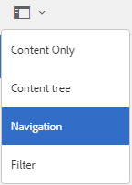
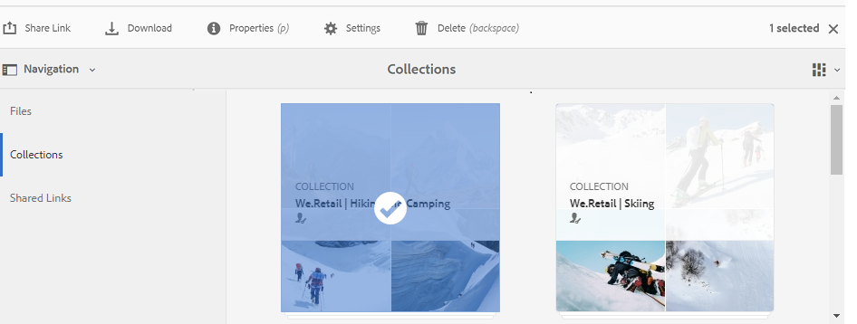
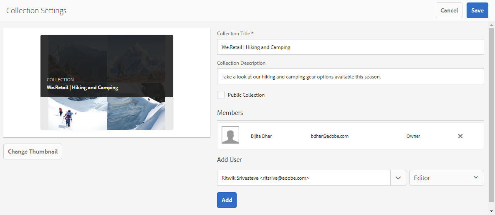
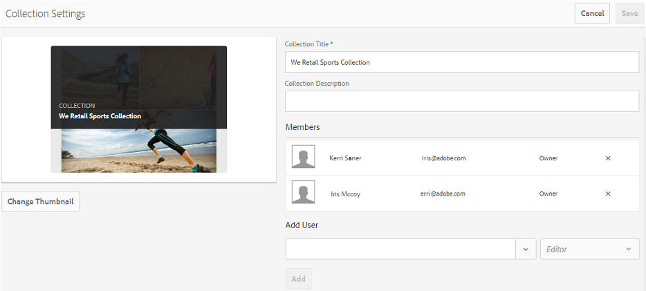

# 在Brand Portal上共享集合 {#share-collections-bp}

AEM Assets Brand Portal管理员可以与授权用户共享和取消共享集合或智能集合。 编辑只能查看和共享由他们创建的集合、与他们共享的集合以及公共集合。 但是，编辑不能将公共集合更改为非公共集合。

>[!NOTE]
>
>编辑不能将公共集合更改为非公共集合，因此，“集合设置”对话框中不提供 [!UICONTROL “公共集合] ” [!UICONTROL 复选框] 。

## 共享集合 {#share-collection}

要共享集合，请执行以下步骤：

1. 单击左侧的叠加图标，然后选择“导 **[!UICONTROL 航”]**。

   

2. 在左侧的脱轨处，单击“集 **[!UICONTROL 合”]**。

   

3. 从“收 **[!UICONTROL 藏集]** ”控制台中，执行下列操作之一：

   * 将指针悬停在要共享的集合上。 在集合的可用快速操作缩略图中，单击“设 **[!UICONTROL 置]** ”图标。
   

   * 选择要共享的集合。 在顶部的工具栏中，单击“设 **[!UICONTROL 置”]**。
   

4. 在“收 [!UICONTROL 藏集设置] ”对话框中，选择要与其共享收藏集的一个或多个用户组，然后为用户或用户组选择与其全局角色匹配的角色。 例如，将“编辑者”角色分配给全局编辑者，将“查看者”角色分配给全局查看者。

   或者，要使集合对所有用户可用（不论其用户组成员关系和角色如何），请通过选中“公共集合 **** ”复选框将其公开。

   >[!NOTE]
   >
   >但是，非管理员用户可能无法创建公共集合，以避免拥有大量公共集合，从而可以保存系统空间。 组织可以从管理工具 **[!UICONTROL 面板中提供的常规设置]** ，禁  用“允许创建公共集合”配置。

   

   编辑不能将公共集合更改为非公共集合，因此，“集合设置”对话框中不提供 [!UICONTROL “公共集合] ” [!UICONTROL 复选框] 。

   

5. Select Add, and then Save. ******** The collection is shared with the chosen users.

   >[!NOTE]
   >
   >A user's role governs access to the assets and folders inside a collection. If a user does not have access to assets, an empty collection is shared with the user. Also, a user's role governs the actions available for collections.

## Unshare a collection {#unshare-a-collection}

To unshare a previously shared collection, do the following:

1. From the Collections console, select the collection you want to unshare.

   In the toolbar, click Settings.****

   

2. On the Collection Settings dialog box, under Members, click the x symbol next to users or groups to remove them from the list of users you shared the collection with.****

   

3. In the warning message box, click Confirm to confirm unshare.****

   Click **[!UICONTROL Save]**.

4. Log in to Brand Portal with the credentials of the user you removed from the shared list. 集合将从“集合”控制 **[!UICONTROL 台中删]** 除。
