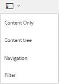

# 在Brand Portal上共享文件夹 {#share-folders}

资产需要从预配置的AEM作者实例发布到Brand Portal，因为Brand Portal不支持资产摄取。

## Brand Portal中的文件夹共享工作流 {#folder-sharing-workflow-in-brand-portal}

下面介绍了文件夹共享工作流和用户访问权限：

* 默认情况下，从AEM资产发布到Brand Portal的所有文件夹只对Brand Portal管理员可见，除非在配置复制时标记为public。
* 管理员使用“文 [!UICONTROL 件夹属性] ”控制台与选择性用户或用户组共享文件夹。 只有与其共享文件夹的用户或用户组在登录到Brand Portal后才能看到该文件夹。 其他用户看不到该文件夹。
* 管理员还可以通过文件夹属性控制台中的“公 [!UICONTROL 共文件夹] ”复选框，将文 [!UICONTROL 件夹公开] 。 公共文件夹对所有用户可见。

* 无论用户角色和权限如何，当用户登录到Brand Portal时，他们都会看到所有公共文件夹，以及直接与他们或他们所属的组共享的文件夹。 私人文件夹或与其他用户共享的文件夹并非对所有用户可见。

### 在Brand Portal上与用户组共享文件夹 {#sharing-folders-with-user-groups-on-brand-portal}

对文件夹资产的访问权限取决于其父文件夹的访问权限，而与子文件夹的设置无关。 此行为受AEM中 [的ACL](https://helpx.adobe.com/experience-manager/6-5/sites/administering/using/security.html#PermissionsinAEM) （子文件夹从父文件夹继承ACL）的约束。 例如，如果文件夹A包含文件夹B，其中包含文件夹C，则对文件夹A具有访问权限的用户组（或用户）对文件夹B和文件夹C也具有相同的访问权限。文件夹B是A的子文件夹，继承其ACL，文件夹C是B的子文件夹。

同样，具有仅访问文件夹B权限的用户组（或用户）对文件夹C具有相同的访问权限，但对文件夹A不具有相同的访问权限。因此，建议组织安排其内容，以便将最暴露的资产放入子文件夹中，并限制从子文件夹到根文件夹的访问。

### Public folder publish {#public-folder-publish}

除非在配 [!UICONTROL 置Brand Portal复制时选择了“公共文件夹发布] ”选项，否则非管理员用户（如编辑器和查看器）无权访问从AEM资产发布到Brand Portal的资产。

如果禁用 [!UICONTROL 了“公共文件夹发布] ”选项，管理员需要使用共享功能专门与非管理员用户共享这些资产。

>[!NOTE]
>
>从AEM 6.3.2.1 [!UICONTROL 开始] ，可以使用启用公共文件夹发布选项。

## 访问共享文件夹 {#access-to-shared-folders}

The following matrix discusses the access rights and rights to share/ unshare assets for various user roles:

|  | Access to all folders published from AEM Assets to Brand Portal | Access to shared folders | Share/unshare folder rights |
|---------------|-----------|-----------|------------|
| Administrator | 是 | 是 | 是 |
| 编辑者 | 否* | Yes, only if shared with them or with the group to which they belong | Yes, only for the folders shared with them or with the group to which they belong |
| 查看者 | 否* | Yes, only if shared with them or with the group to which they belong | 否 |
| 来宾用户 | 否* | Yes, only if shared with them or with the group to which they belong | 否 |

**By default, the Public Folder Publish option is disabled while configuring replication of Brand Portal with AEM Author.If the option is enabled, then the folders published to Brand Portal will be accessible to all the users (non-admin users also) by default.*

### 非管理员用户访问共享文件夹 {#non-admin-user-access-to-shared-folders}

非管理员用户只能访问品牌门户上与他们共享的文件夹。 However, how these folders are displayed on the portal when they log in depends on the settings of Enable Folder Hierarchy configuration.

**如果禁用了配置**

Non-admin users see all the folders shared with them on landing page, on logging in to the Brand Portal.

**If the configuration is enabled**

非管理员用户登录到Brand Portal时，会看到文件夹树（从根文件夹开始）和排列在其各自父文件夹内的共享文件夹。

These parent folders are the virtual folders and no actions can be performed on them. 您可以通过锁定图标识别这些虚拟文件夹。

与共享文件夹不同，在卡片视图中悬停或选择 [!UICONTROL 操作任务时]，不会显示任何操作任务。 [!UICONTROL 在“列视图] ”和“列表视图”中选择虚拟文件夹时， [!UICONTROL 会显示“概述] ” [!UICONTROL 按钮]。

>[!NOTE]
>
>请注意，虚拟文件夹的默认缩略图是第一个共享文件夹的缩略图。

   

## 共享文件夹 {#how-to-share-folders}

要与Brand Portal上的用户共享文件夹，请执行以下步骤：

1. 单击左侧的叠加图标，然后选择“导 **[!UICONTROL 航”]**。

   

2. 从左侧的脱轨中，选择“文 **[!UICONTROL 件”]**。

   

3. 从Brand Portal界面中，选择要共享的文件夹。

   

4. 从顶部的工具栏中，选择共 **[!UICONTROL 享]**。

   

   此时将 [!UICONTROL 显示“文件夹属性] ”控制台。

   

5. 在“文 [!UICONTROL 件夹属性] ”控制台中，如果不希望向用户显示默认名称，请在“文件夹标题  ”字段中指定文件夹标题。
6. 从“添 [!UICONTROL 加用户] ”列表中，选择要与其共享文件夹的一个或多个用户组，然后单击“添 **[!UICONTROL 加”]**。
要仅与客人用户共享文件夹，而不与其他用户共享文件夹，请从“成 **[!UICONTROL 员]** ”下拉列 [!UICONTROL 表中选择] “匿名用户”。

   

   >[!NOTE]
   >
   >要使文件夹对所有用户可用（不论其用户组成员关系和角色如何），请通过选中“公共文件夹 **** ”复选框将其公开。

7. 如果需要，请单 **[!UICONTROL 击“更改缩略图]** ”以修改文件夹的缩略图。
8. Click **[!UICONTROL Save]**.
9. 要访问共享的文件夹，请使用您与之共享文件夹的用户的凭据登录到Brand Portal。 查看界面中的共享文件夹。

## 取消共享文件夹 {#unshare-the-folders}

要取消共享以前共享的文件夹，请执行以下步骤：

1. 从Brand Portal界面中，选择要取消共享的文件夹。

   

2. 在顶部的工具栏中，单击共 **[!UICONTROL 享]**。
3. 在“文 [!UICONTROL 件夹属性] ”控制台的“成员”下 [!UICONTROL ，单击用户旁边的]**** x符号，以从您与之共享文件夹的用户列表中删除这些符号。

   

4. 在警告消息框中，单击“确 **[!UICONTROL 认]** ”以确认取消共享。
Click **[!UICONTROL Save]**.

5. 使用您从共享列表中删除的用户的凭据登录到Brand Portal。 该文件夹不再在用户的Brand Portal界面中可用。
