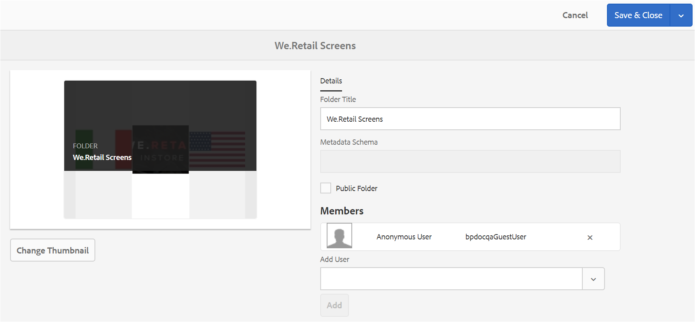

# 在Brand Portal上共享文件夹 {#share-folders}

资源需要从预配置的Experience Manager创作实例发布到Brand Portal，因为Brand Portal不支持资源摄取。

## Brand Portal中的文件夹共享工作流 {#folder-sharing-workflow-in-brand-portal}

下面介绍了文件夹共享工作流和用户访问权限：

* 默认情况下，从Experience Manager Assets发布到Brand Portal的所有文件夹仅对Brand Portal管理员可见，除非在配置复制时标记为公用。
* 管理员使用 **[!UICONTROL 文件夹属性]** 控制台与选定的用户或组共享文件夹。 只有与其共享文件夹的用户或组在登录到Brand Portal后才能看到该文件夹。 其他用户看不到该文件夹。
* 管理员还可以选择通过 **[!UICONTROL 公用文件夹]** 复选框 **[!UICONTROL 文件夹属性]** 控制台。 公用文件夹对所有用户可见。

* 无论用户角色和权限如何，当用户登录到Brand Portal时，都会看到所有公用文件夹，以及直接与他们共享或与其所属的组共享的文件夹。 所有用户都看不到专用文件夹或与其他用户共享的文件夹。

### 在Brand Portal上与用户组共享文件夹 {#sharing-folders-with-user-groups-on-brand-portal}

文件夹资产的访问权限取决于其父文件夹的访问权限，而不管子文件夹的设置如何。 此行为受 [ACL](https://experienceleague.adobe.com/docs/experience-manager-65/administering/security/security.html) 在AEM中，子文件夹继承父文件夹的ACL。 例如，如果文件夹A包含文件夹B，其中包含文件夹C，则对文件夹A具有访问权限的用户组（或用户）对文件夹B和文件夹C也具有相同的访问权限。文件夹B是A的子文件夹，它继承了ACL，而文件夹C是B的子文件夹，它继承了ACL。

同样，有权仅访问文件夹B的用户组（或用户）对文件夹C拥有相同的访问权限，对文件夹A没有相同的访问权限。因此，建议组织安排其内容，以便将大多数公开的资产放在子文件夹中，并且可以限制从子文件夹到根文件夹的访问。

### 公共文件夹发布 {#public-folder-publish}

除非 **[!UICONTROL 公用文件夹发布]** 选项在配置Brand Portal复制时处于选中状态，因此非管理员用户（例如编辑者和查看者）无权访问从AEM Assets发布到Brand Portal的资源。

如果 **[!UICONTROL 公用文件夹发布]** 选项被禁用，管理员需要使用共享功能专门与非管理员用户共享这些资源。

>[!NOTE]
>
>要启用的选项 **[!UICONTROL 公用文件夹发布]** 在AEM 6.3.2.1及更高版本中提供。

## 访问共享文件夹 {#access-to-shared-folders}

以下矩阵讨论了各种用户角色的访问权限以及共享/取消共享资产的权限：

|  | 访问从AEM Assets发布到Brand Portal的所有文件夹 | 访问共享文件夹 | 共享/取消共享文件夹权限 |
|---------------|-----------|-----------|------------|
| 管理员 | 是 | 是 | 是 |
| 编辑器 | 否* | 是，仅当与他们共享或与他们所属的组共享时 | 是，仅适用于与其共享或与所属组共享的文件夹 |
| 查看者 | 否* | 是，仅当与他们共享或与他们所属的组共享时 | 否 |
| 来宾用户 | 否* | 是，仅当与他们共享或与他们所属的组共享时 | 否 |

>[!NOTE]
>
>默认情况下， **[!UICONTROL 公用文件夹发布]** 在使用AEM Author配置Brand Portal复制时，选项被禁用。 如果启用了该选项，则所有用户（非管理员用户）默认情况下都可以访问发布到Brand Portal的文件夹。

### 非管理员用户访问共享文件夹 {#non-admin-user-access-to-shared-folders}

非管理员用户只能访问在Brand Portal上与他们共享的文件夹。 但是，这些文件夹在登录时在门户上的显示方式取决于 **[!UICONTROL 启用文件夹层次结构]** 配置。

**如果配置被禁用**

非管理员用户登录Brand Portal后，会在登陆页面上看到与其共享的所有文件夹。

**如果已启用配置**

登录Brand Portal后，非管理员用户会看到文件夹树（从根文件夹开始）以及在其各自的父文件夹内排列的共享文件夹。

这些父文件夹是虚拟文件夹，不能对它们执行任何操作。 您可以使用锁图标来识别这些虚拟文件夹。

悬停或选择操作任务时不会显示任何操作任务 **[!UICONTROL 卡片视图]**，与共享文件夹不同。 **[!UICONTROL 概述]** 选择中的虚拟文件夹时显示按钮 **[!UICONTROL 列视图]** 和 **[!UICONTROL 列表视图]**.

>[!NOTE]
>
>请注意，虚拟文件夹的默认缩略图是第一个共享文件夹的缩略图图像。

   

## 共享文件夹 {#how-to-share-folders}

要与Brand Portal上的用户共享文件夹，请执行以下步骤：

1. 单击左侧的叠加图标，然后选择 **[!UICONTROL 导航]**.

   

1. 从左侧的侧栏中，选择 **[!UICONTROL 文件]**.

   

1. 从Brand Portal界面中，选择要共享的文件夹。

   

1. 从顶部的工具栏中，选择 **[!UICONTROL 共享]**.

   

   此 [!UICONTROL 文件夹属性] 控制台出现。

   

1. 在 **[!UICONTROL 文件夹属性]** 控制台中，指定文件夹标题 **[!UICONTROL 文件夹标题]** 字段。
1. 从 **[!UICONTROL 添加用户]** 列表中，选择要与其共享文件夹的用户或组，然后单击 **[!UICONTROL 添加]**.
要仅与来宾用户共享文件夹，而不与其他用户共享，请选择 **[!UICONTROL 匿名用户]** 从 **[!UICONTROL 成员]** 下拉菜单。

   

   >[!NOTE]
   >
   >要使文件夹可供所有用户使用（无论其组成员资格和角色如何），请选择 **[!UICONTROL 公用文件夹]** 复选框。

1. 如有必要，请单击 **[!UICONTROL 更改缩略图]** 以修改文件夹的缩略图图像。
1. 单击“**[!UICONTROL 保存]**”。

1. 要访问共享文件夹，请使用与其共享该文件夹的用户的凭据登录Brand Portal。 在界面中查看共享文件夹。

## 取消共享文件夹 {#unshare-the-folders}

要取消共享以前共享的文件夹，请执行以下步骤：

1. 在Brand Portal界面中，选择要取消共享的文件夹。

   

1. 在顶部的工具栏中，单击 **[!UICONTROL 共享]**.
1. 在 **[!UICONTROL 文件夹属性]** 控制台，在下 **[!UICONTROL 成员]**，单击 **[!UICONTROL x]** 用户旁边的符号，用于从共享该文件夹的用户列表中删除这些用户。

   

1. 在警告消息框中，单击 **[!UICONTROL 确认]** 以确认取消共享。
单击“**[!UICONTROL 保存]**”。

1. 使用从共享列表中删除的用户的凭据登录Brand Portal。 该文件夹在Brand Portal界面中不再可供用户使用。
