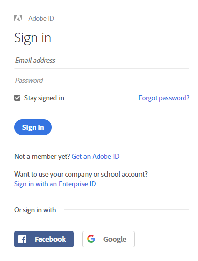
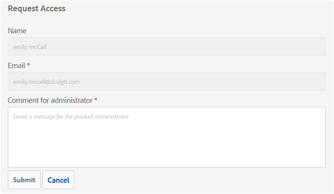

# Overview of AEM Assets Brand Portal {#overview-of-aem-assets-brand-portal}

As a marketer, you sometimes need to collaborate with channel partners and internal business users to quickly create, manage, and deliver relevant digital content to customers. Timely delivery of relevant content across the entire customer journey is critical to driving greater demand, conversion, engagement, and customer loyalty.

However, it is a challenge to develop solutions that support efficient and secure sharing of approved brand logos, guidelines, campaign assets, or product shots with extended internal teams, partners, and resellers.

**Adobe Experience Manager (AEM) Assets Brand Portal can help you easily acquire, control, and securely distribute approved creative assets to external parties and internal business users across devices.**&#x200B;它有助于提高资产共享的效率，加快资产的上市时间，并降低不合规和未授权访问的风险。

The browser-based portal environment enables you to easily upload, browse, search, preview, and export assets in approved formats.

## User personas in Brand Portal {#Personas}

Brand Portal支持以下用户角色：

* 客人用户
* 查看者
* 编辑者
* 管理员

The following table lists the tasks that users in these roles can perform:

|  | **浏览** | **搜索** | **下载** | **共享文件夹** | **共享集合** | **将资产共享为链接** | **Access to Admin Tools** |
|--- |--- |--- |--- |--- |--- |--- |--- |
| **客人用户** | ✓* | ✓* | ✓* | x | x | x | x |
| **查看者** | ✓ | ✓ | ✓ | x | x | x | x |
| **编辑者** | ✓ | ✓ | ✓ | ✓ | ✓ | ✓ | x |
| **管理员** | ✓ | ✓ | ✓ | ✓ | ✓ | ✓ | ✓ |

* Guest users can browse, access, and search assets in public folders and collections only.

### Guest user {#guest-user}

Any user having limited access to assets on Brand Portal without undergoing authentication is a guest user. 客人会话允许用户访问公共文件夹和集合。 作为客人用户，您可以浏览资产详细信息，并拥有公共文件夹和集合成员的完整资产视图。 您可以搜索、下载公共资产并将其添加到 [!UICONTROL Lightbox收藏集] 。

但是，客人会话限制您创建集合和保存的搜索，并进一步共享它们。 客人会话中的用户无法访问文件夹和集合设置，并且无法将资产共享为链接。 以下是客人用户可以执行的任务列表：

[浏览和访问公共资产](browse-assets-brand-portal.md)

[搜索公共资产](brand-portal-searching.md)

[下载公共资源](brand-portal-download-users.md)

[将资产添加到[!UICONTROL Lightbox]](brand-portal-light-box.md#add-assets-to-lightbox)

### 查看者 {#viewer}

Brand Portal中的标准用户通常是具有查看器角色的用户。 具有此角色的用户可以访问允许的文件夹、集合和资产。 用户还可以浏览、预览、下载和导出资产（原始或特定的演绎版）、配置帐户设置以及搜索资产。 以下是查看器可以执行的任务列表：

[浏览资源](browse-assets-brand-portal.md)

[搜索资产](brand-portal-searching.md)

[下载资源](brand-portal-download-users.md)

### 编辑者 {#editor}

具有“编辑者”角色的用户可以执行查看器可以执行的所有任务。 此外，编辑者还可以查看管理员共享的文件和文件夹。 具有编辑者角色的用户还可以与他人共享内容（文件、文件夹、集合）。

除了查看器可以执行的任务之外，编辑器还可以执行以下其他任务：

[共享文件夹](brand-portal-sharing-folders.md)

[共享集合](brand-portal-share-collection.md)

[将资产共享为链接](brand-portal-link-share.md)

### 管理员 {#administrator}

An administrator includes a user marked as system administrator or Brand Portal product administrator in Admin Console. An administrator can add and remove system administrators and users, define presets, send email to users, and view portal usage and storage reports.

An administrator can perform all tasks that an Editor can perform the following additional tasks:

[Manage users, groups, and user roles](brand-portal-adding-users.md)

[自定义墙纸、页眉和电子邮件](brand-portal-branding.md)

[Use custom search facets](brand-portal-search-facets.md)

[Use the metadata schema form](brand-portal-metadata-schemas.md)

[Apply image presets or dynamic renditions](brand-portal-image-presets.md)

[Work with reports](brand-portal-reports.md)

除了上述任务之外，AEM资产中的作者还可以执行以下任务：

[配置AEM资产与Brand Portal的集成](https://helpx.adobe.com/experience-manager/6-5/assets/using/brand-portal-configuring-integration.html)

[将文件夹发布到Brand Portal](https://helpx.adobe.com/experience-manager/6-5/assets/using/brand-portal-publish-folder.html)

[将集合发布到Brand Portal](https://helpx.adobe.com/experience-manager/6-5/assets/using/brand-portal-publish-collection.html)

## 品牌门户URL的替代别名 {#tenant-alias-for-portal-url}

从Brand Portal 6.4.3开始，组织可以拥有一个替代（别名）URL作为其Brand Portal租户的现有URL。 别名URL可以通过在URL中具有替代前缀来创建。\
请注意，只能自定义品牌门户URL的前缀，而不能自定义整个URL。 例如，具有现有域 **[!UICONTROL geometrix.brand-portal.adobe.com的组织可以获取]** geometrixinc.brand-portal.adobe.com **** （根据请求创建）。

但是，AEM作者实例只能 [使用租户](https://helpx.adobe.com/experience-manager/6-5/assets/using/brand-portal-configuring-integration.html) ID URL配置，而不能使用租户别名（备用）URL配置。

>[!NOTE]
>
>要获取现有门户URL中租户名称的别名，组织需要通过新的租户别名创建请求与Adobe支持部门联系。 通过首先检查别名是否可用，然后创建别名来处理此请求。
>
>要替换旧别名或删除旧别名，需要执行相同的过程。

## 请求对Brand Portal的访问权 {#request-access-to-brand-portal}

用户可以从登录屏幕请求访问Brand Portal。 这些请求将发送给Brand Portal管理员，这些管理员通过Adobe [!UICONTROL Admin Console向用户授予访问权限]。 授予访问权限后，用户会收到通知电子邮件。

要请求访问权限，请执行以下操作：

1. 从Brand Portal登录页面中，选择 **[!UICONTROL 单击此处]** ，与需 **[!UICONTROL 要访问？]**. 但是，要进入客人会话，请选择与“客人访 **[!UICONTROL 问]** ”对应的 **[!UICONTROL “单击此处”]**。

   

   此时将 [!UICONTROL 打开“请求访问] ”页面。

2. 要请求访问组织的Brand Portal，您必须具有有效的 [!UICONTROL Adobe ID]、 [!UICONTROL Enterprise ID]或 [!UICONTROL Federated ID]。

   在“请 [!UICONTROL 求访问] ”页面中，使用您的ID登录（方案1）或创建 [!UICONTROL Adobe ID] （方案2）: 
   ![[!UICONTROL 请求访问]](assets/bplogin_request_access_2.png)

   **场景1**
   1. 如果您有 [!UICONTROL Adobe ID]、 [!UICONTROL Enterprise ID]或 [!UICONTROL Federated ID]，请单击“ ****登录Regin In”。
此时 [!UICONTROL 将打开登录] 页面。
   2. 提供您 [!UICONTROL 的Adobe ID凭据] ，然后单击 **[!UICONTROL 登录]**。 
   

   You are redirected to the Request Access page. 
   **场景2**
   1. 如果您没有 [!UICONTROL Adobe ID]，请单击“请求访问”页 **[!UICONTROL 面中的“获取Adobe ID]** ” [!UICONTROL (获取Adobe ID] )。
The Sign in page opens.
   2. Click **[!UICONTROL Get an Adobe ID]**.
The Sign up page opens.
   3. Enter your first and last name, email ID, and password.
   4. Select Sign up.**** 
   

   You are redirected to the Request Access page.

3. The next page displays your name and email ID used to request access. 为管理员保留评论，然后单击“提 **[!UICONTROL 交”]**。 

   

## 产品管理员授予访问权限 {#grant-access-to-brand-portal}

Brand Portal产品管理员会在其Brand Portal通知区域或通过收件箱中的电子邮件接收访问请求。

要授予访问权限，产品管理员需要单击Brand Portal通知区域中的相关通知，然后单击“授 **[!UICONTROL 予访问权限”]**。
或者，产品管理员也可以按照访问请求电子邮件中提供的链接访问Adobe [!UICONTROL Admin Console] ，并将用户添加到相关的产品配置。

您将被重定向到 [Adobe [!UICONTROL Admin Console]主页](https://adminconsole.adobe.com/enterprise/overview) 。 使用Adobe [!UICONTROL Admin Console] ，创建用户并将其分配到产品配置（以前称为产品配置），这些配置在Brand Portal中显示为组。 有关在 [!UICONTROL Admin Console中添加用户的详细信息]，请参阅 [添加用户](brand-portal-adding-users.md#add-a-user) （按照过程中的步骤4-7添加用户）。

## 品牌门户语言 {#brand-portal-language}

您可以从Adobe [!UICONTROL Experience Cloud设置更改Brand Portal语言]。

要更改语言：

1. 从顶 [!UICONTROL 部菜单中选] 择“用户 [!UICONTROL ”&gt;“编辑配置文件] ”。 
   

2. 在 [!UICONTROL Experience cloud设置页] ，从语言下拉菜单中 [!UICONTROL 选择一种语] 言。

## Brand Portal维护通知 {#brand-portal-maintenance-notification}

在Brand Portal计划停止运行以进行维护之前，登录Brand Portal后，将显示一条通知作为横幅。 示例通知：

您可以关闭此通知并继续使用Brand Portal。 此通知显示在每个新会话中。

## 发布和系统信息 {#release-and-system-information}

* [新增功能](whats-new.md)
* [发行说明](brand-portal-release-notes.md)
* [支持的文件格式](brand-portal-supported-formats.md)

## Related resources {#related-resources}

* [Adobe客户关怀](https://helpx.adobe.com/marketing-cloud/contact-support.html)
* [AEM 论坛](https://www.adobe.com/go/aod_forums_en)