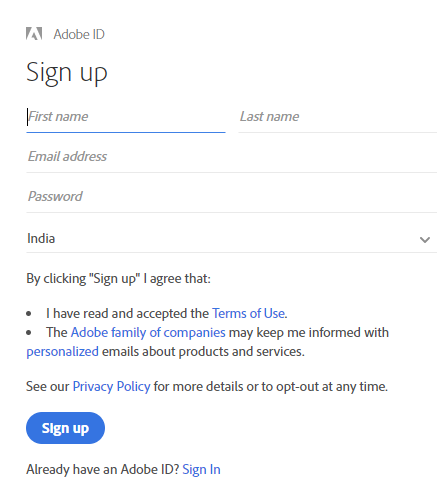

# AEM Assets Brand Portal概述 {#overview-of-aem-assets-brand-portal}

作为营销人员，您有时需要与渠道合作伙伴和内部业务用户协作，以快速创建、管理相关数字内容并向客户交付相关内容。 在整个客户旅程中及时交付相关内容对于提高需求、转化率、参与度和客户忠诚度至关重要。

但是，开发解决方案是一个挑战，它们支持与扩展的内部团队、合作伙伴和经销商高效、安全地共享已批准的品牌徽标、准则、活动资产或产品照片。

**Adobe Experience Manager(AEM)Assets Brand Portal** ，可帮助您轻松获取、控制获准的创意资产并跨设备安全地分发给外部方和内部业务用户。 它有助于提高资产共享的效率，加快资产的上市时间，并降低不合规和未授权访问的风险。

基于浏览器的门户环境使您能够轻松上传、浏览、搜索、预览和导出批准格式的资产。

## Brand Portal中的用户角色 {#Personas}

Brand Portal支持以下用户角色：

* 客人用户
* 查看者
* 编辑者
* 管理员

下表列出了这些角色中的用户可以执行的任务：

|  | **浏览** | **搜索** | **下载** | **共享文件夹** | **共享集合** | **将资产共享为链接** | **访问管理工具** |
|--- |--- |--- |--- |--- |--- |--- |--- |
| **客人用户** | ✓* | ✓* | ✓* | x | x | x | x |
| **查看者** | ✓ | ✓ | ✓ | x | x | x | x |
| **编辑者** | ✓ | ✓ | ✓ | ✓ | ✓ | ✓ | x |
| **管理员** | ✓ | ✓ | ✓ | ✓ | ✓ | ✓ | ✓ |

*客人用户只能浏览、访问和搜索公共文件夹和集合中的资产。

### Guest user {#guest-user}

在未经身份验证的情况下对品牌门户上的资源具有有限访问权限的任何用户都是客人用户。 客人会话允许用户访问公共文件夹和集合。 作为客人用户，您可以浏览资产详细信息，并拥有公共文件夹和集合成员的完整资产视图。 您可以搜索、下载公共资产并将其添加到 [!UICONTROL Lightbox收藏集] 。

但是，客人会话限制您创建集合和保存的搜索，并进一步共享它们。 客人会话中的用户无法访问文件夹和集合设置，并且无法将资产共享为链接。 以下是客人用户可以执行的任务列表：

[浏览和访问公共资产](browse-assets-brand-portal.md)

[搜索公共资产](brand-portal-searching.md)

[下载公共资源](brand-portal-download-users.md)

[将资产添加到[!UICONTROL Lightbox]](brand-portal-light-box.md#add-assets-to-lightbox)

### 查看者 {#viewer}

Brand Portal中的标准用户通常是具有查看器角色的用户。 具有此角色的用户可以访问允许的文件夹、集合和资产。 用户还可以浏览、预览、下载和导出资产（原始或特定的演绎版）、配置帐户设置以及搜索资产。 以下是查看器可以执行的任务列表：

[浏览资源](browse-assets-brand-portal.md)

[搜索资产](brand-portal-searching.md)

[下载资源](brand-portal-download-users.md)

### 编辑者 {#editor}

具有“编辑者”角色的用户可以执行查看器可以执行的所有任务。 此外，编辑者还可以查看管理员共享的文件和文件夹。 具有编辑者角色的用户还可以与他人共享内容（文件、文件夹、集合）。

除了查看器可以执行的任务之外，编辑器还可以执行以下其他任务：

[共享文件夹](brand-portal-sharing-folders.md)

[共享集合](brand-portal-share-collection.md)

[将资产共享为链接](brand-portal-link-share.md)

### 管理员 {#administrator}

管理员包括在 [!UICONTROL Admin Console中标记为系统管理员或Brand Portal产品管理员的用]户。 管理员可以添加和删除系统管理员和用户、定义预设、向用户发送电子邮件以及查看门户使用情况和存储报告。

管理员可以执行编辑者可以执行的所有任务，这些任务还包括以下其他任务：

[管理用户、用户组和用户角色](brand-portal-adding-users.md)

[自定义墙纸、页眉和电子邮件](brand-portal-branding.md)

[使用自定义搜索彩块化](brand-portal-search-facets.md)

[使用元数据架构表单](brand-portal-metadata-schemas.md)

[应用图像预设或动态演绎版](brand-portal-image-presets.md)

[使用报告](brand-portal-reports.md)

除了上述任务之外，AEM资产中的作者还可以执行以下任务：

[配置AEM资产与Brand Portal的集成](https://helpx.adobe.com/experience-manager/6-5/assets/using/brand-portal-configuring-integration.html)

[将文件夹发布到Brand Portal](https://helpx.adobe.com/experience-manager/6-5/assets/using/brand-portal-publish-folder.html)

[将集合发布到Brand Portal](https://helpx.adobe.com/experience-manager/6-5/assets/using/brand-portal-publish-collection.html)

## 品牌门户URL的替代别名 {#tenant-alias-for-portal-url}

从Brand Portal 6.4.3开始，组织可以拥有一个替代（别名）URL作为其Brand Portal租户的现有URL。 别名URL可以通过在URL中具有替代前缀来创建。\
请注意，只能自定义品牌门户URL的前缀，而不能自定义整个URL。 例如，具有现有域 **[!UICONTROL geometrix.brand-portal.adobe.com的组织可以获取]** geometrixinc.brand-portal.adobe.com **** （根据请求创建）。

但是，AEM作者实例只能 [使用租户](https://helpx.adobe.com/experience-manager/6-5/assets/using/brand-portal-configuring-integration.html) ID URL配置，而不能使用租户别名（备用）URL配置。

>[!NOTE]
>
>要获取现有门户URL中租户名称的别名，组织需要通过新的租户别名创建请求与Adobe支持部门联系。 通过首先检查别名是否可用，然后创建别名来处理此请求。
>
>要替换旧别名或删除旧别名，需要执行相同的过程。

## 请求对Brand Portal的访问权 {#request-access-to-brand-portal}

用户可以从登录屏幕请求访问Brand Portal。 这些请求将发送给Brand Portal管理员，这些管理员通过Adobe [!UICONTROL Admin Console向用户授予访问权限]。 授予访问权限后，用户会收到通知电子邮件。

要请求访问权限，请执行以下操作：

1. 从Brand Portal登录页面中，选择 **[!UICONTROL 单击此处]** ，与需 **[!UICONTROL 要访问？]**. 但是，要进入客人会话，请选择与“客人访 **[!UICONTROL 问]** ”对应的 **[!UICONTROL “单击此处”]**。

   

   此时将 [!UICONTROL 打开“请求访问] ”页面。

2. 要请求访问组织的Brand Portal，您必须具有有效的 [!UICONTROL Adobe ID]、 [!UICONTROL Enterprise ID]或 [!UICONTROL Federated ID]。

   在“请 [!UICONTROL 求访问] ”页面中，使用您的ID登录（方案1）或创建 [!UICONTROL Adobe ID] （方案2）:
   ![[!UICONTROL 请求访问]](assets/bplogin_request_access_2.png)

   **场景1**
   1. 如果您有 [!UICONTROL Adobe ID]、 [!UICONTROL Enterprise ID]或 [!UICONTROL Federated ID]，请单击“ ****登录Regin In”。
此时 [!UICONTROL 将打开登录] 页面。
   2. 提供您 [!UICONTROL 的Adobe ID凭据] ，然后单击 **[!UICONTROL 登录]**。 
   

   您将被重定向到“请 [!UICONTROL 求访问] ”页面。
   **场景2**
   1. 如果您没有 [!UICONTROL Adobe ID]，请单击“请求访问”页 **[!UICONTROL 面中的“获取Adobe ID]** ” [!UICONTROL (获取Adobe ID] )。
此时 [!UICONTROL 将打开登录] 页面。
   2. Click **[!UICONTROL Get an Adobe ID]**.
此时 [!UICONTROL 将打开“注册] ”页面。
   3. 输入您的名字和姓氏、电子邮件ID和密码。
   4. 选择 **[!UICONTROL 注册]**。 
   

   您将被重定向到“请 [!UICONTROL 求访问] ”页面。

3. 下一页显示您的姓名和用于请求访问权限的电子邮件ID。 为管理员保留评论，然后单击“提 **[!UICONTROL 交”]**。

   

## 产品管理员授予访问权限 {#grant-access-to-brand-portal}

Brand Portal产品管理员会在其Brand Portal通知区域或通过收件箱中的电子邮件接收访问请求。

要授予访问权限，产品管理员需要单击Brand Portal通知区域中的相关通知，然后单击“授 **[!UICONTROL 予访问权限”]**。
或者，产品管理员也可以按照访问请求电子邮件中提供的链接访问Adobe [!UICONTROL Admin Console] ，并将用户添加到相关的产品配置。

您将被重定向到 [Adobe [!UICONTROL Admin Console]主页](https://adminconsole.adobe.com/enterprise/overview) 。 使用Adobe [!UICONTROL Admin Console] ，创建用户并将其分配到产品配置（以前称为产品配置），这些配置在Brand Portal中显示为组。 有关在 [!UICONTROL Admin Console中添加用户的详细信息]，请参阅 [添加用户](brand-portal-adding-users.md#add-a-user) （按照过程中的步骤4-7添加用户）。

## Brand Portal维护通知 {#brand-portal-maintenance-notification}

在Brand Portal计划停止运行以进行维护之前，登录Brand Portal后，将显示一条通知作为横幅。 示例通知：

您可以关闭此通知并继续使用Brand Portal。 此通知显示在每个新会话中。

## 发布和系统信息 {#release-and-system-information}

<!--* [What's new](../using/whats-new.md)-->
* [发行说明](brand-portal-release-notes.md)
* [支持的文件格式](brand-portal-supported-formats.md)

## Related resources {#related-resources}

* [Adobe客户关怀](https://helpx.adobe.com/marketing-cloud/contact-support.html)
* [AEM 论坛](https://www.adobe.com/go/aod_forums_en)