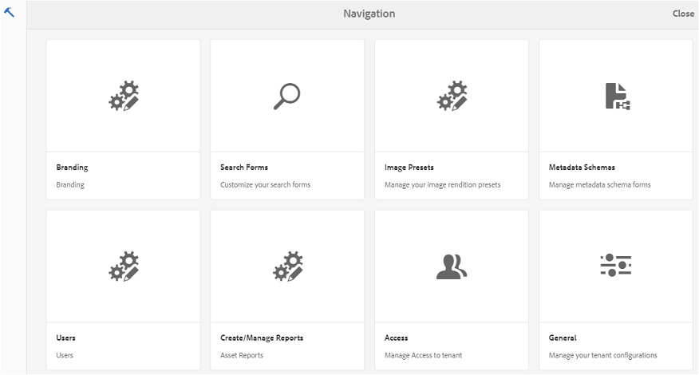

# 在Brand Portal上浏览资产 {#browsing-assets-on-brand-portal}

[!DNL AEM] Assets[！DNL Brand Portal提供各种功能和用户界面元素，可帮助浏览资源、遍历资源层次结构和在使用不同视图选项的同时搜索资源。

[!DNL AEM][!DNL AEM] 工具栏中的徽标可方便管理员用户访问管理工具面板。

左上角的边栏选择器 [!DNL Brand Portal] 可显示用于导航到资产层次结构、简化搜索和显示资源的选项。

您可以在右上角的视图选择器中使用任何可用视图(卡片、列和列表)查看、导航和选择资产 [!DNL Brand Portal]。

## 查看和选择资源 {#viewing-and-selecting-resources}

从概念上讲，所有视图中的查看、导航和选择操作都相同，只是操作方法根据所使用的视图而略有差异。

您可以使用任何可用视图查看、浏览和选择资源(以进一步操作)：

* 列视图
* 卡片视图
* 列表视图

### 卡片视图

卡片视图显示各个项目在当前级别的信息卡片。这些卡提供以下详细信息：

* 资产/文件夹的可视表示形式。
* 类型
* 标题
* 名称
* 资产发布到 [!DNL Brand Portal] 的日期和时间 [!DNL AEM]
* 大小
* 尺寸

You can navigate down the hierarchy by tapping/clicking cards (taking care to avoid the quick actions) or up again by using the [breadcrumbs in the header](https://helpx.adobe.com/experience-manager/6-5/sites/authoring/using/basic-handling.html#TheHeader).

#### 非管理员用户的卡片视图

文件夹的卡片，在卡片视图中，将文件夹层次结构信息显示给非管理员用户(编辑器、查看器和客人用户)。此功能可让用户了解文件夹相对于父级层次结构的位置。
文件夹层次结构信息在区分文件夹的名称与从其他文件夹层次结构共享的其他文件夹时特别有用。如果非管理员用户不知道与其共享的资产的文件夹结构，则具有类似名称的资产/folders似乎难以理解。

* 将截断各个卡上显示的路径以适合卡大小。但是，用户可以将整个路径视为一个将指针悬停在截断路径上方的工具。

**查看资产属性的概述选项**

非管理员用户(编辑器、查看器、客人用户)可使用概述选项查看选定资产/文件夹的资产属性。概述选项可见：

1. 选择资产/文件夹时顶部的工具栏中。
2. 在选择边栏选择器时，请进入下拉菜单。

在选择资产/文件夹时选择“概述”选项，用户可以查看资产创建的标题、路径和时间。但是，在资产详细信息页面上选择概述选项后，用户可以看到资产的元数据。

#### 在卡片视图中查看设置

在从视图选择器中选择查看设置时，将打开查看设置对话框。它允许您在卡片视图中调整资产缩略图的大小。这样，您就可以个性化视图并控制显示的缩略图数量。

### 列表视图

列表视图在当前级别显示每个资源的信息。列表视图提供以下详细信息：

* 资产缩略图图象
* 名称
* 标题
* 区域设置
* 类型
* Dimension
* 大小
* 评级
* 显示资产层次结构的文件夹路径*
* 在Brand Portal上发布资产的日期

*路径列可让您轻松识别文件夹层次结构中的资产位置。You can navigate down the hierarchy by tapping/clicking the resource name, and back up by using the [breadcrumbs in the header](https://helpx.adobe.com/experience-manager/6-5/sites/authoring/using/basic-handling.html#TheHeader).

<!--
Comment Type: draft lastmodifiedby="mgulati" lastmodifieddate="2018-08-17T03:12:05.096-0400" type="annotation">Removed:- "Selecting assets in list view To select all items in the list, use the checkbox at the upper left of the list. When all items in the list are selected, this check box appears checked. To deselect all, click or tap the checkbox. When only some items are selected, it appears with a minus sign. To select all, click or tap the checkbox. To deselect all, click or tap the checkbox again. You can change the order of items using the dotted vertical bar at the far right of each item in the list. Tap/click the vertical selection bar and drag the item to a new position in the list."
 -->

### 在列表视图中查看设置

默认情况下，列表视图将资产 **名称** 显示为第一列。还会显示资产标题、区域设置、类型、维度、大小、评级、发布状态等其他信息。但是，您可以使用查看设置选择要显示的列。

### 列视图

使用列视图通过一系列级联列导航内容树。此视图可帮助您可视化和遍历资产层次结构。

选择第一个(最左侧)列中的资源将在右侧第二列显示子资源。选择第二列中的资源会在右侧第三列中显示子资源，依此类推。

您可以通过点按或单击资源名称或资源名称右侧的V形标记，在树中向上和向下导航。

* 资源名称和V形标记在点击或单击时高亮显示。
* 点按或单击缩略图将选择资源。
* 选择此选项后，缩略图上将覆盖一个勾形，资源名称会高亮显示。
* 所选资源的详细信息将显示在最后一列中。

在列视图中选择资产时，资产的可视表示形式会显示在最后的列中，以及以下详细信息：

* 标题
* 名称
* 尺寸
* 资产发布到 [!DNL Brand Portal] 的日期和时间 [!DNL AEM]
* 大小
* 类型
* 更多详细信息选项，转到资产的详细信息页面

<!--
Comment Type: draft

<h3>Selecting Resources</h3>
-->

<!--
Comment Type: draft

Selecting a specific resource depends on a combination of the view and the device:

-->

<!--
Comment Type: draft

<table border="1" cellpadding="1" cellspacing="0" width="100%">
<tbody>
<tr>
<td> </td>
<td>Select</td>
<td>Deselect</td>
</tr>
<tr>
<td>Column View  </td>
<td>
<ul>
<li>Desktop:  Mouseover, then use the check mark quick action</li>
<li>Mobile device:  Tap the thumbnail</li>
</ul> </td>
<td>
<ul>
<li>Desktop:  Click the thumbnail</li>
<li>Mobile device:  Tap the thumbnail</li>
</ul> </td>
</tr>
<tr>
<td>Card View  </td>
<td>
<ul>
<li>Desktop:  Mouseover, then use the check mark quick action</li>
<li>Mobile device:  Tap-and-hold the card</li>
</ul> </td>
<td>
<ul>
<li>Desktop:  Click the card</li>
<li>Mobile device:  Tap the card</li>
</ul> </td>
</tr>
<tr>
<td>List View</td>
<td>
<ul>
<li>Desktop:  Mouseover, then use the check mark quick action</li>
<li>Mobile device:  Tap the thumbnail</li>
</ul> </td>
<td>
<ul>
<li>Desktop:  Click the thumbnail</li>
<li>Mobile device:  Tap the thumbnail</li>
</ul> </td>
</tr>
</tbody>
</table>
-->

<!--
Comment Type: draft

<h4>Deselecting All</h4>
-->

<!--
Comment Type: draft

In all cases, as you select items the count of the items selected is displayed at the upper right of the toolbar.

You can deselect all items and exit selection mode by clicking or tapping the X next to the count.

-->

<!--
Comment Type: draft

In all views, all items can be deselected by tapping escape on the keyboard if you are using a desktop device.

-->

## 内容树 {#content-tree}

除了这些视图之外，还可使用树视图在您查看和选择所需资产或文件夹时向下展开资产层次结构。

要打开树视图，请点按/单击左上角的边栏选择器，然后从菜单中选择 **内容树** 。

从内容层次结构中，导航到所需的资产。

## 资源详细信息 {#asset-details}

通过资产详细信息页面，您可以查看资产、下载、共享资产的链接、将其移动到集合或查看其属性页面。它还允许您在同一文件夹的其他资产的详细信息页面中导航。

要概述资产的元数据或查看其各种演绎版，请使用资产详细信息页面上的边栏选择器。

您可以在资产详细信息页面上查看资产的所有可用演绎版，并选择一个演绎版以进行预览。

要打开资产属性页面，请在顶部栏中使用 *属性(p)* 选项。

您还可以在资产的属性页面上查看其所有相关资产(源资产或派生资产)的列表，因为资产关系也会从中发布 [!DNL AEM][!DNL Brand Portal]。
