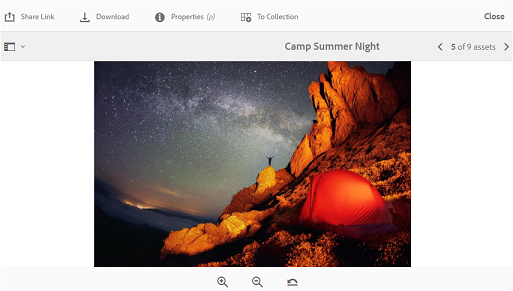

# Browse assets on Brand Portal {#browsing-assets-on-brand-portal}

AEM Assets Brand Portal provides various capabilities and user interface elements that facilitate browsing through resources, traversing asset hierarchies, and searching assets while using different view options.

AEM logo in the AEM toolbar at the top facilitates admin users to access administrative tools panel.

 

Rail selector at the upper left in Brand Portal drops-down to expose options to navigate into asset hierarchies, streamline your search, and display resources.

You can view, navigate through, and select assets using any of the available views (Card, Column, and List) in the view selector at the upper right in Brand Portal.

## 查看和选择资源 {#viewing-and-selecting-resources}

从概念上讲，所有视图中的查看、导航和选择操作都相同，但操作方式根据所使用的视图而略有不同。

您可以使用以下任一可用视图查看、导航和选择资源（以对其执行进一步操作）:

* 列视图
* 卡片视图
* 列表视图

### 卡片视图

卡片视图显示各个项目在当前级别的信息卡片。These cards provide the following details:

* A visual representation of the asset/folder.
* 类型
* 标题
* 名称
* 从AEM将资产发布到Brand Portal的日期和时间
* 大小
* 尺寸

You can navigate down the hierarchy by tapping/clicking cards (taking care to avoid the quick actions) or up again by using the [breadcrumbs in the header](https://helpx.adobe.com/experience-manager/6-5/sites/authoring/using/basic-handling.html#TheHeader).

#### 非管理员用户的卡片视图

文件夹的卡片在卡片视图中向非管理员用户（编辑者、查看者和客人用户）显示文件夹层次结构信息。 此功能可让用户了解文件夹的位置，以及他们访问的与父层次结构相关的文件夹。
文件夹层次结构信息对于区分名称与从不同文件夹层次结构共享的其他文件夹相似的文件夹特别有用。 如果非管理员用户不知道与他们共享的资产的文件夹结构，则名称相似的资产／文件夹似乎会令人混淆。

* 相应卡上显示的路径会被截断以适合卡的大小。 但是，用户在将鼠标悬停在被截断的路径上时，可以将完整路径看作工具提示。

**查看资产属性的概述选项**

“概述”选项对非管理员用户（编辑者、查看者、客人用户）可用，用于查看选定资产／文件夹的资产属性。 “概述”选项可见：

* 在顶部的工具栏中选择资产／文件夹。
* 在下拉框中，选择边栏选择器。

在选择资 [!UICONTROL 产] /文件夹时选择“概述”选项后，用户可以查看资产创建的标题、路径和时间。 但是，在资产详细信息页面上，选择“概述”选项可让用户查看资产的元数据。

#### 在卡片视图中查看设置

[!UICONTROL 在从视图选择器中选择] “查看设置”时， **[!UICONTROL 将打开“查看设置]** ”对话框。 它允许您在卡片视图中调整资产缩略图的大小。 这样，您就可以个性化您的视图并控制显示的缩略图数量。

### 列表视图

列表视图显示当前级别上每个资源的信息。 列表视图提供以下详细信息：

* 资产的缩略图
* 名称
* 标题
* 区域设置
* 类型
* Dimension
* 大小
* 评级
* 显示资产层次结构的文件夹路径*
* 在Brand Portal上发布资产的日期

*路径列可让您轻松识别文件夹层次结构中的资产位置。 You can navigate down the hierarchy by tapping/clicking the resource name, and back up by using the [breadcrumbs in the header](https://helpx.adobe.com/experience-manager/6-5/sites/authoring/using/basic-handling.html#TheHeader).

<!--
Comment Type: draft lastmodifiedby="mgulati" lastmodifieddate="2018-08-17T03:12:05.096-0400" type="annotation">Removed:- "Selecting assets in list view To select all items in the list, use the checkbox at the upper left of the list. When all items in the list are selected, this check box appears checked. To deselect all, click or tap the checkbox. When only some items are selected, it appears with a minus sign. To select all, click or tap the checkbox. To deselect all, click or tap the checkbox again. You can change the order of items using the dotted vertical bar at the far right of each item in the list. Tap/click the vertical selection bar and drag the item to a new position in the list."
 -->

### 在列表视图中查看设置

“列表”视图默 [!UICONTROL 认将资产] “名称”显示为第一列。 此外，还会显示资产 [!UICONTROL Asset]、 [!UICONTROL Locale]、 [!UICONTROL DimensionsTitle]、 DimensionsSize、Type Status、Publish状态等其他信息。 However, you can select the columns to be shown using [!UICONTROL View Settings].

### 列视图

使用列视图可在内容树中浏览一系列级联列。 此视图可帮助您可视化和遍历资产层次结构。

在第一列（最左侧）中选择资源后，将在右侧第二列中显示子资源。 Selecting a resource in the second column displays child resources in the third column to the right, and so on.

通过点按或单击资源名称或资源名称右侧的V形标记，可以在树中上下导航。

* 点按或单击资源名称和V形标记时将高亮显示。
* 点按或单击缩略图可选择资源。
* When selected, a check mark is overlaid on the thumbnail and the resource name is highlighted.
* 所选资源的详细信息显示在最后一列中。

When an asset is selected in column view, visual representation of the asset is displayed in the final column along with the following details:

* 标题
* 名称
* 尺寸
* Date and time when asset was published to Brand Portal from AEM
* 大小
* 类型
* More Details option, to go on the details page of the asset

<!--
Comment Type: draft

<h3>Selecting Resources</h3>
-->

<!--
Comment Type: draft

Selecting a specific resource depends on a combination of the view and the device:

-->

<!--
Comment Type: draft

<table border="1" cellpadding="1" cellspacing="0" width="100%">
<tbody>
<tr>
<td> </td>
<td>Select</td>
<td>Deselect</td>
</tr>
<tr>
<td>Column View  </td>
<td>
<ul>
<li>Desktop:  Mouseover, then use the check mark quick action</li>
<li>Mobile device:  Tap the thumbnail</li>
</ul> </td>
<td>
<ul>
<li>Desktop:  Click the thumbnail</li>
<li>Mobile device:  Tap the thumbnail</li>
</ul> </td>
</tr>
<tr>
<td>Card View  </td>
<td>
<ul>
<li>Desktop:  Mouseover, then use the check mark quick action</li>
<li>Mobile device:  Tap-and-hold the card</li>
</ul> </td>
<td>
<ul>
<li>Desktop:  Click the card</li>
<li>Mobile device:  Tap the card</li>
</ul> </td>
</tr>
<tr>
<td>List View</td>
<td>
<ul>
<li>Desktop:  Mouseover, then use the check mark quick action</li>
<li>Mobile device:  Tap the thumbnail</li>
</ul> </td>
<td>
<ul>
<li>Desktop:  Click the thumbnail</li>
<li>Mobile device:  Tap the thumbnail</li>
</ul> </td>
</tr>
</tbody>
</table>
-->

<!--
Comment Type: draft

<h4>Deselecting All</h4>
-->

<!--
Comment Type: draft

In all cases, as you select items the count of the items selected is displayed at the upper right of the toolbar.

You can deselect all items and exit selection mode by clicking or tapping the X next to the count.

-->

<!--
Comment Type: draft

In all views, all items can be deselected by tapping escape on the keyboard if you are using a desktop device.

-->

## 内容树 {#content-tree}

In addition to these views, use the tree view to drill down the asset hierarchy while you view and select desired assets or folders.

To open the tree view, tap/click the rail selector at upper left and select the Content tree from the menu.****

From the content hierarchy, navigate to the desired asset.

## 资源详细信息 {#asset-details}

Asset detail page lets you view an asset, download, share asset's link, move it to a collection, or view its properties page. It also allows you to navigate through the details page of other assets of the same folder in succession.

To view the asset's metadata, or view its various renditions, use the rail selector on asset detail page.

You can view all the available renditions of the asset on asset details page, and select a rendition to preview it.

To open the asset properties page, use Properties (p) option from the top bar.****

You can also view a list of all its related assets (source or derived assets on AEM) on an asset's properties page, as asset relationship is also published from AEM to Brand Portal.
