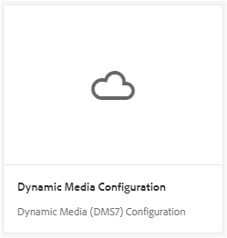

# Brand Portal上的动态视频支持 {#dynamic-video-support-on-brand-portal}

在Brand Portal上通过Dynamic Media支持自适应预览和播放视频。 还可从门户和共享链接下载动态演绎版。
Brand Portal用户可以：

* 在“资产详细信息”页面、“卡片视图”和链接共享预览页面中预览视频。
* 在“资产详细信息”页面上播放视频编码。
* 在资源详细信息页面的“演绎版”选项卡中查看动态演绎版。
* 下载视频编码和包含视频的文件夹。

>[!NOTE]
>
>要使用视频并将其发布到Brand Portal，请确保在Dynamic Media混合模式或Dynamic Media **[!DNL Scene7]**&#x200B;模式下设置了Experience Manager创作实例。

要预览、播放和下载视频，Brand Portal向管理员公开以下两个配置：

* [Dynamic Media混合配置](#configure-dm-hybrid-settings)
如果Experience Manager创作实例以Dynamic Media — 混合模式运行。
* [Dynamic Media [!DNL Scene7] 配置](#configure-dm-scene7-settings)
如果Experience Manager创作实例在Dynamic Media - **[!DNL Scene7]**&#x200B;模式下运行。
根据您在用于复制Brand Portal租户的Experience Manager创作实例中设置的配置，设置这些配置中的任意一个。

>[!NOTE]
>
>配置为在&#x200B;**[!UICONTROL Brand Portal Connect]**&#x200B;运行模式下运行Experience Manager创作的Scene7租户不支持动态视频。

## 如何播放动态视频？ {#how-are-dynamic-videos-played}

如果在Brand Portal上设置了Dynamic Media配置（[混合](../using/dynamic-video-brand-portal.md#configure-dm-hybrid-settings)或[[!DNL Scene7]](../using/dynamic-video-brand-portal.md#configure-dm-scene7-settings)配置），将从&#x200B;**[!DNL Scene7]**&#x200B;服务器中获取动态演绎版。 因此，视频编码被预览和播放，没有延迟和质量失真。

Brand Portal存储库不存储视频编码并从&#x200B;**[!DNL Scene7]**&#x200B;服务器中获取它们。 确保Adobe Experience Manager创作实例和Brand Portal上的Dynamic Media配置相同。

>[!NOTE]
>
>Brand Portal不支持视频查看器和查看器预设。 在Brand Portal中的默认查看器中预览和播放视频。

## 先决条件 {#prerequisites}

要在Brand Portal上处理动态视频，请确保：

* **在Dynamic Media模式下启动Experience Manager作者**

  在[Dynamic Media - [!DNL Scene7] 模式](https://experienceleague.adobe.com/zh-hans/docs/experience-manager-65/content/assets/dynamic/config-dms7#enabling-dynamic-media-in-scene-mode)或[Dynamic Media — 混合模式](https://experienceleague.adobe.com/zh-hans/docs/experience-manager-65/content/assets/dynamic/config-dynamic)中启动Experience Manager创作实例(已配置Brand Portal)，或

* **在Experience Manager创作实例上配置Dynamic MediaCloud Service**

  根据Experience Manager作者正在运行的Dynamic Media模式(Scene7模式或混合模式)，在&#x200B;**Tools**&#x200B;中的Experience Manager作者上设置[Dynamic MediaCloud Service（[!DNL Scene7]模式）](https://experienceleague.adobe.com/zh-hans/docs/experience-manager-65/content/assets/dynamic/config-dms7#configuring-dynamic-media-cloud-services)或[Dynamic MediaCloud Service（混合模式）](https://experienceleague.adobe.com/zh-hans/docs/experience-manager-65/content/assets/dynamic/config-dms7#configuring-dynamic-media-cloud-services) | **Cloud Service** | **Dynamic Media**。

* **在Brand Portal上配置Dynamic Media**

  基于Experience Manager作者的Dynamic Media云配置，从Brand Portal管理工具中配置[Dynamic Media设置](#configure-dm-hybrid-settings)或[[!DNL Scene7] 设置](#configure-dm-scene7-settings)。

  确保将[单独的Brand Portal租户](#separate-tenants)用于在Dynamic Media - **[!UICONTROL Scene7]**&#x200B;模式和Dynamic Media — 混合模式下配置的Experience Manager创作实例。 如果您使用Dynamic Media **[!UICONTROL S7]**&#x200B;和Dynamic Media Hybrid的功能，则此方法尤其重要。

* **将视频编码应用于Brand Portal的Publish文件夹**

  应用[视频编码](https://experienceleague.adobe.com/zh-hans/docs/experience-manager-65/content/assets/dynamic/video-profiles)并将包含富媒体资源的文件夹从Experience Manager创作实例发布到Brand Portal。

* 如果启用了安全预览，则&#x200B;**在SPS中允许列表出口IP**

  如果使用Dynamic Media-**[!DNL Scene7]**（为公司启用了[安全预览](https://experienceleague.adobe.com/zh-hans/docs/dynamic-media-classic/using/upload-publish/testing-assets-making-them-public)），则建议&#x200B;**[!DNL Scene7]**&#x200B;公司管理员[使用SPS (**[!UICONTROL Scene7]** Publishing System) Flash UI允许列表各地区的公共出口IP](https://experienceleague.adobe.com/zh-hans/docs/dynamic-media-classic/using/upload-publish/testing-assets-making-them-public#testing-the-secure-testing-service)。

  出口IP如下所示：

  | **地区** | **出口IP** |
  |--- |--- |
  | NA | 130.248.160.68， 20.94.203.130 |
  | EMEA | 185.34.189.3， 51.132.146.75 |
  | 亚太地区 | 63.140.44.54 |

  若要允许列表这些出口IP中的任何一个，请参阅[准备帐户以进行安全测试服务](https://experienceleague.adobe.com/zh-hans/docs/dynamic-media-classic/using/upload-publish/testing-assets-making-them-public#testing-the-secure-testing-service)。

## 最佳实践

确保成功预览、播放和下载Brand Portal中的动态视频资源（以及共享链接），请遵循以下实践：

### Dynamic Media的单独租户 — Scene7和Dynamic Media — 混合模式 {#separate-tenants}

如果您同时使用Dynamic Media - **[!DNL Scene7]**&#x200B;模式和Dynamic Media — 混合模式功能，请为使用Dynamic Media - **[!DNL Scene7]**&#x200B;和Dynamic Media — 混合模式配置的Experience Manager创作实例使用不同的Brand Portal租户。

### Experience Manager创作实例和Brand Portal中的相同配置详细信息

确保Brand Portal和&#x200B;**[!UICONTROL Experience Manager云配置]**&#x200B;中的配置详细信息相同。 相同的配置详细信息包括：

* **[!UICONTROL 标题]**
* **[!UICONTROL 注册ID]**
* **[!UICONTROL Dynamic Media — 混合模式中的**&#x200B;[!UICONTROL &#x200B;视频服务URL &#x200B;]&#x200B;**]**
* **[!UICONTROL 标题]**
* 凭据（**[!UICONTROL 电子邮件]**&#x200B;和密码）
* **[!UICONTROL 地区]**
* Dynamic Media中的&#x200B;**[!UICONTROL 公司]** - **[!DNL Scene7]**&#x200B;模式

### Dynamic Media Scene7模式的允许列表公共出口IP

如果Dynamic Media **[!UICONTROL Scene7]** — 启用了[安全预览](https://experienceleague.adobe.com/zh-hans/docs/dynamic-media-classic/using/upload-publish/testing-assets-making-them-public) — 用于向Brand Portal提供视频资源，则&#x200B;**[!UICONTROL Scene7]**&#x200B;会为暂存环境或内部应用程序建立专用图像服务器。 对此服务器的任何请求都会检查原始IP地址。 如果传入请求不在批准的IP地址列表中，则会返回失败响应。
因此，**[!UICONTROL Scene7]**&#x200B;公司管理员通过&#x200B;**[!UICONTROL SPS]** (Scene7 Publishing System) Flash UI为其公司的&#x200B;**[!UICONTROL 安全测试]**&#x200B;环境配置已批准的IP地址列表。 确保将您各自区域（来自以下区域）的出口IP添加到该批准列表。
若要允许列表这些出口IP中的任何一个，请参阅[准备帐户以进行安全测试服务](https://experienceleague.adobe.com/zh-hans/docs/dynamic-media-classic/using/upload-publish/testing-assets-making-them-public#testing-the-secure-testing-service)。
出口IP如下所示：

| **地区** | **出口IP** |
|--- |--- |
| NA | 130.248.160.68， 20.94.203.130 |
| EMEA | 51.132.146.75， 130.248.244.202， 130.248.244.203， 130.248.244.204， 130.248.244.210， 130.248.244.211， 130.248.244 12 |
| 亚太地区 | 63.140.44.54 |

## 配置Dynamic Media（混合）设置 {#configure-dm-hybrid-settings}

如果Experience Manager创作实例在Dynamic Media混合模式下运行，则使用“管理工具”面板中的&#x200B;**[!UICONTROL 视频]**&#x200B;拼贴来配置Dynamic Media网关设置。

>[!NOTE]
>
>[视频编码配置文件](https://experienceleague.adobe.com/zh-hans/docs/experience-manager-65/content/assets/dynamic/video-profiles)未发布到Brand Portal。 而是从&#x200B;**[!UICONTROL Scene7]**&#x200B;服务器获取它们。 因此，对于要在Brand Portal中成功播放的视频编码，请确保配置详细信息与Experience Manager创作实例中的[Dynamic MediaCloud Service（[!DNL Scene7]模式）](https://experienceleague.adobe.com/zh-hans/docs/experience-manager-65/content/assets/dynamic/config-dms7#configuring-dynamic-media-cloud-services)相同。

要在Brand Portal租户上设置Dynamic Media配置，请执行以下操作：

1. 选择Experience Manager徽标，以便您可以从Brand Portal顶部的工具栏访问管理工具。
1. 从“管理工具”面板中，选择&#x200B;**[!UICONTROL 视频]**&#x200B;拼贴。

   Brand Portal上的

   **[!UICONTROL 编辑Dynamic Media配置]**&#x200B;页面打开。

   Brand Portal上的

1. 指定&#x200B;**[!UICONTROL 注册ID]**&#x200B;和&#x200B;**[!UICONTROL 视频服务URL]** （DM网关URL）。 请确保这些详细信息与Experience Manager创作实例中&#x200B;**[!UICONTROL Cloud Service>工具]**&#x200B;中的详细信息相同。
1. 选择&#x200B;**保存**&#x200B;以保存配置。

## 配置Dynamic Media Scene7设置 {#configure-dm-scene7-settings}

如果Experience Manager创作实例在Dynamic Media- **[!UICONTROL Scene7]**&#x200B;模式下运行，则使用“管理工具”面板中的“**[!UICONTROL Dynamic Media配置]**”拼贴来配置&#x200B;**[!UICONTROL Scene7]**&#x200B;服务器设置。

要在Dynamic Media租户上设置Brand Portal **[!UICONTROL Scene7]**&#x200B;配置，请执行以下操作：

1. 选择Experience Manager徽标，以便您可以从Brand Portal顶部的工具栏访问管理工具。

2. 从“管理工具”面板中，选择&#x200B;**[!UICONTROL Dynamic Media配置]**&#x200B;拼贴。

   Brand Portal上的DM [!UICONTROL Scene 7]配置

   **[!UICONTROL 编辑Dynamic Media配置]**&#x200B;页面打开。

   Brand Portal上的

3. 提供：

   * **[!UICONTROL 标题]**
   * 用于访问Scene7服务器的凭据（**[!UICONTROL 电子邮件ID]**&#x200B;和&#x200B;**[!UICONTROL 密码]**）
   * **[!UICONTROL 地区]**

   确保这些值与在Experience Manager创作实例中找到的值相同。

4. 选择&#x200B;**[!UICONTROL 连接到Dynamic Media]**。

5. 提供&#x200B;**[!UICONTROL 公司名称]**，**[!UICONTROL 保存]**&#x200B;配置。
