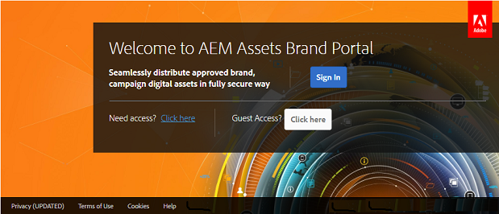

# 客人访问Brand Portal {#guest-access-to-brand-portal}

AEM品牌门户允许客人访问门户。客人用户不需要凭据进入门户，并且有权访问门户的公共资源(和集合)。客人会话中的用户可以将资产添加到其Lightbox(私有集合)，并下载相同的内容，直到会话持续时间，除非客人用户选择 [[！UICCONTROL最终会话]](#exit-guest-session)。

客人访问功能使组织能够 [快速与目标受众共享获准的资产](../using/brand-portal-sharing-folders.md#how-to-share-folders) ，而不必覆盖它们。Brand Portal6.4.2提供了多个并发客人用户的服务，为每个组织的用户总配额的10%。允许客人访问节省了对需要在Brand Portal上使用有限功能的用户的管理和展示的时间。\
组织可以使用管理工具面板中的访问设置中 **[!UICONTROL 的“允许客人访问权限]** ”选项，启用( **[!UICONTROL 或]** 禁用)单位的品牌门户帐户。

<!--
Comment Type: annotation
Last Modified By: mgulati
Last Modified Date: 2018-08-17T10:42:59.879-0400
Removed the first para: "AEM Assets Brand Portal allows public users to enter the portal anonymously and have restricted access to the allowed public resources as guests. Organization users with guest role need not seek access and authentication from administrators."
-->

## 开始客人会话 {#begin-guest-session}

要匿名进入Brand Portal，请选择 **[!UICONTROL 与客人访问]** 对应的单击 **[!UICONTROL 此处。]** 欢迎使用Brand Portal欢迎屏幕。用户无需寻求访问权限，并等待管理员对其进行身份验证以授予访问使用Brand Portal的权限。

## 客人会话持续时间 {#guest-session-duration}

客人用户会话在小时内保持活动状态。这意味着 [!UICONTROL Lightbox] 的状态会被保留，直到从会话开始时间开始小时，且在两小时后恢复当前客人会话，因此Lightbox状态丢失。\
例如，客人用户在1500小时内登录Brand Portal，并将资源添加到Lightbox以在16：50小时下载。如果用户在17：00小时之前未下载 [!UICONTROL Lightbox] 集合(或其资源)， [!UICONTROL Lightbox] 将变为空，因为用户必须在小时结束时重新启动会话(该会话为1700小时)。

## 允许的并发客人会话 {#concurrent-guest-sessions-allowed}

并发客人会话的数量仅限于每个组织的用户配额的10%。这意味着对于用户配额为200的组织，最多可同时工作20位客人。第21位用户被拒绝访问，并且只有在20位主动客人用户中任一用户的会话结束时，才能作为客人访问。

## 客人与Brand Portal的用户交互 {#guest-user-interaction-with-brand-portal}

### 客人UI导航

以客人身份进入Brand [Portal后，用户可以看到公开共享](../using/brand-portal-sharing-folders.md#sharefolders) 或与客人用户共享的所有资产和文件夹。此视图仅为内容视图，它在卡片、列表或列布局中显示资产。

但是，如果管理员启用 [了“启用文件夹层次结构”配置，客人用户可以看到文件夹树(从根文件夹开始)以及其各自的父文件夹中排列的共享文件夹(如果管理员启用了“启用文件夹层次结构](../using/brand-portal-general-configuration.md#main-pars-header-1621071021) ”配置)。

这些父文件夹是虚拟文件夹，不可对这些文件夹执行任何操作。您可以使用锁定图标识别这些虚拟文件夹。

与共享文件夹不同，在 [!UICONTROL “卡片视图]”中悬停或选择操作任务时不会看到任何操作任务。[!UICONTROL 在][!UICONTROL 列视图] 和 [!UICONTROL 列表视图中选择虚拟文件夹时，会显示概述按钮]。

>[!NOTE]
>
>请注意，虚拟文件夹的默认缩略图是第一个共享文件夹的缩略图图象。

   

[!UICONTROL “查看设置] ”选项允许客人用户调整 [!UICONTROL 卡片视图] 中的卡大小或列视图 中的列。

[!UICONTROL 通过内容树] ，您可以在资产层次结构中移动。

Brand Portal为客人用户提供 [!UICONTROL 概述] 选项以查看 [!UICONTROL 选定资产/文件夹的资产属性] 。[!UICONTROL 概述] 选项可见：

* 选择资产/文件夹时顶部的工具栏中。
* 在选择边栏选择器时，请进入下拉菜单。

在选择资产/文件夹时选择 [!UICONTROL “概述] ”选项，用户可以查看资产创建的标题、路径和时间。但是，在资产详细信息页面上选择 [!UICONTROL 概述] 选项后，用户可以看到资产的元数据。

**[!UICONTROL 左侧边栏中的导航]** 选项允许从文件导航到集合并返回到客人会话中，以便用户可以浏览文件或集合中的资产。

**[!UICONTROL “过滤器]** ”选项允许客人用户使用管理员设置的搜索谓词过滤资产文件和文件夹。

### 客人用户功能

客人用户可以访问Brand Portal上的公共资源，还有一些限制，如进一步讨论。

客人用户可以：

* 访问所有Brand Portal用户的所有公共文件夹和集合。
* 浏览成员、详细信息页面，并具有所有公共文件夹和集合成员的完整资产视图。
* 跨公共文件夹和集合搜索资源。
* 将资产添加到Lightbox集合。在会话期间，集合的这些更改仍保持不变。
* 直接下载资源或通过Lightbox集合下载。

客人用户无法：

* 创建集合和保存的搜索，或进一步共享它们。
* 访问文件夹和集合设置。
* 以链接形式共享资产。

### 下载客人会话中的资源

客人用户可以直接下载与品牌门户上的客人用户共享或独家共享的资产。客人用户还可以将资源添加到 [!UICONTROL Lightbox] (公共集合)，并在其会话过期之前下载 [!UICONTROL Lightbox] 集合。

要下载资产和集合，请使用以下下载图标：

* 快速操作缩略图，将鼠标悬停在资产或集合上时出现
* 顶部的工具栏，在选择资产或集合时显示

选择 **[!UICONTROL “下载]** 时 [!UICONTROL 启用下载] 加速”可 [增强下载性能](../using/accelerated-download.md)。

## 退出客人会话 {#exit-guest-session}

要退出客人会话，请使用标题中可用的选项的 **[!UICONTROL 结束会话]** 。但是，如果来宾会话的浏览器选项卡使用了非活动选项卡，则会话在不活动的两小时后会自动过期。

## 监控客人的用户活动 {#monitoring-guest-user-activities}

管理员可以监视客人与Brand Portal的用户交互。在Brand Portal中生成的报告可以提供对客人用户活动的重要洞察。例如 **[!UICONTROL ，下载]** 报告可用于跟踪客人用户下载的资产计数。**[!UICONTROL 用户登录]** 报告可通知客人用户上次登录到指定持续时间内的门户和登录频率。
