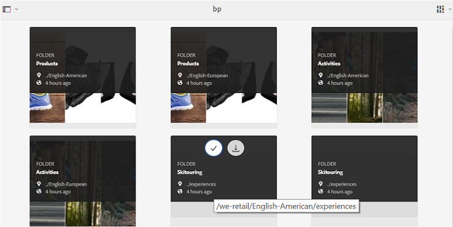

# 来宾访问 Brand Portal {#guest-access-to-brand-portal}

AEM Brand Portal允许客人访问门户。 客人用户无需凭据即可进入门户，并有权访问门户的公共资产（和集合）。 来宾会话中的用户可以将资产添加到其lightbox（专用集合）并下载资产，直到其会话持续。此会话自会话开始算起2小时，除非来宾用户选择[[!UICONTROL 结束会话]](#exit-guest-session)。

客人访问功能使组织能够[快速地与预期受众共享获准资产](../using/brand-portal-sharing-folders.md#how-to-share-folders)，而无需加入这些资产。 从Brand Portal 6.4.2开始，可为多个并发来宾用户提供服务，这是每个组织的用户配额总数的10%。 允许客人访问可节省管理和安装大量需要在Brand Portal上使用有限功能的用户的时间。\
组织可以使用管理工具面板中的&#x200B;**[!UICONTROL 访问]**&#x200B;设置中的&#x200B;**[!UICONTROL 允许客人访问]**&#x200B;选项，启用（或禁用）单位的Brand Portal帐户的客人访问。

<!--
Comment Type: annotation
Last Modified By: mgulati
Last Modified Date: 2018-08-17T10:42:59.879-0400
Removed the first para: "AEM Assets Brand Portal allows public users to enter the portal anonymously and have restricted access to the allowed public resources as guests. Organization users with guest role need not seek access and authentication from administrators."
-->

## 开始来宾会话{#begin-guest-session}

要匿名进入Brand Portal，请选择&#x200B;**[!UICONTROL 单击此处]**，此处与&#x200B;**[!UICONTROL 客人访问？]** 在Brand Portal欢迎屏幕上。输入catcha安全检查以授予使用Brand Portal的访问权限。

## 来宾会话持续时间{#guest-session-duration}

来宾用户会话保持活动状态15分钟。
这意味着从会话开始时间起，**[!UICONTROL Lightbox]**&#x200B;的状态将保留15分钟，之后当前来宾会话重新启动，因此Lightbox状态将丢失。

例如，客人用户在15时登录Brand Portal，将资产添加到&#x200B;**[!UICONTROL Lightbox]**,15时05分下载。 如果用户在15:15小时（登录后15分钟内）之前未下载&#x200B;**[!UICONTROL Lightbox]**&#x200B;集合（或其资产），则用户必须重新启动会话。 **[!UICONTROL Lightbox]**&#x200B;将为空，这意味着如果会话丢失，上传的资产将不再可用。

## 允许并发来宾会话{#concurrent-guest-sessions-allowed}

并发来宾会话数限制为每个组织用户配额总数的10%。 这意味着对于用户配额为200的组织，最多可以同时使用20个来宾用户。 第21个用户被拒绝访问，并且仅当20个活动来宾用户中的任意一个的会话结束时，才能以客人身份访问。

## 客人与Brand Portal的交互{#guest-user-interaction-with-brand-portal}

### 来宾UI导航

以客人身份进入Brand Portal时，用户可以公开查看共享的[所有](../using/brand-portal-sharing-folders.md#sharefolders)资产和文件夹，也可以只与客人用户共享。 此视图是仅限内容的视图，它在卡、列表或列布局中显示资产。

但是，如果管理员已启用[启用文件夹层次结构](../using/brand-portal-general-configuration.md#main-pars-header-1621071021)配置，则来宾用户在登录到Brand Portal时会看到文件夹树（从根文件夹开始）和在各自父文件夹内排列的共享文件夹。

这些父文件夹是虚拟文件夹，不能对其执行任何操作。 您可以通过锁定图标识别这些虚拟文件夹。

与共享文件夹不同，在将鼠标悬停在&#x200B;**[!UICONTROL 卡片视图]**&#x200B;中选择操作任务时，不会显示任何操作。 **[!UICONTROL 在]** 列视图和列表视图中选择虚拟文件 **[!UICONTROL 夹]** 时，将显 **[!UICONTROL 示“概述”按钮]**。

>[!NOTE]
>
>虚拟文件夹的默认缩略图是第一个共享文件夹的缩略图。

   

**[!UICONTROL 视图]** 设置选项允许客人用户调整卡片视图中的卡 **[!UICONTROL 大]** 小，以列表视图显 **[!UICONTROL 示卡片]**。

使用&#x200B;**[!UICONTROL 内容树]**&#x200B;可以在资产层次结构中移动。

Brand Portal为客人用户提供&#x200B;**[!UICONTROL 概述]**&#x200B;选项，以视图选定资产／文件夹的&#x200B;**[!UICONTROL 资产属性]**。 **[!UICONTROL 概述]**&#x200B;选项可见：

* 在顶部的工具栏中，选择资产／文件夹。
* 在下拉菜单中，选择边栏选择器。
在选择资产／文件夹时选择**[!UICONTROL 概述]**&#x200B;选项，用户可以查看资产创建的标题、路径和时间。 但是，在资产详细信息页面上，选择&#x200B;**[!UICONTROL 概述]**&#x200B;选项可让用户查看资产的元数据。

 

**[!UICONTROL 通]** 过左边栏中的导航选项，可在来宾会话中从文件导航到集合，然后返回，以便用户浏览文件或集合中的资产。

**[!UICONTROL 筛选]** 允许客人用户使用管理员设置的搜索谓词筛选资产文件和文件夹。

### 客人用户功能

客人用户可以在Brand Portal上访问公共资产，并且如进一步讨论的那样，限制很少。

**客人用户可以**:

* 访问适用于所有Brand Portal用户的所有公共文件夹和集合。
* 浏览成员、详细信息页面，并拥有所有公共文件夹和集合成员的完整资产视图。
* 在公共文件夹和收藏集中搜索资产。
* 将资产添加到Lightbox收藏集。 对集合的这些更改会在会话期间持续存在。
* 直接或通过Lightbox收集下载资产。

**客人用户不能**:

* 创建集合和保存的搜索，或进一步共享它们。
* 访问文件夹和收藏集设置。
* 将资产共享为链接。

### 在客人会话中下载资源

客人用户可以直接在Brand Portal上下载公共或专供客人用户共享的资源。 客人用户还可以将资产添加到&#x200B;**[!UICONTROL Lightbox]**（公共集合），并在会话过期前下载&#x200B;**[!UICONTROL Lightbox]**&#x200B;集合。

要下载资产和集合，请使用下载图标：

* 快速操作缩略图，将指针悬停在资产或集合上方时显示
* 顶部的工具栏，在选择资产或收藏集时显示该工具栏

选择&#x200B;**[!UICONTROL 在[!UICONTROL 下载]对话框上启用下载加速]**&#x200B;可让您[增强下载性能](../using/accelerated-download.md)。

## 退出来宾会话{#exit-guest-session}

要退出来宾会话，请从标题中的可用选项中使用&#x200B;**[!UICONTROL 结束会话]**。 但是，如果用于来宾会话的浏览器选项卡处于非活动状态，则会话在两小时不活动后自动过期。

## 监视来宾用户活动{#monitoring-guest-user-activities}

管理员可以监视来宾用户与Brand Portal的交互。 在Brand Portal中生成的报告可以提供对客人用户活动的重要洞察。 例如，**[!UICONTROL 下载]**&#x200B;报告可用于跟踪来宾用户下载的资产计数。 **[!UICONTROL 用户]** 登录报告可以通知来宾用户上次登录门户的时间以及指定持续时间内的登录频率。
