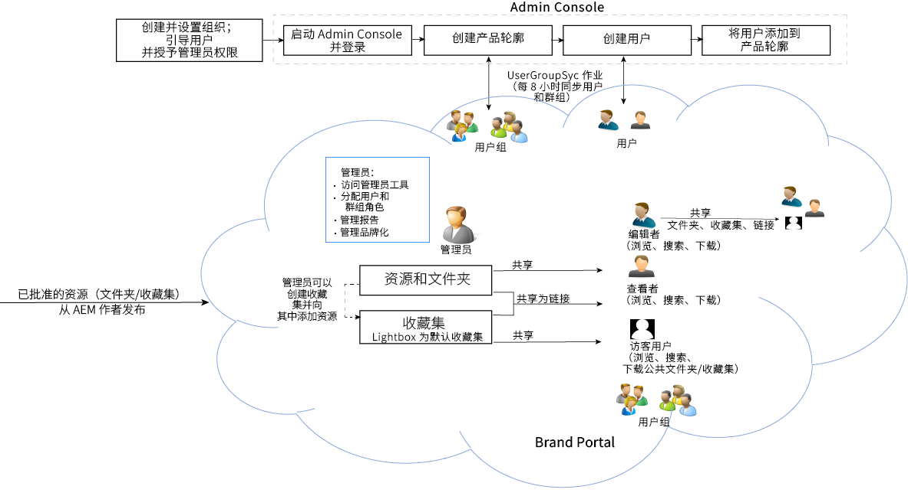

# 简介

Brand Portal通过安全地将已批准的品牌和产品资产分发给外部代理商、合作伙伴、内部团队和分销商以供下载，帮助他们满足他们的营销需求。

缺乏安全共享解决方案可能导致：

* 通过电子邮件或云手动共享资源
* 品牌合规性问题
* 缺乏对资产使用情况的控制
* 营销活动和产品启动延迟
* 复制跨地理位置和组织的内容
* 释放之前不安全地存储资源

借助Brand Portal，组织可以通过使营销人员与渠道合作伙伴和内部业务用户协作来快速创建、管理和交付最新的设计指南、徽标、营销活动和产品资产，从而确保品牌合规性。
Brand Portal是基于云的SAAS产品。它可作为Adobe Experience Manager Assets产品(内部部署或托管服务)的加载项提供。

Brand Portal解决方案工作流程如下图所示。

## Adobe Experience Manager品牌门户用户指南

此用户指南将文档洞察用于Brand Portal产品和主要工作流程。使用左边栏导航各种功能，向下展开以了解不同角色如何与门户互动。

### 另请参阅

| 用户指南 | 描述 |
|--- |---|
| [新增功能](whats-new.md) | 通过先前版本在Brand Portal中更改和最新的产品。 |
| [发行说明](brand-portal-release-notes.md) | 增强、已修复的关键问题以及当前版本中的已知问题。 |
| [配置AEM Assets与Brand Portal的集成](https://helpx.adobe.com/experience-manager/6-5/assets/using/brand-portal-configuring-integration.html) | 如何使用AEM资产复制Brand Portal以发布资产。 |
| [解决并行出版中的问题](troubleshoot-parallel-publishing.md) | 对Brand Portal和AEM资产之间的复制进行故障诊断。 |
| [支持的文件格式](brand-portal-supported-formats.md) | Brand Portal中支持的文件格式以供预览和下载。 |
| [将资产发布到Brand Portal](../TOC.md#publish) | 如何将文件夹、集合、链接、预设、架构、彩块化和标记发布到Brand Portal。 |

### 有用的资源

* [了解AEM资产的品牌门户](https://helpx.adobe.com/experience-manager/kt/assets/using/brand-portal-article-understand.html)
