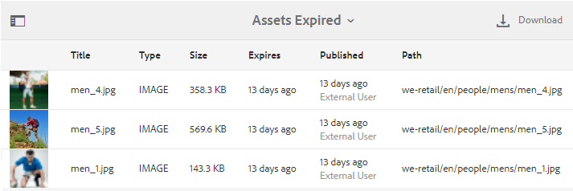

# 管理资产的数字权限 {#manage-digital-rights-of-assets}

确保创意资产和品牌资料的安全分发和使用对于保护您的品牌至关重要。 通过将到期日（和时间）与从AEM发布到Brand Portal的已批准资产相关联，或通过授权许可这些资产以便有条件地使用，可以在组织内外强制实施。 此外，Brand Portal还允许您为从Brand Portal共享的资产链接指定到期日期。

阅读以了解资产在品牌门户上的安全性，并了解相关的使用权限。

## 资产过期 {#asset-expiration}

资产过期是控制组织内品牌门户上已批准资产的使用的有效方式。 从AEM Assets发布到Brand Portal的所有资产都可以具有到期日期，这会限制不同用户角色对这些资产的使用。

### 与过期资产{#usage-permissions-expired-assets}相关的使用权限

在Brand Portal中，管理员可以视图、下载过期的资产并将其添加到收藏集。 而编辑器和查看器只能将过期的资产视图并添加到收藏集。

管理员可以将过期的资产从AEM Assets发布到Brand Portal。 但是，无法通过Brand Portal中的链接共享过期的资产。 如果您从同时包含已过期和未过期资产的文件夹中选择任何已过期资产，则&#x200B;**[!UICONTROL 共享链接]**&#x200B;操作将不可用。 但是，如果您选择的文件夹包含已过期和未过期的资产，则[!UICONTROL 共享]和&#x200B;**[!UICONTROL 共享链接]**&#x200B;操作将可用。

>[!NOTE]
>
>即使文件夹包含过期的资产，也仍可以共享为链接。 在这种情况下，链接不会列表到期的资产，只会共享未到期的资产。

下表显示过期资产的使用权限：

|  | **[!UICONTROL 链接共享]** | **[!UICONTROL 下载]** | **[!UICONTROL 属性]** | **[!UICONTROL 添加到收藏集]** | **[!UICONTROL 删除]** |
|---|---|---|---|---|---|
| **[!UICONTROL 管理员]** | 不可用 | 可用 | 可用 | 可用 | 可用 |
| **[!UICONTROL 编辑者]** | 不可用 | 不可用 | 可用 | 可用 | 不可用 |
| **[!UICONTROL 查看者]** | 不可用 | 不可用 | 可用 | 可用 | 不可用 |
| **[!UICONTROL 客人用户]** | 不可用 | 不可用 | 可用 | 可用 | 不可用 |

>[!NOTE]
>
>如果查看器和编辑器下载的文件夹包含已过期和未过期的资产，则仅下载未过期的资产。 如果文件夹仅包含过期的资产，则会下载一个空文件夹。

### 资产{#expiration-status-of-assets}的过期状态

您可以在资产的&#x200B;**[!UICONTROL 卡片视图]**&#x200B;中视图资产的过期状态。 卡上的红旗表示资产已过期。

>[!NOTE]
>
>列表和列视图不会显示资产的过期状态。

## 资产链接过期{#asset-link-expiration}

在通过链接共享资产时，管理员和编辑人员可以使用&#x200B;**[!UICONTROL 链接共享]**&#x200B;对话框中的&#x200B;**[!UICONTROL Expiration]**&#x200B;字段设置过期日期和时间。 链接的默认过期时间为共享链接之日起七天。

它可确保作为链接共享的资产在Brand Portal管理员和编辑人员设置的日期和时间过期，并且在过期日期后将无法再查看和下载。 由于通过链接共享的资产也可以由非组织成员的外部用户查看，通过指定过期时间，您可以确保已批准的资产受到保护并且不会在指定时间后暴露给未知实体。

有关链接共享的详细信息，请参阅[将资产共享为链接](../using/brand-portal-link-share.md)。

## 授权资产{#licensed-assets}

从Brand Portal下载许可资产前，必须接受许可协议。 本协议适用于从Brand Portal直接下载资产或通过共享链接下载的授权资产。 无论是否已过期，所有用户都可以查看受许可证保护的资产。 但是，过期的许可资产的下载和使用受到限制。 要了解过期的许可资产的行为以及基于用户角色的允许活动，请参阅过期资产的[使用权限](../using/manage-digital-rights-of-assets.md#usage-permissions-expired-assets)。

受许可证保护的资产附加了[许可协议](https://helpx.adobe.com/experience-manager/6-5/assets/using/drm.html#DigitalRightsManagementinAssets)，可通过在AEM Assets中设置资产的[元数据属性](https://helpx.adobe.com/experience-manager/6-5/assets/using/drm.html#DigitalRightsManagementinAssets)来完成此操作。

如果您选择下载受许可证保护的资产，您将被重定向到&#x200B;**[!UICONTROL 版权管理]**&#x200B;页面。

您需要在此选择要下载的资产并接受关联的许可协议。 如果您不接受该许可协议，则&#x200B;**[!UICONTROL 下载]**&#x200B;按钮将不启用。

如果所选内容包含多个受保护的资产，则一次选择一个资产，接受许可协议，然后继续下载该资产。

## 生成有关过期资产{#generate-report-about-expired-assets}的报告

管理员可以生成并下载一个报告，其中列出了在特定时间范围内过期的所有资产。 此报表包括有关过期资产的详细信息，如大小、类型、在资产层次结构中指定资产位置的路径、资产的过期时间以及资产的发布时间。 可自定义此报表的列，以根据用户要求显示更多数据。

有关报告功能的详细信息，请参阅[使用报告](../using/brand-portal-reports.md#work-with-reports)。
