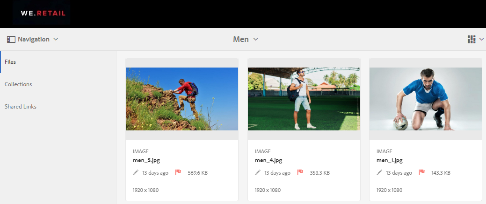

# 管理资产的数字权限 {#manage-digital-rights-of-assets}

确保安全分发和使用创意资源和品牌材料对于保护您的品牌至关重要。可以通过将过期日期(和时间)关联到从AEM发布到Brand Portal的批准资产，或通过授权这些资产以备条件使用，来在组织内外执行此操作。此外，Brand Portal允许您指定一个过期日期，以链接到从Brand Portal共享的资产。

阅读以了解如何在Brand Portal上保护资产并了解关联的使用权限。

## 资产过期 {#asset-expiration}

资产到期是控制整个组织中品牌门户在品牌门户中使用的有效方式。从AEM资产发布到Brand Portal的所有资产都可以有到期日，该日期限制了不同用户角色对这些资产的使用。

### 与过期资产相关的使用权限 {#usage-permissions-expired-assets}

在Brand Portal中，管理员可以查看、下载和添加过期的资产到集合。但是，编辑和查看者只能查看已过期的资产并将其添加到集合。

管理员可以将过期的资产从AEM资产发布到Brand Portal。但是，无法通过Brand Portal中的油墨共享过期的资产。如果您从包含过期和未过期资产的文件夹中选择任何过期的资产， **[!UICONTROL 则“共享链接]** ”动作不可用。但是，如果您选择一个包含过期和未过期资产的文件夹，则可以使用 [!UICONTROL “共享] ”和 **[!UICONTROL “共享链接]** ”动作。

>[!NOTE]
>
>文件夹仍可共享为链接，即使它包含过期的资产也是如此。在这种情况下，链接不会列出过期的资产，只会共享未过期的资产。

下表显示了过期资产的使用权限：

|  | **[!UICONTROL 链接共享]** | **[!UICONTROL 下载]** | **[!UICONTROL 属性]** | **[!UICONTROL 添加到集合]** | **[!UICONTROL 删除]** |
|---|---|---|---|---|---|
| **[!UICONTROL 管理员]** | 不可用 | 可用 | 可用 | 可用 | 可用 |
| **[!UICONTROL 编辑者]** | 不可用 | 不可用 | 可用 | 可用 | 不可用 |
| **[!UICONTROL 查看器]** | 不可用 | 不可用 | 可用 | 可用 | 不可用 |
| **[!UICONTROL 客人用户]** | 不可用 | 不可用 | 可用 | 可用 | 不可用 |

>[!NOTE]
>
>如果查看器和编辑人员下载包含过期和未过期资产的文件夹，则仅下载未过期的资产。如果文件夹仅包含过期的资产，则下载空文件夹。

### 资产的过期状态 {#expiration-status-of-assets}

您可以在 [!UICONTROL 卡片视图中查看资产的过期状态]。卡上的红色旗标表示资产已过期。

>[!NOTE]
>
>列表和列视图不显示资产的过期状态。

## 资产链接过期 {#asset-link-expiration}

在通过链接共享资产时，管理员和编辑人员可以使用“链接共享”对话框中的 **[!UICONTROL “过期]** ”字段设置 **[!UICONTROL 过期日期]** 和时间。链接的默认到期时间为共享链接之日起七天。

它可确保链接在Brand Portal管理员和编辑器设置的日期和时间过期，并且不能再在到期日之外查看和下载。由于通过链接共享的资产还可以由不属于组织成员的外部用户查看，因此，通过指定过期情况，您可以确保已批准的资产受到保护，而不会在指定时间向未知实体公开。

有关链接共享的详细信息，请参阅将资产 [共享为链接](../using/brand-portal-link-share.md)。

## 许可资产 {#licensed-assets}

许可资源在从Brand Portal下载之前接受许可协议的接受。当您直接从Brand Portal下载资产或通过共享链接下载资源时，此协议将会出现。无论过期还是未过期，所有用户均可查看受许可保护的资产。但是，已过期许可资产的下载和使用受到限制。要了解已过期的许可资产和基于用户角色的允许活动的行为，请参阅过期资产 [的使用权限](../using/manage-digital-rights-of-assets.md#usage-permissions-expired-assets)。

受许可保护的资产已 [附加](https://helpx.adobe.com/experience-manager/6-5/assets/using/drm.html#DigitalRightsManagementinAssets) 许可协议，通过在AEM资产中设置资产 [的元数据属性](https://helpx.adobe.com/experience-manager/6-5/assets/using/drm.html#DigitalRightsManagementinAssets) 来完成此操作。

如果您选择下载受许可保护的资产，则您将被重定向到 [!UICONTROL “版权管理] ”页面。

在此，您需要选择资产以下载并接受关联的许可协议。如果您不接受许可协议，则不会启用 [!UICONTROL “下载] ”按钮。

如果选择包含多个受保护的资产，请一次选择一个资产，接受许可协议，然后继续下载该资产。

## 生成有关过期资产的报告 {#generate-report-about-expired-assets}

管理员可以生成并下载一个报告，其中列出了特定时间段内已过期的所有资产。此报告包括详细信息—如大小、类型、指定资产层次结构中资产位置的路径、资产过期时以及发布的资产(关于已过期的资产)。可以自定义此报告的列，以根据用户要求显示更多数据。

有关报告功能的详细信息，请参阅 [使用报告](../using/brand-portal-reports.md#work-with-reports)。
