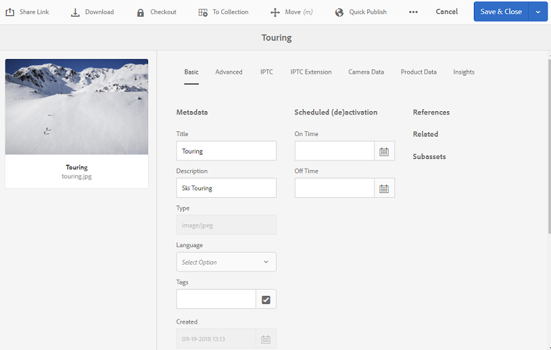

# Brand Portal的Publish预设、架构和Facet {#publish-presets-schema-and-facets-to-brand-portal}

本文深入探讨了如何从AEM创作实例将图像预设、元数据架构和自定义搜索彩块化发布到Brand Portal。 发布功能允许组织重复使用在AEM Author实例上创建或编辑的图像预设、元数据架构和搜索Facet。 此方法可减少重复工作。

>[!NOTE]
>
>从AEM 6.2 SP1-CFP7和AEM 6.3 SP 1-CFP 1 (6.3.1.1)开始，提供了将图像预设、元数据架构和搜索Facet从AEM创作实例发布到Brand Portal的功能。

## Publish图像预设到Brand Portal {#publish-image-presets-to-brand-portal}

图像预设是在图像投放时应用于图像的一组大小调整和格式命令。 可在Brand Portal中创建和修改图像预设。 或者，如果AEM Author实例在Dynamic Media模式下运行，则用户可以在AEM Author中创建预设，并将它们发布到AEM Assets Brand Portal。 此方法可避免在Brand Portal中重新创建相同的预设。
创建预设后，该预设将作为动态演绎版列在资源详细信息演绎版边栏和下载对话框中。

>[!NOTE]
>
>如果AEM创作实例未在&#x200B;**[!UICONTROL Dynamic Media模式]**&#x200B;下运行(客户未购买Dynamic Media)，则在上传时不会创建资源的&#x200B;**[!UICONTROL 金字塔TIFF]**&#x200B;演绎版。 图像预设或动态演绎版适用于资源的&#x200B;**[!UICONTROL 金字塔TIFF]**。 因此，如果&#x200B;**[!UICONTROL 金字塔TIFF]**&#x200B;在AEM Author实例上不可用，则它在Brand Portal上不可用。 因此，资产详细信息页面和下载对话框的演绎版边栏中不存在动态演绎版。

要将图像预设发布到Brand Portal，请执行以下操作：

1. 在AEM Author实例中，单击AEM徽标以访问全局导航控制台，然后单击“工具”图标并导航到&#x200B;**[!UICONTROL Assets >图像预设]**。
1. 从图像预设列表中选择一个或多个图像预设，然后单击&#x200B;**[!UICONTROL Publish到Brand Portal]**。

>[!NOTE]
>
>当用户单击&#x200B;**[!UICONTROL Publish到Brand Portal]**&#x200B;时，图像预设将排队等待发布。 建议用户监视复制代理的日志，以确认发布是否成功。

要从Brand Portal取消发布图像预设，请执行以下操作：

1. 在AEM Author实例中，单击AEM徽标以访问全局导航控制台，然后单击&#x200B;**[!UICONTROL 工具]**&#x200B;图标并导航到&#x200B;**[!UICONTROL Assets >图像预设]**。
1. 选择图像预设，然后从顶部可用的选项中选择&#x200B;**[!UICONTROL 从Brand Portal中删除]**。

## Publish元数据架构到Brand Portal {#publish-metadata-schema-to-brand-portal}

元数据架构描述资产/收藏集的属性页面上显示的布局和属性。

 

如果用户在AEM创作实例上编辑了默认架构，并且希望使用与Brand Portal上的默认架构相同的架构，则将元数据架构表单发布到Brand Portal。 在此类场景中，从AEM创作实例发布的默认架构会覆盖Brand Portal上的默认架构。

如果用户在AEM创作实例中创建了自定义架构，则他们可以将自定义架构发布到Brand Portal，而不是在那里重新创建相同的自定义架构。 然后，用户可以将此自定义架构应用于Brand Portal中的任何文件夹/收藏集。

>[!NOTE]
>
>如果默认架构在AEM实例中被锁定，则无法将其发布到Brand Portal。 也就是说，它们不进行编辑。

>[!NOTE]
>
>如果文件夹在AEM Author实例上应用了架构，则Brand Portal上也必须存在相同的架构。 这样做有助于维护AEM Author和Brand Portal上资源属性页面的一致性。

要将元数据架构从AEM创作实例发布到Brand Portal，请执行以下操作：

1. 在AEM Author实例中，单击AEM徽标以访问全局导航控制台，然后单击“工具”图标并导航到&#x200B;**[!UICONTROL Assets >元数据架构]**。
1. 选择元数据架构，然后从顶部可用的选项中选择&#x200B;**[!UICONTROL Publish到Brand Portal]**。

>[!NOTE]
>
>当用户单击&#x200B;**[!UICONTROL Publish到Brand Portal]**&#x200B;时，元数据架构将排队等待发布。 建议用户监视复制代理的日志，以确认发布是否成功。

要从Brand Portal中取消发布元数据架构，请执行以下操作：

1. 在AEM Author实例中，单击AEM徽标以访问全局导航控制台，然后单击“工具”图标并导航到&#x200B;**[!UICONTROL Assets >元数据架构]**。
1. 选择一个元数据架构，然后从顶部可用的选项中选择&#x200B;**[!UICONTROL 从Brand Portal中删除]**。

## Publish搜索Facet到Brand Portal {#publish-search-facets-to-brand-portal}

搜索表单为Brand Portal上的用户提供[面向搜索](../using/brand-portal-search-facets.md)的功能。 搜索Facet可为Brand Portal上的搜索提供更高的粒度。 在搜索表单中添加的所有[谓词](https://experienceleague.adobe.com/en/docs/experience-manager-65/content/assets/administer/search-facets)都可用作搜索筛选器中的搜索Facet。

要在AEM创作实例的&#x200B;**[!UICONTROL Assets管理员搜索边栏]**&#x200B;上使用自定义搜索表单，请将其直接发布到Brand Portal，而不是重新创建它。

>[!NOTE]
>
>要将&#x200B;**[!UICONTROL Assets管理员搜索边栏]**&#x200B;上锁定的搜索表单从AEM Assets发布到Brand Portal，必须首先对其进行编辑。 编辑和发布后，此搜索表单将覆盖Brand Portal上的现有搜索表单。

要将编辑后的搜索彩块化从AEM创作实例发布到Brand Portal，请执行以下操作：

1. 单击AEM徽标，然后转到&#x200B;**[!UICONTROL 工具>常规>搜索Forms]**。
1. 选择编辑的搜索表单，然后选择&#x200B;**[!UICONTROL Publish到Brand Portal]**。

   >[!NOTE]
   >
   >当用户单击&#x200B;**[!UICONTROL Publish到Brand Portal]**&#x200B;时，搜索Facet将排队等待发布。 建议用户监视复制代理的日志，以确认发布是否成功。

要从Brand Portal中取消发布搜索表单，请执行以下操作：

1. 在AEM Author实例中，单击AEM徽标以访问全局导航控制台，然后单击“工具”图标，然后导航到&#x200B;**[!UICONTROL 常规>搜索Forms]**。
1. 选择搜索表单，然后从顶部可用的选项中选择&#x200B;**[!UICONTROL 从Brand Portal中删除]**。

>[!NOTE]
>
>**[!UICONTROL 从Brand Portal取消发布]**&#x200B;操作将保留Brand Portal上的默认搜索表单，并且不会还原到发布之前使用的最后一个搜索表单。

### 限制 {#limitations}

1. 很少搜索谓词不适用于Brand Portal上的搜索过滤器。 当这些搜索谓词作为搜索表单的一部分从AEM创作实例发布到Brand Portal时，会被过滤掉。 因此，用户可以在Brand Portal的已发布表单中看到较少的谓词。 查看适用于Brand Portal](../using/brand-portal-search-facets.md#list-of-search-predicates)上的筛选器的[搜索谓词。

1. 对于[!UICONTROL 选项谓词]，如果用户使用任何自定义路径读取AEM Author实例上的选项，则该路径在Brand Portal上不起作用。 这些附加路径和选项未使用搜索表单发布到Brand Portal。 在这种情况下，用户可以在&#x200B;**[!UICONTROL 选项谓词]**&#x200B;内的&#x200B;**[!UICONTROL 添加选项]**&#x200B;中选择&#x200B;**[!UICONTROL 手动]**&#x200B;选项，以便在Brand Portal中手动添加这些选项。

