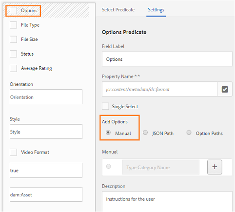

# 将预设、架构和 Facet 发布到 Brand Portal {#publish-presets-schema-and-facets-to-brand-portal}

文章涉及将图像预设、元数据架构和自定义搜索彩块化从AEM作者实例发布到Brand Portal。 发布功能使组织能够重复使用在AEM作者实例中创建／修改的图像预设、元数据架构和搜索彩块化，从而减少重复工作。

>[!NOTE]
>
>从AEM作者实例到Brand Portal发布图像预设、元数据架构和搜索彩块化的功能可从AEM 6.2 SP1-CFP7和AEM 6.3 SP 1-CFP 1(6.3.1.1)开始使用。

## 将图像预设发布到Brand Portal {#publish-image-presets-to-brand-portal}

图像预设是一组调整大小和设置格式的命令，这些命令在图像传送时应用于图像。 可以在Brand Portal中创建和修改图像预设。 或者，如果AEM作者实例在Dynamic media模式下运行，则用户可以在AEM作者处创建预设并将其发布到AEM Assets Brand Portal，并避免在Brand Portal中重新创建相同的预设。\
创建预设后，该预设将作为动态演绎版列在资产详细信息演绎版边栏和下载对话框中。

>[!NOTE]
>
>如果AEM作者实例未在 **[!UICONTROL Dynamic Media模式下运行]**（客户尚未购买Dynamic Media），则上传时不会创建资产的**[!UICONTROL  Pyramid TIFF]** 再现。 图像预设或动态演绎版适用于资产的 **[!UICONTROL Pyramid TIFF]**，因此，如果**[!UICONTROL  Pyramid TIFF]** 在AEM作者实例中不可用，则Brand Portal中也不可用。 因此，资产详细信息页面和下载对话框的演绎版边栏中不显示动态演绎版。

要将图像预设发布到Brand Portal，请执行以下操作：

1. 在AEM作者实例中，点按／单击AEM徽标以访问全局导航控制台，然后点按／单击工具图标，然后导航到资产>图 **[!UICONTROL 像预设]**。
1. 从图像预设列表中选择一个或多个图像预设，然后单击／点按发布 **[!UICONTROL 到品牌门户]**。

>[!NOTE]
>
>当用户单击 **[!UICONTROL 发布到Brand Portal时]**，图像预设将排队等待发布。 建议用户监视复制代理的日志以确认发布是否成功。

要从Brand Portal取消发布图像预设，请执行以下操作：

1. 在AEM作者实例中，点按／单击AEM徽标以访问全局导航控制台，然后点按／单击工具图标，然后导航到 **[!UICONTROL Assets]**>**[!UICONTROL  Image Presets]**。
1. 选择图像预设，然后从 **[!UICONTROL 顶部的可用选项中选择]**“从Brand Portal删除”。

## 将元数据架构发布到Brand Portal {#publish-metadata-schema-to-brand-portal}

元数据架构描述资产／集合的属性页面上显示的布局和属性。

 

如果用户已在AEM作者实例上编辑了默认架构，并且愿意使用与Brand Portal上的默认架构相同的架构，则他们只需将元数据架构表单发布到Brand Portal。 在这种情况下，Brand Portal的默认架构由从AEM作者实例发布的默认架构过度使用。

如果用户已在AEM作者实例上创建了自定义架构，则他们可以将自定义架构发布到Brand Portal，而不是在那里重新创建相同的自定义架构。 然后，用户可以将此自定义架构应用到Brand Portal中的任何文件夹／集合。

>[!NOTE]
>
>如果默认架构在AEM实例处被锁定（即它们未编辑），则无法将其发布到Brand Portal。

>[!NOTE]
>
>如果文件夹已在AEM作者实例上应用了架构，则品牌门户上也必须存在相同的架构，以保持AEM作者和品牌门户上的资产属性页面的一致性。

要将元数据架构从AEM作者实例发布到Brand Portal，请执行以下操作：

1. 在AEM作者实例中，点按／单击AEM徽标以访问全局导航控制台，然后点按／单击工具图标，然后导航到资产>元 **[!UICONTROL 数据架构]**。
1. 选择元数据架构，然后从 **[!UICONTROL 顶部的可用选项中选择]**“发布到品牌门户”。

>[!NOTE]
>
>当用户单击 **[!UICONTROL 发布到Brand Portal时]**，元数据架构将排队等待发布。 建议用户监视复制代理的日志以确认发布是否成功。

要从Brand Portal取消发布元数据架构，请执行以下操作：

1. 在AEM作者实例中，点按／单击AEM徽标以访问全局导航控制台，然后点按／单击工具图标，然后导航到资产>元 **[!UICONTROL 数据架构]**。
1. 选择元数据架构，然后从 **[!UICONTROL 顶部的可用选项中选择]**“从品牌门户中删除”。

## 将搜索彩块化发布到Brand Portal {#publish-search-facets-to-brand-portal}

搜索表单为Brand Portal上的用户 [提供了](../using/brand-portal-search-facets.md) “分面搜索”功能。 搜索彩块化可为品牌门户上的搜索提供更高的粒度。 在搜索 [筛选器中](https://helpx.adobe.com/experience-manager/6-5/assets/using/search-facets.html#AddingaPredicate) ，用户可以在搜索表单中添加所有谓词作为搜索彩块化。

如果您愿意从AEM作者实例中使用自定义搜索表单资产管理搜索边栏 ****，则您可以将自定义搜索表单从AEM作者实例发布到Brand Portal，而不是在Brand Portal上重新创建同一表单。

>[!NOTE]
>
>AEM资产上锁定 **[!UICONTROL 的搜索表单资产管理搜索边栏]**（除非已编辑）无法发布到Brand Portal。 编辑并发布到Brand Portal后，此搜索表单将覆盖Brand Portal上的搜索表单。

要将编辑后的搜索facet从AEM作者实例发布到Brand Portal，请执行以下操作：

1. 点按／单击AEM徽标，然后转到工具> **[!UICONTROL 常规>搜索表单]**。
1. 选择已编辑的搜索表单，然后选择 **[!UICONTROL 发布到Brand Portal]**。

   >[!NOTE]
   >
   >当用户单击“ **[!UICONTROL 发布到品牌门户”时]**，搜索彩块化将排队等待发布。 建议用户监视复制代理的日志以确认发布是否成功。

要从Brand Portal取消发布搜索表单，请执行以下操作：

1. 在AEM作者实例中，点按／单击AEM徽标以访问全局导航控制台，然后点按／单击工具图标，然后导航到常规>搜 **[!UICONTROL 索表单]**。
1. 选择搜索表单，然后从顶 **[!UICONTROL 部的可用选项中选择]**“从Brand Portal中删除”。

>[!NOTE]
>
>“从 **[!UICONTROL Brand Portal取消发布]**”操作会在Brand Portal上保留默认的搜索表单，但不会恢复到发布前使用的最后一个搜索表单。

### 限制 {#limitations}

1. 少数搜索谓词不适用于品牌门户上的搜索筛选器。 当这些搜索谓词作为搜索表单的一部分从AEM作者实例发布到Brand Portal时，它们会被过滤掉。 因此，用户在品牌门户的已发布表单中可看到的谓词数量较少。 请参 [阅适用于Brand Portal上的筛选器的搜索谓词](../using/brand-portal-search-facets.md#list-of-search-predicates)。

1. 对于 [!UICONTROL 选项谓词]，如果用户在AEM作者实例中使用任何自定义路径读取选项，则它在Brand Portal中将无法使用。 这些附加路径和选项不会随搜索表单一起发布到Brand Portal。 在这种情况下，用户可以在“选项 **[!UICONTROL 谓词”中]**的“添加选项**[!UICONTROL ”中选择“手]******动”选项，以在Brand Portal手动添加这些选项。

