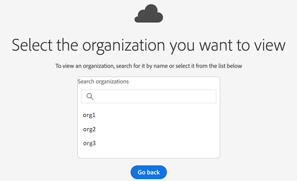
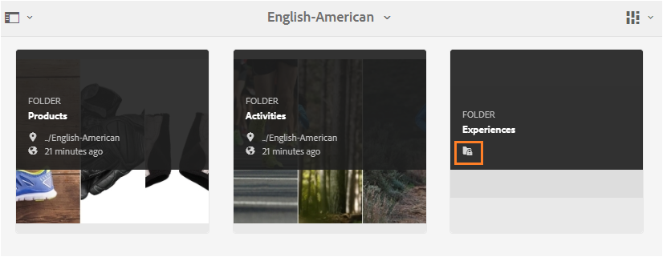
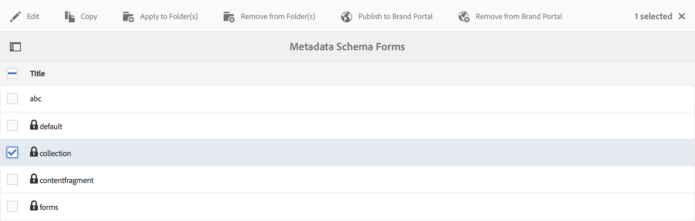

# AEM Assets Brand Portal 的新增功能 {#what-s-new-in-aem-assets-brand-portal}

Adobe Experience Manager Assets Brand Portal可帮助您跨设备轻松获取、控制和安全地将批准的创意资产分发给外部各方和内部业务用户。 它有助于提高资产共享的效率，加快资产的上市时间，并降低不合规和未经授权访问的风险。 Adobe正在努力改进整体Brand Portal体验。 以下是新增功能和增强功能的先机概述。

## 2021.08.0中的变化 {#what-changed-in-august-2021}

Brand Portal 2021.08.0是一个内部版本，为企业和团队客户引入了业务配置文件，以便让组织更好地控制其资产。 用户现在对新组织和迁移组织拥有特定于组织的权利。 在迁移期间，所有现有的Adobe ID帐户都将迁移到业务ID。

* 所有新组织和现有组织的业务ID在迁移后即可使用。
* 业务ID不需要任何特定设置，例如声明域或设置单点登录。
* 您可以添加具有任何电子邮件地址的用户，包括公共电子邮件域名，如gmail.com或outlook.com。

**对Brand Portal用户的影响**

迁移不会影响您的现有数据集、资产、用户或任何设置。 在迁移期间发生的唯一内部更改是现有组织有权使用业务配置文件。

>[!NOTE]
>
>业务配置文件当前适用于2021年8月16日之后创建的新组织。
>
>在迁移您的组织之前，您可以继续使用Adobe ID、Enterprise ID或Federated ID类型来访问组织。

### 参考文章 {#reference-articles}

* [Adobe配置文件简介](https://helpx.adobe.com/enterprise/kb/introducing-adobe-profiles.html)

* [管理Adobe配置文件](https://helpx.adobe.com/enterprise/using/manage-adobe-profiles.html)

* [更新了用户和管理员的登录体验](https://helpx.adobe.com/enterprise/using/storage-for-business.html#new-admin-sign-in-exp)

* [迁移期间登录限制](https://helpx.adobe.com/enterprise/kb/account-temporarily-unavailable.html)

* [在Admin Console中管理用户](https://helpx.adobe.com/enterprise/using/manage-users-individually.html)

* [为企业用户管理产品配置文件](https://helpx.adobe.com/enterprise/using/manage-product-profiles.html#assign-users)

* [域信任](https://helpx.adobe.com/enterprise/admin-guide.html/enterprise/using/set-up-identity.ug.html#directory-trusting)

<!--   
### Add new users to T2E organization   {#add-users-to-T2E-org}

On adding a new user in Admin Console for a new or migrated T2E organization, the user will have to perform an additional step **Join Team** to get entitled to the T2E organization. 

The user is entitled only if the user chooses to **Join Team**, otherwise the user won't get access to the selected T2E organization in Brand Portal. 

>[!NOTE]
>
>The workflow is not applicable to the existing Brand Portal users.

### Additional screen while navigating to Admin Console   {#navigate-to-admin-console}

The administrators will have to perform an additional step of selecting the T2E organization while navigating from Brand Portal to Admin Console. The workflow applies on the new and migrated T2E organizations.   

Selection of the T2E organization is a one-time activity and is not required everytime the administrator navigates from Brand Portal to Admin Console.

1. Log in to a T2E organization in Brand Portal as administrator.
1. Go to **[!UICONTROL Tools]** > **[!UICONTROL Users]** > **[!UICONTROL Management]** and click on the link **[!UICONTROL Launch Admin Console]**. 

   Or, go to **[!UICONTROL Unified Shell]** > **[!UICONTROL Administration]** and click on the link **[!UICONTROL Launch Admin Console]**. 
1. Search the T2E organization to login to Admin Console.

   

### Restriction during migration of an organization   {#login-restriction}

When an organization is undergoing T2E migration, the users of that organization will not be able to login to Brand Portal. The following error message appears on the screen. However, the migration won't impact the active user session until the token expires. 

Once the migration is complete, the users can login to Brand Portal. The users will receive an email notification containing the entitlement changes. If the users are entitled to more than one organization, they will have to select the organization at the time of login. 
-->

<!--
For a new or migrated T2E orgnization, the users will have an organization specific entitlement. A user can have multiple entitlements with the same email id for different T2E organizations. 
-->

## 2021.06.0中的变化 {#what-changed-in-june-2021}

Brand Portal 2021.06.0是一个内部版本，其中包含对关键问题的修复。 请参阅最新的[Brand Portal发行说明](brand-portal-release-notes.md)。

## 2021.02.0中的变化 {#what-changed-in-feb-2021}

Brand Portal 2021.02.0是一个增强版本，其中在AEM Assets as a Cloud Service上引入了Brand Portal激活工作流，促进了AEM Assets as a Cloud Service上的资产源功能，改进了资产下载体验，并包含关键修复。 它还允许管理员配置文件夹、收藏集的默认下载行为，以及在租户级别批量下载资产。 Brand Portal **[!UICONTROL 使用情况报表]**&#x200B;也已修改，以反映活动的Brand Portal用户。

### 在AEM Assets上激活Brand Portal作为Cloud Service {#bp-automation-on-cloud-service}

AEM Assets as aCloud Service现在有权使用预配置的Brand Portal实例。 Cloud Manager用户可以在AEM Assets上作为Cloud Service实例激活Brand Portal。

以前，AEM Assets as a Cloud Service是使用“Adobe开发人员控制台”通过Brand Portal手动配置的。

Cloud Manager用户会触发激活工作流，该工作流会在后端创建所需的配置，并在与AEM Assets(作为Cloud Service实例)相同的IMS组织上激活Brand Portal。

要在AEM Assets上作为Cloud Service实例激活Brand Portal，请执行以下操作：

1. 登录到AdobeCloud Manager，然后导航到&#x200B;**[!UICONTROL Environments]**。
1. 从列表中选择环境（逐个）。 找到与Brand Portal关联的环境后，单击&#x200B;**[!UICONTROL 激活Brand Portal]**&#x200B;按钮以开始激活工作流。
1. 激活Brand Portal租户后，状态将变为“已激活”。

请参阅[在AEM Assets上激活Brand Portal as a Cloud Service](https://experienceleague.adobe.com/docs/experience-manager-cloud-service/assets/brand-portal/configure-aem-assets-with-brand-portal.html)。

### 将AEM Assets作为Cloud Service的资产源 {#asset-sourcing-on-cloud-service}

资产源功能现在可在AEM Assets上作为Cloud Service使用。 默认情况下，该功能为所有云服务用户启用。 允许的Brand Portal用户可以通过将新资产上传到贡献文件夹，并将贡献文件夹从Brand Portal发布到AEM Assets(作为Cloud Service实例)来参与资产采购。 管理员可以审核和批准Brand Portal用户的贡献，以进一步将其分发给其他Brand Portal用户。

以前，资产源仅在AEM Assets上可用（内部部署版和托管服务版）。

请参阅[Brand Portal中的资产源](https://experienceleague.adobe.com/docs/experience-manager-brand-portal/using/asset-sourcing-in-brand-portal/brand-portal-asset-sourcing.html)。

### 资源下载 {#asset-download-setting}

除了现有的&#x200B;**[!UICONTROL 下载设置]**&#x200B;之外，Brand Portal管理员现在还可以配置&#x200B;**[!UICONTROL 资产下载]**&#x200B;设置。 此设置允许管理员在租户级别管理文件夹、收藏集和批量下载资产（超过20个资产）的默认下载行为。

<!--
Earlier, all the asset renditions were directly downloaded in a zip folder in case of folder, collection, and bulk download of assets. As the **[!UICONTROL Download]** dialog is skipped for folders or collections, there was no mechanism to control the downloading behaviour of the assets. Due to this, the users were finding it difficut to search for a particular asset rendition from a folder containing huge bunch of downloaded renditions. 
-->

以前，所有资产演绎版都直接下载到zip文件夹中。 已跳过文件夹和收藏集的&#x200B;**[!UICONTROL 下载]**&#x200B;对话框，并且没有方法控制资产的下载行为，因此很难从许多下载中搜索特定的演绎版。

**[!UICONTROL 资产]** 下载设置现在提供了一个选项，用于在下载文件夹、收藏集或批量下载资产时，为每个资产创建单独的文件夹。

如果禁用了&#x200B;**[!UICONTROL 资产下载]**&#x200B;设置，则文件夹或收藏集将下载到一个zip文件夹中，其中包含同一文件夹下的所有资产演绎版，但使用共享链接下载资产除外。

以管理员身份登录Brand Portal租户，然后导航到&#x200B;**[!UICONTROL 工具]** > **[!UICONTROL 下载]**。 管理员可以启用&#x200B;**[!UICONTROL 资产下载]**&#x200B;设置，以在下载文件夹、收藏集和批量下载资产时为每个资产创建单独的文件夹。

请参阅[从Brand Portal下载资产](https://experienceleague.adobe.com/docs/experience-manager-brand-portal/using/download/brand-portal-download-assets.html)。
<!--
### Download using Share link {#download-using-share-link}

The default behavior of downloading the assets using share link is now independent of the **[!UICONTROL Download Settings]**. A separate folder is created for each asset while downloading the assets using share link. 
-->

### 使用情况报表 {#usage-report}

已修改Brand Portal **[!UICONTROL 使用情况报表]**，以仅反映活动的Brand Portal用户。 未分配到Admin Console中任何产品配置文件的Brand Portal用户将被视为不活动用户，并且不会反映在&#x200B;**[!UICONTROL 使用情况报表]**&#x200B;中。

以前，使用情况报表中会显示活动用户和不活动用户。

## 2020.10.0中的变化 {#what-changed-in-oct-2020}

Brand Portal 2020.10.0是一个增强版本，其重点在于简化资产下载体验并包含关键修复。 该增强功能包括用于资产下载的新工作流和经过改进的工作流，用于排除呈现的其他选项，从&#x200B;**[!UICONTROL 呈现]**&#x200B;面板直接下载，允许特定用户组的访问和下载权限的配置，以及从所有Brand Portal页面轻松导航到文件、收藏集和共享链接。 请参阅最新的[Brand Portal发行说明](brand-portal-release-notes.md)。

### 简化的下载体验 {#download-dialog}

以前，出现了&#x200B;**[!UICONTROL 下载]**&#x200B;对话框，其中包含多个选项，例如为每个资产创建单独的文件夹、电子邮件资产、选择原始资产、自定义演绎版、动态演绎版、排除系统演绎版，以及启用下载加速，当选择多个资产或文件夹进行下载时，这些选项对非技术用户或新用户而言并不明确。 此外，用户看不到所有资产演绎版，也无法排除特定的自定义或动态演绎版。

新的&#x200B;**[!UICONTROL 下载]**&#x200B;对话框可通用化资产选择和过滤流程，从而让Brand Portal用户在下载资产演绎版时更轻松地做出有效决策。 它会根据[**[!UICONTROL Download]**](brand-portal-download-assets.md)配置和&#x200B;**[!UICONTROL Download]**&#x200B;设置列出所有选定的资产及其演绎版。

>[!NOTE]
>
>现在，所有用户默认启用&#x200B;**[!UICONTROL Fast Download]**，并且需要在其浏览器扩展中安装IBM Aspera Connect 3.9.9(`https://www.ibm.com/docs/en/aspera-connect/3.9.9`)，然后才能从Brand Portal下载资产。

<!--
If any of the **[!UICONTROL Custom Rendition]** or **[!UICONTROL System Rendition]** is enabled in the [**[!UICONTROL Download]**](brand-portal-download-assets.md) configuration and **[!UICONTROL Download]** settings are enabled for the group users, the new **[!UICONTROL Download]** dialog appears with all the renditions of the selected assets or folders containing assets in a list view. 
-->

从&#x200B;**[!UICONTROL 下载]**&#x200B;对话框中，用户可以：

* 在下载列表中查看任何资产的所有可用演绎版。
* 排除下载不需要的资产演绎版。
* 只需单击一次，即可将相同的演绎版集应用于所有类似的资产类型。
* 对不同资产类型应用不同的演绎版集。
* 为每个资产创建单独的文件夹.
* 下载选定的资产及其演绎版。

对于独立资产、多个资产、包含资产的文件夹、已授权或未授权的资产，以及使用共享链接下载资产，下载工作流程将保持不变。 请参阅[从Brand Portal下载资产的步骤](https://experienceleague.adobe.com/docs/experience-manager-brand-portal/using/download/brand-portal-download-assets.html)。

### 快速导航  {#quick-navigation}

以前，用于查看&#x200B;**[!UICONTROL 文件]**、**[!UICONTROL 收藏集]**&#x200B;和&#x200B;**[!UICONTROL 共享链接]**&#x200B;的选项处于隐藏状态，用户每次想要切换到其他视图时需要多次单击该选项。

在Brand Portal 2020.10.0中，用户可以使用快速导航链接从所有Brand Portal页面一键单击导航到&#x200B;**[!UICONTROL 文件]**、**[!UICONTROL 收藏集]**&#x200B;和&#x200B;**[!UICONTROL 共享链接]**。

### 增强的演绎版面板 {#rendition-panel}

以前，如果在&#x200B;**[!UICONTROL Download]**&#x200B;配置中启用了任何&#x200B;**[!UICONTROL 自定义演绎版]**&#x200B;或&#x200B;**[!UICONTROL 系统演绎版]**，则用户只能在&#x200B;**[!UICONTROL 演绎版]**&#x200B;面板中查看原始资产及其演绎版。 此外，用户还必须下载所有资产演绎版，因为没有过滤器可排除不需要的特定自定义或动态演绎版。

<!--
Earlier, if any of the custom or system renditions was enabled in the **[!UICONTROL Download]** settings, an additional **[!UICONTROL Download]** dialog appeared on clicking the **[!UICONTROL Download]** button wherein the user had to manually select the set of renditions (original asset, custom renditions, dynamic renditions) to download.
There was no filter to exclude specific custom or dynamic renditions which were not required for download.
-->

在Brand Portal 2020.10.0中，用户可以排除特定的演绎版，并直接[从资产详细信息页面的演绎版面板](brand-portal-download-assets.md#download-assets-from-asset-details-page)下载选定的演绎版，而无需打开&#x200B;**[!UICONTROL 下载]**&#x200B;对话框。

<!-- 
In Brand Portal 2020.10.0, direct download and exclude renditions features are introduced in the **[!UICONTROL Renditions]** panel on the asset details page. All the renditions (original asset, custom renditions, dynamic renditions) under the rendition panel are now associated with a check box and are enabled by default. 

The user can clear the check boxes to exclude the renditions which are not required for download. And can click on the **[!UICONTROL Download]** button in the **[!UICONTROL Renditions]** panel to directly download the selected set of renditions in a zip folder without having to open the **[!UICONTROL Download]** dialog.
-->

### 配置下载设置 {#download-permissions}

除了现有的&#x200B;**[!UICONTROL Download]**&#x200B;配置外，Brand Portal管理员还可以配置不同用户组的设置，以从资产详细信息页面查看和（或）下载原始资产及其演绎版。

以管理员身份登录Brand Portal租户，然后导航到&#x200B;**[!UICONTROL 工具]** > **[!UICONTROL 用户]**。

在&#x200B;**[!UICONTROL 用户角色]**&#x200B;页面中，导航到&#x200B;**[!UICONTROL 组]**&#x200B;选项卡，以配置用户组的视图和（或）下载设置。

以前，这些设置仅可用于限制群组用户下载原始资产。

通过&#x200B;**[!UICONTROL 用户角色]**&#x200B;页面上的&#x200B;**[!UICONTROL 组]**&#x200B;选项卡，管理员可以配置视图和下载设置：

* 如果同时启用了&#x200B;**[!UICONTROL 下载原始资产]**&#x200B;和&#x200B;**[!UICONTROL 下载演绎版]**&#x200B;设置，则选定组的用户可以查看和下载原始资产及其演绎版。
* 如果这两个设置都处于关闭状态，则用户只能查看原始资产。 资产演绎版在资产详细信息页面上的用户不可见。
* 如果仅启用了&#x200B;**[!UICONTROL 下载原始资产]**&#x200B;设置，则用户只能从资产详细信息页面查看和下载原始资产。
* 如果仅启用了&#x200B;**[!UICONTROL 下载演绎版]**&#x200B;设置，则用户可以查看原始资产，但无法下载该资产。 但是，用户可以查看和下载资产演绎版。

请参阅[配置资产下载](https://docs.adobe.com/content/help/en/experience-manager-brand-portal/using/download/brand-portal-download-assets.html#configure-download-permissions)。

>[!NOTE]
>
>如果用户被添加到多个组，并且其中一个组具有限制，则该限制适用于该用户。

<!--
>Restrictions to access the original asset and their renditions do not apply to administrators even if they are members of restricted groups.
 >
 >The users can always download assets and their renditions from the repository using a `curl` request even if the download configurations are turned-off.
 >
-->

## 6.4.7中的更改 {#what-changed-in-647}

Brand Portal 6.4.7版引入了文档查看器，改善了下载资产的体验，并且包含关键修复。 请参阅最新的[Brand Portal发行说明](brand-portal-release-notes.md)。

<!--
Brand Portal 6.4.7 release brings in the Document Viewer, leverages the Brand Portal administrators to configure asset download, and centers top customer requests. See latest [Brand Portal Release Notes](brand-portal-release-notes.md).
-->

### 文档查看器 {#doc-viewer}

文档查看器可增强PDF查看体验。 在Brand Portal中查看PDF文件时，它提供的体验与Adobe Document Cloud类似。

以前，有限的选项可用于查看PDF文件。

现在，使用文档查看器，Brand Portal用户可以选择查看页面、查看书签、搜索页面上的文本、放大、缩小、导航到上一页和下一页、切换到页面、适合窗口、适合屏幕，以及隐藏或取消隐藏工具栏。

>[!NOTE]
>
>其他文档格式的查看体验保持不变。

### 下载体验 {#download-configurations}

改进了资产下载流程，在[从Brand Portal](brand-portal-download-assets.md)下载资产时，提供了简化的用户体验。

从Brand Portal下载资产的现有工作流必然会随后出现&#x200B;**[!UICONTROL 下载]**&#x200B;对话框，其中包含多个下载选项可供选择。

在Brand Portal 6.4.7中，Brand Portal管理员可以配置资产&#x200B;**[!UICONTROL 下载]**&#x200B;设置。 可用的配置包括：
* **[!UICONTROL 快速下载]**
* **[!UICONTROL 自定义呈现版本]**
* **[!UICONTROL 系统呈现版本]**

Brand Portal管理员可以启用任意组合来配置资产下载。

<!--In Brand Portal 6.4.7, fast download, custom renditions, and system renditions are the three configurations available.-->

* 如果&#x200B;**[!UICONTROL 自定义演绎版]**&#x200B;和&#x200B;**[!UICONTROL 系统演绎版]**&#x200B;配置均处于关闭状态，则会下载资产的原始演绎版，而不会添加任何其他对话框，这会简化Brand Portal用户的下载体验。

* 如果启用了任何&#x200B;**[!UICONTROL 自定义演绎版]**&#x200B;或&#x200B;**[!UICONTROL 系统演绎版]**，则会显示&#x200B;**[!UICONTROL 下载]**&#x200B;对话框，并下载原始资产以及资产演绎版。 启用&#x200B;**[!UICONTROL 快速下载]**&#x200B;配置可加快下载过程。

根据配置，独立资产、多个资产、包含资产的文件夹、已授权或未授权的资产，以及使用共享链接下载资产时，下载工作流将保持不变。

## 6.4.6中的更改 {#what-changed-in-646}

在Brand Portal 6.4.6中，更改了AEM Assets和Brand Portal之间的授权渠道。 Brand Portal现在在AEM Assets as a Cloud Service、AEM Assets 6.3及更高版本上受支持。 在AEM Assets 6.3及更高版本中，Brand Portal之前已通过旧版OAuth网关在经典UI中进行配置，该网关使用JWT令牌交换获取IMS访问令牌以进行授权。 AEM Assets现在可通过Adobe开发人员控制台使用Brand Portal进行配置，以便获取IMS令牌以授权您的Brand Portal租户。

<!-- The steps to configure integration are different depending on your AEM version, and whether you are configuring for the first-time, or upgrading the existing integration:
-->

<!--
  
   | **AEM Version** |**New Integration** |**Upgrade Integration** |
|---|---|---|
| **AEM 6.5** |[Create new integration](../using/brand-portal-configure-integration-65.md) |[Upgrade existing integration](../using/brand-portal-configure-integration-65.md#upgrade-integration-65) | 
| **AEM 6.4** |[Create new integration](../using/brand-portal-configure-integration-64.md) |[Upgrade existing integration](../using/brand-portal-configure-integration-64.md#upgrade-integration-64) | 
| **AEM 6.3** |[Create new integration](../using/brand-portal-configure-integration-63.md) |[Upgrade existing integration](../using/brand-portal-configure-integration-63.md#upgrade-integration-63) | 
| **AEM 6.2** |Contact Support |Contact Support | 

   -->

使用Brand Portal配置AEM Assets的步骤因AEM版本以及您是首次配置还是升级现有配置而异：

<!--| **AEM Version** |**New Configuration** |**Upgrade Configuration** |
|---|---|---|
| **AEM 6.5 (6.5.4.0 and above)** |[Create configuration](../using/brand-portal-configure-integration-65.md) |[Upgrade configuration](../using/brand-portal-configure-integration-65.md#upgrade-integration-65) | 
| **AEM 6.4 (6.4.8.0 and above)** |[Create configuration](../using/brand-portal-configure-integration-64.md) |[Upgrade configuration](../using/brand-portal-configure-integration-64.md#upgrade-integration-64) | 
| **AEM 6.3 (6.3.3.8 and above)** |[Create configuration](../using/brand-portal-configure-integration-63.md) |[Upgrade configuration](../using/brand-portal-configure-integration-63.md#upgrade-integration-63) | 
| **AEM 6.2** |Contact Support |Contact Support | 
-->

<!-- AEM Assets configuration with Brand Portal on Adobe I/O is supported on:
* AEM 6.5.4.0 and above
* AEM 6.4.8.0 and above
* AEM 6.3.3.8 and above -->

| **AEM 版本** | **新配置** | **升级配置** |
|---|---|---|
| **AEM Assets as a Cloud Service** | [创建配置](https://docs.adobe.com/content/help/zh-Hans/experience-manager-cloud-service/assets/brand-portal/configure-aem-assets-with-brand-portal.html) | - |
| **AEM 6.5（6.5.4.0及更高版本）** | [创建配置](https://docs.adobe.com/content/help/zh-Hans/experience-manager-65/assets/brandportal/configure-aem-assets-with-brand-portal.html) | [升级配置](https://docs.adobe.com/content/help/zh-Hans/experience-manager-65/assets/brandportal/configure-aem-assets-with-brand-portal.html#upgrade-integration-65) |
| **AEM 6.4（6.4.8.0及更高版本）** | [创建配置](https://docs.adobe.com/content/help/zh-Hans/experience-manager-64/assets/brandportal/configure-aem-assets-with-brand-portal.html) | [升级配置](https://docs.adobe.com/content/help/zh-Hans/experience-manager-64/assets/brandportal/configure-aem-assets-with-brand-portal.html#upgrade-integration-64) |
| **AEM 6.3（6.3.3.8及更高版本）** | [创建配置](https://helpx.adobe.com/cn/experience-manager/6-3/assets/using/brand-portal-configuring-integration.html) | [升级配置](https://helpx.adobe.com/cn/experience-manager/6-3/assets/using/brand-portal-configuring-integration.html#Upgradeconfiguration) |
| **AEM 6.2** | 联系支持人员 | 联系支持人员 |

>[!NOTE]
>
>建议将您的AEM实例更新到最新的Service Pack。

请参阅最新的[Brand Portal发行说明](brand-portal-release-notes.md)。

请参阅[Brand Portal常见问题解答](brand-portal-faqs.md)。

## 6.4.5中的更改 {#what-changed-in-645}

Brand Portal 6.4.5 是一个功能版本，其主要是为 Brand Portal 用户（外部代理/团队）提供在不需要访问作者环境的情况下将内容上传到 Brand Portal 并发布到 AEM Assets 的功能。此功能在Brand Portal中称为&#x200B;**[资产源](brand-portal-asset-sourcing.md)**，它通过为用户提供双向机制来贡献资产并与其他分布在全球的Brand Portal用户共享资产，从而改善客户体验。

### Brand Portal 中的资产源 {#asset-sourcing-in-bp}

资产源允许AEM用户（管理员/非管理员用户）创建具有额外&#x200B;**资产贡献**&#x200B;属性的文件夹，从而确保创建的新文件夹可由Brand Portal用户打开进行资产提交。 它会自动触发一个工作流，该工作流会在新创建的&#x200B;**Contribution**&#x200B;文件夹内创建另外两个名为NEW和SHARED的子文件夹。

然后，AEM用户通过将应添加到贡献文件夹的资产类型的简介上传到&#x200B;**SHARED**&#x200B;文件夹，并将基线资产上传到SHARED文件夹，以确保Brand Portal用户具有所需的参考信息，从而定义了相关要求。 然后，管理员可以在将新创建的&#x200B;**Contribution**&#x200B;文件夹发布到Brand Portal之前，向活动的Brand Portal用户授予对贡献文件夹的访问权限。

用户完成在&#x200B;**NEW**&#x200B;文件夹中添加内容后，便可以将Contribution文件夹发布回AEM创作环境。 请注意，完成导入并反映AEM Assets中新发布的内容可能需要几分钟的时间。

此外，所有现有功能都保持不变。 Brand Portal用户可以从贡献文件夹和其他允许的文件夹查看、搜索和下载资产。 此外，管理员还可以进一步共享贡献文件夹、修改属性并将资产添加到收藏集。

>[!NOTE]
>
>AEM 6.5.2.0及更高版本支持Brand Portal中的资产源。
>
>早期版本(AEM 6.3和AEM 6.4)不支持此功能。

### 将资产上传到贡献文件夹 {#upload-assets-in-bp}

具有相应权限的Brand Portal用户可以下载资产要求，以了解贡献的需要，并将多个资产或包含多个资产的文件夹上传到贡献文件夹。 但请注意，Brand Portal用户只能将资产上传到&#x200B;**NEW**&#x200B;子文件夹。 **SHARED**&#x200B;文件夹用于分配要求和基准资产。

### 将贡献文件夹发布到AEM Assets {#publish-assets-to-aem}

上传到&#x200B;**NEW**&#x200B;文件夹后，Brand Portal用户随后可以将该贡献文件夹发布回AEM。 在AEM Assets中导入和反映已发布的内容/资产可能需要几分钟的时间。 请参阅[将贡献文件夹发布到AEM Assets](brand-portal-publish-contribution-folder-to-aem-assets.md)。

## 6.4.4中的更改 {#what-changed-in-644}

Brand Portal 6.4.4 版主要增强了文本搜索和常见客户请求。请参阅最新的[Brand Portal发行说明](brand-portal-release-notes.md)。

### 搜索增强功能

从Brand Portal 6.4.4开始，支持对过滤窗格中的属性谓词进行部分文本搜索。 要允许部分文本搜索，必须在搜索表单的属性谓词中启用&#x200B;**部分搜索**。

请阅读以了解有关部分文本搜索和通配符搜索的更多信息。

#### 部分短语搜索 {#partial-phrase-search}

现在，您可以通过在筛选窗格中仅指定搜索短语的一个部分（即一两个单词）来搜索资产。

**当您**
不确定搜索短语中出现的单词的确切组合时，使用casePartial短语搜索非常有用。

例如，如果您在Brand Portal中的搜索表单使用属性谓词对资产标题进行部分搜索，则指定术语&#x200B;**camp**&#x200B;将返回所有资产，其标题短语中带有单词camp 。

#### 通配符搜索 {#wildcard-search}

Brand Portal允许在搜索查询中使用星号(*)以及搜索短语中单词的一部分。

**用例。 如果您不确定搜索短语中出现的确切字词，可以使用通配符搜索来填补搜索查询中的空白。

例如，如果Brand Portal中的搜索表单使用属性谓词对资产标题进行部分搜索，则指定&#x200B;**climb***&#x200B;会返回所有资产，其标题短语中的单词以字符&#x200B;**climb**&#x200B;开头。

同样，指定：

* ***** mabping会返回所有单词以字符结尾的资 **** 产，并在其标题短语中返回。

* ***climb*** 会返回所有包含包含字符的词语的资产，并在 **** 其标题短语中进行爬升。

>[!NOTE]
>
>选中&#x200B;**部分搜索**&#x200B;复选框时，默认情况下会选中&#x200B;**忽略大小写**。

## 6.4.3中的更改 {#what-changed-in}

Brand Portal 6.4.3版本重点关注 — 在Brand Portal访问URL中为组织除了提供租户ID之外，还为其提供备用别名、新文件夹层次结构配置、视频支持增强、从AEM创作实例到Brand Portal的计划发布、操作增强 — 并满足客户请求。

### 非管理员文件夹层次结构导航

管理员现在可以配置在登录时向非管理员用户（编辑者、查看者和来宾用户）显示文件夹的方式。 [“启用文件夹](../using/brand-portal-general-configuration.md) 层次配置”将添加在“ **常规设置**”中的“管理工具”面板中。如果配置为：

* **启用**&#x200B;时，从根文件夹开始的文件夹树对非管理员用户可见。因此，应向他们授予与管理员类似的导航体验。
* **禁用**，则登陆页面上只显示共享文件夹。

[启用文件夹层次结构](../using/brand-portal-general-configuration.md)功能（启用后）有助于区分从不同层次结构共享的具有相同名称的文件夹。 现在，非管理员用户在登录时会看到共享文件夹的虚拟父（和上级）文件夹。

共享文件夹在虚拟文件夹的相应目录内组织。 您可以使用锁定图标识别这些虚拟文件夹。

虚拟文件夹的默认缩略图是第一个共享文件夹的缩略图。

### 在特定文件夹层次结构或路径中搜索

**路径浏** 览器谓词已在搜索表单中引入，以允许在特定目录中搜索资产。路径浏览器的搜索谓词的默认搜索路径为`/content/dam/mac/<tenant-id>/`，可通过编辑默认搜索表单来配置该路径。

* 管理员用户可以使用路径浏览器导航到Brand Portal上的任意文件夹目录。
* 非管理员用户可以使用路径浏览器仅导航到与他们共享的文件夹（并导航回父文件夹）。

   例如，与非管理员用户共享`/content/dam/mac/<tenant-id>/folderA/folderB/folderC`。 用户可以使用路径浏览器在folderC中搜索资产。 此用户还可以导航到folderB和folderA（因为它们是与用户共享的folderC的祖先）。

现在，您可以限制在已浏览到的特定文件夹内进行资产搜索，而不是从根文件夹开始。

在这些文件夹下搜索时，只会返回与用户共享的资产中的结果。

### Dynamic Media视频演绎版支持

除了原始视频文件之外，AEM创作实例处于Dynamic Media混合模式的用户还可以预览和下载Dynamic Media演绎版。

要允许预览和下载特定租户帐户上的Dynamic Media演绎版，管理员必须在“管理工具”面板的&#x200B;**视频**&#x200B;配置中指定&#x200B;**Dynamic Media配置**(视频服务URL(DM-Gateway URL)和注册ID来获取动态视频)。

Dynamic Media视频可在以下位置预览：

* 资产详细信息页面
* 资产的卡片视图
* 链接共享预览页面

Dynamic Media视频编码可从以下位置下载：

* Brand Portal
* 共享链接

### 计划发布到Brand Portal

可以安排在稍后的日期和时间将资产（和文件夹）从[AEM(6.4.2.0)](https://helpx.adobe.com/experience-manager/6-4/release-notes/sp-release-notes.html#main-pars_header_9658011)创作实例发布到Brand Portal的工作流。

同样，可以稍后通过计划从Brand Portal取消发布工作流，从门户中删除已发布的资产。

### URL中的可配置租户别名

组织可以通过在URL中使用替代前缀来自定义其门户URL。 要在其现有门户URL中获取租户名称的别名，组织必须联系Adobe支持。

只能自定义Brand Portal URL的前缀，而不能自定义整个URL。\
例如，现有域为&#x200B;**geometrix.brand-portal.adobe.com**&#x200B;的组织可以获取根据请求创建的&#x200B;**geomettrixinc.brand-portal.adobe.com**。

但是，AEM创作实例只能[配置](https://helpx.adobe.com/cn/experience-manager/6-5/assets/using/brand-portal-configuring-integration.html) ，且只能使用租户ID URL，而不能使用租户别名（替代）URL。

组织可以通过自定义门户URL来满足其品牌需求，而不是坚持使用由Adobe提供的URL。

### 下载体验增强功能

该版本通过减少点击次数和警告次数，简化了下载体验，具体包括：

* 选择仅下载演绎版（而不是原始资产）。
* 当访问原始演绎版受到限制时，请下载资产。

## 6.4.2中的更改 {#what-changed-in-1}

Brand Portal 6.4.2版本提供了一系列功能，可满足组织的资产分发需求，并帮助组织通过“来宾访问”和优化下载体验来联系分布在全球的众多用户。 Brand Portal还通过为管理员、新添加的报表以及满足客户请求的新配置，为组织提供更大的控制力。

### 来宾访问

AEM Brand Portal允许来宾访问该门户。 来宾用户无需凭据即可进入门户，并且可以访问和下载所有公共文件夹和收藏集。 来宾用户可以将资产添加到其Lightbox（专用收藏集）并下载相同的资产。 他们还可以查看由管理员设置的智能标记搜索和搜索谓词。 来宾会话不允许用户创建收藏集和保存的搜索，或进一步共享它们、访问文件夹和收藏集设置，以及将资产共享为链接。

在组织中，允许多个并发来宾会话，该会话数限制为每个组织用户配额总数的10%。

来宾会话保持活动状态2小时。 因此，灯箱的状态也会保留到会话开始时间后的两个小时。 两小时后，来宾会话必须重新启动，因此灯箱状态将丢失。

### 加速下载

Brand Portal用户可以应用基于IBM Aspera Connect的快速下载，使下载速度提高25倍，并且无论他们位于全球哪个位置，都能享受无缝的下载体验。 要更快地从Brand Portal或共享链接下载资产，用户需要在下载对话框中选择&#x200B;**启用下载加速**&#x200B;选项，前提是其组织已启用下载加速。

要为组织启用基于IBM Aspera的加速下载，管理员可从管理工具面板的[常规设置](brand-portal-general-configuration.md#allow-download-acceleration)中&#x200B;**启用下载加速**&#x200B;选项（默认情况下处于禁用状态）。 要详细了解从Brand Portal和共享链接更快地下载资产文件的先决条件和疑难解答步骤，请参阅[指南以加快从Brand Portal下载的速度](../using/accelerated-download.md#main-pars-header)。

### 用户登录报表

引入了新报表来跟踪用户登录情况。 **用户登录**&#x200B;报表有助于使组织能够审核和检查委派的管理员和Brand Portal的其他用户。

在生成报告之前，报表会从Brand Portal 6.4.2部署中记录每个用户的显示名称、电子邮件ID、角色（管理员、查看者、编辑者、来宾）、组、上次登录、活动状态和登录计数。 管理员可以将报表导出为.csv。 除了其他报告外，“用户登录”报告还允许组织更密切地监控用户与已批准品牌资源的交互情况，从而确保符合公司合规办公室的要求。

### 访问原始演绎版

管理员可以限制用户访问原始图像文件(.jpeg、.tiff、.png、.bmp、.gif、.pjpeg、x-portable-anymap、x-portable-bitmap、x-portable-graymap、x-pixmap、x-rgbit、x-xpixmap、x-icon、image/photoshop、image/x-photoshop、.psd、image/vnd.adobe.photoshop)，并允许访问他们从Brand Portal或共享链接下载的低分辨率演绎版。 此访问权限可以在用户组级别的“管理工具”面板中“用户角色”页面的“组”选项卡中进行控制。

* 默认情况下，所有用户都能够下载原始演绎版，因为所有用户都启用了“原始访问”。
* 管理员需要取消选中相应的复选框，以阻止一组用户访问原始演绎版。
* 如果用户是多个组的成员，但其中只有一个组具有限制，则该限制适用于该用户。
* 这些限制不适用于管理员，即使他们是受限组的成员。
* 将资产共享为链接的用户的权限，适用于使用共享链接下载资产的用户。

### 卡片视图和列表视图中的文件夹层次结构路径

文件夹卡片在卡片视图中现在可向非管理员用户（编辑者、查看者和来宾用户）显示文件夹层次结构信息。 通过此功能，用户可以了解文件夹的位置以及他们正在访问的文件夹相对于父层次结构的位置。

文件夹层次结构信息在区分名称与从其他文件夹层次结构共享的其他文件夹相似的文件夹时特别有用。 如果非管理员用户不知道与他们共享的资产的文件夹结构，则名称相似的资产/文件夹似乎会令人困惑。

* 相应卡片上显示的路径会被截断以适合卡片大小。 但是，用户可以将完整路径视为将鼠标悬停在截断路径上时的工具提示。

列表视图在列中显示资产的文件夹路径，该路径指向所有Brand Portal用户。

### 查看资产属性的概述选项

Brand Portal为非管理员用户（编辑者、查看者、来宾用户）提供了“概述”选项，以查看选定资产/文件夹的资产属性。 概述选项可见：

1. 在顶部的工具栏中，选择资产/文件夹。
2. 在下拉菜单中，选择边栏选择器。

在选择资产/文件夹时，当选择概述选项时，用户可以查看资产创建的标题、路径和时间。 然而，在资产详细信息页面上选择概述选项，用户可以查看资产的元数据。

## 新配置

为管理员添加了六项新配置，以针对特定租户启用/禁用以下功能：

* 允许来宾访问
* 允许用户请求访问Brand Portal
* 允许管理员从Brand Portal中删除资产
* 允许创建公共集合
* 允许创建公共智能收藏集
* 允许下载加速

以上配置位于管理工具面板的访问和常规设置下。

### Adobe I/OUI以配置oAuth集成

从Brand Portal 6.4.2开始，使用旧版OAuth(`https://legacy-oauth.cloud.adobe.io/`)界面创建JWT应用程序，该应用程序支持配置oAuth集成，以允许AEM Assets与Brand Portal集成。 以前，用于配置OAuth集成的UI托管在`https://marketing.adobe.com/developer/`中。 有关将AEM Assets与Brand Portal集成以将资产和收藏集发布到Brand Portal的更多信息，请参阅[配置AEM Assets与Brand Portal的集成](https://docs.adobe.com/content/help/en/experience-manager-64/assets/brandportal/configure-aem-assets-with-brand-portal.html)。

## 搜索增强功能

管理员可以使用更新的属性谓词，使属性谓词不区分大小写，该谓词已选中忽略大小写。 此选项适用于属性谓词和多值属性谓词。\
但是，非区分大小写的搜索比属性谓词的默认搜索相对较慢。 如果搜索过滤器中的非区分大小写谓词过多，则搜索可能会减慢。 因此，建议谨慎使用非区分大小写的搜索。

## 6.4.1中的更改 {#what-changed-in-2}

Brand Portal 6.4.1是一个平台升级版本，它引入了多项新增功能和重要的增强功能，例如浏览、搜索和性能增强，以便为客户提供充实的体验。

### 浏览增强功能

* 新增了内容树边栏，可快速导航资产层次结构。

* 引入了新的键盘快捷键，例如&#x200B;_(p)_（用于导航到属性页面）、_(e)_（用于编辑）和&#x200B;_(ctrl+c)_（用于复制操作）。
* 改善了在卡片视图和列表视图中浏览大量资产时的滚动和延迟加载体验。
* 增强的卡片视图，支持根据视图设置大小不同的卡片。

* 现在，卡片视图会在将鼠标悬停在日期标签上方时显示日期/时间戳。

* 资产快照下具有&#x200B;**更多详细信息**&#x200B;的增强列视图，允许您导航到资产的详细信息页面。

* 除了区域设置、资产类型、维度、大小、评级和发布信息之外，列表视图现在默认在第一列中显示资产的文件名。 新的&#x200B;**视图设置**&#x200B;可用于配置要在列表视图中显示的详细信息量。

* 改进了资产详细信息体验，并且能够使用新的导航按钮在资产之间来回导航，以及查看资产计数。

* 新增了在资产详细信息页面中预览从AEM上传的音频文件的功能。
* 资产属性中提供了新的相关资产功能。 与AEM上的其他源/派生资产相关并在Brand Portal上发布的资产现在在Brand Portal中的关系将保持不变，并且在属性页面上具有指向相关资产的链接。
* 引入了新配置，以限制非管理员用户创建公共收藏集。 组织可以与Adobe支持团队合作，在特定帐户上配置此功能。

### 搜索增强功能

* 引入了在导航到搜索项目后返回到搜索结果中相同位置的功能，无需再次运行搜索查询。
* 新的搜索结果计数，用于显示已提供的搜索结果数。
* 改进了文件类型搜索过滤器，与之前的“图像”、“文档”、“多媒体”选项相比，该过滤器能够根据细粒度MIME类型(如.jpg、.png和.psd)筛选搜索结果。
* 增强了收藏集的搜索筛选器，提供了准确的时间戳，而不是以前的时间滑块功能。
* 已引入新的访问类型过滤器，用于搜索公共或非公共的收藏集。

### 下载优化

* 直接下载单个大文件，无需创建zip文件，从而提高了速度和吞吐量。
* 链接共享功能的每个文件大小的下载限制为&#x200B;**1** GB。

* 现在，用户在从Brand Portal或通过共享链接功能下载资产时，可以选择仅下载自定义文件和原始文件，并阻止开箱即用的演绎版。

### 性能增强

* 资产下载速度提高了100%。
* 资产搜索响应最多改进40%。
* 浏览性能提高40%。

**注意**:根据实验室进行的测试，引证的改进效果如下。

### 增强的报告功能

**引入链接共**
享报表引入了新报表，用于提供共享链接的相关信息。链接共享报表会列出在指定时间范围内与组织内内部和外部用户共享的所有资产URL。 它还会通知链接的共享时间、共享者以及过期的时间。

**修改了访问使用情况报表的入**
口点现在，使用情况报表已与其他报表整合，并且现在可以从资产报表控制台中查看。要访问资产报表控制台，请从管理工具面板导航到**创建/管理报表**。

**改进了Brand Portal上**
的reportingReporting界面的用户体验，变得更加直观，并增强了对组织的控制。除了创建各种报表之外，管理员现在还可以重新访问生成的报表，并下载或删除这些报表，因为这些报表保存在Brand Portal中。

可通过添加或删除默认列来自定义每个正在创建的报表。 此外，还可以在“下载”、“过期”和“发布”报表中添加自定义列，以控制其粒度程度。

### 改进的管理工具

改进了“管理工具”中的属性选取器，以用于元数据、搜索和报表，并且具有提前键入和浏览功能，可简化管理体验。

### 其他增强功能

* 现在，通过标记AEM Assets Brand Portal复制对话框中的公共文件夹发布复选框，可以将从AEM 6.3.2.1和6.4发布到Brand Portal的资产公开提供给Brand Portal的一般用户。

* 如果有人请求访问Brand Portal，则除Brand Portal通知区域的通知之外，还会通过访问请求电子邮件向管理员发送通知。

## 6.3.2中的更改内容 {#what-changed-in-3}

Brand Portal 6.3.2包含针对主要客户请求和一般性能增强的新增和增强功能。

### 请求访问Brand Portal {#request-access-to-brand-portal}

用户现在可以使用新的&#x200B;****&#x200B;功能请求访问Brand Portal，该功能在Brand Portal的登录屏幕上可用。

根据用户是拥有Adobe ID还是需要创建Adobe ID，用户可以按照相应的工作流提交请求。 Brand Portal产品管理员在其通知区域中接收此类请求，并通过Adobe Admin Console授予访问权限。

有关更多信息，请参阅[请求访问Brand Portal](../using/brand-portal.md#requestaccesstobrandportal)。

### 增强了“下载的资产”报表 {#enhancement-in-the-assets-downloaded-report}

现在，资产下载报表包含指定日期和时间范围内每位用户的资产下载计数。 用户可以以.csv格式下载此报表，并编译数据，如授权资产的下载总计数。

有关更多信息，请参阅[创建和管理其他报告](../using/brand-portal-reports.md#createandmanageadditionalreports)中的步骤3和6。

### Brand Portal维护通知 {#brand-portal-maintenance-notification}

现在，Brand Portal会在接下来的维护活动开始前几天显示通知横幅。 示例通知：

有关更多信息，请参阅[Brand Portal维护通知](https://helpx.adobe.com/experience-manager/brand-portal/using/brand-portal.html#BrandPortalmaintenancenotification)。

### 增强使用链接共享功能共享的授权资产 {#enhancement-for-licensed-assets-shared-using-the-link-share-feature}

使用链接共享功能下载授权资产时，系统现在会提示您同意这些资产的许可协议。

有关更多信息，请参阅[将资产共享为链接](../using/brand-portal-link-share.md#shareassetsasalink)中的步骤12。

### 用户选取器增强功能 {#user-picker-enhancement}

用户选取器性能现已得到增强，可满足拥有大量用户群的客户的需求。

### Experience Cloud品牌变更 {#experience-cloud-branding-changes}

Brand Portal现在符合Adobe Experience Cloud新品牌。

## 6.3.1中的更改内容 {#what-changed-in-4}

Brand Portal 6.3.1包含旨在将Brand Portal与AEM保持一致的新增和增强功能。

### 升级了用户界面 {#upgraded-user-interface}

为了使Brand Portal用户体验与AEM保持一致，Adobe正在过渡到Coral 3用户界面。 此更改增强了整体可用性，包括导航和外观。

#### 增强的导航体验 {#enhanced-navigational-experience}

* 通过新的Adobe徽标快速访问管理工具：

* 通过叠加浏览产品：

* 快速导航到父文件夹：

* 快速搜索并导航到所需的内容和工具：

### 增强的浏览体验 {#enhanced-browsing-experience}

* 浏览嵌套文件夹的新列视图：

 

* 在文件夹中的资产列表中，顶部会显示上传的最新资产。

### 增强的搜索体验 {#enhanced-search-experience}

* 在您键入搜索关键词时，新的Omni搜索功能可通过自动建议，帮助快速访问相关内容、功能或标记。 Omni搜索功能适用于所有搜索功能。

* 您还可以将搜索过滤器添加到Omni搜索，以进一步缩小搜索范围并加快搜索速度。

* 新的基于资产评级的搜索功能允许您搜索具有评级的资产(如果是从AEM Assets发布的)。
* 新的多值搜索功能通过AND运算符接受多个关键字，以便更快地发现资产。
* 新的搜索提升功能允许您提高搜索相关性，以便特定资产显示在搜索结果的顶部。
* 新的基于路径的搜索功能允许您提供嵌套文件夹的路径，以便能够搜索该文件夹中的资产。

#### 基于智能标记的新搜索 {#new-smart-tags-based-search}

如果具有智能标记的图像从AEM Assets发布到Brand Portal，则可以使用智能标记名称作为搜索关键字在Brand Portal中搜索这些图像。 此功能仅适用于文件。

### 增强的下载体验 {#enhanced-downloading-experience}

下载嵌套文件夹后，可以保留原始文件夹层次结构。 嵌套文件夹中的资产可以在单个文件夹中下载，而不是在单独的文件夹中下载。

### 改进的性能 {#improved-performance}

浏览、搜索和下载功能的增强功能显着提高了Brand Portal性能。

### 资产的新数字版权管理 {#new-digital-rights-management-for-assets}

管理员在共享资产之前，可以设置资产的到期日期和时间。 资产过期后，查看器和编辑器可看到该资产，但无法下载。 当资产过期时，管理员会收到通知。

### 增强了资产排序功能 {#enhanced-asset-sorting}

在列表视图的文件夹中对资产进行排序，不再限制为在第一页上显示的资产数量。 文件夹中的所有资产都会进行排序，而不管所有资产是否都列在第一页。

### 增强的报告功能 {#reporting-capabilities}

管理员可以创建和管理三种类型的报表：已下载、已过期和已发布的资产。 还可以配置报表中的列，并将报表导出为CSV格式。

### 其他元数据 {#additional-metadata}

Brand Portal 6.3.1引入了其他元数据，与AEM Assets 6.3相同。您可以使用架构编辑器表单来控制应在“资产属性”页面上显示的元数据。 外部链接共享用户看不到资产元数据，他们只能使用链接共享URL预览和下载资产。

### 管理员的其他功能 {#additional-capabilities-for-administrators}

* 在最终定制登录屏幕墙纸之前，管理员可以预览更改。

* 管理员添加新用户后，他们无需接受添加到Brand Portal的邀请，即会自动添加。

### AEM Assets 6.3中的新发布功能 {#new-publishing-capabilities-in-aem-assets}

* AEM管理员可以使用AEM 6.3 SP 1-CFP 1(6.3.1.1)将元数据架构从AEM Assets发布到Brand Portal，该架构将在2017年第4季度提供。

* AEM管理员可以使用AEM 6.2 SP1-CFP7和AEM 6.3 SP 1-CFP 1(6.3.1.1)将所有标记从AEM Assets发布到Brand Portal。

* 在AEM Assets中，您可以发布具有标记（包括智能标记）的资产和收藏集。 然后，您可以在Brand Portal中使用这些标记作为搜索关键词来搜索这些资产或收藏集。
